# 利用机器学习预测员工流失

> 原文：<https://towardsdatascience.com/will-your-employee-leave-a-machine-learning-model-8484c2a6663e?source=collection_archive---------8----------------------->

## 对 14，249 名员工进行分类模型培训


图片来源:Shutterstock。

众所周知，招聘新员工比留住现有人才要昂贵得多。离开的员工会从你的组织中带走宝贵的经验和知识。据《福布斯》报道，一个初级职位的周转成本估计为该员工工资的 50%。对中层员工来说，估计是工资的 125%，对高层管理人员来说，是工资的 200%。

我们将在一个 [Jupyter 笔记本](https://www.anaconda.com/products/individual)中训练一些机器学习模型，使用关于员工的 ***职位******快乐******绩效******工作量*** 和 ***任期*** 的数据来预测他们是会留下还是离开。

我们的目标变量是分类的，因此 ML 任务是分类。(对于数值目标，任务变成[回归](/predict-house-prices-with-machine-learning-5b475db4e1e)。)

我们将使用来自 elitedatascience.com 的数据集，模拟一家拥有 14249 名过去和现在员工的大公司。有 10 列。

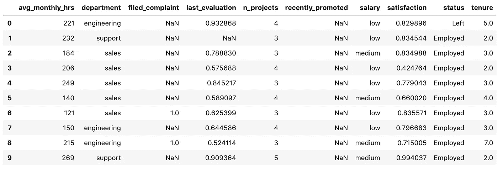

原始数据集的快照。

这些步骤是:

1.  **EDA &数据处理:**探索、可视化和清理数据。
2.  **特性工程:**利用领域专业知识，创造新特性。
3.  **模型训练:**我们将训练和调整一些屡试不爽的分类算法，比如逻辑回归、随机森林和梯度推进树。
4.  **性能评估:**我们将看看包括 F1 和 AUROC 在内的一系列分数。
5.  **部署:**批量运行还是弄几个数据工程师/ ML 工程师来建一个自动化流水线？

理想情况下，该公司将对其目前的永久员工运行该模型，以识别那些处于风险中的员工。这是机器学习提供 ***可操作*** 商业洞察的一个例子。

在此加入 Medium [并获得**无限制访问**互联网上最好的数据科学文章。](https://col-jung.medium.com/membership)

# 1.数据探索和处理

**探索性数据分析(EDA)** 帮助我们理解数据，为**数据清洗**和**特征工程**提供思路和见解。数据清理为我们的算法准备数据，而特征工程是真正帮助我们的算法从数据集中提取潜在模式的神奇调味汁。请记住:

> 更好的数据总是胜过更好的算法！

我们首先将一些标准的数据科学 Python 包加载到 JupyterLab 中。

```
import numpy as np
import pandas as pd
import matplotlib.pyplot as plt
import seaborn as sbfrom sklearn.linear_model import LogisticRegression
from sklearn.ensemble import RandomForestClassifier,
                             GradientBoostingClassifierfrom sklearn.model_selection import train_test_split
from sklearn.pipeline import make_pipeline
from sklearn.preprocessing import StandardScaler
from sklearn.model_selection import GridSearchCVfrom sklearn.metrics import confusion_matrix, accuracy_score,
                            f1_score, roc_curve, roc_auc_scoreimport pickle
```

导入数据集:

```
df = pd.read_csv('employee_data.csv')
```

这是我们数据帧的快照。形状为(14，249，10)。


原始数据集的快照。

目标变量是**状态**。该分类变量采用值*使用*或*离开*。

共有 25 个栏目/功能:

*   **部门**
*   **工资**
*   **满意，提起 _ 投诉** —代理 ***幸福***
*   **上次 _ 评估，最近 _ 提升**—***绩效代理***
*   **avg_monthly_hrs，n _ projects**—***工作量的代理***
*   **任期** —代理 ***经验***

## **1.1 数字特征**

让我们绘制一些快速直方图来了解我们的数字特征的分布。

```
df.hist(figsize=(10,10), xrot=-45)
```


对我们的数字特征要做的事情，以确保数据与我们的算法配合良好:

*   将**投诉**和**最近提升**中的 NaN 转换为 0。它们的标签贴错了。
*   在将 NaN 转换为零之前，为 **last_evaluation** 特征中的缺失数据创建一个指示变量。

```
df.filed_complaint.fillna(0, inplace=True)
df.recently_promoted.fillna(0, inplace=True)df['last_evaluation_missing'] =         
df.last_evaluation.isnull().astype(int)
df.last_evaluation.fillna(0, inplace=True)
```

这是我们数字特征的**关联热图**。

```
sb.heatmap(df.corr(),
 annot=True,
 cmap=’RdBu_r’,
 vmin=-1,
 vmax=1)
```

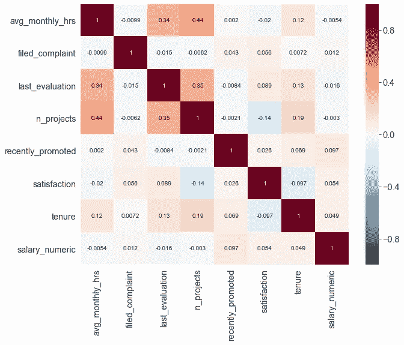

## 1.2 分类特征

让我们为我们的分类特征绘制一些快速柱状图。Seaborn 在这方面很棒。

```
for feature in df.dtypes[df.dtypes=='object'].index:
    sb.countplot(data=df, y='{}'.format(features))
```

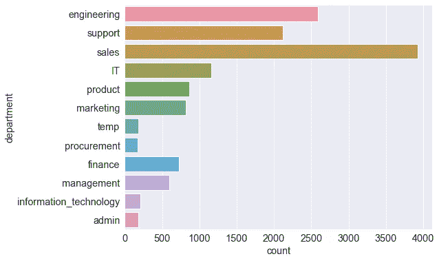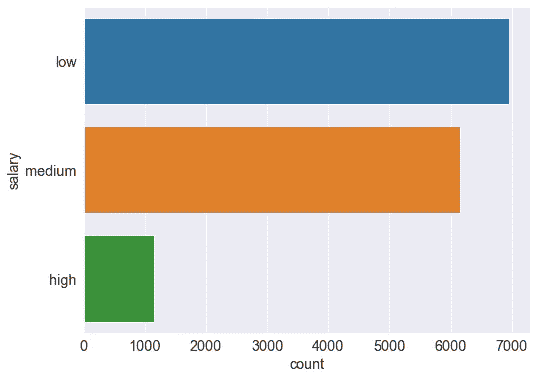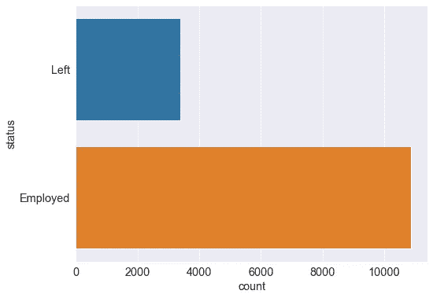

最大的**部门**是*销售部*。只有一小部分员工处于*高*低**工资**的阶层。我们的数据集是**不平衡**，因为只有少数员工离开了公司，也就是说，只有一小部分员工的**状态=** *离开了*。这对我们选择用来评估算法性能的指标有影响。我们将在结果中详细讨论这一点。

从数据清理的角度来看，**部门**特性的 *IT* 和 *information_technology* 类应该合并在一起:

```
df.department.replace('information_technology', 'IT', inplace=True)
```

而且 HR 只关心**永久**员工，所以要过滤掉*临时*部门:

```
df = df[df.department != 'temp']
```

因此，我们的**部门**功能看起来应该更像这样:

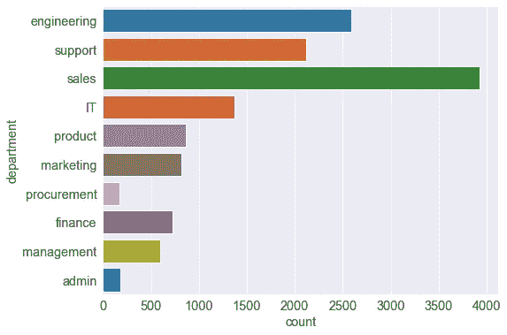

对我们的分类特征要做的事情，以确保数据与我们的算法配合良好:

*   **部门**特征的缺失数据应该被集中到它自己的*缺失*类中。
*   **部门**和**薪资**分类特征也应该是**一键编码**。
*   目标变量**状态**应转换为二进制。

```
df['department'].fillna('Missing', inplace=True)df = pd.get_dummies(df, columns=['department', 'salary'])df['status'] = pd.get_dummies(df.status).Left
```

## 1.3 细分

我们可以通过将数字特征与分类特征进行分割来获得进一步的见解。让我们从一些**单变量分割**开始。

具体来说，我们将通过我们的分类目标变量**状态**来细分代表快乐、绩效、工作量和体验的数字特征。

**按状态划分的细分市场满意度:**

```
sb.violinplot(y='status', x='satisfaction', data=df)
```

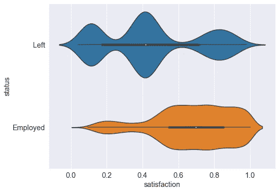

有一种观点认为，许多被解雇的员工对他们的工作非常满意。

**细分市场最后 _ 评估状态:**

```
sb.violinplot(y='status', x='last_evaluation', data=df)
```

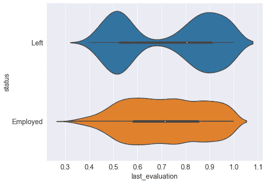

一种观点认为，大量被解雇的员工都是高绩效员工。也许他们觉得留下来没有进一步发展的机会？

**按状态细分平均每月小时数和项目数:**

```
sb.violinplot(y='status', x='avg_monthly_hrs', data=df)
sb.violinplot(y='status', x='n_projects', data=df)
```

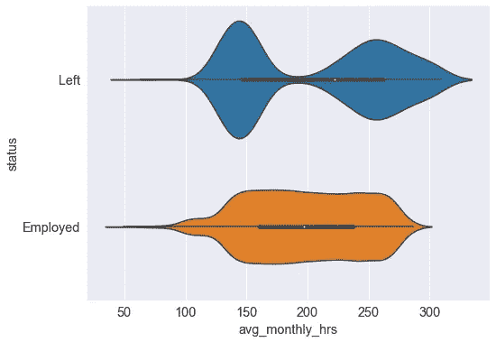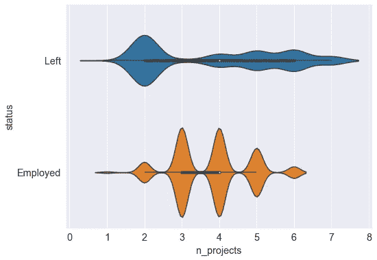

似乎那些翻腾的人要么工作量相当大，要么工作量相当低。这些代表了精疲力竭、无所事事的前员工吗？

**按状态划分的细分任期:**

```
sb.violinplot(y='status', x='tenure', data=df)
```

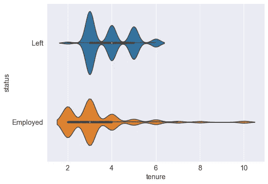

我们注意到员工在第三年突然流失。那些 6 年后还在的人倾向于留下来。

# 2.特征工程

查看下面的**双变量分割**，这将推动我们以后的特征工程。

对于每个情节，我们将按照**状态**来分割*两个*数字特征(代表快乐、表现、工作量或经历)。这可能会给我们一些基于员工刻板印象的聚类。

**表现和快乐:**

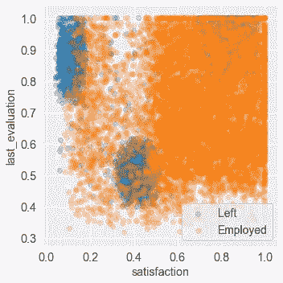

哎呦，雇佣的*工人让这个图很难看。让我们只显示剩下的*工人，因为他们才是我们真正想要了解的。**

```
sb.lmplot(x='satisfaction',
          y='last_evaluation',
          data=df[df.status=='Left'],
          fit_reg=False
         )
```

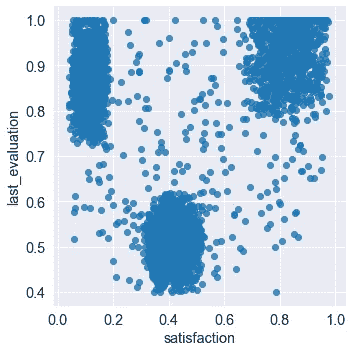

我们有三组不安分的员工:

*   **表现不佳者**:最后 _ 评价< 0.6
*   **不开心**:满意度 _ 等级< 0.2
*   **超额完成者**:上次评估> 0.8，满意度> 0.7

**工作负载和性能:**

```
sb.lmplot(x='last_evaluation',
          y='avg_monthly_hrs',
          data=df[df.status=='Left'],
          fit_reg=False
         )
```

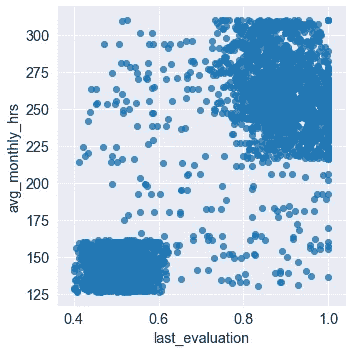

我们有两群焦躁不安的员工:

*   **星级** : avg_monthly_hrs > 215，last_evaluation > 0.75
*   **懒鬼** : avg_monthly_hrs < 165，last_evaluation < 0.65

**工作量和幸福感:**

```
sb.lmplot(x='satisfaction',
          y='avg_monthly_hrs',
          data=df[df.status=='Left'],
          fit_reg=False,
         )
```


我们有三组不安分的员工:

*   **工作狂**:平均每月工时> 210，满意度> 0.7
*   刚刚参加工作:平均每月工作时间< 170
*   **过度劳累**:平均每月小时数> 225，满意度< 0.2

让我们为这 8 个“典型”员工群体设计新功能:

```
df['underperformer'] = ((df.last_evaluation < 0.6) & (df.last_evaluation_missing==0)).astype(int)
df['unhappy'] = (df.satisfaction < 0.2).astype(int)
df['overachiever'] = ((df.last_evaluation > 0.8) & (df.satisfaction > 0.7)).astype(int)df['stars'] = ((df.avg_monthly_hrs > 215) & (df.last_evaluation > 0.75)).astype(int)
df['slackers'] = ((df.avg_monthly_hrs < 165) & (df.last_evaluation < 0.65) & (df.last_evaluation_missing==0)).astype(int)df['workaholic'] = ((df.avg_monthly_hrs > 210) & (df.satisfaction > 0.7)).astype(int)
df['justajob'] = (df.avg_monthly_hrs < 170).astype(int)
df['overworked'] = ((df.avg_monthly_hrs > 225) & (df.satisfaction < 0.2)).astype(int)
```

我们可以看一下这 8 个组中每个组的员工比例。

```
df[['underperformer', 'unhappy', 'overachiever', 'stars', 
    'slackers', 'workaholic', 'justajob', 'overworked']].mean()underperformer    0.285257
unhappy           0.092195
overachiever      0.177069
stars             0.241825
slackers          0.167686
workaholic        0.226685
justajob          0.339281
overworked        0.071581
```

34%的员工是刚参加工作的员工——没有灵感，只是来领周薪的——而只有 7%的人是超负荷工作的。

**分析基表:**应用所有这些数据清洗步骤和特征工程后的数据集就是我们的**分析基表**。这是我们训练模型的数据。

我们的 ABT 有 14，068 名员工和 31 个栏目——请看下面的片段。*回想一下，我们的原始数据集有 14，249 名员工，只有 10 列！*

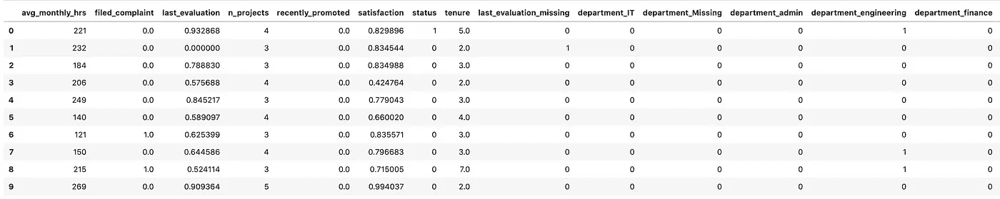

# 3.系统模型化

我们将训练四个屡试不爽的分类模型:

*   **逻辑回归** (L1 和 L2——正规化)
*   **随机森林**
*   **梯度增强树**

首先，让我们拆分我们的分析基表。

```
y = df.status
X = df.drop('status', axis=1)
```

然后我们将分成训练集和测试集。我们的数据集有点不平衡，所以我们将使用**分层抽样**进行补偿。

```
X_train, X_test, y_train, y_test = train_test_split(X, y, test_size=0.2, random_state=1234, stratify=df.status)
```

我们将设置一个**管道对象**来训练。这将简化我们的模型训练过程。

```
pipelines = {
       'l1': make_pipeline(StandardScaler(), 
             LogisticRegression(penalty='l1', random_state=123)),
       'l2': make_pipeline(StandardScaler(), 
             LogisticRegression(penalty='l2', random_state=123)),
       'rf': make_pipeline(
             RandomForestClassifier(random_state=123)),
       'gb': make_pipeline(
             GradientBoostingClassifier(random_state=123))
            }
```

我们还想调整每个算法的**超参数**。对于逻辑回归，最有影响的超参数是正则化的强度， **C** 。

```
l1_hyperparameters = {'logisticregression__C' : [0.001, 0.005, 0.01, 
                       0.05, 0.1, 0.5, 1, 5, 10, 50, 100, 500, 1000]
                     }l2_hyperparameters = {'logisticregression__C' : 
                       [0.001, 0.005, 0.01, 0.05, 0.1, 0.5, 
                        1, 5, 10, 50, 100, 500, 1000]
                     }
```

对于我们的随机森林，我们将调整估计器的数量( **n_estimators** )、分割期间要考虑的最大特征数量( **max_features** )以及作为叶子的最小样本数量( **min_samples_leaf** )。

```
rf_hyperparameters = {
    'randomforestclassifier__n_estimators' : [100, 200],
    'randomforestclassifier__max_features' : ['auto', 'sqrt', 0.33],
    'randomforestclassifier__min_samples_leaf' : [1, 3, 5, 10]
    }
```

对于我们的梯度增强树，我们将调整估计器的数量(**n _ 估计器**)，**学习速率**，以及每棵树的最大深度( **max_depth** )。

```
gb_hyperparameters = {
    'gradientboostingclassifier__n_estimators' : [100, 200],
    'gradientboostingclassifier__learning_rate' : [0.05, 0.1, 0.2],
    'gradientboostingclassifier__max_depth' : [1, 3, 5]
    }
```

我们将把这些超参数保存在字典中。

```
hyperparameters = {
    'l1' : l1_hyperparameters,
    'l2' : l2_hyperparameters,
    'rf' : rf_hyperparameters,
    'gb' : gb_hyperparameters
    }
```

最后，我们将拟合和调整我们的模型。使用 **GridSearchCV** 我们可以训练所有这些模型，只需几行代码就可以对我们声明的所有超参数进行交叉验证！

```
fitted_models = {}
for name, pipeline in pipelines.items():
    model = GridSearchCV(pipeline, 
                         hyperparameters[name], 
                         cv=10, 
                         n_jobs=-1)
    model.fit(X_train, y_train)
    fitted_models[name] = model
```

# 4.估价

我写了一篇关于流行的机器学习指标的[专门文章](/popular-machine-learning-performance-metrics-a2c33408f29)，包括下面使用的那些。

## 4.1 绩效得分

我们将从打印**交叉验证分数**开始。这是 10 个保留折叠的平均性能，是仅使用您的训练数据获得模型性能**的可靠估计的一种方式。**

```
for name, model in fitted_models.items():
    print(name, model.best_score_)**Output:
l1 0.9088324151412831
l2 0.9088324151412831
rf 0.9793851075173272
gb 0.975475386529234**
```

转到**测试数据**，我们将:

*   计算**精度**；
*   打印**混淆矩阵**并计算**精度，调出**和**F1-得分**；
*   显示 **ROC** 并计算 **AUROC** 分数。

**准确性**衡量正确标记的预测的比例，但它不适用于不平衡的数据集，例如垃圾邮件过滤(垃圾邮件与非垃圾邮件)和医疗测试(生病与未生病)。例如，如果我们的数据集只有 1%的员工满足**目标** = *离开*，那么一个总是预测该员工仍在该公司工作的模型将立即获得 99%的准确率。在这些情况下，**精确**或**召回**更为合适。你经常使用哪一个取决于你是想最小化**类型 1 错误**(假阳性)还是**类型 2 错误**(假阴性)。对于垃圾邮件，类型 1 错误更糟糕(一些垃圾邮件是可以的，只要你没有意外过滤掉一封重要的邮件！)而第二类错误对于医学测试来说是不可接受的(告诉别人他们没有患癌症是一场灾难！). **F1 分数**通过对精确度和召回率进行加权平均，让你两全其美。

ROC 下的面积，被称为 AUROC 是分类问题的另一个标准度量。这是对分类器区分类别和从噪声中分离信号的能力的有效测量。这种度量对于不平衡数据集也是稳健的。

下面是生成这些分数和图表的代码:

```
for name, model in fitted_models.items():
    print('Results for:', name)

    # obtain predictions
    pred = fitted_models[name].predict(X_test) # confusion matrix
    cm = confusion_matrix(y_test, pred)
    print(cm) # accuracy score
    print('Accuracy:', accuracy_score(y_test, pred))

    # precision
    precision = cm[1][1]/(cm[0][1]+cm[1][1])
    print('Precision:', precision)

    # recall
    recall = cm[1][1]/(cm[1][0]+cm[1][1])
    print('Recall:', recall)

    # F1_score
    print('F1:', f1_score(y_test, pred))

    # obtain prediction probabilities
    pred = fitted_models[name].predict_proba(X_test)
    pred = [p[1] for p in pred] # plot ROC
    fpr, tpr, thresholds = roc_curve(y_test, pred) 
    plt.title('Receiver Operating Characteristic (ROC)')
    plt.plot(fpr, tpr, label=name)
    plt.legend(loc='lower right')
    plt.plot([0,1],[0,1],'k--')
    plt.xlim([-0.1,1.1])
    plt.ylim([-0.1,1.1])
    plt.ylabel('True Positive Rate (TPR) i.e. Recall')
    plt.xlabel('False Positive Rate (FPR)')
    plt.show()

    # AUROC score
    print('AUROC:', roc_auc_score(y_test, pred))
```

**逻辑回归(L1 正则化):**

```
**Output:
[[2015  126]
 [ 111  562]]

Accuracy:  0.9157782515991472
Precision: 0.8168604651162791
Recall:    0.8350668647845468
F1:        0.8258633357825129
AUROC:     0.9423905869485105**
```

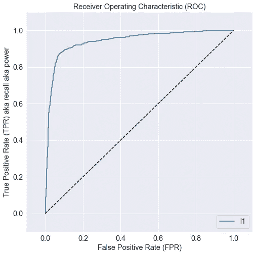

**逻辑回归(L2 正则化):**

```
**Output:
[[2014  127]
 [ 110  563]]

Accuracy:  0.9157782515991472
Precision: 0.8159420289855073
Recall:    0.836552748885587
F1:        0.8261188554658841
AUROC:     0.9423246556128734**
```

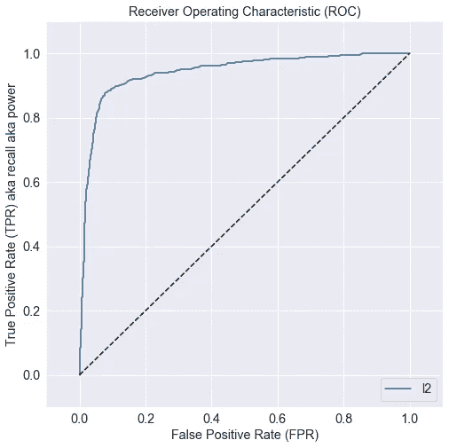

**渐变增强树:**

```
**Output:
[[2120   21]
 [  48  625]]

Accuracy:  0.9754797441364605
Precision: 0.9674922600619195
Recall:    0.9286775631500743
F1:        0.9476876421531464
AUROC:     0.9883547910913578**
```

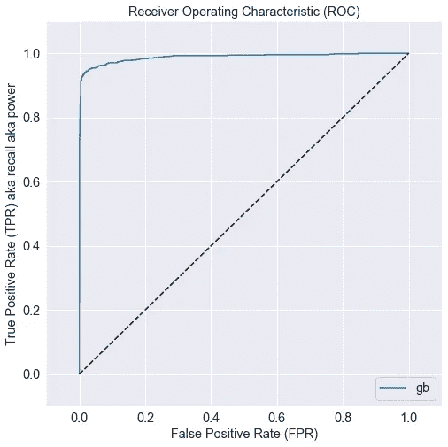

**随机森林:**

```
**Output:
[[2129   12]
 [  45  628]]****Accuracy:  0.9797441364605544
Precision: 0.98125
Recall:    0.9331352154531947
F1:        0.9565879664889566
AUROC:     0.9916117990718256**
```

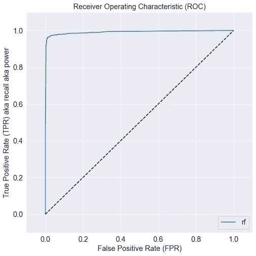

获胜的算法是 AUROC 为 99%、F1 得分为 96%的随机森林。这种算法有 99%的几率区分出*左*和*受雇的*工人……相当不错！

在测试集中的 2814 名员工中，算法:

*   正确分类 628 个*左*工人(*真阳性*，同时得到 12 个错误(*I 型错误*，以及
*   正确分类的 2129 个*雇佣的*工人(*真否定*)，同时得到 45 个错误(*第二类错误*)。

仅供参考，这里是获胜随机森林的超参数，使用 GridSearchCV 进行了调整。

```
RandomForestClassifier(bootstrap=True, 
                       class_weight=None, 
                       criterion='gini',
                       max_depth=None, 
                       max_features=0.33, 
                       max_leaf_nodes=None,
                       min_impurity_decrease=0.0,
                       min_impurity_split=None,
                       min_samples_leaf=1, 
                       min_samples_split=2,
                       min_weight_fraction_leaf=0, 
                       n_estimators=200,
                       n_jobs=None, 
                       oob_score=False, 
                       random_state=123,
                       verbose=0, 
                       warm_start=False
                      )
```

## **4.2 特性重要性**

考虑下面的代码。

```
coef = winning_model.feature_importances_
ind = np.argsort(-coef)for i in range(X_train.shape[1]):
    print("%d. %s (%f)" % (i + 1, X.columns[ind[i]], coef[ind[i]]))x = range(X_train.shape[1])
y = coef[ind][:X_train.shape[1]]plt.title("Feature importances")
ax = plt.subplot()
plt.barh(x, y, color='red')
ax.set_yticks(x)
ax.set_yticklabels(X.columns[ind])
plt.gca().invert_yaxis()
```

这将打印按重要性排序的特性列表和相应的条形图。

```
**Ranking of feature importance:
1\. n_projects (0.201004)
2\. satisfaction (0.178810)
3\. tenure (0.169454)
4\. avg_monthly_hrs (0.091827)
5\. stars (0.074373)
6\. overworked (0.068334)
7\. last_evaluation (0.063630)
8\. slackers (0.028261)
9\. overachiever (0.027244)
10\. workaholic (0.018925)
11\. justajob (0.016831)
12\. unhappy (0.016486)
13\. underperformer (0.006015)
14\. last_evaluation_missing (0.005084)
15\. salary_low (0.004372)
16\. filed_complaint (0.004254)
17\. salary_high (0.003596)
18\. department_engineering (0.003429)
19\. department_sales (0.003158)
20\. salary_medium (0.003122)
21\. department_support (0.002655)
22\. department_IT (0.001628)
23\. department_finance (0.001389)
24\. department_management (0.001239)
25\. department_Missing (0.001168)
26\. department_marketing (0.001011)
27\. recently_promoted (0.000983)
28\. department_product (0.000851)
29\. department_admin (0.000568)
30\. department_procurement (0.000296)**
```

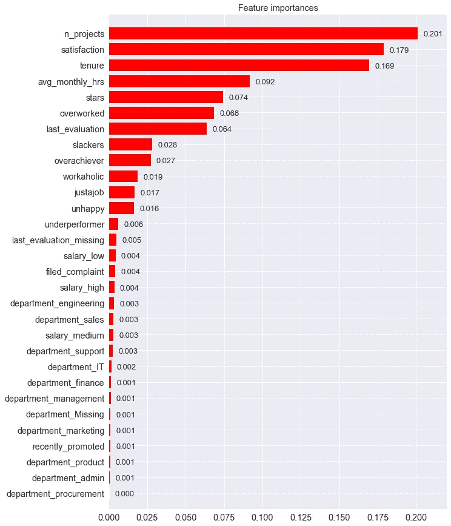

员工流失有三个特别强的预测因素:

*   **n_projects** (工作量)
*   **满意度**(幸福感)和
*   **任期**(经验)。

此外，这两个工程特性在特性重要性上排名也很高:

*   **明星**(高幸福&工作量)，以及
*   **劳累过度**(低幸福感&高工作量)。

有趣，但并不完全令人惊讶。明星们可能为了更好的机会而离开，而过度劳累的人则在筋疲力尽后离开。

# 5.部署


图片由 [ThisisEngineering RAEng](https://unsplash.com/@thisisengineering) 提供。

此模型的可执行版本(。pkl)可以从 Jupyter 笔记本中保存。

```
with open('final_model.pkl', 'wb') as f:
    pickle.dump(fitted_models['rf'].best_estimator_, f)
```

人力资源可以在将新员工数据输入训练模型之前对其进行预处理。这被称为批量运行。

在大型组织中，他们可能希望通过与**数据工程师**和**机器学习工程师**合作，将模型部署到**生产环境**中。这些专家围绕我们的模型建立了一个自动化的管道，确保新的数据能够得到预处理，并定期向人力资源部门报告预测。

# 最终意见

我们从一个**业务问题**开始:一家大公司的人力资源想要对他们的员工流失有可操作的见解。

我们在包含超过 14，000 名过去和现在员工的大量历史数据上训练了一个获胜的随机森林模型。

人力资源部可以在我们训练有素的员工身上运行新数据。pkl 文件，或者可以由他们的工程部门构建自动管道。

我们的模型是二元分类模型，其中目标变量是分类的。它预测了一系列不连续的可能性——这里是*流失*或*不流失*。

监督学习硬币的另一面是**回归模型**，其目标变量是数值。在[这里](/predict-house-prices-with-machine-learning-5b475db4e1e)，我训练了一个预测房价的。

最后，我在这里写了一篇关于机器学习在数学建模领域的位置的文章。

在 [YouTube](https://www.youtube.com/c/CryptoFilmmaker) 和 [Twitter](https://twitter.com/col_jung) 上关注我。

# 无限制媒体访问

提升你的知识和技能到一个新的水平。

[加入 Medium](https://col-jung.medium.com/membership) 享受**无限制访问**互联网上的**最佳分析&数据科学文章**。你可以在这里加入[来支持我和其他顶级作家。](https://col-jung.medium.com/membership)

# 我的数据科学文章

*   微分方程与机器学习——这里[这里](https://medium.com/swlh/differential-equations-versus-machine-learning-78c3c0615055)
*   新冠肺炎的数学建模与机器学习— [此处](https://medium.com/swlh/math-modelling-and-machine-learning-for-covid-19-646efcbe024e)
*   用回归预测房价— [此处](/predict-house-prices-with-machine-learning-5b475db4e1e)
*   分类预测员工流失— [此处](/will-your-employee-leave-a-machine-learning-model-8484c2a6663ea)
*   流行的机器学习性能指标— [此处](/popular-machine-learning-performance-metrics-a2c33408f29)
*   Jupyter 笔记本与 Dataiku DSS — [此处](/jupyter-notebooks-versus-dataiku-dss-for-data-science-e02264a753ca)
*   Power BI —从数据建模到令人惊叹的报告— [此处](/intro-to-power-bi-from-data-modelling-to-stunning-reports-b34aac43d8a1)