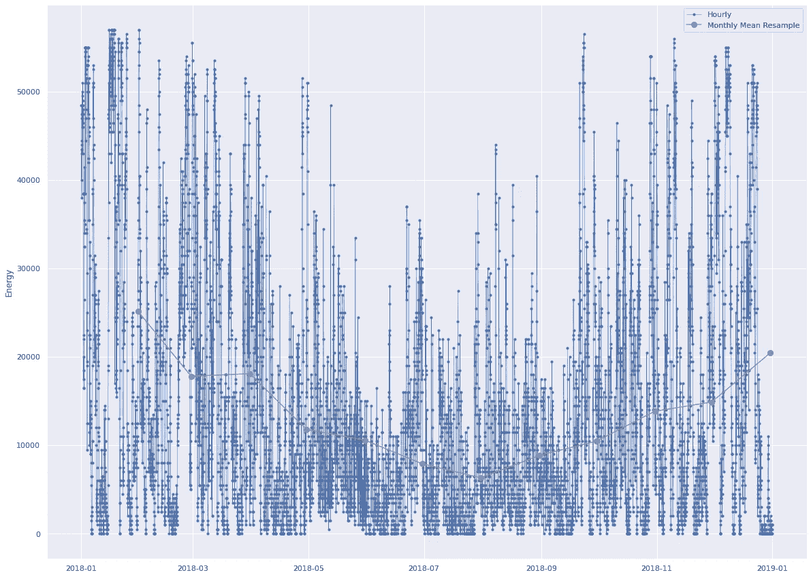

# 基于深度学习的风能交易——时间序列预测

> 原文：<https://towardsdatascience.com/wind-energy-trade-with-deep-learning-time-series-forecasting-580bd41f163?source=collection_archive---------32----------------------->

## 用人工智能预测风能发电量

*本文由* [*罗萨娜·德奥利维拉·戈麦斯*](https://www.linkedin.com/in/rosanaogomes/) *代表 Deep Delve 团队为* [*AI4Impact 深度学习 Datathon 2020*](https://ai4impact.org/dld.html#) *。*

来源: [Unsplash](https://unsplash.com/photos/xRvaPOFsEKo) 。

# 问题简介

如今，世界比以往任何时候都更需要合作，以实现应对气候危机的清洁能源解决方案。自 2015 年以来，联合国所有会员国通过的[可持续发展目标](https://www.un.org/sustainabledevelopment/energy/)旨在确保到 2030 年所有人都能获得负担得起、可靠、可持续的现代清洁能源。清洁能源来自大自然提供的可再生资源，如太阳、风、潮汐和海浪、地热等。其用途从大规模发电和离网发电(农村和偏远地区)[1]到加热/冷却系统和运输。然而，太阳能和风能等可再生能源依赖于天气，比传统能源更不稳定。随着世界上许多国家可再生能源供应份额的增加[2，3]，保证这些清洁能源在替代化石燃料能源的同时提供稳定的供应是非常重要的。

在 [*AI4Impact 深度学习 Datathon 2020*](https://ai4impact.org/dld.html#) 中，利用深度神经网络研究了清洁能源的话题。在挑战的第一部分，团队使用 [Kaggle 数据集](https://www.kaggle.com/robikscube/hourly-energy-consumption)预测能源需求，该数据集包含来自 [PJM 互联有限责任公司](https://www.pjm.com/)的超过 10 年的每小时能源消耗数据。你可以在下面的视频中查看 team Deep Delve 对该项目的第一部分的一些见解。

挑战的第二部分致力于预测风能以最大化交易利润。与太阳能一起，风能是最重要的可再生能源之一，2018 年提供了全球电力供应的 4.8%[4，5]，2019 年占欧洲电力消耗的 15%[6]。风能是由风力涡轮机产生的机械能产生的。因为风的强度随着时间的推移而变化，并且可能间歇性地停止吹动，所以由这种来源产生的电力通常与其他电源结合，以提高可靠性和稳定性。

通过考虑不同类型的能源公司之间的交易，可以理解风能的经济性。**地区或国家能源公司**从**能源生产商**那里购买预定数量的能源(以千瓦时计量)，这些能源生产商是经营风力农场的公司(就风能而言)。由于人们期望从电网获得稳定的能源供应，在停电的情况下，能源生产商可能会被政府处以巨额罚款。

**能源贸易公司**通过帮助*预测预期的能源产量*(特别是在风力作为不稳定能源的情况下)，在*评估能源交易中短缺*的风险方面发挥重要作用。能源交易商代表能源生产商预测能源产量(在我们的例子中是风能)，考虑两种情况:

*   如果**短缺**低于预测值，则在现货市场上购买能源供应给电网(价格高于平均能源价格)
*   在**超出**预测产量的情况下，能源生产商不会因为额外的能源而得到补偿。

从这个意义上说，对发电量的精确预测对风电场(即风能生产商)的财务表现起着至关重要的作用。

# 问题陈述

风能高度依赖于风速等环境因素。对于能源贸易商来说，成功预测风能产量以实现利润最大化至关重要。通过将深度学习应用于*金融风险*，我们的目标是为*法兰西岛*地区制作一个领先时间为 18 小时、分辨率为 1 小时的风能预测模型。目标是实现一个模型，优化风电场的利润，最小化能源生产的过剩短缺。

# 方法学

为了评估我们的风能模型表现如何，我们估计了与实际产生的能量相比，该模型将实现多少货币利润。在交易周期之后的**评估期**内，使用真实数据对模型进行测试:

*   **热身:**前 18 个小时不进行交易(从 2020 年 7 月 22 日 00:00 UTC 开始)。
*   **交易时段:**每小时生成一次未来 18 小时(T+18)的风能预报，包括周末、公共节假日，24/7(2020 年 7 月 22 日 18:00 UTC 开始)。
*   交易在**评估期**结束时结束(2020 年 7 月 28 日 23:00 UTC)。

财务绩效分析遵循之前讨论的交易方法，具体如下:

*   **能源价格(千瓦时):** 10 欧分。
*   **每天销售的最大电能(kWh):**当天的最大预测。
*   **能源生产过剩:**能源生产商不会因产生额外的能源而得到补偿。
*   **能源短缺:**从现货市场购买能源(20 欧分/千瓦时)。可购买的能源数量取决于手头的现金，并且只有在有正结余时才有可能。
*   **初始现金储备:** 10，000，000 欧分，用于购买能源差额短缺情况。该金额将在评估结束时返回。
*   **债务(累计):**如果手头可用现金少于购买所需，则处以每千瓦时 100 欧分的罚款。这被记录为负值，并添加到手头现金。

# 数据集

该项目的目标是预测巴黎周围的法兰西岛地区的总风能产量。风能生产的数据来自法国能源传输管理局[电力运输网络](https://www.rte-france.com/) (RTE)。数据集`energy-ile-de-france` 包含来自 [RTE 在线数据库](https://www.rte-france.com/en/eco2mix/eco2mix-telechargement-en)的近实时风力产量，遵循以下规范:

*   从 2017 年 1 月 1 日 00:00 UTC 开始到现在，以一个 1 小时的时间戳表示的发电量(kWh)。
*   该地区 8 个主要风电场的风力预测数据(见下表)，来自 [Terra Weather](http://www.terra-weather.com/) 提供的 2 个不同的风力模型(16 个预测)。
*   因变量:风速(米/秒)和风向(北纬度——例如，45 度的风向意味着风从东北方向吹**)。预测每 6 小时更新一次，并以 1 小时为基数进行插值。风速和风向的所有值都是根据模型估算的。**

表 1:项目中使用的法兰西岛地区 8 个主要风力发电场的信息。

# 探索性数据分析

在进入深度学习模型之前，我们需要首先从数据中提取见解，并进行数据准备工作。数据提取和建模由 Terra AI 在整个比赛中使用的 Autocaffe 平台内用 *Smojo* 编程语言实现。

## 统计和标准化

我们从获取数据集中风能的描述性统计数据开始分析，如表 2 所示。我们强调数据是直接从 Autocaffe 中提取的，并且已经进行了插值，因此不包含任何缺失值。

下一步是对数据进行归一化，以使所有特征具有相似的取值范围。这一步对于避免网络偏向具有更高值的特征以及加快学习过程非常重要。所有特征标准化为零平均值和单位标准偏差，遵循以下方程:

其中，Xnorm 是归一化输入要素的值，Xmean 是 X 的平均值，stddev 是标准偏差。

在处理预测时，定义一个可以衡量模型预测与获得的真实值(实际值)相比有多好的度量标准是很重要的。处理时间序列时的另一个重要概念是*持续性*，基本上是假设一个量在现在的观测值在未来(T+X = T+0)将是相同的。持久性是一个微不足道的预测模型，因此，任何可信的时间序列模型必须至少击败持久性值。

假设一个平均绝对误差(MAE)度量，我们为我们的数据集确定了 0.65 的持久性，这是我们的模型必须克服的第一个基准。

表 2:风能的描述性统计。

## 风能时间序列

我们使用图 1 和图 2 的箱线图，从多年来风能产量的可视化开始我们的时间序列分析。在该可视化中，一个框对应于每年数据的 50%，每个框内的水平线对应于中值，触须(距框的范围)对应于最大值和最小值(不包括异常值)，最后圆圈对应于异常值(1.5 倍框=距框的距离)。

图 1:2017 年和 2019 年*法兰西岛*风能产量(标准化)的箱线图。

从图 1 中，可以看出多年来风能产量的增加。这种普遍增长可能与法国政府对其整体风能生产的更多投资有关。这可能是通过风电场容量的增加或风电场自身数量的增加而发生的，如表 1 所示，2019 年安装了 Angerville 1 和 2 号风电场[7，8]。

如果我们随着时间的推移提高我们分析的分辨率，并将重点放在 2019 年，例如，我们可以从图 2 中看到，在 3 月和 9 月至 12 月期间，能源产量的范围更广。同样，从 4 月到 8 月，能源产量也有所下降，这表明可能存在季节相关性。

图 2:2019 年几个月法兰西岛风能产量(标准化)的箱线图。

箱线图有助于理解分布情况。现在查看图 3 中 2018 年几个月的类似能源分析，我们可以更好地可视化风能生产的年度行为。为了更容易理解，我们用橙色圆点突出显示了每日平均值。从橙色曲线可以看出，一月是风能产量最高的月份，八月是风能产量最低的月份。随着时间的推移，在其他年份也发现了类似的行为。该信息稍后用于为我们的模型优化生成新特征。

图 3:月平均能量重采样

图 Guitrancourt(纵轴)一月份的风速(横轴)。

## 风速和风向

在确定了一些关于风能生产随时间变化的见解后，我们现在可以研究我们的数据集中可用的特征。

我们有法国岛 8 个不同风电场的风速和风向，总共有 16 个初始特征。

图 5:一月份 Guitrancourt(纵轴)的风向(横轴)。

图 5 和图 6 分别显示了 2019 年 1 月 Guitrancourt 风电场的风速和风向。从这两个特征的时间序列行为中似乎看不到清晰的见解。

在这项分析中，我们选择了 2019 年，因为这一年所有的风力发电场都可用。在调查我们的数据集中的其他 7 个风电场时，发现了类似的行为。

图 6 显示了 2019 年 1 月同期的发电量在图 3 中的放大。查看我们数据中可用的区域和整个时间段，我们现在可以将发电量峰值和谷值与风速和风向行为进行比较(图 4 和图 5)。尽管在发电量和风向之间任何关联似乎都是清楚的，但是随着时间的推移，我们看到了发电量和风速的类似模式。

图 6:2019 年 1 月(横轴)各天的风能产量(纵轴)。

为了进一步研究这种相似性，图 7 显示了我们的数据中所有区域和整个时间内所有风速和风向特征之间的皮尔逊相关图。在该图中，较高的值(红色)表示较强的相关性，而较低的值(白色)表示较弱的相关性。结果表明，风向和能量之间没有直接关系，但与所有风电场的速度有明显和强烈的相关性。可以识别相同农场的风速和风向之间的较弱相关性，而不需要显著的相关性分数。

图 7:初始特征之间的皮尔逊相关性。

最后，我们可以看看图 8 中的风特征分布。显示了 4 个风电场的风速直方图(左)和风向直方图(右)(所有风电场呈现相似的曲线)。我们可以看到，特征的分布不遵循高斯分布，因为风速的峰值向左移动，并且风向具有两个峰值。这表明使用*平均绝对误差*指标更适合模型评估，这将在下节课中讨论。

图 8:2017 年和 2019 年法国 4 个风电场的风速和风向分布。

# 深度学习模型

这个项目的目标是为法兰西岛*地区*进行风能预测。[时间序列预测](https://machinelearningmastery.com/time-series-forecasting/)是用神经网络和深度学习解决的常见问题。您可以点击查看 tome 系列车型的概述，点击查看预测主题[。](https://otexts.com/fpp2/accuracy.html/)

我们从基本的神经网络模型开始建模任务，后来通过添加不同的特征和参数来增加其复杂性。

## 特征工程

考虑到数据已经标准化并为训练和测试而设置，我们继续进行特征工程阶段，在该阶段，我们研究了对原始特征的可能修改或组合，以提高模型的性能。我们不再将特定风电场的单一风向作为一个特征，而是寻找与确定发电量相关的更具洞察力的特征。

根据 EDA 会话中的讨论，最佳性能模型中使用的最终功能集如下:

*   **空间平均特征:**风速(所有风电场坐标)、方向(所有风电场坐标)、风速矢量和风向矢量。
*   **时间特征:**UTC 早上 6 点开始的小时数，1 月开始的月数，4 月开始的月数，季节。
*   **加权标称特性:**当前风速除以标称速度 12m/s，再乘以标称功率输出(见表 1)，得出所有风电场位置和所有矢量的平均值。

## 差分模型

在处理时间序列时使用差分模型对于减少数据中的噪声而不改变最大值和最小值是极其重要的。此外，差异有助于捕捉更多关于变量随时间变化的行为的见解。为此，我们对以下时间窗口的变量进行了平均:

*   过去 24，48，72 小时，
*   上周，过去两周(14 天)，
*   差异 18 小时(交易提前期):t36、t18、t0

最后，我们还通过引入 [*动量*](/deep-learning-and-momentum-investing-2273e8db5b86) *和力*考察了高阶时间贡献对发电量预测的影响。动量(m)和力(f)有助于提供更多关于*时间速率*随时间变化的信息。对于时间相关变量 *s* ，独立变量 *x，* a 时间 *t* 和时间步长 *h* ，动量和力定义如下:

s(t) = x(t) +x(t-h)，

m(t) = s(t) -s(t-h)，

f(t) = s(t)-2s(t-h) +s(t-2h)。

动量和力是使模型预测和实际值之间的滞后最小化的重要量。鉴于其他特征来自风力模型，我们仅针对风能生产进行了分析。

## 神经网络

在对数据进行分析和预处理后，我们在最后一次会议中为我们的模型确定了有见地的新特性。现在我们终于可以建立我们的神经网络模型了。首先，考虑到数据的非高斯行为，我们已经从数据行为中发现 *MAE 度量*更合适。我们还确定了几个新的特征作为神经网络的输入。

在处理输入特征时，如果某些输入特征与问题不相关，则总是存在向网络添加噪声或使学习过程变慢的风险。为此，我们使用 [*输入缩放*](/why-data-should-be-normalized-before-training-a-neural-network-c626b7f66c7d) 以便只选择相关特征来训练我们的神经网络。

输入缩放是减少噪声以及神经网络中异常值影响的一种强有力的方法。该方法包括将输入特征乘以(正)比例因子，让网络学习哪些是相关的，作为模型训练的一部分。缩放输入后，输入可进一步被*箝位*，其值为 *tanh* 。

另一种重要的降维方法是一种称为 [*自动编码器*](http://ufldl.stanford.edu/tutorial/unsupervised/Autoencoders/) *的无监督学习技术。*该方法由一个子网组成，该子网对*瓶颈网络*中的输入特征进行压缩和解压缩，从而识别输入特征之间可能的相关性。更多话题[见这里](https://www.jeremyjordan.me/autoencoders/)。

为了找到我们的预测模型的最佳执行配置，在几个参数下研究了上述所有方法。类似地，我们测试了几种神经网络架构，尝试了不同的层数、层大小、激活函数、优化器和[退出正则化](https://machinelearningmastery.com/dropout-for-regularizing-deep-neural-networks/)概率。

最佳性能配置的得分为 **0.48** ，比 MAE 指标的持久性高出 26 %。下面的表 3 总结了所使用的具体参数和架构(表中没有提到输出层),我们将在下一节课中讨论。

表 3:最佳性能模型。

## 结果

图 9 和图 10 分别显示了自动编码器和主神经网络的训练和测试损失。结果表明，尽管模型能够战胜持久性，但与训练相比，测试损失仍然很高，这表明网络面临学习挑战。正如在整个项目中所了解到的，高测试损耗可能来自过大的网络和/或数据中过多的噪声。让我们继续思考这个问题。

图 9:作为 autoencoder 迭代函数的训练和测试损失(纵轴)。

图 10:作为模型迭代函数的训练和测试损失(纵轴)。

从损失结果中，人们可以预期该模型的性能不会特别好。然而，如果我们现在查看图 11 中滞后相关性的结果，我们发现了非常好的结果。这里，重要的是回来理解项目的目标:*从能源生产预测*中获取最大利润。正如本文开头的交易方法中所述，每当模型预测不足时，交易者就会亏损。从这个角度来看，获利最多的模型是能够更好地预测时间序列中的波峰和波谷的模型，但不一定在整个时间序列中都具有高精度，这是有道理的。

训练和试验数据的滞后相关性。

从这个意义上来说，在这个优化分析中所做的是将滞后相关性优先于损失，以使利润最大化。根据采用时间序列预测的问题，逻辑可能不同，例如在离群值不重要的情况下。

最后，我们在图 12 中显示了实际值与训练值以及实际值与测试预测值。在两种情况下都可以看到清晰的线性关系，表明模型的预测良好，并且模型实际上是在学习而不是记忆训练数据。如上所述，模型被优化以最小化滞后相关性，因此确定了更广泛的线性行为。这是我们模型定制方式的直接结果。

图 12:实际数据与训练(左)和测试(右)预测的对比。

# 摘要

在这个项目中，我们为法国的风能预测训练了一个神经网络模型。这个模型后来被应用于在几天的时间内最大化风能交易者的真实数据的利润。在评估期间，根据产生的利润对不同团队的模型进行了比较。

通过*数据马拉松*学到的重要知识包括:

*   领域知识对于识别风能预测的相关特征至关重要，
*   详细的数据分析可以帮助洞察特征工程和参数选择，
*   数据预处理对于模型的良好性能至关重要，
*   降低噪声是时间序列分析的一个关键组成部分。

由团队 *Deep Delve* 实现的模型是一个神经网络，它预测风能产量，并能够为能源交易商和生产商产生合理的利润。该模型可能的改进包括更多关于参数调整和神经网络架构的实验，以及更先进的深度学习技术，如递归神经网络——以在时间序列问题中表现良好而闻名。工程分析更深层次特征也可以导致风能预测新重要因素，这些因素在本项目中没有考虑，例如海拔高度，甚至气候变化影响。

使用深度学习来理解时间序列具有很高的范围和影响许多其他领域的潜力，例如识别随时间传播的疾病(医疗保健、经济、销售、股票市场等)。特别是在可再生能源领域，它还可以用于预测能源需求和消费。

请点击下面的链接查看我们的简短演示:)

我们要感谢 AI4Impact 组织了这次有见地的*数据马拉松*，并为所有参赛者提供了学习更多关于时间序列预测、神经网络和可再生能源的机会。

*深究团队:* [*程诺仪*](https://www.linkedin.com/in/nokyee-ching-637a89153/)*[*张小溪*](https://www.linkedin.com/in/nancy-y-zhang/)*[*罗萨娜·德奥利维拉·戈麦斯*](https://www.linkedin.com/in/rosanaogomes/)*[*斯胡阿德·奥贡塔约*](https://www.linkedin.com/in/cydal/) *瓦莱丽·科·易慧****

## **更多参考**

**[1] [可再生能源技术](http://www.undp.org/energy/activities/wea/drafts-frame.html)。*世界能源评估(2001 年)***

**[2] [“可再生能源领先的 12 个国家”](https://www.clickenergy.com.au/news-blog/12-countries-leading-the-way-in-renewable-energy/)。*点击能量***

**[3][《2018 年 6 月可再生能源发电量及发电量统计》](https://web.archive.org/web/20181128034842/http://resourceirena.irena.org/gateway/dashboard/?topic=4&subTopic=54)。*互联网存档方式回机***

**[4] [世界能源统计回顾](https://www.bp.com/en/global/corporate/energy-economics/statistical-review-of-world-energy/renewable-energy.html.html#wind-energy)。 *bp***

**[5][《2018 年全球装机量》](https://gwec.net/51-3-gw-of-global-wind-capacity-installed-in-2018/)。*全球风能委员会***

**[6] [丹麦风力发电新破纪录年](http://energinet.dk/EN/El/Nyheder/Sider/Dansk-vindstroem-slaar-igen-rekord-42-procent.aspx)。*能源网***

**这就是欧洲为可持续的绿色未来铺平道路的方式。*我们论坛***

**这些国家正在引领向可持续能源的转变。*我们论坛***