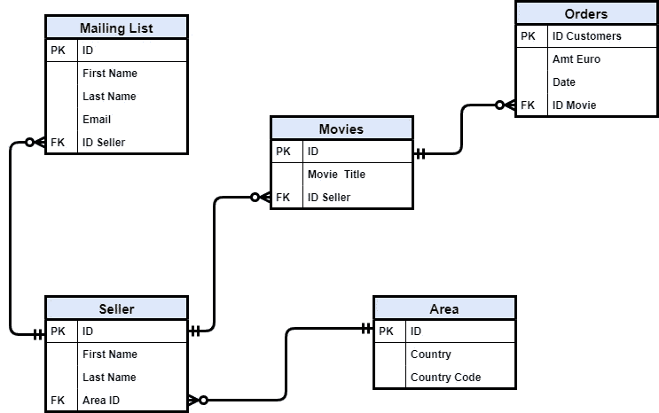
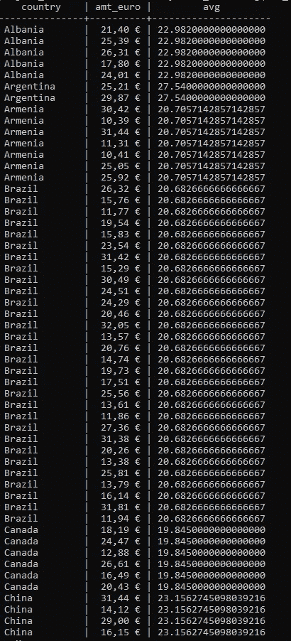
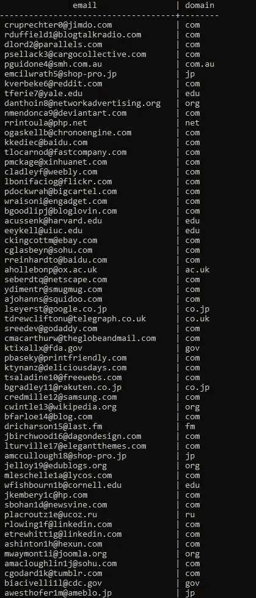
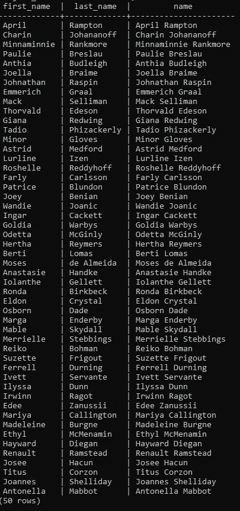

# 窗口函数和 SQL 的其他概念

> 原文：<https://towardsdatascience.com/window-functions-and-other-concepts-of-sql-d53ca756e254?source=collection_archive---------62----------------------->

## [带 PostgreSQL 的 Sql 教程](https://towardsdatascience.com/tagged/Sql%20Tutorial)

## 用 SQL 开发您解决问题的技能


由[菲利克斯·杜布瓦-罗伯特](https://unsplash.com/@007felix?utm_source=unsplash&utm_medium=referral&utm_content=creditCopyText)在 [Unsplash](https://unsplash.com/collections/4794263/frameworks?utm_source=unsplash&utm_medium=referral&utm_content=creditCopyText) 上拍摄的照片

**简介**

在我的[教程](https://towardsdatascience.com/tagged/Sql%20Tutorial)的最后一部分，我们将看到窗口函数的效用和 SQL 的其他概念，它们允许为我们的问题找到解决方案。

正如在[前一部分](/working-with-multiple-tables-thanks-to-sql-and-erd-9cb5dcb99228?source=friends_link&sk=7734128676dd5fe6e8f91256f0505d6f)中，我将使用为名为**太空漫游**的虚拟公司建造的 ERD。

我的教程的第二部分解释了这个图的结构，你可以在这里找到。

现在，我们可以从我的 SQL 教程的最后一部分开始。



作者图片

**第一部分:窗口功能**

假设您希望有一个表，允许将每部电影的销售价格与特定国家的平均价格进行比较。显然第一件要做的事是将表**与区域**、**卖家、电影**和**订单连接起来。**之后，我们可以使用我们的窗口功能。所以:

```
WITH sub AS (SELECT a.country, o.amt_euro
FROM area AS a
JOIN seller AS s
ON a.id = s.area_id
JOIN movies AS m
ON s.id = m.id_seller
JOIN orders AS o
ON m.id = o.id_movie)SELECT country, amt_euro,
avg(amt_euro::numeric) OVER (PARTITION BY country) 
FROM sub;
```

出局:



作者图片

正如你在上面看到的，我没有对电影的价格进行求和，而是做了一个分组，我报告了每个价格在一个特定国家的平均价格。这样一来，我们可以即时看到一部电影的价格是超过还是低于我们要考虑的国家的平均价格。

**第二部分:右侧、长度和 Strpos**

假设我们需要知道邮件列表中每封邮件的域。在这种情况下，我们可以使用以下函数: **Right，Length** 和 **Strpos** 。

```
SELECT email,
RIGHT(email, LENGTH(email) — STRPOS(email,’.’)) AS domain
FROM mailing_list;
```

出局:



作者图片

正如你所观察到的，每封邮件我们都有自己的域名。事实上，**右函数**帮助我找到了我想要的值，相反，**长度**和 **Strpos** 之间的差值确定了我想要从右边拉出的字符数。 **Length 函数**显示每行电子邮件的长度， **Strops** 显示圆点前的电子邮件长度。

**第三部分:串联**

我们决定对销售者表进行反规范化，以便拥有一个包含名字和姓氏的唯一列。为此，我们可以使用一个简单的连接。

我们可以使用两种不同的技术。

第一个技巧:

```
SELECT first_name, last_name,
CONCAT(first_name,’ ‘,last_name) AS name
FROM seller;
```

第二个技巧:

```
SELECT first_name, last_name,
 first_name||’ ‘||last_name AS name
FROM seller;
```

出局:



作者图片

**结论**

感谢我在我的[教程](https://towardsdatascience.com/tagged/Sql%20Tutorial)的所有部分中向您介绍的概念，现在您已经对如何应用 SQL 有了一个大致的了解，并开始提高处理越来越复杂问题的技能。

在 ETL 过程中，数据以杂乱的形式出现在我们面前，数据工程师或数据分析师的目标是规范化数据，并创建一个架构，以满足使用这些数据的不同部门的需求。这是数据分析师或数据工程师面临的基本挑战之一。

此外，通过创建或使用一家公司的数据仓库架构，您将拥有一个企业不同流程的全景，换句话说，您的眼睛将无处不在。这是深入研究一家公司的绝佳机会。

我发出一份期刊简讯。如果你想加入，请通过此链接注册。

除了我的**简讯**之外，还可以在我的电报群 [**初学数据科学**](https://t.me/DataScienceForBeginners) **中取得联系。**