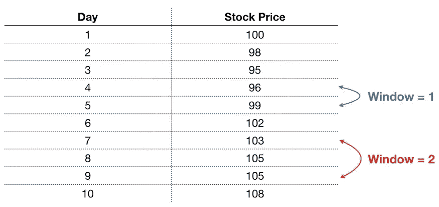
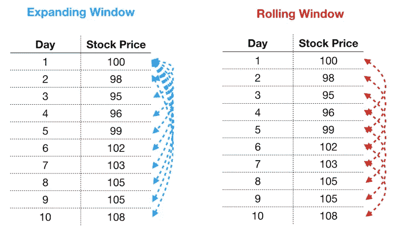
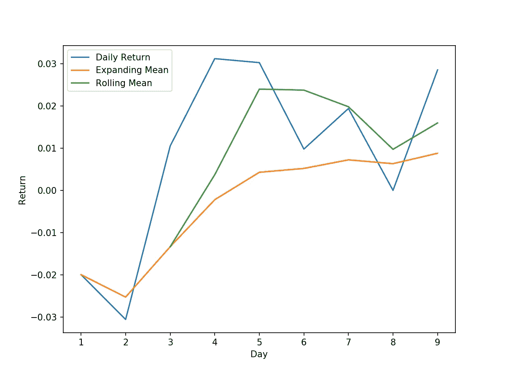

# 熊猫的窗口功能

> 原文：<https://towardsdatascience.com/window-functions-in-pandas-eaece0421f7?source=collection_archive---------5----------------------->


[R 莫](https://unsplash.com/@mooo3721?utm_source=medium&utm_medium=referral)在 [Unsplash](https://unsplash.com?utm_source=medium&utm_medium=referral) 上拍照

## 运行总计、期初至今回报和其他有趣的东西

QL 有一个简洁的功能，叫做窗口功能。顺便说一句，如果你正在寻找一份数据分析师的工作，你肯定应该知道如何在 SQL 中使用这些。熊猫(带一点跑腿)让我们可以做同样的事情。让我们看看怎么做。

# 但是首先，什么是窗口函数？

窗口函数允许我们对给定行的数据和指定行数之外的另一行的数据执行操作— **这个“行数之外的值”被称为窗口**。

例如，假设您有 10 天的股票价格:



Windows 操作系统

窗口函数允许我们在指定列的值之间执行计算。例如，我可能想要比较今天的股票价格和昨天的价格，然后我想要一个“1”的窗口向后看。窗口函数允许我们这样做。另一方面，如果我想将今天的价格与一年前的价格进行比较，那么我会想要一个“356”的窗口(假设周末在您的数据集中)。

窗口函数对于时间序列数据特别有用，在这种情况下，在数据的每个时间点，您只需要知道该点发生了什么(不允许使用水晶球)。好消息是熊猫有 windows 功能，而且非常好用。

# 使用熊猫执行窗口计算

假设我们想计算股票价格的每日变化。为此，我们需要将每天的价格除以前一天的价格，然后减去 1。我们以列表的形式获取数据:

```
stock_list = [100, 98, 95, 96, 99, 102, 103, 105, 105, 108]
```

列表在数学上不是很友好，所以我们可以把数据放在一个 numpy 数组中(我把它改造成一个 9 乘 1 的数组，这样更容易查看和显示):

```
**In:**
stock_array = np.array(stock_list)
(stock_array[1:]/stock_array[:-1] - 1).reshape(-1,1)**Out:** array([[-0.02      ],
       [-0.03061224],
       [ 0.01052632],
       [ 0.03125   ],
       [ 0.03030303],
       [ 0.00980392],
       [ 0.01941748],
       [ 0\.        ],
       [ 0.02857143]])
```

太好了，我们拿到回报了。不需要数据帧，对吗？不完全是。Dataframes 比 numpy 数组更加通用(numpy 数组针对处理数值数据进行了优化)。熊猫的开发者创造了所有这些漂亮的窗口方法让我们的生活更容易——如果我们不利用它们，他们会很难过。

让我们把我们的股票价格放入一个数据框架中:

```
stock_df = pd.DataFrame(stock_list, columns=['price'])
```

我们可以使用 **shift** 方法获得前一天的价格。shift 方法非常类似于 SQL 的 lag 函数。**“1”告诉它滞后一天，给出前一天的价格**:

```
stock_df['prev_price'] = stock_df.shift(1)
```

现在 stock_df 看起来是这样的:

```
 price  prev_price
0    100         NaN
1     98       100.0
2     95        98.0
3     96        95.0
4     99        96.0
5    102        99.0
6    103       102.0
7    105       103.0
8    105       105.0
9    108       105.0
```

酷，现在我们只需要用 price 除以 prev_price，然后减去 1，就可以得到日收益率:

```
**In:**
stock_df['daily_return'] = stock_df['price']/stock_df['prev_price']-1
print(stock_df)**Out:
**   price  prev_price  daily_return
0    100         NaN           NaN
1     98       100.0     -0.020000
2     95        98.0     -0.030612
3     96        95.0      0.010526
4     99        96.0      0.031250
5    102        99.0      0.030303
6    103       102.0      0.009804
7    105       103.0      0.019417
8    105       105.0      0.000000
9    108       105.0      0.028571
```

# 现在是有趣的部分

我们能做的不仅仅是计算回报。例如，假设我们想要将我们的每日回报与一个扩展窗口的平均回报进行比较，以查看每个回报与历史平均回报的比较情况。您可能会想，为什么不计算每日 return_column 中所有值的平均值并使用它呢？答案是数据泄露。

在时间序列分析中，当我们试图预测未来时，我们需要非常小心在特定日期观察到了什么，观察不到什么。例如，在数据集的第 5 天，我们只能观察到前 5 个价格:100、98、95、96、99。因此，如果我们为了预测第 6 天而测试特性，我们不能将第 5 天的 3.03%的回报率与整个期间的平均每日变化进行比较，因为在第 5 天，我们还没有观察到第 6 天到第 9 天。

## 扩展和滚动窗口

这就是一个扩展窗口出现的原因。如果你不熟悉展开和滚动窗口，下面的图片形象地展示了它们是什么。**使用扩展窗口，我们以扩展的方式计算指标**——这意味着我们在计算中包括了到当前行为止的所有行。**滚动窗口允许我们在滚动的基础上计算指标** —例如，滚动(3)意味着我们使用当前观察以及之前的两个观察来计算我们想要的指标。



扩展与滚动窗口

使用扩展窗口背后的基本原理是，随着每一天的过去，我们会得到另一个价格和另一个每日变化，我们可以将它们添加到均值计算中。这是我们应该在计算指标中捕捉的新信息。我们可以用下面的代码做到这一点(为了好玩，我还加入了一个 3 天的滚动窗口)。

```
stock_df['expand_mean']=stock_df['daily_return'].expanding().mean()
stock_df['roll_mean_3']=stock_df['daily_return'].rolling(3).mean()
```

呼唤**。在 pandas 数据帧或系列上展开()**创建 pandas **展开**对象。这很像更广为人知的 **groupby** 对象(基于指定的列标签对事物进行分组)。**扩展**(或**滚动**)对象允许我们以扩展的方式计算各种指标。让我们看看我们的数据帧现在是什么样子:

```
 price  prev_price  daily_return  expand_mean  roll_mean_3
0    100         NaN           NaN          NaN          NaN
1     98       100.0     -0.020000    -0.020000          NaN
2     95        98.0     -0.030612    -0.025306          NaN
3     96        95.0      0.010526    -0.013362    -0.013362
4     99        96.0      0.031250    -0.002209     0.003721
5    102        99.0      0.030303     0.004293     0.024026
6    103       102.0      0.009804     0.005212     0.023786
7    105       103.0      0.019417     0.007241     0.019841
8    105       105.0      0.000000     0.006336     0.009740
9    108       105.0      0.028571     0.008807     0.015996
```

请注意，在第 1 天，expand_mean 和 daily_return 是相等的——这是必然的情况，因为我们计算的是第 1 天只有一个日收益的扩展平均值。此外，在第 3 天，当我们终于有足够的数据来计算我们的滚动 3 天平均值时，roll_mean_3 的第一个值等于 expand_mean。这也是有意义的——在第 3 天，我们的扩展均值也是使用最近 3 天的回报计算的。

这是我们计算的股票日收益和 2 均值的曲线图(和代码):

```
plt.subplots(figsize=(8,6))
plt.plot(stock_df['daily_return'], label='Daily Return')
plt.plot(stock_df['expand_mean'], label='Expanding Mean')
plt.plot(stock_df['roll_mean_3'], label = 'Rolling Mean')
plt.xlabel('Day')
plt.ylabel('Return')
plt.legend()
plt.show()
```



股票收益及其扩展均值和滚动三日均值

## 正天数的累计

除了均值之外，我们还可以应用其他函数。假设我们的老板过来说，“我想让你记录这只股票上涨了多少天。”

我们可以使用一个**扩展**对象和 **sum** 方法(用于保存一个运行总数)来实现。首先，我们需要在数据框架中添加一列来表示当天股票是否上涨。我们可以利用**应用**方法(将函数应用于数据帧或系列中的每一行)。我们可以定义一个函数来给 **apply** 或者使用 lambda 函数——我选择了一个 lambda 函数(更少的代码行),它接受每个返回，如果是正数则返回 1，如果是负数则返回 0。

```
stock_df['positive'] = stock_df['daily_return'].apply(lambda x: 1 if x>0 else 0)
```

一旦我们有了“正”列，我们可以对它应用一个**扩展窗口**和 **sum** 方法(因为每个正的一天用 1 表示，我们只需要保存 1 的总数):

```
stock_df['num_positive'] = stock_df['positive'].expanding().sum()
```

我们发送给老板的数据帧是这样的:

```
 price  daily_return  num_positive
0    100           NaN           0.0
1     98     -0.020000           0.0
2     95     -0.030612           0.0
3     96      0.010526           1.0
4     99      0.031250           2.0
5    102      0.030303           3.0
6    103      0.009804           4.0
7    105      0.019417           5.0
8    105      0.000000           5.0
9    108      0.028571           6.0
```

所以到目前为止，该股有 6 个交易日上涨。但是随着我们收集更多的价格，我们的运行总数将随之更新。很好，我们的老板应该会很高兴。

感谢阅读！干杯，祝大家平安健康。

[***如果你总体上喜欢这篇文章和我的写作，请考虑通过我在这里的推荐链接注册 Medium 来支持我的写作。谢谢！***](https://tonester524.medium.com/membership)