# 视窗，和 Docker，和 Kubernetes 哦，我的天！(2020)

> 原文：<https://towardsdatascience.com/windows-and-docker-and-kubernetes-oh-my-2020-d21be00b168b?source=collection_archive---------24----------------------->


马克西米利安·魏斯贝克尔在 [Unsplash](https://unsplash.com?utm_source=medium&utm_medium=referral) 上的照片

# 我们要讲的内容

在本教程中，我们将涵盖在 Windows 上安装 Docker，启用 Kubernetes，安装 helm，并通过运行机器学习笔记本服务器来测试这一切。然后我们将介绍一些额外的东西，如 docker-compose 和 Visual Studio 代码扩展。

# 入门指南

首先，我在其中设置的示例环境具有正常的互联网连接(没有复杂的代理配置)，并且是一台运行 64 位 Windows 10 Pro 副本的 64 位 PC，具有 4 个内核和 16GB RAM。你至少需要 8GB 的内存和两个内核来运行任何合理的东西。

预装:

*   安装了 Git for Windows(【https://gitforwindows.org/】T4)这给了你 git 命令行工具和 bash shell。非常有用。

下载:

*   用于 Windows 安装程序的 Docker 桌面([https://docs.docker.com/docker-for-windows/install/](https://docs.docker.com/docker-for-windows/install/))
*   车窗头盔([https://github.com/helm/helm/releases](https://github.com/helm/helm/releases))

(来源 Giphy)

# 赋予 Docker 生命

1.  运行 docker for windows install，不要选中“使用 windows 容器…”。

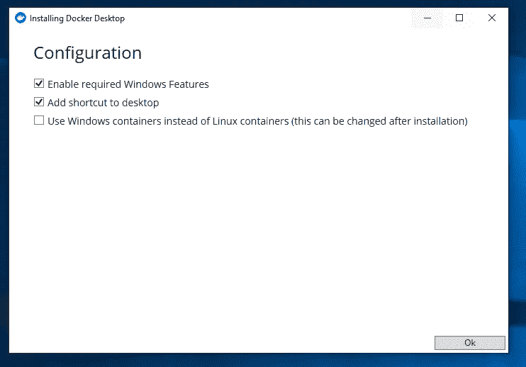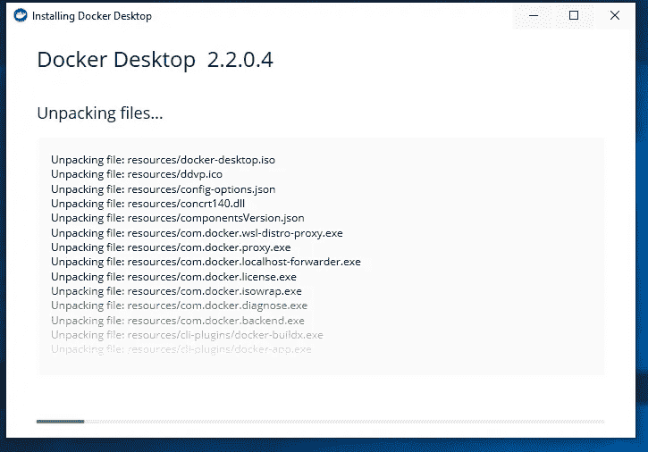

2.选择关闭并重新启动，这将重新启动您的机器，并在 windows 启动时启动 docker。

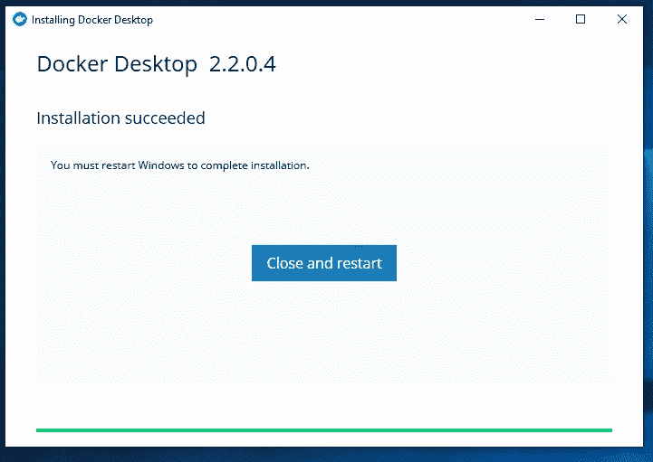

3.一旦 Windows 重新启动，你会在任务栏上看到一个小的动画 docker 图标，显示 docker 正在启动，这可能需要 20 秒到几分钟的时间。

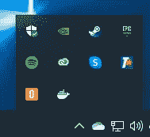

4.一旦它完成了它的启动程序，你会看到一个欢迎卡。在 windows 上使用 docker 不需要登录并注册 docker。

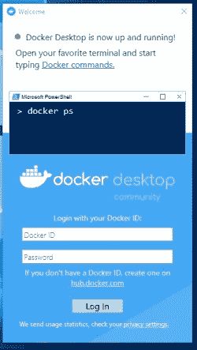

5.打开一个 bash 提示符(Win 键-> bash -> Enter)。然后，您可以运行 docker hello-world 容器。

```
$ docker run --rm hello-world
Unable to find image 'hello-world:latest' locally
latest: Pulling from library/hello-world
1b930d010525: Pulling fs layer
1b930d010525: Verifying Checksum
1b930d010525: Download complete
1b930d010525: Pull complete
Digest: sha256:f9dfddf63636d84ef479d645ab5885156ae030f611a56f3a7ac7f2fdd86d7e4e
Status: Downloaded newer image for hello-world:latestHello from Docker!
This message shows that your installation appears to be working correctly.To generate this message, Docker took the following steps:
...<rest of message remove>
```

hello-world 容器测试将验证:

*   Docker 服务已正确安装并运行。
*   docker 命令位于您的执行路径中，可以与 docker 服务通信。
*   您有权限运行 docker 命令。
*   docker 服务可以通过 docker 容器报告到达 DockerHub。
*   docker 服务可以运行容器。

如果一切都出错了呢？(来源 Giphy)

## 排除故障

docker 安装和运行过程可能有点不稳定，因此您可以通过 Docker 仪表板访问诊断日志。单击故障排除图标，在诊断窗格中，会有一个指向日志文件的链接，该链接将在记事本中打开。
或者可以在“C:\ Users \ User \ AppData \ Local \ Docker”找到

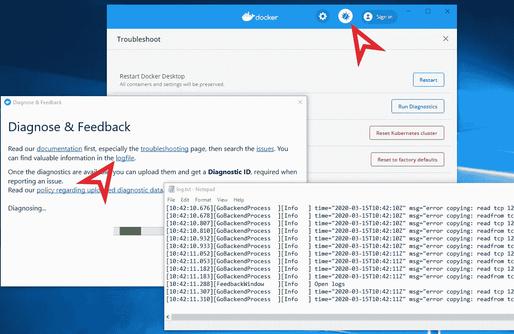

访问诊断日志文件

(来源 Giphy)

# 与库伯内特斯起航

如果你不知道 Kubernetes(简称 k8s)是什么，也不知道它有什么用途，那么有一个来自 K8s 团队的很好的[解释你可以翻阅一下。Kubernetes 在希腊语中是舵手或领航员的意思，因此这个图标是船只的舵手，也是你随处可见的航海主题。windows 上的 K8s 过去设置起来非常痛苦，但现在已经变得容易多了。在启用 k8s 之前，将 docker 可用的 RAM 从默认的 2GB 增加到 4GB 可能是明智的，或者如果您有 8GB 的容量，这意味着它将运行得更快。设置可以在 docker dashboard 中找到，该 dashboard 从任务栏图标启动，并单击 Cog 符号。点击“应用&重启”以使新的内存限制生效。](https://kubernetes.io/docs/concepts/overview/what-is-kubernetes/)

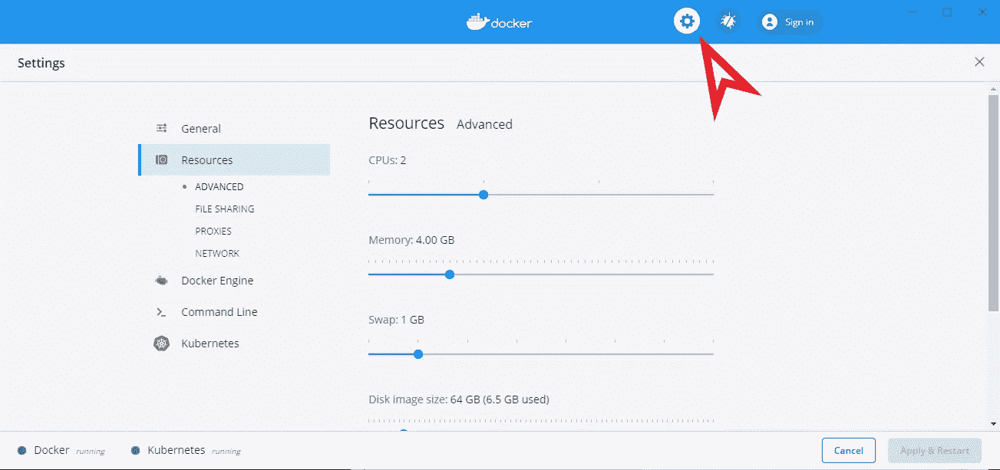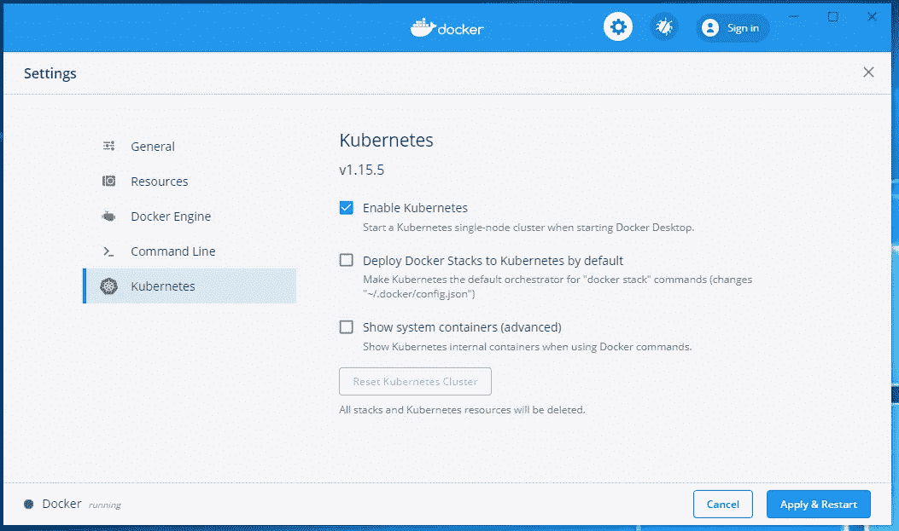

然后只需点击“启用 Kubernetes”，然后“应用和重启”即可启用 Kubernetes。这将下载并初始化所有的 k8s 容器，这些容器是在本地机器上运行本地 one node k8s 集群所必需的。去冲杯咖啡吧，这可能要花很长时间。如果 15-20 分钟后仍未完成(通常是由于内存不足),重启机器，它应该与 windows 一起启动。您可以使用下面的 kubectl 命令测试 k8s 是否都在运行。

```
$ kubectl get nodes
NAME             STATUS   ROLES    AGE    VERSION
docker-desktop   Ready    master   167m   v1.15.5
```

我们来部署一下吧！(来源 Giphy)

# 抓住舵

正如您可能已经读到的，k8s 非常强大，能够运行巨大的集群并管理大量的资源，但是说得委婉一点，它很难管理。为了帮助解决这个问题，并提供预打包的部署在您的集群上运行，创建了 [Helm 项目](https://helm.sh/)。一个相对容易使用的 k8s 包管理器。解压你之前下载的 helm 包，找到 helm.exe 文件。这个文件可以添加到您的路径中的任何地方，但我更喜欢将它和所有其他 Docker 命令行工具一起放在“C:\ Program Files \ Docker \ Docker \ resources \ bin”中。

## 启动示例应用程序

要运行 helm 应用程序，您需要添加 repo，更新索引并安装图表。helm install 通常会在部署信息的末尾给出一些有用的说明，让您连接到新创建的服务。

```
$ **helm repo add stable** [**https://kubernetes-charts.storage.googleapis.com/**](https://kubernetes-charts.storage.googleapis.com/)
$ **helm repo update**
$ **helm install stable/tensorflow-notebook --generate-name**
NAME: tensorflow-notebook-1584196283
LAST DEPLOYED: Sat Mar 14 14:31:25 202
NAMESPACE: default
STATUS: deployed
REVISION: 1
TEST SUITE: None
NOTES:
1\. Get the application URL by running these commands:
NOTE: It may take a few minutes for the LoadBalancer IP to be available.
You can watch the status of by running 'kubectl get svc -w tensorflow-notebook-1584196283'
export SERVICE_IP=$(kubectl get svc --namespace default tensorflow-notebook-1584196283 -o jsonpath='{.status.loadBalancer.ingress[0].ip}')
echo notebook_url=http://$SERVICE_IP:8888
echo tensorboard_url=http://$SERVICE_IP:6006
```

图表被发送到 k8s 集群，应用程序被初始化，但这不是即时的。下载容器映像并运行它们需要时间。

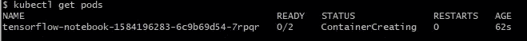

图表仍在启动中

舵图试图创建 2 个容器，但它仍然在创建它们。这可能需要一段时间。

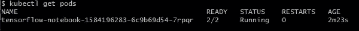

图表已启动并运行

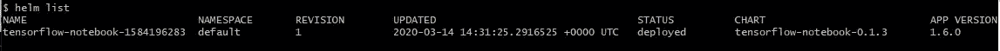

Helm 将应用程序列为已部署，即使 pod 尚未准备好。

部署图表后，有时需要使用默认凭据来登录。这些可以在舵图中指定，但也可以自动生成，并且对每个实例都是唯一的。要获得存储在 kubectl secrets 系统中的凭证，您需要使用 secret 命令检索它们。例如

```
$ **kubectl get secret tensorflow-notebook-<unique_id> -o yaml**
```

秘密 YAML 的输出

然后可以使用 base64 命令对编码的秘密进行解码。

```
echo ‘XXXXXXXXXXX==’ |base64 — decode
```

现在您可以在 [http://127.0.0.1:8888 登录您的 k8s 托管机器学习 Tensorflow Jupyter 笔记本服务。](http://127.0.0.1:8888.)和一个 Tensorboard 管理界面 http://127.0.0.1:6006。

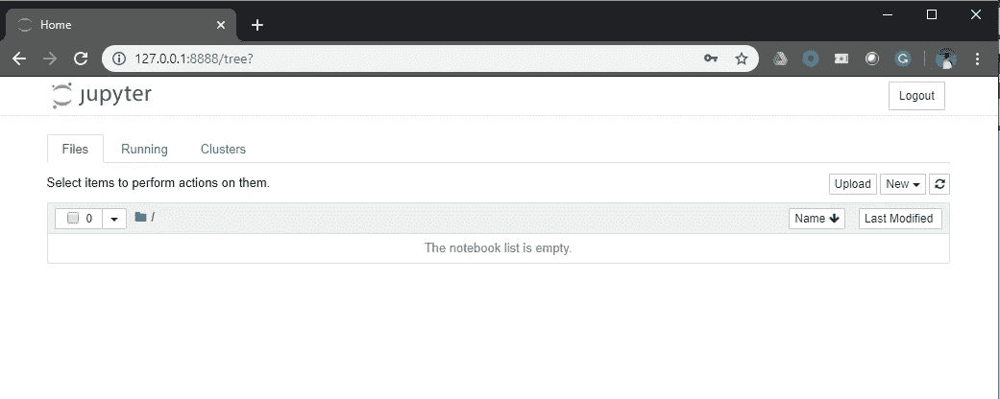

Tensorflow Jupyter 笔记本服务器

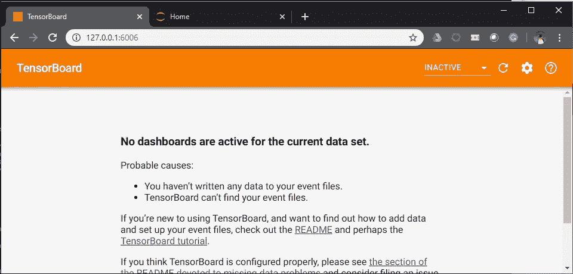

Tenserflow 仪表板

给自己一个击掌，你有一个令人敬畏的设置(来源 Giphy)

# 一些有用的附加功能

## Docker 撰写

在 k8s 所有花哨的云和企业级工具出现之前，有 docker-compose。目前，这种方法通常不用于部署企业应用程序，但对于以一种更简单、更容易上手的方式处理容器来说，docker-compose 是必不可少的。使用一个超级简单的组合文件，你可以用一个简单的“docker-compose up -d”命令运行一系列服务。

简单的 docker 编写文件

创建一个类似 compose_test 的目录，将上面的代码片段放在一个名为 docker-compose.yml 的文件中，在该目录中运行“docker-compose up ”,您就有了一个正在运行的 web 服务。我 90%的时间使用 docker-compose 进行开发、测试和 POC 部署。对于开发工作来说，理解和使用它要容易得多。

## Visual Studio 代码

如果你还没有使用过 Visual Studio 代码，你去过哪里！这是微软的一个优秀的免费轻量级编辑器，它不依赖于 Visual Studio，也不需要 Visual Studio，并且有广泛的语言支持。作为扩展生态系统的一部分，有大量优秀的插件可以与 k8s、helm、Docker 和 compose 文件一起工作。我强烈推荐安装微软的“Kubernetes”和“Docker”扩展。

需要注意的事情(来源 Giphy)

# 一些警告

Docker for Windows 使用了内置于最新版本 Windows 中的 Hyper-V 虚拟化技术。这是 WSL2 和微软虚拟化服务背后的工具集。直到最近，VirtualBox 一直是在 windows 上进行快速简单虚拟化的最佳选择，如果你想让 Hyper-V 和 VirtualBox 在同一系统上共存，那是不可能的。在 VirtualBox 6.1.x 中，这种限制应该已经消除，您可以使用 Hyper-V 后端运行 VirtualBox。我没有测试过这一点，因此，如果您想要使用现有的虚拟机，它可能不会很好地工作。如果它不起作用，可以通过卸载和禁用 Hyper-V 回滚到 VirtualBox，所以尝试一下也无妨。

# 后续步骤

*   熟读 Kubernetes(【https://kubernetes.io/】T2)
*   仔细阅读赫尔姆([https://helm.sh/](https://helm.sh/))
*   滚动你自己的码头集装箱(【https://docs.docker.com/get-started/part2/】T2
*   从 Docker compose(【https://docs.docker.com/compose/】)开始
*   Visual Studio 代码入门([https://code.visualstudio.com/](https://code.visualstudio.com/))