# 在@ratemyskyperoom 获胜:

> 原文：<https://towardsdatascience.com/winning-at-ratemyskyperoom-elaborate-and-pointless-analysis-9daa222cd94?source=collection_archive---------31----------------------->

由 [@ratemyskyperoom](https://twitter.com/ratemyskyperoom/) 评分的房间(和扬声器)的拼贴画。图片归功于每个拍照的人。

## 在这个不确定的时代，世界比以往任何时候都更需要有力的数据新闻。这不是那个。

相反，我分析了 1321 条推文来回答一个问题，自从 Zoom 成为我们日常生活的一部分以来，我们许多前往疫情的远程工作者都想知道这个问题: ***人们喜欢我的房间吗？！***

与动物穿越不同，我们没有权威的浣熊可以依靠，以获得关于我们装饰技巧的客观反馈。

相反，在现实世界中，我们得到的最接近的东西是房间评级( [@ratemyskyperoom](http://twitter.com/ratemyskyperoom) )。随着越来越多的(名人)通过笔记本电脑镜头展示他们的住宅，房间评级机构已经开始公开地、定量地对他们进行评判。

不是所有的家庭都会在国家电视台播出。至少近期不会。但是我们都同意，当那一天到来的时候，我们希望世界看到我们的房间(或者说，我们的存在)配得上 10/10。

所以我问:“怎样才能让我的房间得到 10/10 分？!"

为了找到答案，我把从 2020 年 5 月到 2020 年 7 月的 1321 条房间评级推文全部拉了下来，分析了评级，然后查看了每条推文的图片和文本内容。

以下是我在数据中发现的*关键的*、*深刻的*和*激动人心的*见解。

(本帖互动版在此: [**房间评级统计笔记本**](https://observablehq.com/@elibryan/ratemyskyperoom-room-rating-stats) )

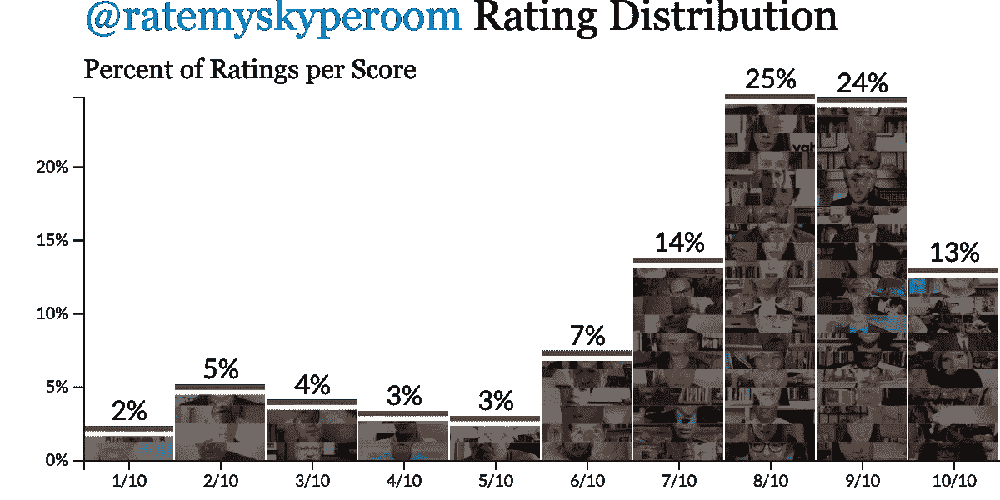

所有客房评分的百分比分布( [src](https://observablehq.com/@elibryan/ratemyskyperoom-room-rating-stats#roomRaterRatingDistribution) )。平均评分是 7.5/10。

## 洞察力#1:获得一个好的评价并不是非常困难。

好消息是:获得高分显然并不难。平均评分是 7.5/10，他们像发糖果一样发 8/10。其实*大部分收视率*至少都是 8/10。

房间评级员说这是一场艰苦的比赛，但他们内心深处是柔软的。

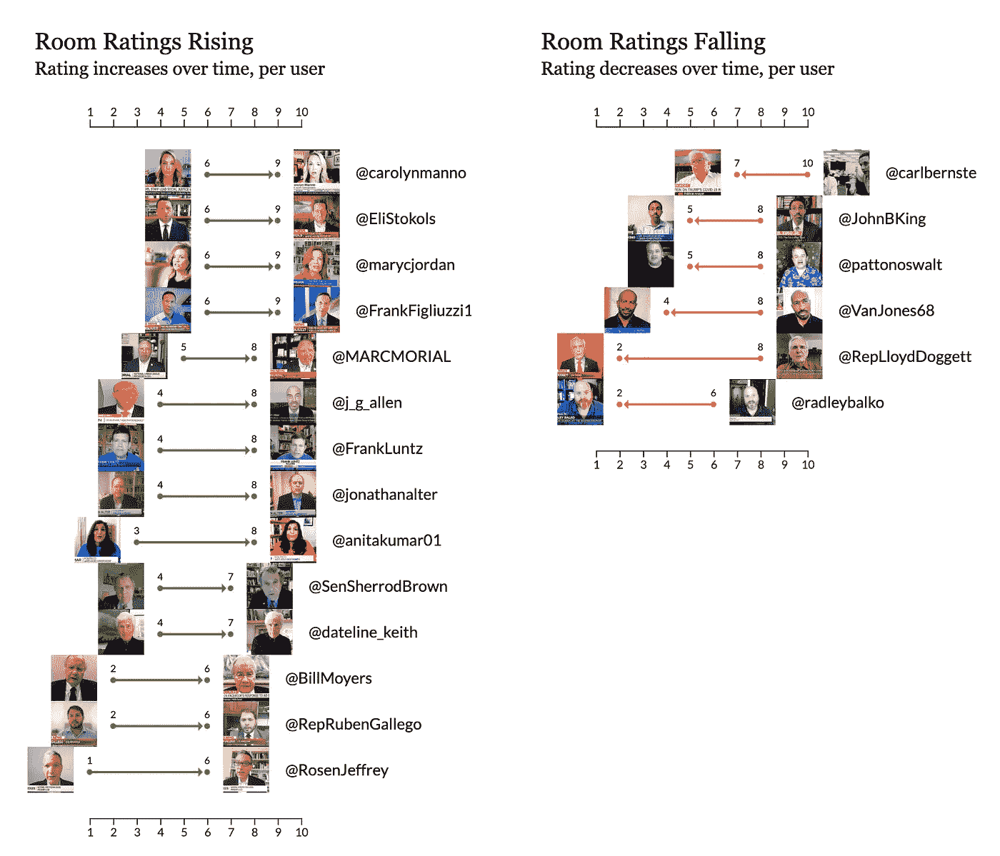

这个愚蠢的渲染显示了个人 twitter 用户的房间评级变化，在他们的第一次评级和最后一次 ratting ( [src](https://observablehq.com/@elibryan/ratemyskyperoom-room-rating-stats#moversShakers) )之间。左栏显示的是提高了房间评价的演讲者。右栏显示的是失宠的演讲者。

## 洞察力#2:第二次机会提供了一条救赎之路(或者没有)

即使你的第一次收视率很低，你总会有下一次电视亮相的机会。至少有 83 人的房间不止一次被评过。

无论你来自斯克兰顿还是芝麻的硬街( [@JoeBiden](https://twitter.com/search?q=(from%3Aratemyskyperoom)%20%40joebiden) +1、 [@elmo](https://twitter.com/search?q=(from%3Aratemyskyperoom)%20%40elmo) +1)，无论你是政治家、新闻界、民意调查者还是教授([@ RepKarenBass](https://twitter.com/search?q=(from%3Aratemyskyperoom)%20%40RepKarenBass)+2； [@marycjordan](https://twitter.com/search?q=(from%3Aratemyskyperoom)%20%40marycjordan) +3，[@ frank luntz](https://twitter.com/search?q=(from%3Aratemyskyperoom)%20%40FrankLuntz)+3； [@j_g_allen](https://twitter.com/search?q=(from%3Aratemyskyperoom)%20%40j_g_allen) +4)，[房间评分员](https://twitter.com/ratemyskyperoom/)愿意给你的房间第二次机会。上面，你可以看到左边的 14 个人在他们第一次和最后一次出现之间至少提高了 3 分。最佳改进奖授予了 [@anitakumar01](https://twitter.com/search?q=(from%3Aratemyskyperoom)%20%40anitakumar01) 和 [@RosenJeffrey](https://twitter.com/search?q=(from%3Aratemyskyperoom)%20%40RosenJeffrey) (各+5)。

但是要小心！房费评定者给的，房费评定者拿走。至少有 6 个人在第一次和最后一次评分之间得分更低。不好意思 [@pattonoswalt](https://twitter.com/search?q=(from%3Aratemyskyperoom)%20%40pattonoswalt) ！

# 房间评级成功的秘诀是什么？

为了理解这一点，我查看了两个来源:房间图像和每条推文的文本。为了分析这些图像，我通过[AWS“Rekognition”](https://aws.amazon.com/rekognition)图像识别 API 运行了每一张图像。为了分析文本，我查看了单个单词的用法(例如，“wu”和“tang”，而不是“wu tang”)。这两种方法都不是特别可靠，但是仍然有一些有趣的发现。

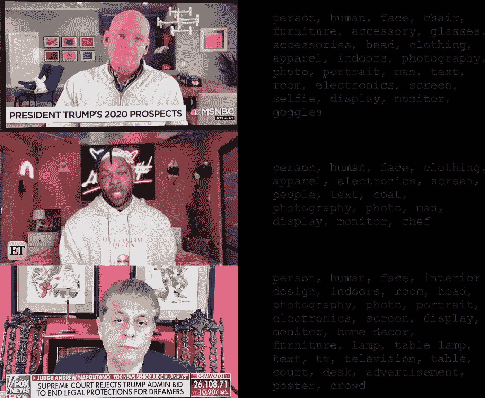

左边是由 [@jheil](https://twitter.com/ratemyskyperoom/status/1263081958990544896) 、 [@todrick](https://twitter.com/ratemyskyperoom/status/1273802967829880832) 和 [@Judgenap](https://twitter.com/ratemyskyperoom/status/1273643977732952067) 的[房间评分员](https://twitter.com/ratemyskyperoom/)发布的 3 张样板间图片。右边是亚马逊的 AWS Rekognition 服务如何标注每张图片。

# 关于高质量的 skype 房间，图像识别能告诉我们什么？

不多。AWS Rekognition 算法似乎很适合区分大类别的事物，但当图像的范围已经有些狭窄时，这不是很有帮助。上面你可以看到一些样本图像的结果。我希望结果更接近“*嘿，看，@托德里克在墙上有冰淇淋！”*但至少它擅长分辨`people`和`human` `faces` …。

这并不是说它完全没有洞察力。让我们看一个例子。

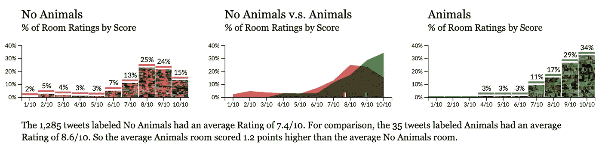

有或没有动物的房间的等级分布( [src](https://observablehq.com/@elibryan/ratemyskyperoom-room-rating-stats#imageLabelComparisonCharts) )。

## 洞察力#3:小狗造就伟大的 Skype 房间。

我们的第一个有趣的事实:房间评分员非常喜欢有动物的房间。平均来说，有动物的房间比没有动物的房间得分高 1.2 分。这可能包括动物艺术品，马的雕塑或真实的宠物在人的背景中闲荡。

上面我们有三张图。最左边和最右边标有`No Animals`和`Animals`的图表显示了没有动物在其中的房间与有动物在其中的房间的评级分布(至少就 AWS 而言)。覆盖在条上的图像包括来自原始推文的图像样本。(如果你去 [**笔记本这里**](https://observablehq.com/@elibryan/ratemyskyperoom-room-rating-stats) 你可以点击图表上的图片看动物)

中间标有`No Animals v.s. Animals`的图表显示了来自其他两个图表的相同数据，相互重叠。中间的图表还包括底部的小凹口，显示每个分布的平均值(在这种情况下，`No Animals`平均为 7.4，`Animals`为 8.6)。

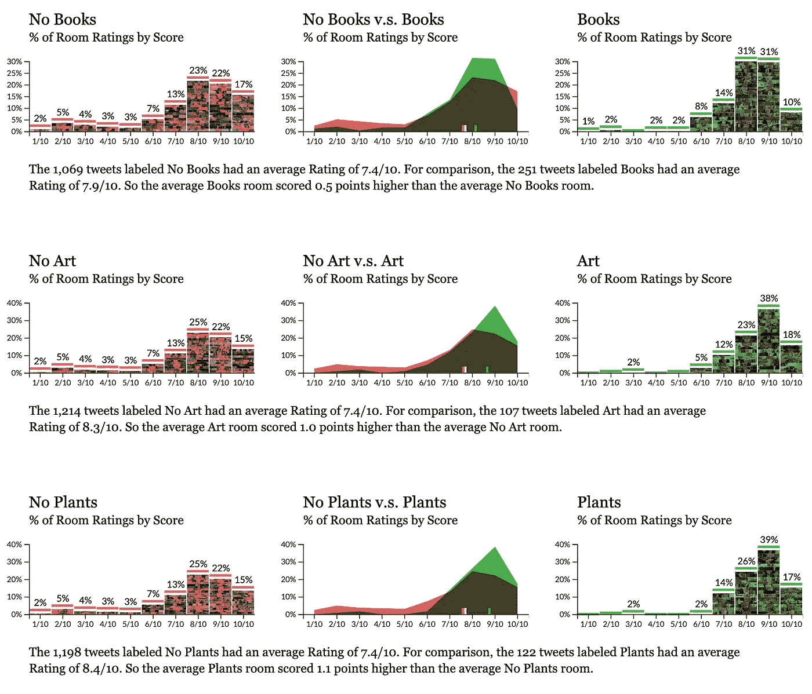

有或没有书籍、艺术品或植物的房间的评级分布( [src](https://observablehq.com/@elibryan/ratemyskyperoom-room-rating-stats#imageLabelComparisonCharts) )。

## 观点 4:已证实:植物、艺术品和书籍有助于打造更好的房间。

这没有什么突破性的，但肯定令人放心。AWS 的算法可以识别植物、艺术或书籍的照片比没有植物、艺术或书籍的房间照片获得了更高的评级。

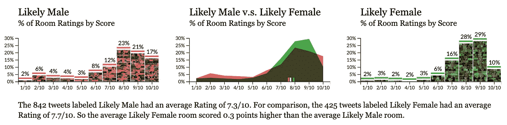

扬声器为男性或女性的房间的等级分布( [src](https://observablehq.com/@elibryan/ratemyskyperoom-room-rating-stats#imageLabelComparisonCharts) )。

## 奇数:男性演讲者的房间更经常被评级，但女性演讲者的房间更好。

男性演讲者的评分几乎是女性演讲者的两倍(男性 842 分，女性 425 分)，但平均而言，女性的房间更好 0.3 分。(*注意:这里的“男性”和“女性”是基于 AWS 从图像中对人的性别的预测。)

# 关于挣高分房，@ratemyskyperoom 的书面反馈告诉了我们什么？

从这些照片中没有发现改变生活的启示，但是也许我们可以直接从[房间评估员](https://twitter.com/ratemyskyperoom/)的书面反馈中获得一些见解…

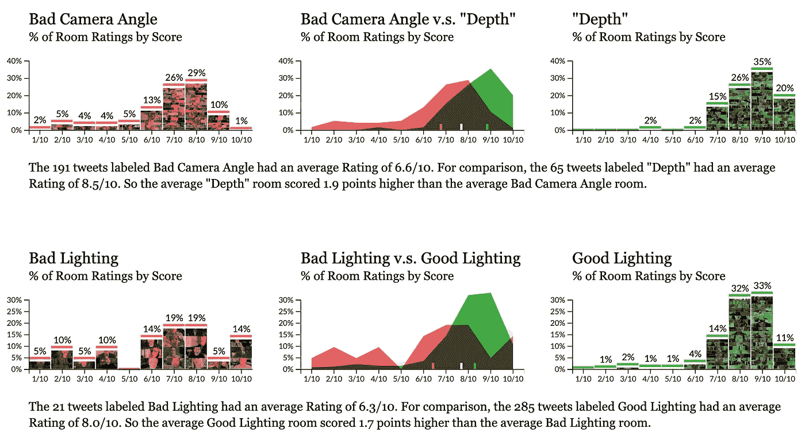

比较反馈中包含摄像机角度或照明语言的房间的评分分布( [src](https://observablehq.com/@elibryan/ratemyskyperoom-room-rating-stats#writtenFeedbackComparisonCharts) )。

## **洞察力#5。首先，把基本的东西做好。**

把基本的东西做好是很重要的。也就是说，正确地调整相机的框架并检查你的照明。当[房间评估员](https://twitter.com/ratemyskyperoom/)的书面反馈提到[重构摄像机](https://twitter.com/search?q=(raise%20OR%20crop%20OR%20camera%20OR%20ceiling%20OR%20reframe)%20from%3Aratemyskyperoom&src=typed_query)(比如“重构”、“裁剪”、“摄像机”、“天花板”等词语。)一般是针对评分较低的房间。同时营造出一种“[深度感](https://twitter.com/search?q=(depth)%20from%3Aratemyskyperoom)”稳操胜券。

好的照明都差不多。包括“黑暗”或“背光”等词语的反馈是一个不好的信号，所以确保你没有坐在黑暗的[中](https://twitter.com/search?q=(dark%20OR%20backlit%20OR%20backlighting)%20from%3Aratemyskyperoom)。

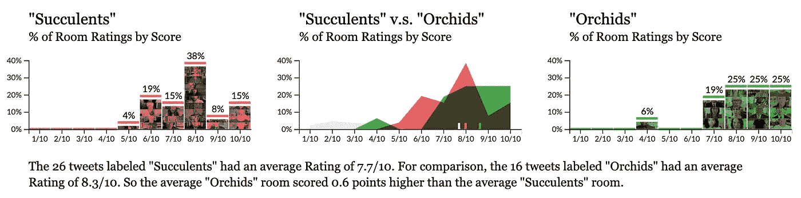

对反馈包含多肉植物或兰花词语的房间进行评级分布比较( [src](https://observablehq.com/@elibryan/ratemyskyperoom-room-rating-stats#writtenFeedbackComparisonCharts) )。

## 洞察力#6。多肉植物不错。兰花更好。

虽然[房间评估员](https://twitter.com/ratemyskyperoom/)很快建议为你的房间买一棵[多肉的](https://twitter.com/search?q=(succulent%2C%20OR%20succulents)%20from%3Aratemyskyperoom)或任何普通的植物，但他们实际上似乎更喜欢[兰花](https://twitter.com/search?q=(orchid%20OR%20orchids)%20from%3Aratemyskyperoom&src=typed_query)。

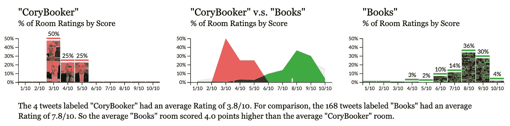

对反馈中包含科里·布克或书籍的房间进行比较的评分分布。

## 洞察力#6。澄清书籍诉 s .布克。

[房间评估员](https://twitter.com/ratemyskyperoom/)批准房间中包含“**书籍。**“他们不同意房间里有书。(细微差别。)

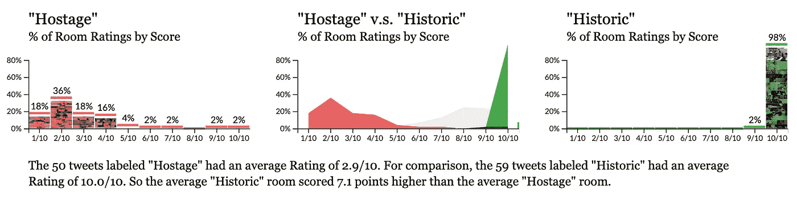

比较反馈中包含人质或历史词汇的房间的评分分布( [src](https://observablehq.com/@elibryan/ratemyskyperoom-room-rating-stats#writtenFeedbackComparisonCharts) )。

## 洞察力#7。"历史性的"比"人质"更好。

也许最大的成功因素是了解“[人质](https://twitter.com/search?q=(hostage%20OR%20kidnap)%20from%3Aratemyskyperoom&src=typed_query)”和“[历史性](https://twitter.com/search?q=(historic)%20from%3Aratemyskyperoom&src=typed_query)”之间的区别似乎被绑架还不够糟糕，[房间评级](https://twitter.com/ratemyskyperoom/)对在电视上看到这些受害者颇有微词。值得称赞的是，他们确实为追随者提供了大量的“历史性 Skype 房间”,供观众在设计自己的房间时效仿。

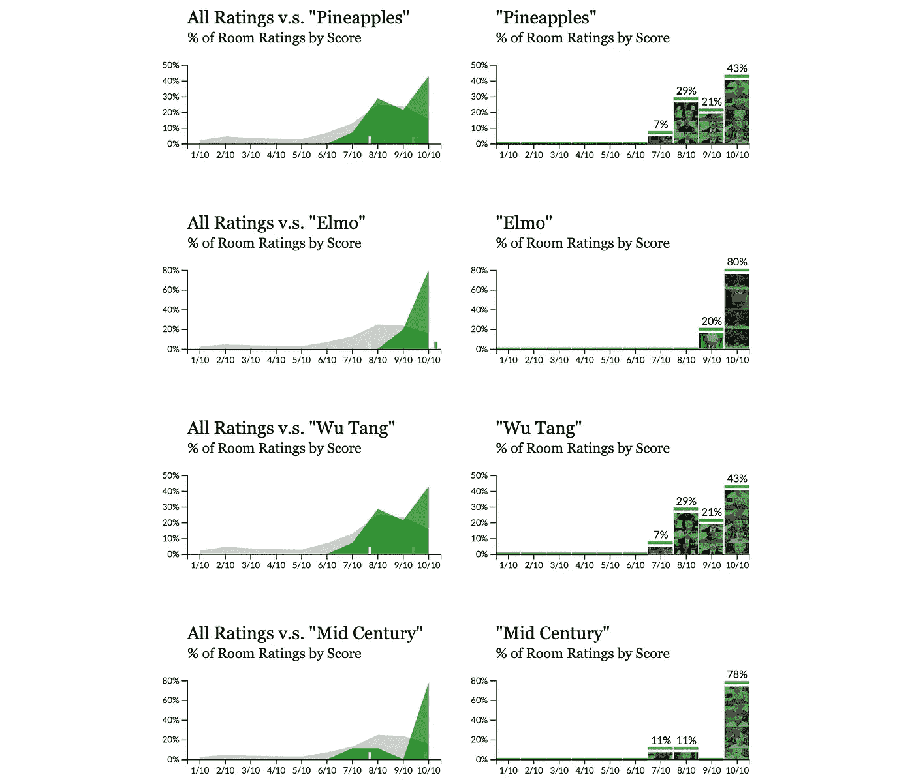

将所有评分与反馈包括菠萝、Elmo、Wu Tang 或 Mid Century ( [src](https://observablehq.com/@elibryan/ratemyskyperoom-room-rating-stats#writtenFeedbackComparisonCharts) )的评分进行比较的评分分布。

## 洞察力#8。轻松赢得提升客房评级。

最后，如果你在直播前需要一个快速的刺激，那么[房间评分员](https://twitter.com/ratemyskyperoom/)非常喜欢[菠萝](https://twitter.com/search?q=(pineapple%20OR%20pineapples)%20from%3Aratemyskyperoom&src=typed_query)、[埃尔莫](https://twitter.com/search?q=(elmo)%20from%3Aratemyskyperoom&src=typed_query)和[吴唐家族](https://twitter.com/search?q=(wu%20OR%20tang)%20from%3Aratemyskyperoom&src=typed_query)，所以你可以考虑将这些主题融入到你的[中世纪](https://twitter.com/search?q=(mid%20OR%20century)%20from%3Aratemyskyperoom&src=typed_query)现代装饰中，你很快就会得到 10/10 的分数。

# 外卖:

*   如果你因为世界末日而感到压力，精心制作和无意义的数据探索可能是一种奇妙的应对机制。
*   [@ratemyskyperoom](https://twitter.com/ratemyskyperoom/) 成功的秘诀:好的灯光，好的相机取景，植物，艺术，书籍，动物，菠萝，Elmo 和吴唐。如果你不是科里·布克，也没有被扣为人质，这也会有所帮助。

我是谁？不，不，*你是谁？！*

嗨！我是伊莱·霍德。我帮助客户设计和开发忙碌的人和他们杂乱的数据之间的有效接口。如果你是一名创始人、创客、讲故事者、非营利行善者或商业领袖，正在思考数据、设计和用户心理的交集，我很乐意联系并聆听你的故事。

你可以发电子邮件到 eli@3isapattern.com 的 T2 或者在 T4 的推特上关注我。