# 在线数据科学黑客马拉松的获奖解决方案

> 原文：<https://towardsdatascience.com/winning-solution-of-an-online-data-science-hackathon-ead4d340bb41?source=collection_archive---------16----------------------->

## 我在 Analytics Vidhya 数据科学黑客马拉松上的获奖解决方案的完整代码


杰佛森·桑多斯在 [Unsplash](https://unsplash.com?utm_source=medium&utm_medium=referral) 上拍摄的照片

数据科学黑客马拉松是有抱负的数据科学家的终极战场。任何黑客马拉松的目的都是让你的想象力引导你拓展这个领域的知识和技能。

经过两年的自学，我决定与其他数据科学家一起在实际战场上检验我的技能。所以我决定参加在线黑客马拉松。我决定将网站列入候选名单，并很快选择了 Analytics Vidhya 开始我的黑客马拉松之旅。

我最初的起步不够好。但是我在我的前四个在线黑客马拉松中的一个上得到了前 50 名。

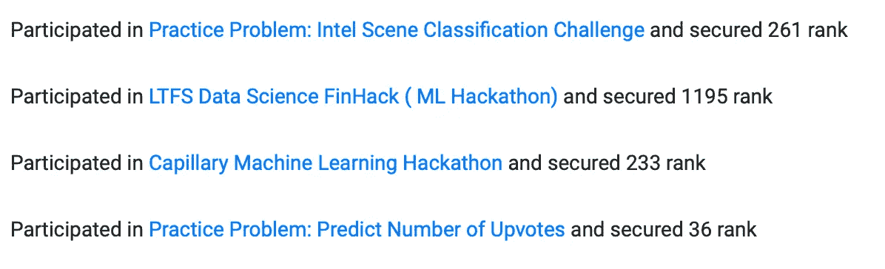

我从中学到的一件重要的事情是不要参加所有可能的黑客马拉松。

> 重要的是列出一个你想关注的特定的黑客马拉松，并为此全力以赴。不要同时参加多个黑客马拉松，因为每个黑客马拉松都需要适当的时间和努力。

8 月，Analytics Vidhya 发起了数据至上黑客马拉松。

链接到黑客马拉松:[https://data hack . analyticsvidhya . com/contest/the-data-supremity/](https://datahack.analyticsvidhya.com/contest/the-data-supremacy/)

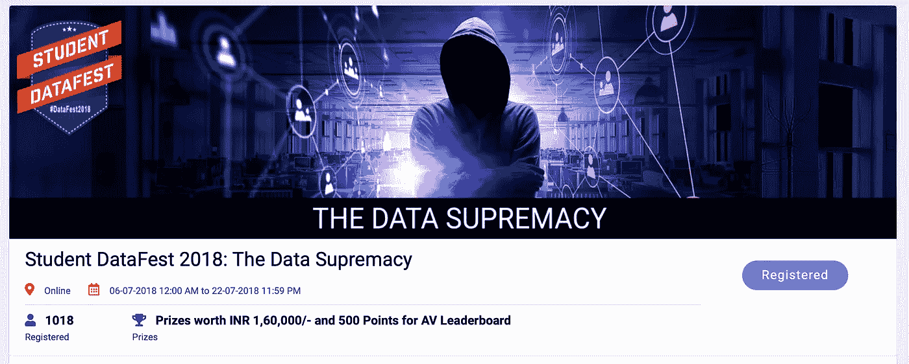

图片来源:[datahack.analyticsvidhya.com/contest/the-data-supremacy/](https://datahack.analyticsvidhya.com/contest/the-data-supremacy/)

并且在看了问题陈述之后，我决定参与并尽我所能。为了更容易理解，我将在不同的部分决定解决方案。

# 问题

黑客马拉松是一个**二元分类**问题，我们必须根据特定学生的历史背景来预测他是否有资格参加。

数据集大小:

火车造型:(18359，14)
测试造型:(15021，13)

目标:二元分类→ 0/1

给出的特征总数:13 个特征[列]

# 了解功能

这是几乎每个人都跳过的重要一步。

> 不要直接跳到写机器学习代码。首先了解问题，以及每个特性的含义。看看你是否能找到特征和目标变量之间的关系。

在对所有特性进行了适当的研究之后，我决定从代码开始。

# 图书馆

以下是我在整个黑客马拉松中使用的库。

我几乎在任何地方都使用的 3 个基本库。

```
import pandas as pd
import numpy as np
import matplotlib.pyplot as plt
%matplotlib inline
```

注意:我已经包括了比我实际使用的更多的库，来展示我在黑客马拉松中尝试过的所有库。

```
import xgboost as xgb
from xgboost.sklearn import XGBClassifier,XGBRegressor
import catboost
from catboost import CatBoostClassifier
from sklearn.preprocessing import LabelEncoder , MinMaxScaler
from sklearn.cross_validation import KFold , cross_val_score
from sklearn.metrics import accuracy_score , roc_auc_score,confusion_matrix
from sklearn.grid_search import GridSearchCV
from sklearn import metrics
from sklearn.ensemble import RandomForestRegressor,RandomForestClassifier
from sklearn.neighbors import KNeighborsRegressor,KNeighborsClassifier
from sklearn.svm import SVR
from sklearn.linear_model import LogisticRegression,LinearRegression
from sklearn.ensemble import ExtraTreesClassifier
from sklearn.model_selection import RandomizedSearchCV
```

# 数据看起来怎么样？

现在是时候阅读培训和测试 csv 了。

```
train_data = pd.read_csv('train_FG6BvLg.csv')
test_data = pd.read_csv('test_wovud0B.csv')
print("Train Shape : {}\nTest Shape : {}".format(train_data.shape,test_data.shape))
```

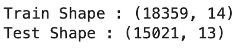

```
train_data.head()
```

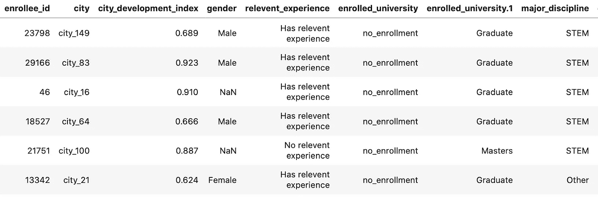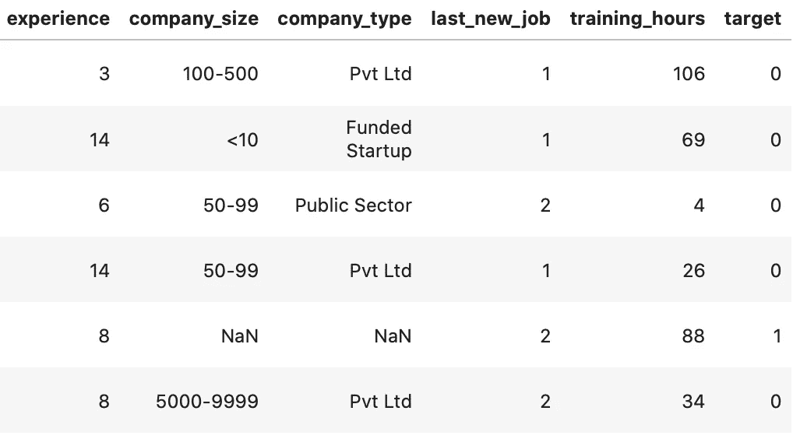

我不得不把快照分成两张图片，因为它在一张图片中看不到。

**目标**列是我们测试文件中要预测的列。

# 预处理

我总时间的大约 75%用于预处理数据。

我研究了所有的列，想出了预处理它们的所有方法，并得出了最终的预处理代码。

注意:每一列的预处理技术都是不同的，不会在所有地方都相同。

首先，是时候从**城市**栏中删除文字部分了

城市 _21 → 21

```
train_city = train_data.city.str.split("_")
test_city = test_data.city.str.split("_")
```

这将包含一个有 2 个值的列表(前者是“城市”,后者是分配的数字)

```
i=0
for x in train_city:
    train_data.loc[i,'city'] = x[1]
    i=i+1
```

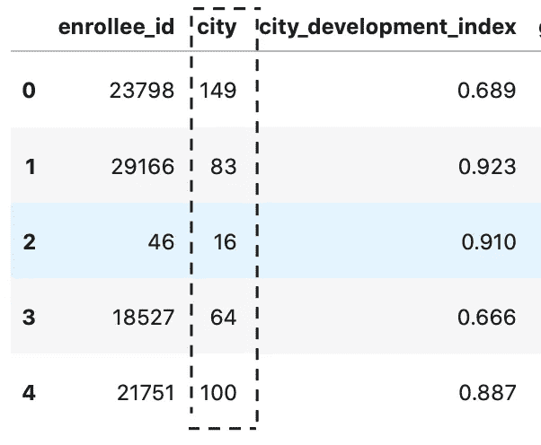

您可以看到所做的更改。我对 test_data 做了同样的事情。

然后我决定检查数据是否包含任何缺失值。

```
train_data.isnull().sum()
```

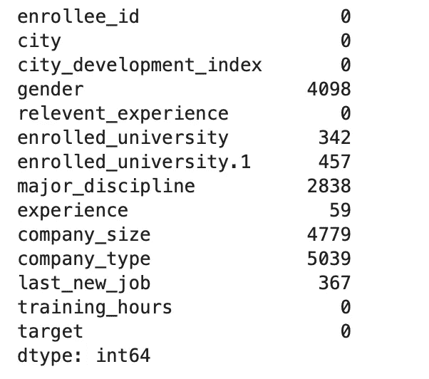

我们需要正确处理这些缺失的值，因为丢弃它们会导致重要信息的丢失。

在我们开始输入缺失值并对它们进行预处理之前，我们将结合训练和测试数据。这将有助于对整个数据集进行相同的更改。

> 在组合之前，从训练数据中弹出目标列，因为它不在测试数据中。

```
target = train_data.pop('target')
enrollee_id = test_data['enrollee_id']
combined_data = train_data.append(test_data)
```

现在是开始进一步预处理的时候了。我将**城市**列的数据类型从字符串改为整数:

```
combined_data.city= combined_data.city.astype('int')
```

我将**性别**列替换为整数类别:

```
combined_data.gender.replace({'Male':2,'Female':0,'Other':1},inplace=True)
```

我对另外两个专栏做了同样的事情:

```
combined_data.enrolled_university.replace({'no_enrollment':1,'Part time course':2,'Full time course':3},inplace=True)combined_data.major_discipline.replace({'No Major':0,'Other':1,'Arts':2,'Humanities':3,'Business Degree':4,'STEM':5},inplace=True)
```

列 **experience** 和 **company_size** 包含类似于“< 10”和“> 500”和“500–1000”的字符串。这阻止了将列设为整数。

```
combined_data.experience.replace({'>20':21,'<1':0},inplace=True)
```

为了说明 company_size 的样子:

```
combined_data.company_size.value_counts()
```

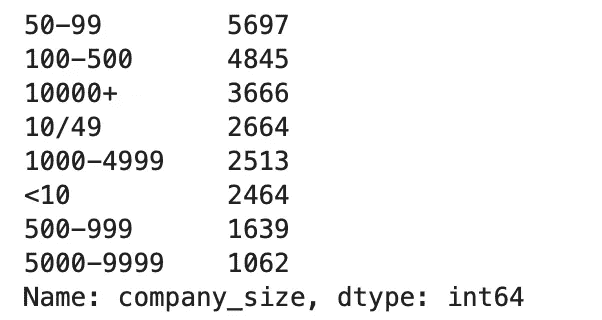

```
combined_data.company_size.replace({'<10':0,'10/49':1,'50-99':2,'100-500':3,'500-999':4,'1000-4999':5,'5000-9999':6,'10000+':7},inplace=True)
```

company_type 列具有分类值:

```
combined_data.company_type.value_counts()
```

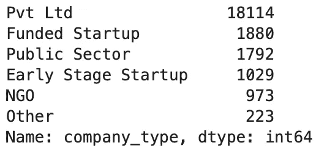

我没有给出随机数来替换，而是按照受众的递增顺序来替换。

```
combined_data.company_type.replace({'Other':0,'Early Stage Startup':1,'Funded Startup':2,'NGO':3,'Public Sector':4,'Pvt Ltd':5},inplace=True)
```

我还在剩下的专栏中做了一些替换。

```
combined_data.last_new_job.replace({'never':0,'>4':5,'nan':1},inplace=True)combined_data.relevent_experience.replace({'No relevent experience':0,'Has relevent experience':1},inplace=True)
```

缺失值怎么办？

我尝试了各种插补法，包括 sklearn 库中的 SimpleImputator。我甚至试着用平均值来表示它们，但是这并不比用 0 来表示它们更好

```
combined_data.major_discipline.fillna(0,inplace=True)
combined_data.company_type.fillna(0,inplace=True)
combined_data.company_size.fillna(0,inplace=True)
combined_data.enrolled_university.fillna(0,inplace=True)
combined_data['enrolled_university.1'].fillna(0,inplace=True)
```

因为数据的数值范围不同。在继续我们的模型之前，我决定将数据标准化。

我使用了 MinMaxScaler，它允许我自定义我的最小和最大范围值。

```
values  =  combined_data.values
scalar = MinMaxScaler(feature_range=(0,5))
x_scaled = scalar.fit_transform(values)
combined_data = pd.DataFrame(x_scaled,columns=combined_data.columns)
```

为了转移到我们的模型，我们需要删除 ID 列。

```
combined_data.drop('enrollee_id',axis=1,inplace=True)
```

# 模型

老实说，我尝试了 10 多种算法，看看哪一种有效。

我从 RandomForest 开始到 CatBoost。

```
clf = CatBoostClassifier(iterations=200,depth=4,eval_metric='AUC',l2_leaf_reg=9,learning_rate=0.1)
```

但是 XGBoost 优于所有其他算法。所以我坚持用它来创建模型函数:

```
def model_fit(alg, dtrain, target,dtest):
    xgb_param = alg.get_xgb_params()
    xgtrain = xgb.DMatrix(dtrain.values, label=target)
    cvresult = xgb.cv(xgb_param, xgtrain, num_boost_round=alg.get_params()['n_estimators'], nfold=5,
        early_stopping_rounds=50)

    #alg.fit(dtrain,target,use_best_model=True,eval_set=(x_val,y_val))
    alg.fit(dtrain,target)
    print("Model Report")
    print("Accuracy is {}".format(alg.score(x_val,y_val)))

    feat_imp = pd.Series(alg.feature_importances_,dtrain.columns).sort_values(ascending=False)
    feat_imp.plot(kind='bar', title='Feature Importances')
    plt.ylabel('Feature Importance Score')

    y_pred = alg.predict_proba(dtest)[:,1]
    return y_pred
```

上面的代码片段在一个函数中包含了模型拟合和绘制特性重要性图。

最后是我的模型和它的参数:

```
clf = XGBClassifier(
 learning_rate =0.3,
 n_estimators=100,
 max_depth=3,
 min_child_weight=1000,
 gamma=0.7,
 subsample=0.45,
 colsample_bytree=0.4,
 objective= 'binary:logistic',
 nthread=1,
 scale_pos_weight=1,
 seed=27,
reg_alpha =0.7,
 random_state=200)
```

**你是怎么得到这些参数的？**

我使用了 GridSearchCV 函数，它有助于从输入的参数范围中选择最佳参数。

```
param_test2 = {
 'n_estimators':[150,170,200],
    'learning_rate':[0.03,0.05],
    'max_depth':[4,10,15,25],
    'min_child_weight':[1,2,5,10],
    'subsample':[0.5,0.7,1],
    'colsample_bylevel':[0.45,0.7,1],
    'colsample_bytree':[0.45,0.7,1],
    'gamma':[0,0.1,0.5,1]
}
gsearch2 = GridSearchCV(estimator = XGBClassifier(), 
 param_grid = param_test2, scoring='roc_auc',n_jobs=4,iid=False, cv=5)
gsearch2.fit(x_train,y_train)
gsearch2.grid_scores_, gsearch2.best_params_, gsearch2.best_score_
```

GridSearchCV 从我们传递的超参数排列中打印出最佳参数。(评分设置为“roc_auc”)

得到合适的超参数后，就该拟合模型了。

```
y_pred = model_fit(clf,x_train,y_train,test_data) 
```

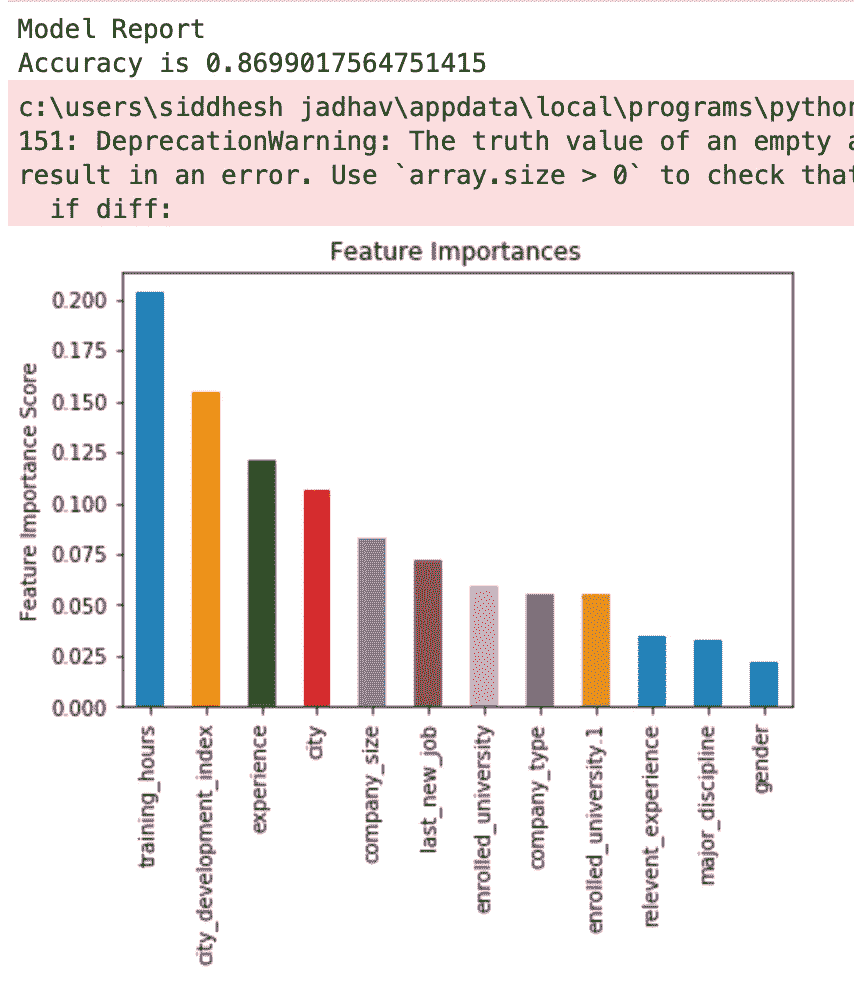

正如你所看到的，培训时间是使学生合格的最重要的特征，其次是城市发展指数和经验。

# 等等，我们必须评估我们的模型

我使用 KFold 来评估我的模型，以检查它的有效性。

```
k_fold = KFold(len(train_data), n_folds=8, shuffle=True, random_state=0)
print(np.mean(cross_val_score(clf, train_data, target, cv=k_fold, n_jobs=1))) 
```

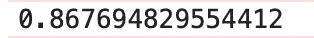

KFold 将提供训练/测试索引，将数据分成训练和测试集。它将把一个数据集分成 k 个连续的折叠。由于模型精度和 kfold 非常相似，因此模型工作正常。

# 提交

我一共上传了 20 多个投稿文件来提高我的分数，达到巅峰。

```
submission = pd.DataFrame({'enrollee_id': enrollee_id , 'target': y_pred})
submission.to_csv('submission.csv',index=False)
```

# 结果

所有的努力都得到了回报。我在全球 1000 人的黑客马拉松中获得了第三名。以下是排行榜的快照。

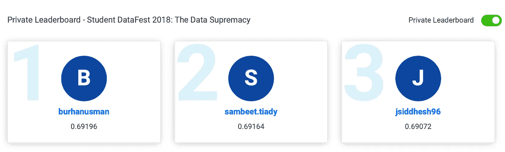

图片来源:datahack.analyticsvidhya.com/contest/the-data-supremacy/

我的用户名:jsiddhesh96

代码可以在我的 GitHub 存储库中找到:

[](https://github.com/Sid11/AnalyticsVidhya_DataSupremacy) [## sid 11/AnalyticsVidhya _ DataSupremacy

### 比赛链接:(https://data hack . analyticsvidhya . com/contest/the-data-supremity/)我用过 xgb classifier……

github.com](https://github.com/Sid11/AnalyticsVidhya_DataSupremacy)