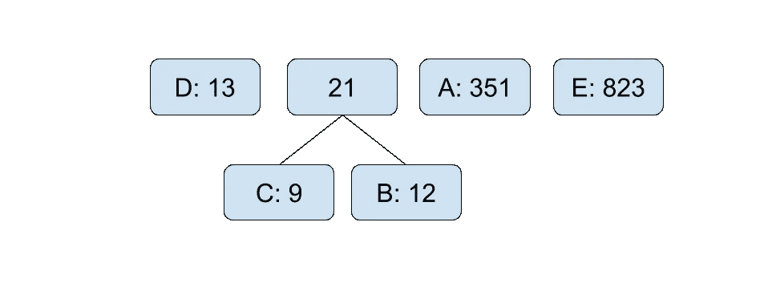
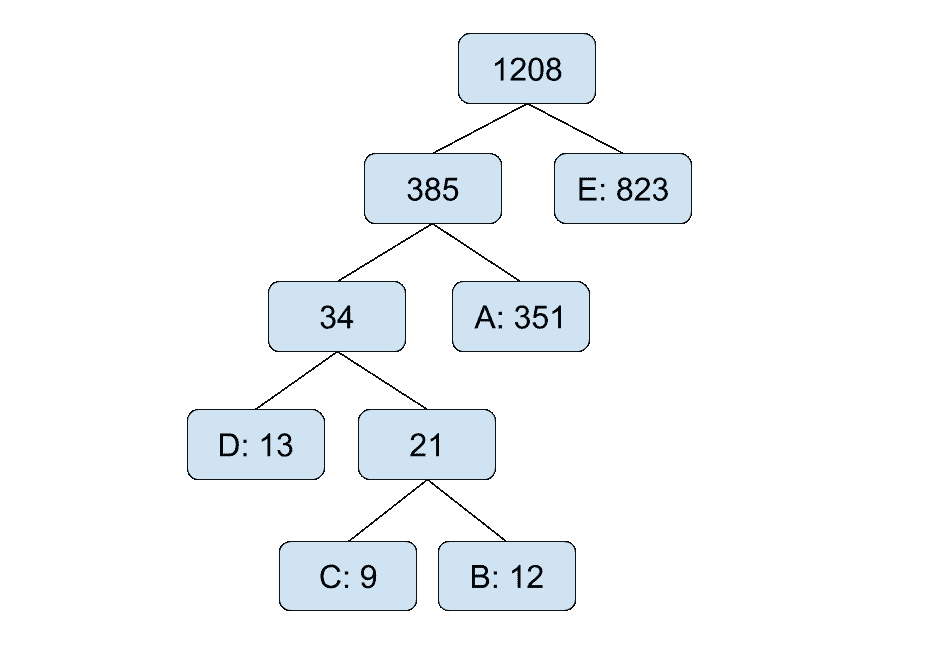

# 赢得数据压缩游戏

> 原文：<https://towardsdatascience.com/winning-the-data-compression-game-af145363ae49?source=collection_archive---------25----------------------->

## 如何在某些特殊情况下击败世界级的压缩算法


照片由[罗德里戈·佩雷拉](https://unsplash.com/@rfp80?utm_source=medium&utm_medium=referral)在 [Unsplash](https://unsplash.com?utm_source=medium&utm_medium=referral) 上拍摄

有几种功能强大的数据压缩程序被广泛使用。一些著名的例子有 [gzip](https://en.wikipedia.org/wiki/Gzip) 、 [bzip2](https://en.wikipedia.org/wiki/Bzip2) 和 [pkzip](https://en.wikipedia.org/wiki/PKZIP) 。最近，我开始思考，如果给定一个要压缩的特定输入文件，我是否可以创建一个优于所有这些程序的算法。

## 挑战

我决定把它变成自己的游戏。我选择了一个重要的输入文件。然后我在上面用了 gzip，bzip2，zip 压缩。在每种情况下，我都提供了尽可能产生最积极的数据压缩的命令行选项。然后我选择了三个程序输出中最小的字节作为我的目标。我开始编写一个程序，在给定相同的输入文件的情况下，它可以超过这个最小的字节大小。

我希望我的测试输入看起来有用。我不想为了给自己一个优势而设计一些奇怪的输入。我决定使用英文单词的字母列表。从我在网上找到的一个 ASCII 文件开始，我删除了包含除小写字母`a`到`z`以外的任何字符的所有行。结果是这个文件:[https://github . com/cosine kitty/compress game/blob/master/words . txt](https://github.com/cosinekitty/compressgame/blob/master/words.txt)

这个`words.txt`文件由 636946 字节组成，包含 67527 个字，每行一个字。我使用了以下命令来压缩这个文件。所有这些程序都运行在我的 64 位 Debian Linux 系统上。

首先，我从 bzip 版本 1.0.6 开始:

```
bzip2 -c --best words.txt > words.bz2
```

然后我用了 gzip 版:

```
gzip -c --best words.txt > words.gz
```

最后，我使用了 Info-ZIP 程序，版本 3.0:

```
zip -9 words.zip words.txt
```

以下是产生的文件大小:

```
don@spearmint:~/github/compressgame $ ls -l words.*
-rw-r--r-- 1 don don **248587** Apr 22 15:05 words.bz2
-rw-r--r-- 1 don don **212736** Apr 22 15:05 words.gz
-rw-r--r-- 1 don don 636946 Apr 22 14:49 words.txt
-rw-r--r-- 1 don don **212876** Apr 22 15:05 words.zip
```

所以在这种特殊情况下，gzip 是赢家。它产生了 212736 字节的输出。那是我要打败的目标。

## 游戏规则

每个游戏都需要规则。在玩游戏之前固化规则是有道理的。以下是我事先选择的规则:

*   我的数据压缩器的输出是另一个 Python 程序。
*   执行时，生成的 Python 程序必须打印出`words.txt`中包含的精确文本。
*   该程序不得引用任何外部文件。它必须是完全自包含的，并通过算法创建其输出。
*   获胜程序的源代码必须小于 212736 字节。
*   为了更有趣，我决定生成的 Python 程序不能使用任何`import`语句。它必须只使用 Python 语言的内置部分。

## 测试装具

我知道我会尝试很多。我需要一个可以尝试多种算法的测试工具。对于每个算法，该工具应该生成候选 Python 程序作为输出，执行该程序，确认它一字不差地生成原始单词列表，并以字节为单位记录该程序的大小。

如果任何生成的程序未能产生正确的输出，线束必须中止并显示错误消息。如果所有的程序都通过了测试，它会选择胜出者:具有最小字节大小的输出。

我的测试线束叫`squash.py`。它需要一个变量`AlgorithmList`中的算法列表。每个算法都是一个必须公开一个`Name`函数和一个`Compress`函数的对象。下面是`squash.py`的相关摘录。(GitHub 上有完整的项目源代码。请参阅本文末尾的参考资料部分。)

## 霍夫曼编码

我尝试的算法都依赖于[霍夫曼编码](https://en.wikipedia.org/wiki/Huffman_coding)，这是一种使用可变位数表示有限符号集的技术。更频繁出现的符号由更少的比特表示；更少的符号需要更多的比特。霍夫曼编码的主要负担是符号不是字节对齐的。这需要额外的代码将这些位尽可能紧密地打包在一起，忽略字节边界。

霍夫曼编码的工作原理是建立一个二叉树，其叶节点代表输入中存在的每个不同的符号。每个符号的二进制编码由从根节点到该符号的叶节点的路径决定。

我将使用一个只有五个符号的简单示例来解释构建霍夫曼树的算法:字母 A 到 e。假设我们计算每个字母在我们的输入中出现的次数，并得出以下数字。

```
A : 351
B :  12
C :   9
D :  13
E : 823
```

如果我们使用固定数量的比特来表示 5 个可选符号，我们将需要 3 个比特，因为 2 =8，这是足以表示 5 个可选符号的 2 的最小幂。霍夫曼编码可以通过利用我们可以对最常出现的符号使用更少的比特这一事实来做更有效的工作。

霍夫曼编码器首先创建 5 个叶节点，每个符号一个。还没有树。我们只是有单独浮动的叶节点，还没有相互连接。编码器创建一个按计数升序排序的节点列表。这是我们开始时的样子:


然后霍夫曼编码器进入一个循环。在每次迭代中，编码器删除排序列表中的前两个节点，并为它们创建一个新的父节点。父节点的计数成为两个子节点计数的总和。父节点被插回到节点列表中保持节点按计数排序的任何位置。

因此，在我们的示例中，编码器删除了 C:9 节点和 B:12 节点，创建了一个计数为 9+12=21 的父节点，并在 D:13 和 A:351 之间插入了新节点，以保持排序后的顺序。结果看起来像这样:



请注意，新创建的节点是内部节点，而不是叶节点，因此它不代表单个符号。因此，它有一个计数，但没有附加符号。

因为每次迭代都从列表中删除两个节点并用一个节点替换它们，所以列表每次都会缩短一个节点。该算法一直循环，直到只剩下一个节点。该节点是最终树的根节点。在我们的示例中，完成的树看起来是这样的:



此时，我们不再需要频率计数。此外，用位 0 和 1 标记树中的分支有助于使编码清晰。每个左分支接收 0，每个右分支接收 1。让我们也使叶节点和内部节点看起来不同。树现在看起来像这样:


我们使用这棵树来构建字母 A 到 e 的二进制表示。对于每个字母，从树根开始(用`*`标记)，沿着树向下移动，直到到达那个符号。每次向左分支时，附加一个 0。每次向右分支时，添加一个 1。这为我们的五个符号产生了以下位模式:

```
A = 01
B = 0011
C = 0010
D = 000
E = 1
```

正如我们所希望的，最常出现的符号 E 使用了最少的数据量:只有 1 位！两个最不常用的符号 B 和 C 各使用 4 比特，这比固定比特长度表示所使用的 3 比特差。但是好消息是输入中没有太多的 B 和 C。

## 霍夫曼编码的效率

那么在这个简单的例子中，我们的数据压缩有多好呢？让我们比较一下简单的固定位方法和霍夫曼可变位方法。

固定比特方法要求我们对每个符号使用 3 比特。如果我们合计输入中的符号总数，并乘以每个符号 3 位，则我们得到:

3*(351+12+9+13+823) = 3624 位

现在让我们看看霍夫曼表示法总共需要多少位。有 351 个 A 符号，每个使用 2 比特；12 个 B 符号，每个使用 4 比特，等等。这给了我们

2*351 + 4*12 + 4*9 + 3*13 + 1*823 = 1648 位

我们用 1648 除以 3624，发现压缩比在 45%左右。因此，在这种情况下，霍夫曼编码将输入缩小到不到其原始大小的一半。当然，这个压缩比对于每种输入都是不同的。这完全取决于每个唯一输入流中存在的符号的相对频率计数。

同样重要的是要注意，霍夫曼树本身需要存储在压缩输出中。解压缩算法需要知道如何解释这些位，以便重建原始数据。因此，这给压缩输出的大小增加了一点开销。

## 霍夫曼编码器源码

我的霍夫曼编码器的源代码包括两个类:`HuffmanNode`和`HuffmanEncoder`。这两个类都在源文件`huffman.py`中。

如上所述，`HuffmanNode`对象代表霍夫曼树中的一个节点。每个节点都包含一个保存原始未压缩符号的符号字段、一个频率计数以及对左右子节点的引用。对于叶节点，引用被设置为`None`。对于内部节点，`left`和`right`是指其他`HuffmanNode`对象。下面是`HuffmanNode`的代码:

`HuffmanEncoder`类支持上面解释的算法。它包含一个由 compressor 算法调用的`Tally`方法，用于计算每个符号在输入中出现的次数。它还包含一个生成霍夫曼树的`Compile`方法。它实现了上述算法，用于从节点的排序列表中构建树。`Compile`返回树的根节点，这为调用者提供了整个树。

一旦 compressor 算法计算完所有符号并调用`Compile`来获得霍夫曼树，它需要一种方法将输入中的每个符号转换为其霍夫曼表示，作为可变长度的位模式。为此，compressor 调用根节点的`MakeEncoding`方法。这个函数创建一个字典，它的键包括输入中的每个符号。

在这个字典中，与每个符号相关联的值是一个元组`(data, nbits)`，其中`data`是一个整数，保存表示从树根到该符号的路径的比特，`nbits`是该整数中有效低位比特的数量。例如，如果位模式是`0111`，`data`将是 7，`nbits`将是 4，产生元组`(7,4)`。

现在，我们有了一个将原始输入文本转换成霍夫曼编码比特流的良好基础。但是我如何在生成的 Python 源代码中表示这些可变的比特流呢？

## Base64 表示法

我要求输出是 Python 源代码，这让我的挑战变得更加困难。不仅程序必须包含自己的解压缩逻辑，而且源代码本质上必须只包含可打印的字符。任意二进制数据会导致 Python 代码混乱。

为了解决这个问题，我使用 [Base64](https://en.wikipedia.org/wiki/Base64) 对二进制数据进行编码。在这种编码中，每个连续的 6 位数据块被替换为 64 个字符中的一个:a-z、A-Z、0–9、+或/。这些 ASCII 字符中的每一个都需要一个完整的 8 位字节来表示，所以我要存储的每 6 位就损失了 2 位的效率。

虽然 Python 内置了`base64`模块，但是我的编码器有一定的特殊需求，所以我自己写了一个名为`BitBuffer`的类。它具有以下特点:

*   它有一个接受元组`(data, nbits)`的`Append`函数。这与存储在由`HuffmanNode.MakeEncoding`返回的字典中的元组完全吻合。
*   `Append`函数动态转换为 Base64。对于每批 6 位，它缓冲另一个 Base64 字符。它会记住任何剩余的位，并保存它们，直到更多的位到达，以填充更多的 6 位块。
*   `Append`通过在每 80 个 Base64 字符后换行，防止文本行变得过长。
*   还有另一种方法`Format`将任何剩余位作为最终的 Base64 字符进行刷新。然后，它将整个 Base64 缓冲区转换为可以写入输出源代码的 UTF-8 字符串。它将该字符串返回给调用者。

这里是`BitBuffer`类。

现在我已经有了自己的基础设施。下一步是尝试各种压缩算法，这些算法可以生成输入到`BitBuffer`类的比特流，并创建相应的解压缩算法来从压缩的 Base64 图像中提取原始数据。

## 尝试 1:所有字符

在我的第一次尝试中，我知道我不会击败 gzip，但我必须从某个地方开始。我所做的只是对输入的每个字符使用霍夫曼编码。输入中出现了 27 个不同的字符:`a` - `z`和换行符(在 Python 中表示为`'\n'`)。我的第一次尝试分两步处理输入。在第一遍中，它计算 27 个字符中的每一个出现的次数。它使用这些信息来建立一个霍夫曼树。

一旦有了霍夫曼树，它就会第二次调用私有函数`_Encode`来创建单词列表的压缩 Base64 表示。

我将第一个压缩器编写为一个名为`cmp_letters.py`的模块。下面是它的源代码:

这种形式的压缩效果如何？它确实使数据变小了，但正如我所怀疑的，它没有打败 gzip。输出文件`letters.py`的总大小为 460531 字节，压缩比为 460531/636946 = 72%。下面是`letters.py`的样子，为了简洁起见进行了编辑。(您可以通过在本文末尾的参考资料部分克隆我的 GitHub 库并运行`squash.py`程序来获得全部内容。)

## 解压器是如何工作的

我的第一次尝试有一些特征是我的三个解压器共有的。第一行可执行代码创建了一个变量`Char`。它是使用元组的霍夫曼树的表示。元组包含两个元素。这些元素中的每一个都是另一个包含两个元素的元组，依此类推，直到到达由单个字符组成的叶节点。

为了理解如何使用`Char`中的霍夫曼树，请看一下`letters.py`中的函数`Huffman`。`Huffman`函数使用`BitReader`类从 Base64 编码中一次提取一位。它一次向下遍历二叉树的一位，选择左分支(元组中的第一个元素)或右分支(第二个元素)，这取决于 Base64 数据中的下一位是 0 还是 1。最终，它到达一个不是元组的元素。该元素是树的叶节点，由原始的、未压缩的字符组成。`Huffman`函数将该字符返回给调用者。

## 尝试 2:省略共享前缀

我知道我可以做得比 72%的压缩比更好。我的下一个想法是利用单词按排序顺序出现的事实。这意味着列表中相邻单词之间通常有一些相同的字母。例如，考虑来自`words.txt`文件的这段摘录:

```
decade
**decade**nce
**decadenc**y
**decaden**t
**deca**gon
**deca**hedron
```

粗体字母显示每个单词中与列表中前一个单词前面相匹配的部分。我推断我可以创建代表这些整数计数的符号。那么上面的话，在`decade`之后，可以更简洁地表示为

```
6nce
8y
7t
4gon
4hedron
```

因此，在我的第二次压缩器/解压器尝试中，我创建了两个独立的霍夫曼树，一个用于前缀计数，另一个用于后缀中出现的字母。这表明霍夫曼编码器可以处理整数或字符作为输入符号。`HuffmanEncoder`类不关心数据类型是什么，只要每个符号允许自己被用作字典键。

压缩源文件被命名为`cmp_prefix.py`。下面是它的代码:

下面是相应生成的解压缩程序，为了简洁起见，再次进行了编辑:

用整数计数代替常用的单词前缀真的很有帮助。它将输出大小降低到 220603 字节。我现在越来越兴奋了，因为我已经接近 gzip 的 212736 字节了！我只是需要提高一点效率。

## 第三次是魅力

我的下一个想法是，我可以利用英语中某些字母比其他字母更容易成对出现的事实。例如，如果你在一个英语单词中看到一个`q`，那么下一个字母几乎肯定是一个`u`。尽管`u`是一个相当常见的英文字母，但它更有可能出现在`q`之后。一般来说，当前字母强烈影响下一个字母出现的概率。

因此，我的第三次尝试是基于我的第二次尝试的前缀优化，只是没有对字母频率使用单个霍夫曼树，而是使用了 27 个霍夫曼树:26 个可能的前面字母中的每一个都有一个，再加上一个单词中的第一个字母(当没有前面的字母时)。

这种方法意味着我必须在输出中消耗额外的空间，以便在生成的输出中存储额外的 26 棵霍夫曼树。

`Repeat`是与前一个单词匹配的每个单词前面的字符数的霍夫曼树。`Tail`是对前缀后每个单词剩余部分的字符数进行解码的树。而`Char`现在是一个霍夫曼树的列表。`Char[0]`是单词中第一个字符的树，`Char[1]`是字母 a 后面的任何字符，`Char[2]`是字母 b 后面的任何字符，依此类推。

这就是我最终打败 gzip 的地方。源文件`pairs.py`长 202641 字节，比`words.gz`小 10095 字节。胜利！

## 最后的想法

显然，我的方法并没有剥夺 gzip 作为顶级通用数据压缩算法的地位。我所做的工作之所以这么好，是因为我根据人类对给定输入文件的理解对它进行了裁剪。我的算法甚至不能处理除小写字母和换行符以外的字符。如果输入没有按字母顺序排序，它的性能不会很好。

但是这个练习确实展示了一些有用的东西。如果您有一个想要压缩的固定数据集，有时可以设计一个比众所周知的通用算法性能更好的自定义压缩算法。

如果你准备好接受一个有趣的挑战，也许你会从我停下的地方继续。使用同样的规则，你能为同样的`words.txt`输入创建另一个击败我的算法吗？如果是这样的话，我会很高兴收到你的来信并了解你的所作所为。

## 参考

1.  我的测试输入是基于一个单词列表，我在:
    [http://www-personal.umich.edu/~jlawler/wordlist.html](http://www-personal.umich.edu/~jlawler/wordlist.html)找到的
2.  我的自定义数据压缩器的完整源代码:
    [https://github.com/cosinekitty/compressgame](https://github.com/cosinekitty/compressgame)