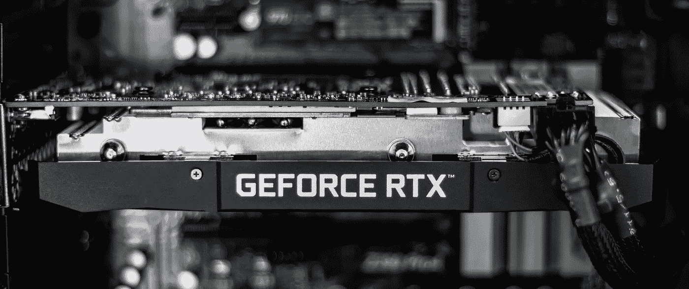
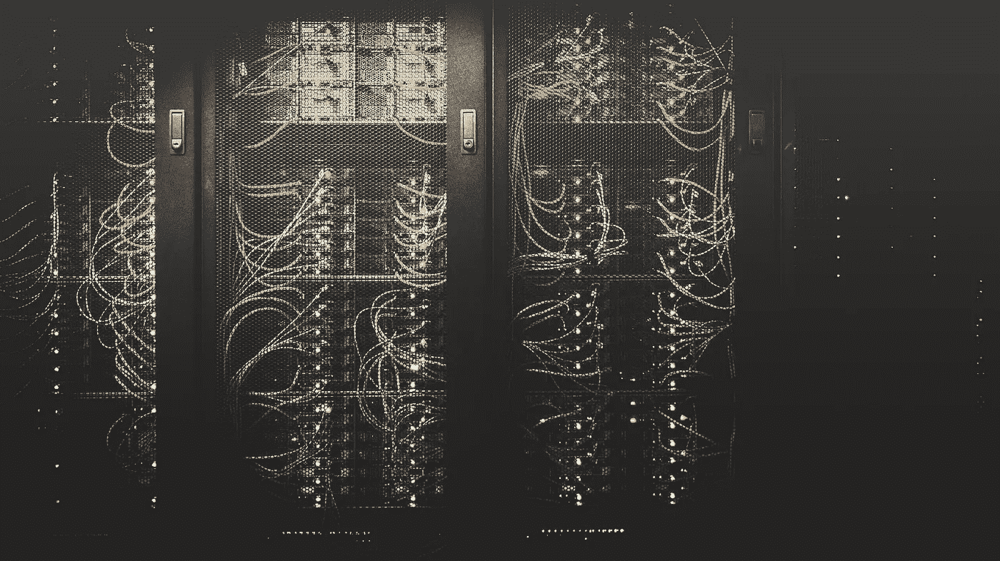

# 如何应对组织中令人担忧的人工智能状况

> 原文：<https://towardsdatascience.com/winter-is-coming-the-alarming-state-of-ai-in-organizations-1de8448a3b97?source=collection_archive---------68----------------------->

这些图形卡(GPU)对人工智能的进步至关重要——但它们不会阻止人工智能的冬天。[ [照片来源](https://unsplash.com/photos/3GUW88tRmv8)

## 意见

## 组织里的 AI 有问题。如果领导者现在不扭转人工智能，人工智能的冬天将会到来——而且不会很快消失。

W hat a move:戴姆勒冻结了与宝马的合作关系，并与英伟达合作制造自动驾驶汽车。这是一个正确的决定，因为戴姆勒和宝马永远不会成功对抗 Waymo 或大众汽车——也因为人工智能没有兑现商业大师的承诺。

是的，正如 7 次担任首席信息官的 Mark Settle 为《福布斯》撰写的文章所说，“在商业低迷时期，这些明智的投资会在未来带来丰厚的回报”。戴姆勒和英伟达的合作是否会成为其中之一，还有待观察。那是因为组织中的人工智能可能有问题。

> 许多商业领袖告诉我们，组织正在让人工智能失败，人工智能正在让组织失败。

大多数人工智能原型从未实现过。公司在不创造有形价值的人工智能项目上花费数百万。《经济学人》最近承认，我们不仅处于经济衰退，而且处于人工智能衰退。根据我们自己的观察，我们确实认为那是真的。

在 20 世纪 70 年代中期和 90 年代初，正是对人工智能进展的失望导致了强烈的人工智能冬天。只需注意 1974 年，美国国防研究局(DARPA)在语音理解研究方面的失望导致了人工智能资金的大幅削减。然而，许多年后，当时开发的技术，即隐马尔可夫模型，成为机器理解人类语言的必要条件。像七十年代一样，今天我们正在接近另一个人工智能的冬天。但是为什么是这次呢？

# 1.关于艾未来的说法结果并不好

2015 年，埃隆·马斯克承诺，到 2018 年，我们将最终拥有完全自动驾驶的汽车。我们不知道。与汽车的情况一样，组织中的人工智能在很大程度上被视为一场革命。然而，机器学习最擅长的是复杂的模式匹配。人工智能可以带来革命，但在大多数情况下，“只会”提高效率，实现超个性化，并培养准确性。人工智能仅仅是一场革命的概念已经导致了深深的沮丧，因为这个承诺在很大程度上仍然没有实现。人们正在慢慢理解人工智能的未来可能与描绘的不同。

# 2.严峻的技术和数据挑战依然存在

人工智能近年来的进步不仅仅是因为大数据和更好的算法。它的改进很大程度上归功于看不见的计算能力的可用性——这是深度学习的一个必要前提。然而，对于像自动驾驶这样的高级任务，算法的训练成本越来越高，摩尔定律正在消失。似乎这还不够，人们越来越多地发现大数据充满了陷阱。我们没有坐在自动驾驶汽车中的原因是因为它们仍然无法处理训练数据没有覆盖的异常情况。算法不太适应看不见的东西。

# 3.领导回避人工智能

根据 Gartner 的说法，大量人工智能项目的失败是因为它们从一开始就规模过大，实现影响太晚，以及员工参与不足。更重要的是，组织无法招募到合适的人才，也无法建立人工智能的思维模式和能力。领导者仍然不为人工智能去神秘化，也不为其激励他人。但是没有员工的参与，人工智能项目很容易失败。人工智能需要更多的领导力，而不是更少。

这些发展让组织中的人工智能处于一种矛盾的境地——早在新冠肺炎危机全面打击组织之前:它已经被谈论过，员工仍然害怕它，而领导者却不认可它。此外，IT 和人工智能的支出计划正在发生重大变化。因此，艾的未来仍然相当暗淡。

> 然而，我们亲身经历了领导者如何在危机中扭转组织中的人工智能并创造价值。

# 领导者现在能做什么

有了解决现实生活、高度相关问题的小规模项目，以及随之而来的精心策划的心态变化，组织可以收获人工智能的好处。要做到这一点，领导者必须将人工智能视为提升业务绩效的一种手段——并选择最有可能不会成为一场革命的用例。其次，领导者需要明白，对于许多应用来说，浅层机器学习非常适合。这个版本的人工智能确保数据需求和计算成本保持在低水平。最后，领导者需要建立一个人工智能运动，培养类似人工智能的学习文化:它使员工能够使用数据和人工智能方法来应对当今商业环境的挑战，从而创造真正的价值。

电晕疫情将推动那些已经在人工智能领域领先的人前进。那些现在不支持人工智能项目的人将在我们的后危机世界中更加落后。

*本文基于我们在* [*领导机器学习*](https://www.lead.berlin/ml) *工作中的见解，由 Oliver Triebel 和 Tim Schleicher 撰写。*