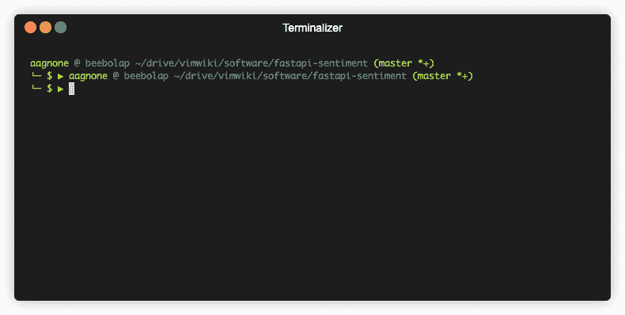

# 有了 AWS 副驾驶，让 Kubernetes 重新思考一下——数据生活

> 原文：<https://towardsdatascience.com/with-an-aws-copilot-give-kubernetes-a-second-thought-life-with-data-95d11761c27e?source=collection_archive---------31----------------------->

## 新的 ECS CLI 便利性使部署容器变得更加容易，而无需管理基础架构。


奥斯卡·萨顿在 [Unsplash](https://unsplash.com/s/photos/copilot?utm_source=unsplash&utm_medium=referral&utm_content=creditCopyText) 上的照片

# 谁在乎呢。

Kubernetes 是一个非常棒的容器编排工具，用于可伸缩的云计算应用程序。经过多年的开发和内部使用，谷歌在 2014 年开源了该工具，导致小型企业和企业的采用量激增。也就是说，我们并不总是需要它的所有电池。虽然它通过 YAML 配置文件提供了一个相对方便的[声明性](https://medium.com/@zach.gollwitzer/imperative-vs-declarative-programming-procedural-functional-and-oop-b03a53ba745c)接口，但是一个单独的开发人员或小团队仍然需要担心部署的许多细节，例如:

*   虚拟专用云(VPC)
*   SSL 证书
*   负载平衡器
*   集装箱登记处

所有这些细节对于管理云解决方案都至关重要，有些人将这一领域作为他们的主要工作。然而，其他人希望专注于应用程序本身。

在许多小项目中，你不会有一个复杂的 80 亿容器的庞然大物需要 Kubernetes 进行编排。我没有这方面的统计数据，但我打赌大多数概念验证项目都包含 1-4 个容器(除此之外:解析 Github/Docker Hub 似乎是一个有趣的项目)。对于这些项目，有一种相当直接的方式告诉您的云提供商“嘿，这是一个容器映像。把它挂在天上，并向我收取它所消耗的费用”就足够了。

使用方便的新 CLI `[copilot](https://github.com/aws/copilot-cli/wiki)`进入 ECS。

# 从应用到部署，速度非常快

我制作了一个演示应用程序来驱动这个过程，并允许您快速查看它的运行情况。对于实干家，你可以在下面的[资源](https://www.lifewithdata.org/blog/aws-ecs-copilot-cli#resources)部分找到链接。让我们从 NLTK 库中取出一个现成的情感分析器，并使用我最喜欢的 python API 库 FastAPI 为文本输入提供情感评分。我完全没有必要对 FastAPI 进行概述，因为下面的一个例子符合您的情况:

1.  你已经知道并喜欢它了
2.  你将通过它的[伟大的文档](https://fastapi.tiangolo.com/)

记住，应用程序开发人员主要关心 1)应用程序代码和 2)它所在的容器。嗯，他们在这里。

也有一些便利的好东西，但我不会把它们扔到你脸上。如果你好奇，请点击这里查看[。](https://github.com/aagnone3/fastapi-sentiment/blob/master/Makefile)

现在我们有了自己的应用程序，部署序列就像下面这样简单。

```
make build test
copilot init
copilot env init \
    --name prod \
    --profile default \
    --app fastapi-sentiment
copilot svc deploy \
    --name fastapi-sentiment \
    --env prod
```

对于那些对上面的`copilot`命令的内部流程感兴趣的人，可以看看下面的展示，它摘自 Efe Karakus 在 AWS 博客上的文章。


初始化副驾驶员部署的示例终端流程[ [来源](https://aws.amazon.com/blogs/containers/aws-copilot-an-application-first-cli-for-containers-on-aws/?nc1=b_rp)

您可能想知道这与规范的“kube apply -f deployment.yml”相比如何，认为它需要更多的命令来实现同样的事情。请记住，上面的命令将设置您的基础设施和应用程序。因此，Kubernetes 应用程序的等效比较是将所有基础设施即代码(IaC)设置与 Kubernetes 配置文件结合起来。那……是更多的工作。

# 我们在直播


Wil Stewart 在 [Unsplash](https://unsplash.com/s/photos/cheer?utm_source=unsplash&utm_medium=referral&utm_content=creditCopyText) 上拍摄的照片

有了这几条命令，我们的应用程序现在可以在黄金时间公开使用(如果您愿意的话)。不差几行好。所有这些节省下来的时间现在可以用于更多的原型制作、测试或与您的猫玩耍。



一些简单的命令演示了对已部署 API 的访问

这个演示只是触及了 ECS 和`copilot`能够和将要做的事情的表面。有管道资源、与`docker-compose`的计划集成以及 CI/CD 集成的简单选项。更多阅读，请查看下面的参考资料。

帮我帮你:[告诉我下一步该怎么做](https://docs.google.com/forms/d/e/1FAIpQLSfmUcJrw1MR0e7rVgEXGVh6qK6OSVm7uXFBrfmqnpsN7p-ZWA/viewform?usp=sf_link)。

# 资源

*   [副驾驶维基](https://github.com/aws/copilot-cli/wiki)
*   [副驾驶公告文章](https://aws.amazon.com/blogs/containers/introducing-aws-copilot/)
*   [我的演示代码](https://github.com/aagnone3/fastapi-sentiment)

# 保持最新状态

这一个就到此为止。然而，在学术界和工业界，事情发生得很快！用 [LifeWithData](https://lifewithdata.org/) 博客、[Medium](https://medium.com/@anthonyagnone)上的文章和我的 [Twitter](https://twitter.com/@anthonyagnone) 让自己保持最新状态。

[](http://eepurl.com/gOe01T)

*原载于 2020 年 8 月 22 日 https://www.lifewithdata.org**的* [*。*](https://www.lifewithdata.org/blog/aws-ecs-copilot-cli)