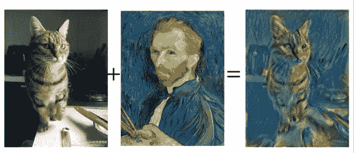
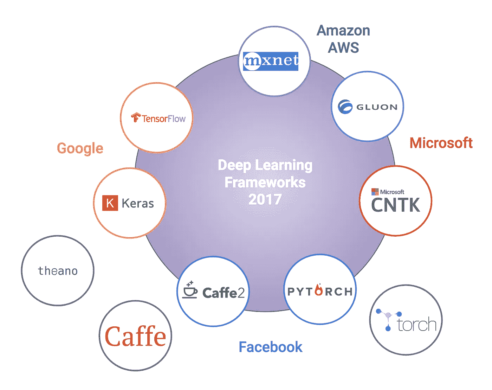

# 通过 AutoGluon，AWS 将 AutoML 带到了他们的平台上

> 原文：<https://towardsdatascience.com/with-autogluon-aws-brings-automl-to-their-platform-969b0cf19b8?source=collection_archive---------17----------------------->

## 随着 AutoGluon 的发布，AWS 现在在其云平台中提供托管和自动化机器学习。

AWS 已经对其竞争对手在深度学习 AutoML 领域的发展做出了回应，在其机器学习云服务中引入了 AutoGluon。该框架建立在现有框架的基础上，为学习如何针对特定的学习任务塑造每个数字大脑提供了一个集中的模块化解决方案。然而，随着这一领域的类似发展，出现了一个核心问题。他们是在为开源团队效力，还是只是想让每个人都使用他们能控制的软件？

不管是哪种方式，让我们一步一步地了解自动旋转的谱系，以充分理解它在空间中的位置。

# MXNet

另一个 Apache 项目 MXNet 是亚马逊选择的深度学习架构框架。虽然存在其他几个这样的框架，但亚马逊将该项目捐赠给 Apache 软件基金会值得称赞。这样做符合开源协作的一些核心目标，即标准化和降低类似工作的门槛。

# 胶子

由 AWS 和微软于 2017 年推出的深度学习模型[的必要软件框架 Gluon，旨在从众多相似但不同的机器学习软件库中带来一些秩序。](https://aws.amazon.com/blogs/machine-learning/introducing-gluon-an-easy-to-use-programming-interface-for-flexible-deep-learning/)

[来源](https://medium.com/@phunter/deep-learning-for-hackers-with-mxnet-2-neural-art-284f3f5ac3ab)

此外，Gluon 项目的 Apache 性质导致了一些围绕它创建的奇妙的学习材料。它的主网站有越来越多的课程和例子，从经典的机器学习到标准的深度学习再到贝叶斯深度学习。作者有一个相当有趣的目标:

> *据我们所知，目前还没有资料来源教授(1)现代深度学习中的全部概念，或者(2)在引人入胜的教科书中穿插可运行的代码。在这次冒险结束时，我们会发现这种空白是否有充分的理由存在。*

# 自动增长

AutoGluon 现在位于 MXNet 和 Gluon 之上，为给定的文本、图像或表格数据提供神经网络的自动学习。该库包括一些用于[神经架构搜索](https://autogluon.mxnet.io/tutorials/nas/index.html) (NAS)的最先进的算法，既用于传统的深度学习架构，也用于强化学习代理。如果你对该方法的螺母&螺栓感兴趣，请参见 [Jesus Rodriguez 关于 Medium](/amazon-gets-into-the-automl-race-with-autogluon-some-automl-architectures-you-should-know-about-aceaaccaeb8b) 的文章。

# 一起工作，但是分开？

自然，AWS 也在其机器学习平台 Sagemaker 中无缝地利用了自动旋翼。然而，尽管 AWS 和微软在 Gluon 上有合作，但两者都创建了自己的 NAS 库。就在上个月，微软开源了[项目 Petridish](https://www.microsoft.com/en-us/research/blog/project-petridish-efficient-forward-neural-architecture-search/) ，一个前沿架构搜索库。最重要的是，虽然它们最终可能会提高跨云兼容性，但这两个库目前都与各自的云深度耦合。

[来源](/battle-of-the-deep-learning-frameworks-part-i-cff0e3841750)

上图显示了大公司如何推出越来越多的软件库，希望开发人员坚持使用他们的软件库。此外，直接尝试它们之间的兼容性*存在明显的不足*。与其说是“大家好，让我们一起分享这个”，不如说是“大家好，用我们的，不要用他们的。”这让我想起了电话提供商之间的争斗。你们中有多少人喜欢尝试将 Android 手机与基于 iCloud 的东西同步，或者相反？

# 做体力工作

准备好试试图书馆了吗？无论您是在本地部署还是在云中部署，这里都有一些选项可供选择:

# 预训练模型

从架子上取下一个[预先训练好的模型](https://autogluon.mxnet.io/model_zoo/index.html)，并将其应用到您自己的任务中！支持代码*重新训练*同样的模型也提供可再生产性。

# 卡格尔

[Kaggle](https://www.kaggle.com/) 抓痒大多数机器学习在实践中会痒。该平台通过开放的数据集、共享的工作空间和正式的比赛，提供了学习、合作和与他人竞争的方式。auto glon 的文档分享了一些[片段](https://autogluon.mxnet.io/tutorials/tabular_prediction/tabular-kaggle.html)，用于在你的 Kaggle 工作空间中快速应用 auto glon。

# Sagemaker

Sagemaker 平台在 2019 年有了很大的改进[，在 Sagemaker Studio 中提供了 AWS 声称的第一个真正的机器学习 IDE。现在下定论还为时过早，但该平台显示出巨大的前景。](https://aws.amazon.com/blogs/aws/amazon-sagemaker-studio-the-first-fully-integrated-development-environment-for-machine-learning/)

# 我只是想跟上

对于那些热衷于简单地跟上神经架构搜索空间发展的人来说，[automl.org](https://www.automl.org/automl/literature-on-neural-architecture-search/)在跟上发展方面做得非常好。

*原载于 2020 年 1 月 25 日 https://lifewithdata.org**的* [*。*](https://lifewithdata.org/with-autogluon-aws-brings-automl-to-their-platform/)