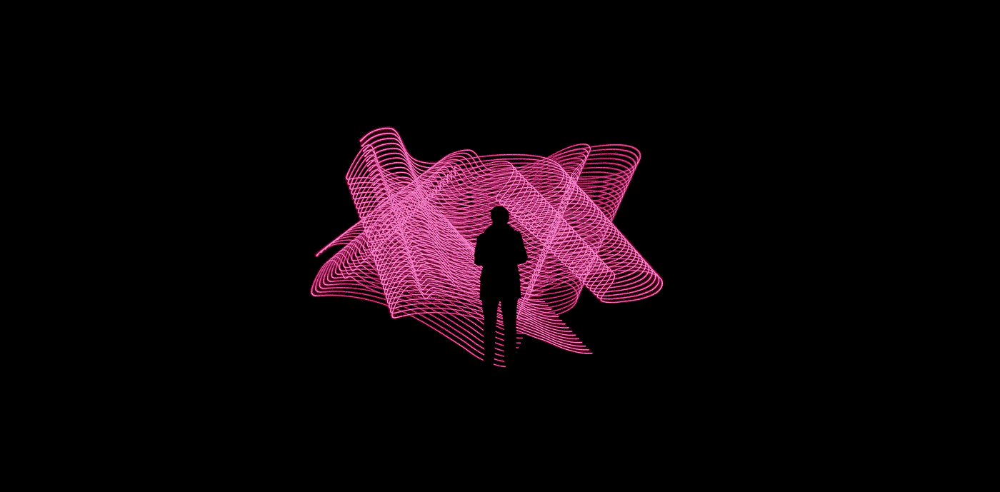
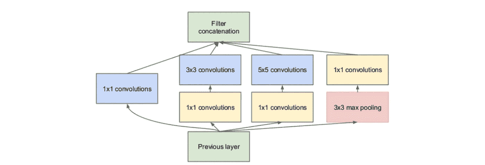
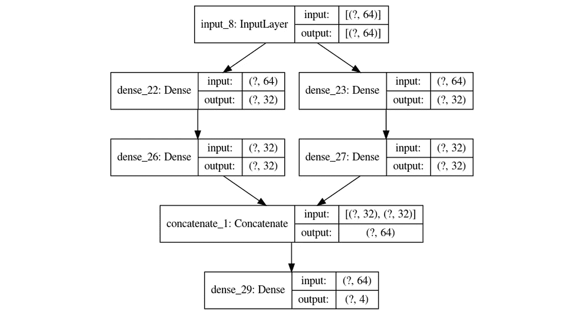
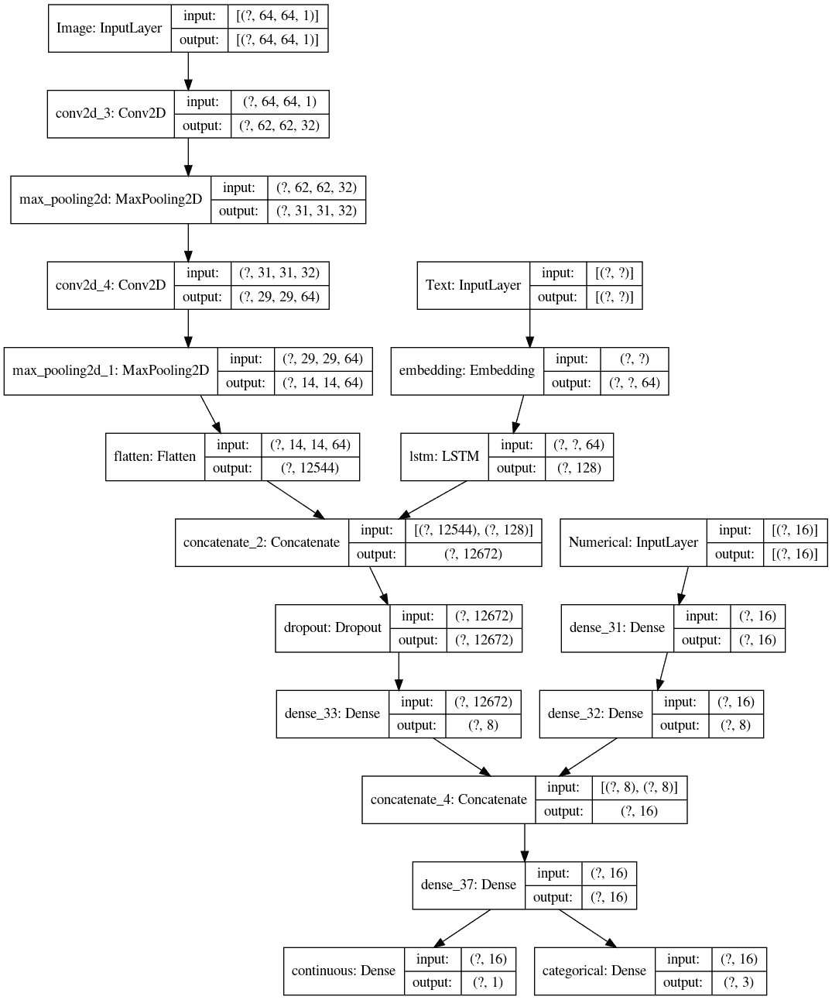
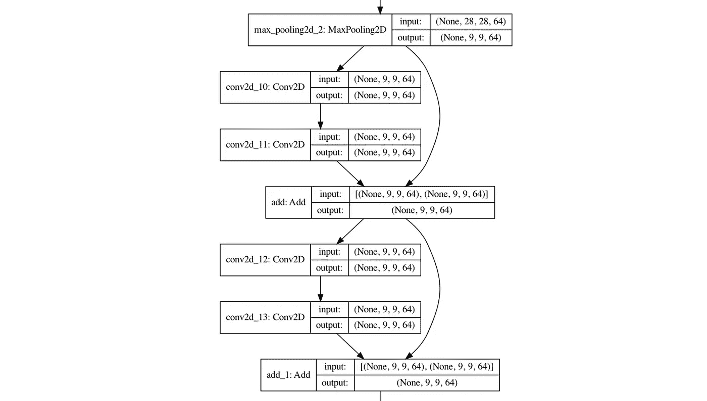

# 有了 Keras 的函数式 API，您的想象力将达到极限

> 原文：<https://towardsdatascience.com/with-keras-functional-api-your-imagination-is-the-limit-4f4fae58d90b?source=collection_archive---------24----------------------->



来源: [Unsplash](https://unsplash.com/photos/ApfyUz5c5Q0)

## 构建任何你喜欢的神经网络结构

大多数人都熟悉构建顺序模型，其中各层一个接一个。例如，在卷积神经网络中，我们可以决定让图像通过卷积层、最大池层、平坦层，然后是密集层。这些网络的标准结构被称为“线性拓扑”。

然而，许多高性能网络并不是线性拓扑结构，例如，作为顶级初始模型核心的初始模块。在该模块中，来自一个层的输入被传递到四个单独的层，这四个层被连接回一个输出层。(你可以在这里阅读更多关于初始模块和 1x1 卷积[的目的。)](/the-clever-trick-behind-googles-inception-the-1-1-convolution-58815b20113)



初始模块。来源:[启始论文](https://arxiv.org/pdf/1409.4842.pdf)。

非线性拓扑允许输入通过不同的解释媒介传递，这些媒介随后可以连接起来以产生全局洞察力。这类似于总统可能会给他们的内阁(顾问)几份潜在法律的副本，他们每个人都会从环境、国家安全、小企业等角度给出自己的观点。这是获取尽可能多信息的有效方法。

或者，您可以使用它们来创建跳过连接(成功 ResNet(剩余网络)的核心)和其他在顺序设置中无法想象的复杂关系。

Keras 的功能 API 允许你创建各种拓扑，不仅优化网络的内部结构，而且处理需要多个输入或输出的问题。

例如，考虑一个评估房屋价值并根据图像(草坪、厨房、外部等)将其分为三类的网络。)、数字数据(平方英尺、卧室)和文本数据(以前的业主/邻居的证明)。我们将创建一个可以做到这一点的网络。

函数式 API 将网络视为有向无环图，因此不支持动态架构。从这里开始，最好将层视为计算图中的节点，将输入视为遍历图的边和节点。(点击阅读更多关于程序员图论基础的内容[。)我们将通过三个渐进的步骤来探索函数式 API:](https://medium.com/@andre_ye/a-short-practical-programmers-guide-to-graph-theory-bfc87bc52581?source=---------20------------------)

*   使用函数式 API 创建线性图。
*   使用函数式 API 创建非线性图形。
*   使用函数式 API 创建复杂的多输入/输出图。
*   进一步探索和想法

## 使用函数式 API 创建线性图形

让我们从使用函数式 API 创建一个序列图开始。我们的目标图将有三层，一层接一层:

```
(input: 64-dimensional vector)
          ↧
[Dense (32 units, relu activation)]
          ↧
[Dense (32 units, relu activation)]
          ↧
[Dense (4 units, softmax activation)]
          ↧
(output: logits of a probability distribution over 4 classes)
```

首先，让我们从创建一个输入节点开始，这样 Keras 就知道数据的形状了。

接下来，让我们开始添加第一个密集层。添加层与顺序模型相同，但有一点不同——我们定义节点，而不是使用`.add()`或作为顺序层的列表。每次我们添加一个新层，我们实际上是相对于前一个节点定义一个新节点，而不是相对于整个模型结构。这部分放在最后。

例如，这个密集层是一个节点，它的前一个节点被定义为变量`inputs`(输入节点)。

我们可以相应地定义序列中的下一个节点:

在这一点上，我们有几个相互联系的变量(节点)。为了将这个图转换成 Keras 神经网络，使用`keras.Model`构造函数，它需要输入和输出节点，以及一个名称标识符。

此时，调用`model.summary()`查看模型结构。

让我们给`keras.utils.plot_model(model, “m1.png”)`打电话，查看模型结构的可视化。


？与“无”相同。

太好了！是时候创建非线性拓扑了。

## 使用函数式 API 创建非线性图形

让我们开始构建一些非线性拓扑。在我们的神经网络中，输入将导致两个分支，这两个分支最终将连接并导致一个输出。

```
 (input: 64-dimensional vector)
          ↧                                  ↧     
[Dense (32 units, relu)]      [Dense (32 units, sigmoid)]
          ↧                                  ↧
[Dense (32 units, relu)]      [Dense (32 units, sigmoid)]
          ↧                                  ↧
                     [Concatenate]
                           ↧
         [Dense (4 units, softmax activation)]
                           ↧
(output: logits of a probability distribution over 4 classes)
```

让我们首先创建一个输入节点和它分支到的两个节点。注意，强烈建议为节点指定有意义的名称，以便清晰、有序地理解图形，而不是使用常用但容易被误解的符号`x = layer()(x)`。

接下来，让我们定义前面定义的两个节点之后的两个节点。

当两个或更多节点被连接时，它们被端到端地放入一个大向量中，该向量被传递给下一个节点。`concatenate`层只是接受一个要连接的节点列表，然后将该层的结果传递给另一个`outputs`节点。最后，整个图形被编译成一个模型。

我们的模型和我们想象的一模一样！通过设想一个基于图形的神经网络模型，我们可以构建任何我们可以想象的网络。



是时候进一步潜水了。

## 探索复杂的输入/输出

让我们来探讨如何使用不同大小的不同输入和不同的输出。假设我们有三个输入——64x 64 图像、16 列数字数据和可变长度文本。我们将希望输出两个值:一个连续值(例如房价)和另一个离散值(3 类)。

让我们首先用相应的大小和名称构造三个输入。

接下来，让我们从处理图像开始。我们将使用一个标准的卷积神经网络简单结构，或者替代卷积和最大池层，然后进行扁平化，以便可以连接。

让我们用标准密集层来处理数字输入。

最后，可以用嵌入和递归层来处理文本数据。

现在，每种特定的数据类型都被简化为向量，我们可以开始连接它们了。让我们首先连接并减少文本和图像向量，因为它们特别长。我们可以使用 Dropout 来进一步提高泛化能力，减少对特定数据的过度拟合。

最后，让我们将`image_text`组合和数值数据连接在一起，形成两个输出。

当我们建立模型时，我们需要传入一个输入和输出列表。

结果是在几分钟内创建了一个庞大的网络:



为了训练网络，数据必须根据输入和输出的名称存在于字典中。例如， *x* 的训练数据将采用以下形式

```
x_data = {'Image': array, 'Numerical': array, 'Text': array}
y_data = {'continuous': array, 'categorical': array}
```

有关训练具有多个输入和输出的复杂模型的更多信息，请参考 Keras 文档[此处](https://keras.io/guides/functional_api/)。

## 进一步的想法

使用函数式 API 有很多原因，即使您没有将它用于多个输入或输出，这也是使用它的一个主要原因。

*   在您的网络中建立跳过连接，即跨层跳跃的连接。这对于函数式 API 来说非常简单。



ResNet 模型的一部分，采用跳过连接。

*   构建多个引用同一层的模型(可能是同一个嵌入空间，称为共享层)。这样可以节省计算时间，促进泛化+全局理解。
*   当需要管理多个具有相互关系的模型时，函数式 API 就派上了用场，比如[编码器-解码器](/gans-for-everyone-an-intuitive-explanation-of-the-revolutionary-concept-2f962c858b95)，神经类型转换，或者[生成对抗网络](https://medium.com/analytics-vidhya/11-essential-neural-network-architectures-visualized-explained-7fc7da3486d8)。
*   使用功能 API 来访问和操作现有预训练网络的层，如 VGG16 或 AlexNet，可能是通过将模型流导向网络的中间部分。

当您使用函数式 API 时，可能性是无限的！

感谢阅读！😄

查看 AutoKeras，它是一个神经架构搜索库，可以为您自动构建架构(通常是非线性的):

[](/automl-creating-top-performing-neural-networks-without-defining-architectures-c7d3b08cddc) [## AutoML:在不定义架构的情况下创建最高性能的神经网络

### 用 AutoKeras 在 Python 中编程 AutoML

towardsdatascience.com](/automl-creating-top-performing-neural-networks-without-defining-architectures-c7d3b08cddc)