# 见证语义分割的进展:从 V1 到 V3+的 DeepLab 系列

> 原文：<https://towardsdatascience.com/witnessing-the-progression-in-semantic-segmentation-deeplab-series-from-v1-to-v3-4f1dd0899e6e?source=collection_archive---------21----------------------->

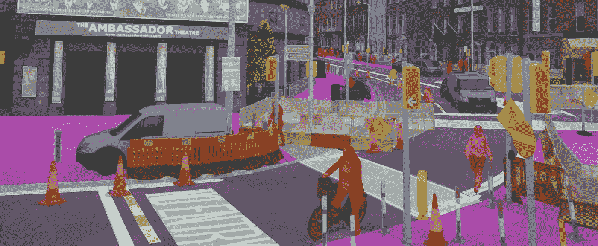

图片来自[泰勒的博客](https://sthalles.github.io/)

*原载于 2020 年 7 月 3 日*[*https://www . yanjia . Li*](https://yanjia.li/witnessing-the-progression-in-semantic-segmentation-deeplab-series-from-v1-to-v3/)*。*

# 序

语义分割是从图像中分割出目标对象或区域的计算机视觉任务。这在电影拍摄、增强现实等很多行业都非常有用。在深度学习时代，卷积神经网络成为最有效的语义分割方法。深度卷积神经网络不是试图通过对比度和锐度这样的视觉信号来理解物体的边界，而是将这项任务转化为一个分类问题:如果我们知道图像中每个像素的类别，我们将免费获得物体的边界。在这种假设下，我们可以只修改典型 CNN 分类网络的最终层，并让它输出 H*W 值来表示每个像素的类别，而不是只输出 1 个值来表示整个图片的类别。输出在每个像素位置都有类别 id，通常编码在类似 PNG 的掩码中。这个想法来自一篇名为《语义分割的完全卷积网络》( FCN)的论文，突然每个研究者都开始效仿。

DeepLab 系列就是这种 FCN 思想的追随者之一。从 2015 年到 2018 年，DeepLab 系列发布了四个迭代，分别叫做 V1、V2、V3 和 V3+。DeepLab V1 为本系列奠定了基础，V2、V3 和 V3+都比前一版本有所改进。这四次迭代借鉴了近年来图像分类中的创新来改进语义分割，也启发了该领域的许多其他研究工作。进入 2020 年，由于这个 DeepLab 系列网络没有更多更新，所以是时候总结一下这个见证了深度卷积神经网络在语义分割方面进展的工作了。

# V1 深度实验室

> 基于深度卷积网和全连通条件随机场的语义图像分割

## 多尺度特征聚合

就像我之前说的，语义分割网络是从图像分类网络进化而来的。因此，通常有一个主干网络，它被证明在图像分类任务中是有效的。早在 2014 年，VGG 网络通过使用 3×3 卷积内核使网络更加深入，超越了 AlexNet，成为最先进的图像分类解决方案。

DeepLabV1 和 FCN 都使用 VGG-16 作为主干网络来提取特征，然后对像素进行一些细粒度的分类。遗憾的是，DeepLabV1 的作者在论文中并没有把网络是什么样子说得很清楚，所以我们要看源代码才能有个全貌。为了节省你阅读冗长的 Caffe proto txt 的时间，我在下面做了一个图表来可视化这个架构。

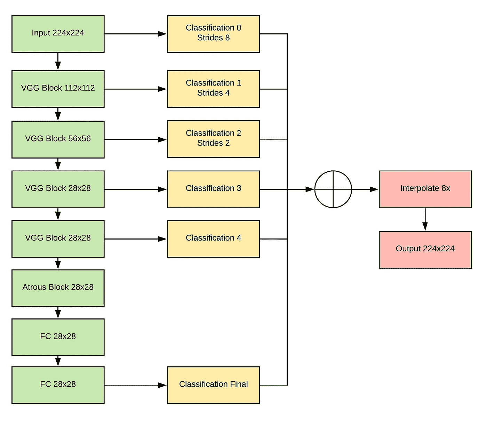

我自己的 DeepLabV1 图

DeepLabV1 在论文中提出了三种变体:DeepLab、DeepLab-Msc、DeepLab-Msc-LargeFOV。这是因为作者希望展示 DeepLab 网络中使用的每个组件的烧蚀情况。上图显示了 DeepLab-Msc 的变体。虽然作者声称简单是这个网络的优点之一，但最好的 DeepLab-Msc 版本(多尺度)远比 FCN 复杂。从图中可以看出，左侧的绿色块是来自 VGG 主干的卷积块。中间的黄色块是 DeepLab 的像素分类图层。右边的红色块是输出的一些后期处理。因为语义分割通常同时需要非常细粒度的细节和高级别的全局特征，所以合并来自多尺度的特征是对抗粗分类预测的非常常见的方法。DeepLab 聚合来自许多中间卷积层和输入的特征，然后将元素相加的值插值回原始分辨率作为输出掩码。通常情况下，卷积层越深，产生的特征尺度越小，所以本质上，DeepLab 是在融合多个尺度的特征。

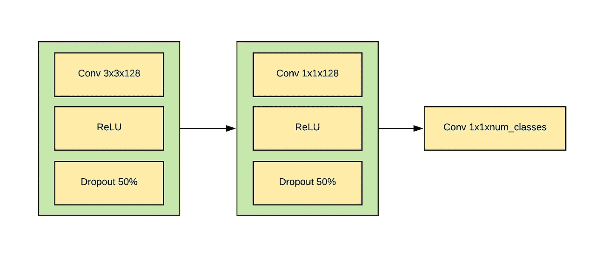

分类标题的详细视图(之前图表中的黄色块)。自己图解。

让我们仔细看看那些处理多尺度特征的分类头。上图显示了一个分类块的内部外观。这种设计类似于 FCN，我们首先使用一个 3x3 内核来压缩特性，然后使用两个 1x1 内核来预测最终的类。辍学也是为了对抗过度适应。

然而，与 FCN 相比，使用多尺度功能并不是一个真正的大创新，DeepLab 需要一些其他东西来脱颖而出。接下来，我们来谈谈 DeepLab 试图修复的 FCN 的另一个“问题”。

## 更大的特征地图

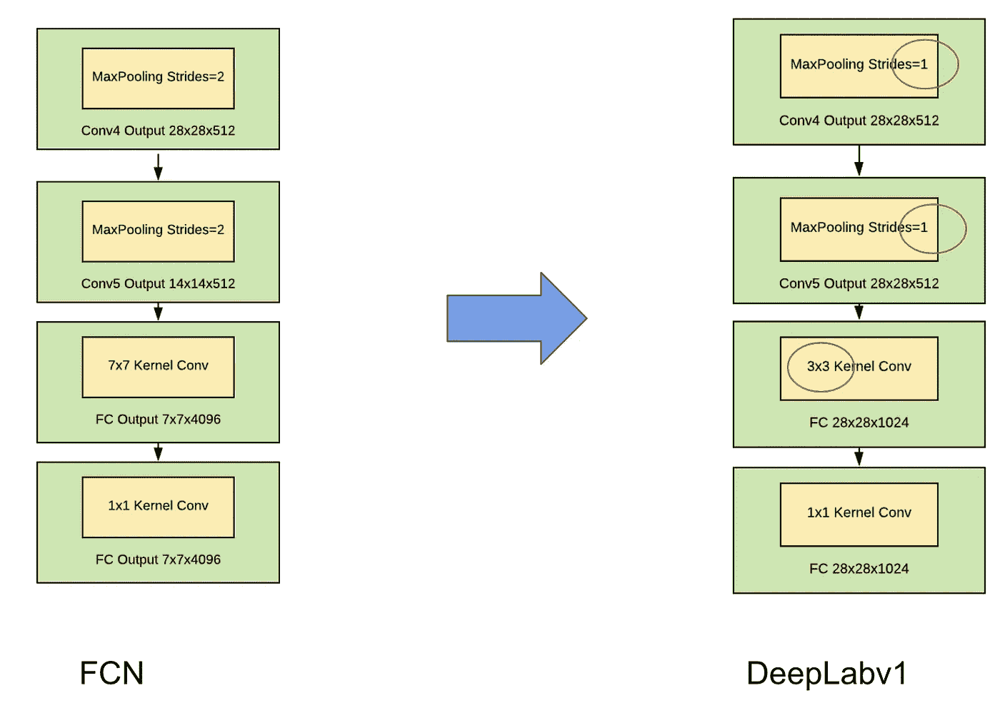

第一步用于池化。自己图解。

在上面的图表中，FCN(左侧)将 VGG 的最后几层转换成一个用于分割的分类头。因此，FCN 不是在最终的全连接层中输出 1 个值和 4096 个通道，而是输出具有 4096 个通道的 7×7 掩码。然而，DeepLab(右侧)的作者认为，从原始 224x224 图像到 7x7 特征的下采样过于激进，可能导致分割质量差。因此，DeepLab 将最后一个 VGG 块的 MaxPooling 层的步幅设置为 1，这样即使对于最后几层，特征图也可以保持在 28x28。

这一变化确保我们有更大规模的要素进行预测，但也带来了另一个问题:计算现在更加昂贵，我们还丢失了一些从 7x7 要素地图中提取的全局信号。作者尝试的一种方法是减少最后 FC 层的通道数。另一种方式，我们将重点介绍，是 DeepLab 的真正创新:阿特鲁卷积。

## 阿特鲁卷积

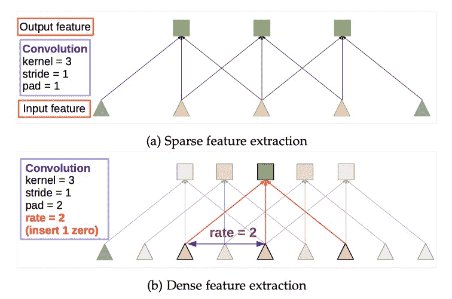

来自“DeepLab:使用深度卷积网络、阿特鲁卷积和全连接 CRF 的语义图像分割”

atrous (hole)卷积的思想简单而有效:常规卷积核结合来自几个相邻像素的值来计算新的像素值，如下面的(a)所示。在语义分割中使用这种核的缺点是，当我们提取特征时，考虑更多的局部关系，而不是全局关系。为了改善这一点，DeepLab V1 借用了信号处理算法的思想，在内核窗口中引入了一个步长，如下图(b)所示。在这个 atrous 版本中，我们在采样的每个像素之间放置孔洞，以便我们可以用相同的内核大小采样更大范围的输入。例如，当 atrous rate(膨胀率)为 2，内核大小为 3x3 时，我们将跳过中间的像素，从 5x5 区域中提取 9 个像素，而不是从 3x3 区域中提取像素。

通过使用 atrous 卷积，我们的 3x3 内核不像以前那样昂贵，因为我们可以使用更少的内核来覆盖更大的区域。此外，28x28 要素地图上的 atrous 卷积可以从 7x7 要素地图上的常规卷积获得类似的全局信号。此外，如果我们增加 atrous 速率，我们可以有效地使用 3×3 内核的相同计算，但实现更大的视野(FOV)。从论文中也证明了这是有用的。

## 全连接通用报告格式

最后，DeepLab V1 还使用了一个名为全连接条件随机场(CRF)的模块来进一步完善分割掩模。CRF 是一种概率模型，用于在给定周围其他像素的条件输入的情况下预测值。简而言之，我们正在尝试学习概率分布，以帮助我们在给定输入像素值及其关系的情况下计算输出像素的概率。全连接 CRF 使用图像的所有像素作为条件输入。

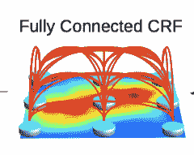

来自“DeepLab:使用深度卷积网络、阿特鲁卷积和全连接 CRF 的语义图像分割”

这对于根据像素相关性抛光对象遮罩内部的边界特别有用。例如，如果两个像素的颜色非常不同(下图中天空为蓝色，飞机为黑色)，则它们更有可能属于两个不同的类别。并且通过比较输出和地面真实值进行几轮迭代，我们得到的概率分布能够正确反映这一现象。

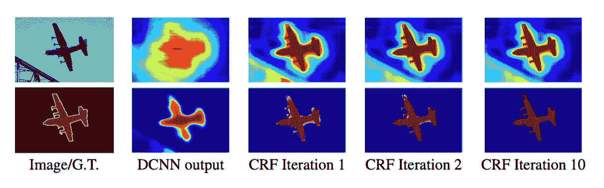

来自“DeepLab:使用深度卷积网络、阿特鲁卷积和全连接 CRF 的语义图像分割”

这种 CRF 在最近的分段网络中不再使用，因为 1)我们的分段网络现在变得更好了 2) CRF 本身不能与网络一起进行端到端训练，并且运行非常慢。

# V2 深度实验室

> DeepLab:使用深度卷积网络、阿特鲁卷积和全连接 CRF 的语义图像分割

既然你已经理解了 DeepLabV1 的工作原理，那么就很容易理解 DeepLabV2 的思想了。所有的核心思想仍然保持不变，比如 atrous 卷积和 CRF，所以我只说增量变化。

## ASPP

阿特鲁空间金字塔池(ASPP)是 DeepLabV2 中引入的新模块。DeepLabV2 借用了“用于视觉识别的深度卷积网络中的空间金字塔池”的思想。即使在深度学习时代之前，空间金字塔也是计算机视觉中非常经典的算法。对于诸如 SIFT 的许多算法来说，这是实现尺度不变的重要技术。SPP network 将空间金字塔引入卷积网络，DeepLabV2 创建了该 SPP 模块的 atrous 版本。

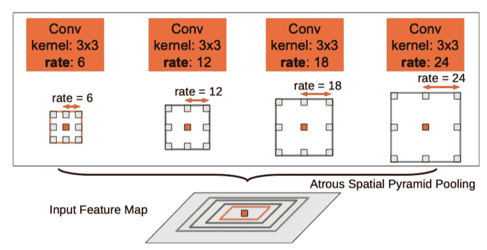

来自“DeepLab:使用深度卷积网络、阿特鲁卷积和全连接 CRF 的语义图像分割”

通过 SPP 模块，我们的网络可以将不同比例的要素编码到固定大小的要素地图中。这有点像单词袋方法，但不是将特征装袋，而是在新的特征向量中为不同的尺度分配元素。例如，可以有 1 个特征值对应于全球范围，2 个特征值对应于大范围，3 个特征值对应于小范围。然后，您将获得一个固定大小为 6 个值的特征图。在真实 ASPP 模块中，我们有四个不同的标度，由从 6 到 24 的不同比率定义。

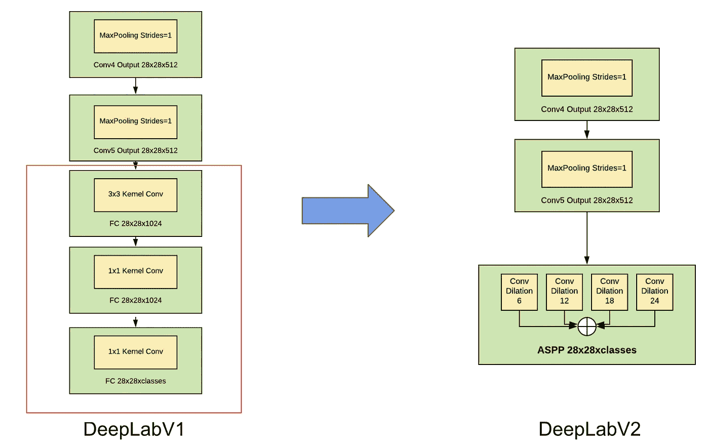

深海实验室 V2·ASPP。自己画图表

如上图所示，在 FCN 和 DeepLabV1 中，我们的输入固定为 224x224，以便与 FC 层的确切连接数 28x28x1024 相匹配。现在我们有了 SPP 模块，我们的网络可以处理各种大小的输入，而无需更改 FC 层。由于这种 SPP 模块使用 atrous 卷积，它还继承了大视场和小计算成本的优点。

## 新的多尺度结构和主干

V1 和 V2 的另一个区别是新的多尺度结构。 [DeepLabV2](http://liangchiehchen.com/projects/DeepLabv2_resnet.html) 不是在计算特征的不同尺度上进行分类，而是在 1.0、0.75 和 0.5 倍缩小的图像上并行运行三次，以实现多尺度特征融合。

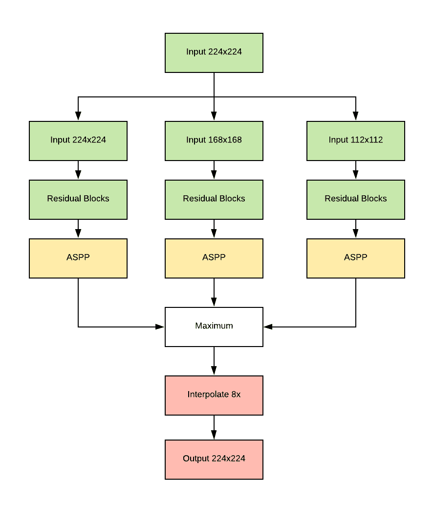

深海实验室 V2 多尺度。自己图解。

很难说这种设计是否明智，但通过运行三次相同的计算，它确实使推理和训练变得非常慢。但毫无疑问，这对作者改进 PASCAL 数据集上的度量非常有用。

为了进一步提高指标和收敛速度，DeepLabV2 也开始使用 ResNet 作为主干网络，ASPP 模块就连接在 ResNet 的 Conv5 块之后。请注意，原始 ResNet 模块的步长为 2，用于对特征进行下采样，但 DeepLabV2 将 Conv4 和 Conv5 模块的步长设置为 1。这是由于我们在 DeepLabV1 一章中讨论过的对粗糙特性的同样关注。为了增加视野，DeepLabV2 还用速率为 2 的 atrous 卷积内核替换 Conv4，用速率为 4 的 atrous 卷积内核替换 Conv5。在实践中，我发现与最初的建议相比，仅让 Conv5 使用步长 1 和 atrous 速率 2 更有效。

# DeepLab V3

语义图像分割中阿特鲁卷积的再思考

## 升级版 ASPP

atrous 卷积和空间金字塔池的使用给 DeepLabV1 和 V2 带来了巨大的成功，所以作者在这个方向上不断探索，做出了这个 DeepLab 系列的 V3，重点是 ASPP 模块。

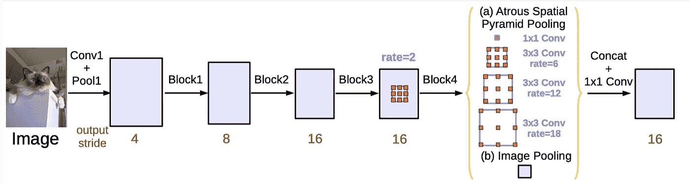

来自“重新思考用于语义图像分割的阿特鲁卷积”

DeepLabV3 仍然使用 ResNet 主干，如上图所示。在 V2，ASPP 将 4 个不同比例的要素合并成一个固定大小的要素。然而，复杂卷积的性质使得网络很难提取微小的局部特征，如微小的边缘，以及考虑到所有像素的非常大的全局特征。

为了将更多信息融合到一个模块中，DeepLabV3 重新设计了 ASPP 模块，使其具有单独的全局图像池通道，以包括全局特征，然后将结果特征向量与 ASPP 输入上的 1x1 卷积连接起来，以使用细粒度的细节。ASPP 模块的另一个变化是在卷积之后和 ReLU 之前使用批处理规格化。

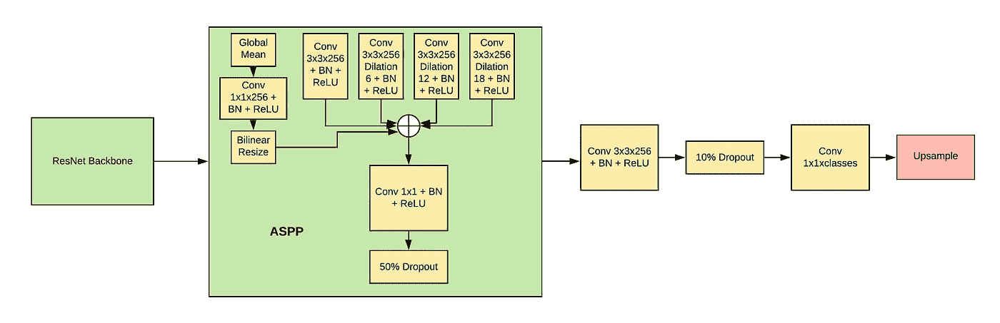

DeepLabV3 ASPP。自己图解。

与论文中的图表不同，官方实现还增加了 50%的 ASPP 输出丢失。以及在预测最终类之前具有 10%丢失的附加 3×3 卷积。

## 多网格、多尺度和输出步幅

atrous ResNet 主干网络也有一些小的变化。之前，网络同一部分内的卷积层具有相同的速率，例如 Conv4 和 Conv5。DeepLabV3 引入了一个名为多重网格(MG)的新超参数来调整 atrous 速率。例如，多网格值{1，2，4}意味着我们将把同一瓶颈块中三个卷积层的 atrous 速率分别乘以 1、2 和 4。如果基本速率为 2，这将导致每层的速率分别为 2、4 和 8。根据实验，这种调整可以更好地融合残余块角度的特征。

DeepLabV3 使用多尺度的方式也不同于 V2。作者意识到了 DeepLabV2 训练的低效，将多尺度完全移到了推理时间。所以当你训练一个网络的时候，它只会使用原始的图像尺度和一个分支计算，而不是 3 个。在推断时间，网络将在按{0.5，0.75，1.0，1.25，1.5，1.75}倍缩放的输入图像上运行 6 次，然后平均出 6 个输出(MS)。为了在 PASCAL 数据集上获得更好的度量，作者还翻转了查询图像，并再次在这 6 个尺度上运行推理。这是许多人不喜欢的部分，作者显然只是为了在 benchmark 中获得更高的分数，而不是提出一个通用的解决方案，这使得整篇论文更缺乏说服力。

借助 Google 的无限计算能力，作者还对网络的不同输出步长(OS)进行了实验。OS = 8 表示网络的分辨率最多降低 8 倍，当输入为 224x224 时，这将转换为 28x28 的要素地图。控制操作系统的关键是共享剩余块。当 Conv4 和 Conv5 的跨距= 2 时，OS 为 8。如果我们将 Conv4 的步长设置为 2，我们将得到 OS = 16 和一个 14x14 的特征图。实验证明，OS 越低，结果越好，但是也需要更多的计算。

## 不再有慢性肾功能衰竭

随着 DeepLabV3 中使用各种技巧来改进基准测试指标，网络到了一个额外的 CRF 步骤不能再改进结果的地步。所以在 V3 及以下版本中 CRF 被移除。这个结果很好理解，疯狂的多尺度和翻转推理，从小输出步幅到大特征图，网络预测的偶然不确定性大多在集成结果中消除。

# DeepLab V3+

> 用于语义图像分割的阿特鲁可分离卷积编解码器

2018 年，DeepLab 公布了最终版本 DeepLabV3+，作为对 V3 的小改进。

## 新骨干网络

DeepLabV3 最具影响力的变化是使用了新的主干网络例外。与 ResNet 相比，通过使用深度方向可分离卷积，Xception 可以在使用较少计算能力的情况下获得更好的结果。它还在 ImageNet 等基准测试中获得了许多最先进的指标。

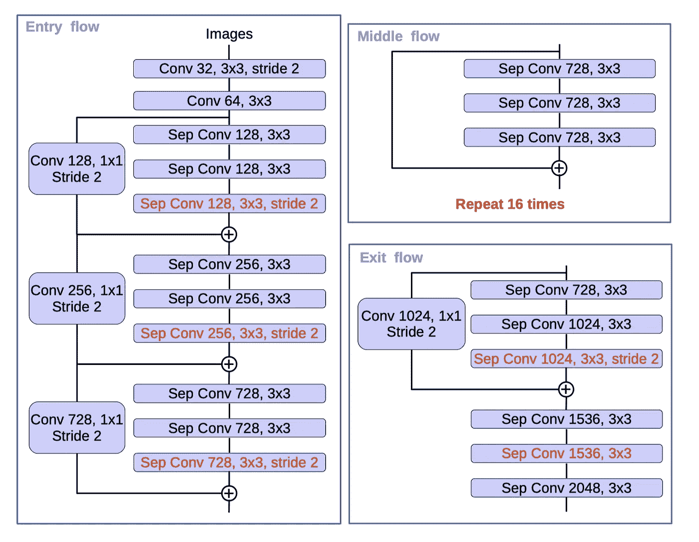

来自“用于语义图像分割的具有阿特鲁可分离卷积的编码器-解码器”

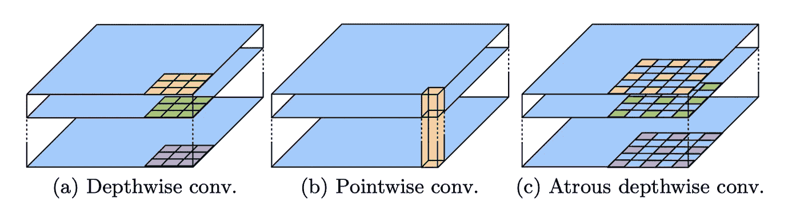

来自“用于语义图像分割的具有阿特鲁可分离卷积的编码器-解码器”

DeepLabV3+从 MSRA 的可变形卷积网络借用了 Xception 的修改版本，还创建了一个深度方向可分离卷积的 atrous 版本，以获得像 ResNet 一样的特征分辨率和视野。如上图所示，糟糕的可分离卷积只是把深度方向的 conv 部分变成了中间有孔的扩张版本。新骨干确实很厉害。与 ResNet-101 主干相比，它将 PASCAL 上的指标提高了 2%。

## 编码器-解码器架构

编码解码是语义分割中非常常见的设计。FCN、U-Net、E-Net 都采用了这种思想:先用一个主干网络将图像编码成一个小的特征向量，然后用卷积转置层学习一个解码器网络来对特征进行上采样。卷积转置是卷积的逆运算，它不是将多个位置的要素压缩到一个位置，而是对一个位置的值进行上采样，然后将数据分散到更大范围的区域。解码器的目标是学习一种变换，以从编码器阶段恢复丢失的信息。然而，在 DeepLabV1 和 V2 中，作者批评了解码器的使用，因为他认为具有更高分辨率特征的 atrous 卷积可以在不损失太多信息的情况下实现类似的上采样效果。尽管 DeepLab 系列避免使用卷积转置来解码功能，但使用这种解码器设计的其他网络架构实际上因其简单的设计而被广泛采用。因此，在 V3+中，DeepLab 最终加入了 decoder，以进一步改善常见基准数据集上的指标。

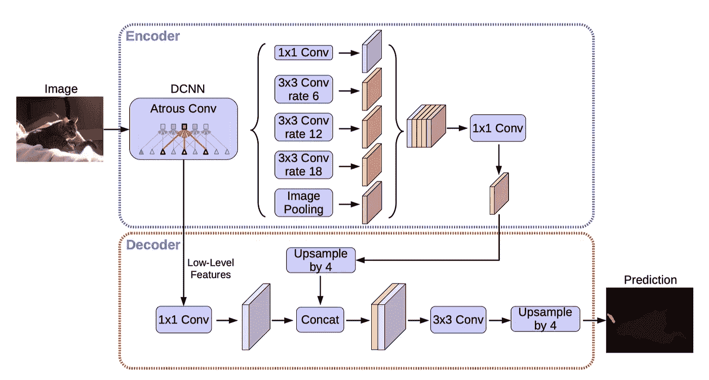

来自“用于语义图像分割的具有阿特鲁可分离卷积的编码器-解码器”

上图中，编码器是原来的 DeepLabV3 网络。它由一个主干 DCNN 网络和一个 ASPP 模块组成。借助 ASPP 输出和主干网络中间输出的特性，解码器使用卷积和双线性上采样将输出分辨率逐渐提高 8 倍。请注意，TensorFlow 中的[官方实现](https://github.com/tensorflow/models/tree/master/research/deeplab)与论文略有不同。例如，在最终的 4x 上采样之前，有两个 3x3 Conv 层和一个 1x1 Conv 层。

具有讽刺意味的是，当与解码器一起使用时，V3 论文中介绍的 ASPP 模块中的图像级特征(全局池)融合实际上降低了 Cityscapes 数据集上的性能。这可能意味着 DeepLab 中使用的特征融合饱和，它们都不是真正必要的。网络架构本身可能已经过度适应 PASCAL 数据集。

# 其他详细信息

到目前为止，我们已经讨论了 DeepLab 网络随时间的演变。在这一部分，我想简要介绍一下网络架构之外的一些培训细节。

## 损失函数

在 DeepLabV1 中，损失函数是对类的简单交叉熵损失。在 V2，由于三个分支在不同规模的输入上工作，损失变成了三个交叉熵损失的总和。在 V3 和 V3+中，这被还原为简单的交叉熵，因为多尺度的思想已经被用于推理而不是训练。

## 学习率政策

在 DeepLabV1 中，学习率策略是从 1e-3 开始的简单阶跃衰减策略。在 DeepLabV2 中，作者发现一种新的“策略”衰变策略效果更好。学习率将是(1-iteration/max_iteration)^power，其中幂是 0.9。这种逐渐衰减的学习速率有助于网络更稳定地找到最优解。而这个策略也被 V3 和 V3+所采用。

## 上采样

为了计算损失，DeepLabV1 和 V2 缩小了“地面真相”的规模，使其与网络输出相同。这与 FCN 形成对比，后者对结果进行上采样以匹配原始输入分辨率。从 V3 开始，作者发现这可能会导致地面真相的一些更好的细节没有反向传播，因此地面真相在训练期间不再缩小。

# 结论

DeepLab 系列是迄今为止最重要的语义切分网络之一。它从 astrous 卷积开始，并逐渐增加其他网络的更多功能，如 SPP 和解码器，以使自己更加强大。所以 DeepLab 确实见证了图像分类和语义分割的进步。它总结了近年来研究人员发现的所有很酷的技术。

然而，自从 DeepLabV3 以来，它也开始使用大量技巧来改进基准测试指标，因此重现结果也变得更加困难。在这些技巧中，来自同一图像的多个尺度的集合预测以及提高特征分辨率是最有用的，因此它对于工程来说仍然是一个有用的见解。希望在下一个十年，当我们拥有更廉价的计算能力时，我们将最终理解 DeepLab 的本质，从这些技巧中剥离所有的助推效果。

# 参考

陈良杰，乔治·帕潘德里欧，Iasonas Kokkinos，凯文·墨菲，艾伦·l·尤耶，[用深度卷积网和全连通条件随机场进行语义图像分割](https://arxiv.org/abs/1412.7062)

陈良杰，乔治·帕潘德里欧，雅索纳·科基诺斯，凯文·墨菲，艾伦·l·尤耶， [DeepLab:用深度卷积网、阿特鲁卷积和全连接条件随机场进行语义图像分割](https://arxiv.org/abs/1606.00915)

陈良杰，乔治·帕潘德里欧，弗洛里安·施罗夫，哈特维格·亚当，[重新思考阿特鲁卷积用于语义图像分割](https://arxiv.org/abs/1706.05587)

陈良杰，朱玉坤，乔治·帕潘德里欧，弗洛里安·施若夫，哈特威格·亚当，[编解码与阿特鲁可分卷积用于语义图像分割](https://arxiv.org/abs/1802.02611)