# 想知道为什么在梯度下降算法中要减去梯度？

> 原文：<https://towardsdatascience.com/wondering-why-do-you-subtract-gradient-in-a-gradient-descent-algorithm-9b5aabdf8150?source=collection_archive---------16----------------------->

## 易于理解的向量微积分洞察力具有偏导数，梯度和方向导数

杰斯温·托马斯在 [Unsplash](https://unsplash.com?utm_source=medium&utm_medium=referral) 上的照片

在使用机器学习时，处理监督 ML 问题的最基本方法之一是定义一个成本函数，然后最小化成本函数以获得最佳输出。梯度下降是最广泛使用的算法之一。梯度下降算法的基本数学表示如下。

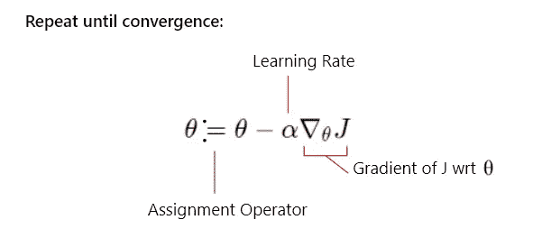

梯度下降算法的基本表示

这里，θ表示包含参数的向量，J 是成本函数。赋值运算符表明，每次迭代后，向量θ中的值都会更新。学习率可以手动设置，它定义了梯度下降算法中步长的大小。但是为什么我们减去梯度下降以达到最小损失呢？为了理解这一点，让我们来理解向量微积分的一些基本概念。

## **渐变**

函数 f 的梯度，写为∇f，是包含 f 所有偏导数的向量，我们来看一个例子。

考虑一个函数 f(x，y) = x sin(y)。我们首先需要找出函数 f 的偏导数，要找出函数对一个变量的偏导数，就要把所有其他变量都当作常数。

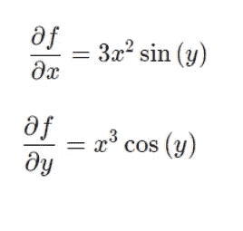

函数 f(x，y) = x sin(y)的偏导数

现在,**f 的梯度，用∇f 表示，就是一个向量，包含了所有偏导数的集合，也就是**

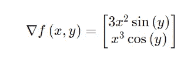

函数 f(x，y) = x sin(y)的梯度

因此，概括起来，我们可以说函数 J 的梯度可以写成-

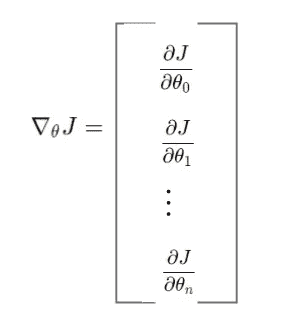

梯度的一般表示

> 多变量函数对特定变量的**偏导数**简单地告诉我们，在保持其他变量不变的情况下，如果我们非常轻微地改变特定变量，函数的输出将如何变化。
> 
> 例如，我们来看一个非常简单的函数:
> 
> f (x，y) = x y。在任何一点，比如说(2，3)，函数对 x 的偏导数:
> 
> ∂f(x,y)/∂x = 2xy = 2*2*3 = 12。
> 
> 函数 f(x，y)在点(2，3)的值(输出)为 2 *3 = 12。
> 
> 现在，让我们稍微增加 x 的值，比如 0.001，同时保持 y 值不变。现在重点是(2.001，3)。此时函数的值(输出)为 2.001 *3 = 12.012003。
> 
> 让我们看看当 x 改变时，输出的变化率，∂f(x,y)/∂x。
> 
> (f(2.001，3)-f(2.3))/2.001–2 = 0.012003/0.001≃12
> 
> 这个值等于函数对 x 的偏导数的值，因此意味着当一个输入变量发生微小变化而其他变量保持不变时，函数的输出也会发生变化。保持 x 值不变，对 y 也可以这样做。

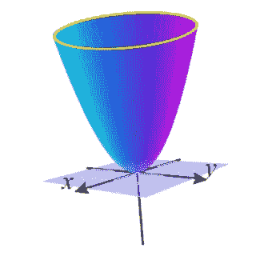

f(x，y) = x +y 的图

为了更好的理解，现在让我们想象函数 f(x，y) = x +y。左边给出了函数的图形。如果这个函数是我们的损失函数，我们可以看到，损失在原点附近最小，随着离原点越远，损失越大。让我们在 x-y 平面上画一个梯度矢量场。给定函数的梯度是[2x，2y]。

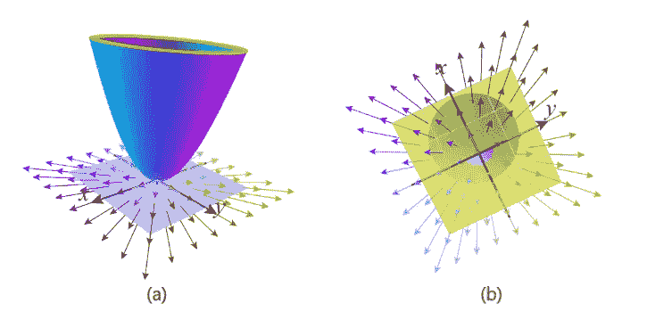

(x-y 平面上的梯度向量场|| (b)从底部到顶部的视图

我们看到向量场中的向量指向远离函数的原点**。这是因为当我们取图上的任意一点(a，b)，将它们投影到 x-y 平面上，然后画出从原点到该点的向量(a，b ),到该点的梯度是向量[2a，2b],它指向离原点更远的地方。此外，这里需要注意的一点是，靠近原点的点的梯度矢量比远离原点的点的梯度矢量长度小。这并不奇怪，因为梯度向量是[2x，2y]，所以任何远离原点的点都会比 x，y 值小的点有更大的长度。**

为了更好地形象化，下面给出了图上特定点的梯度。

图形上各点的梯度向量

图中不同点处梯度向量的仰视图(它指向远离原点的方向，离原点越远，向量的长度越大)

想象你在图上的任何一点，你想往上爬。你想找到一个方向，你应该从一个随机点移动，以最快的速度增加高度。该方向由特定点的梯度向量给出。因此，**坡度给了我们一个最陡的上升方向。**在我们的梯度下降算法中，我们的目标是最小化损失函数值，因此在任何给定点，我们需要向函数值下降最多的方向移动，即**向梯度**的相反方向移动，这是最陡下降的方向。因此，我们在算法中减去梯度。

但是仍然不清楚为什么梯度是最陡上升的方向。为了理解这一点，我们需要对**方向导数有一个大致的了解。**

## **方向导数**

考虑一个具有两个变量 x，y 的函数。我们之前看到，如果我们在 x 方向(保持 y 不变)或 y 方向(保持 x 不变)稍微移动，函数 f(x，y)的偏导数将告诉我们输出的变化。但是如果我们沿着不平行于任何一个轴的方向移动呢？如果我们沿着一个向量的方向移动，比如说[2，3]。即 x 方向上的 2 个单位和 y 方向上的 3 个单位。现在函数的输出会有怎样的变化？该信息由**方向导数给出。**

方向导数在数学上用𝑤⃗函数的梯度的点积来表示，它是我们移动方向的向量。

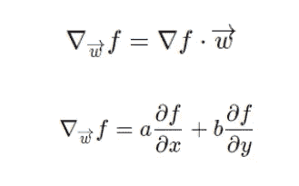

方向导数(将𝑤⃗视为[a，b])

以之前的函数 f(x，y) = x +y 为例，你站在一个点上，比如说(2，3)。现在你稍微向向量(3，1)的方向移动。输出会有什么变化？

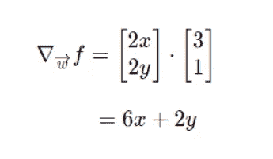

现在，当我们站在(2，3)时，该点的方向导数将是:

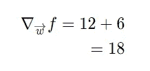

这意味着，如果在(2，3)处，我们稍微向向量(3，1)的方向移动，输出将改变 18 倍。我们点积的原因也很明显。当我们只在 x 方向移动时，输出的变化是∂f/∂x，当我们只在 y 方向移动时，输出的变化是∂f/∂y.，现在当我们在向量𝑤 ⃗的方向移动时，比如说[a，b]，我们在 x 方向移动**a**单位，在 y 方向移动**b**单位。因此，输出的变化可以用 a(∂f/∂x) + b(∂f/∂y).来表示

在任何给定的点上，我们可以向很多方向移动。假设我们希望在方向导数最大的𝑤 ⃗方向上移动，即函数的输出增加最多。这个方向也是最陡上升的方向。

因此，我们可以说我们在寻找:

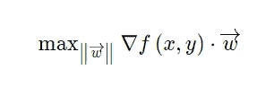

这里要注意的一点是，等式中的向量长度为 1，即单位向量。这是为了消除这样一种可能性，即我们可能会选择任何其他具有大幅度指向完全不同方向的向量，仅仅因为它给出了点积的最高值。

我们知道，给定任意两个向量，点积可以写成:

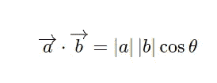

两个向量的点积

这里θ是两个向量之间的角度。为了使点积最大，两个向量之间的角度应为 0。

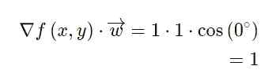

在我们的例子中，向量的大小是 1。因此，只有矢量之间的角度有关系。我们可以看到，当我们移动的矢量𝑤 ⃗(the 方向是函数的梯度方向时，方向导数的值最高。

因此，我们可以说，函数任意点的梯度都指向最陡上升的**方向，**也就是说，如果我要尽可能快地爬上函数，我会选择梯度的方向。

而在梯度下降算法中，我们希望选择在函数(即损失函数)减少最大值的方向上移动，因此我们在梯度的相反方向上移动，即**最陡下降的方向**。因此，我们在梯度下降算法中减去梯度。

感谢您的阅读！

如果您希望阅读更多关于深度学习的核心主题，请随时关注并保持更新。

 [## 深度学习主题的简单指南— 1(神经元、MacCulloch Pits 神经元、感知器)

### 初学者的去处，了解核心深度学习主题的概述。

medium.com](https://medium.com/@mmayank74567/a-simple-guide-to-deep-learning-topics-1-neuron-macculloch-pits-neuron-perceptron-bef18eded324) 

*故事中所有的图示和图像都是作者的。*