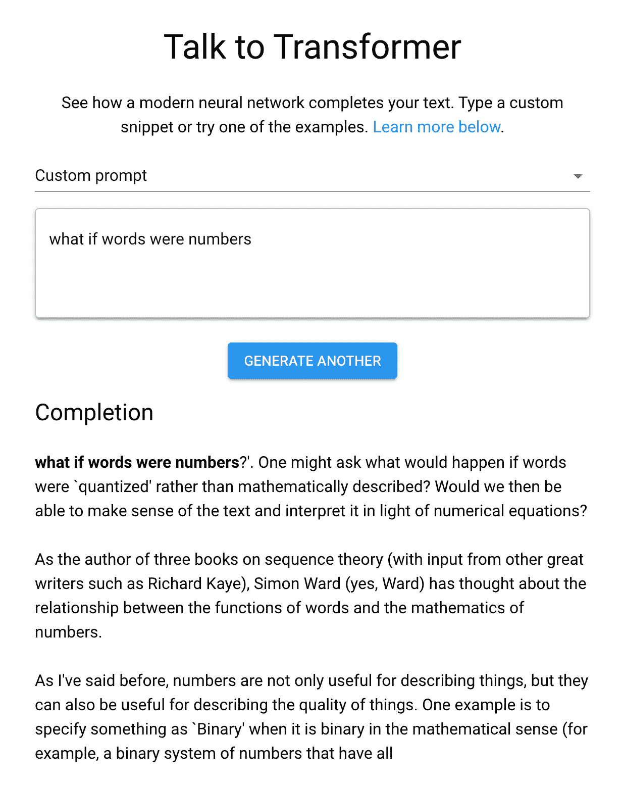
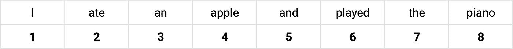
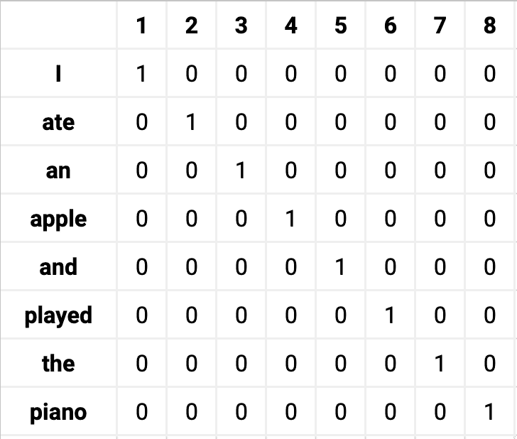
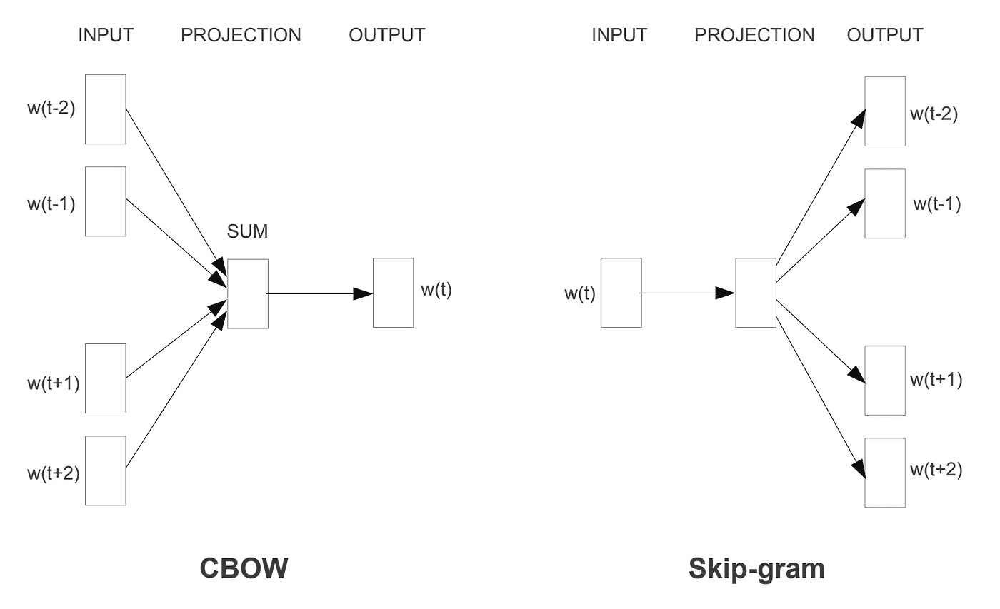
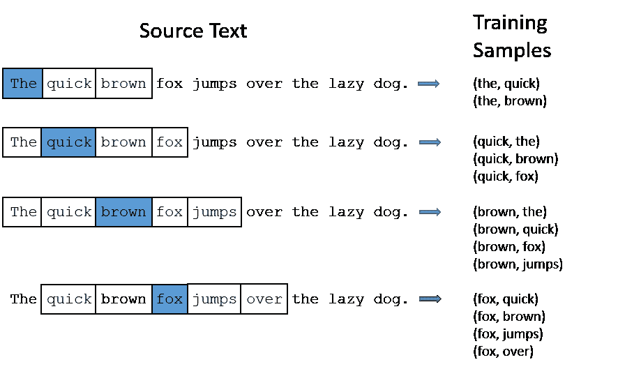
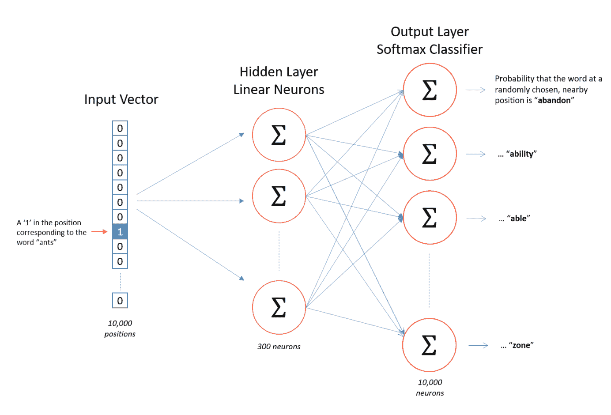
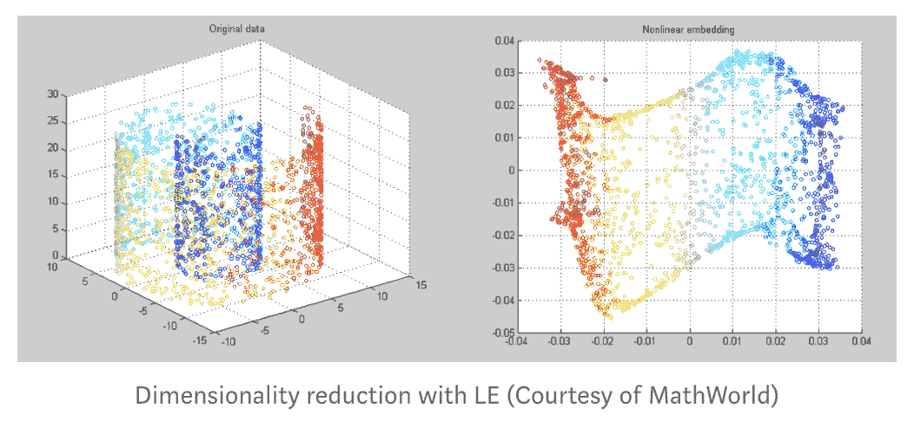

# 自然语言处理中的单词嵌入:一键编码和跳格神经网络

> 原文：<https://towardsdatascience.com/word-embedding-in-nlp-one-hot-encoding-and-skip-gram-neural-network-81b424da58f2?source=collection_archive---------12----------------------->

我是一名诗人出身的程序员，刚刚开始了解自然语言处理的奇妙世界。在这篇文章中，我将分享我对单词嵌入的理解，重点是两种嵌入方法:一键编码和跳过 gram 神经网络模型。

去年，OpenAI 发布了一个(受限)版本的 GPT-2，这是一个生成文本的人工智能系统。当用户输入一个提示——一个单词、一个句子甚至一个段落——系统会“预测”并产生下一个单词。GPT-2 的惊人之处在于，由此产生的段落，往往很容易被认为是一个(相当散漫的)人写的文本。

*一个由 GPT-2 生成文本的例子，这里测试出*

*不难找到输出随机单词的诗歌生成器，不管是否考虑句法逻辑。我们可以编写一个相当简单的算法，从名词池中选择一个随机单词，然后从动词池中选择一个随机单词，依此类推。(有人说诗歌生成相对“容易”是因为体裁固有的文学许可。)*

*但是，机器如何生成连贯的句子，这些句子似乎像人类一样了解周围的上下文？*

*输入自然语言处理(NLP)。NLP 是人工智能领域的一个分支，旨在理解日常(自然)人类语言。NLP 的众多应用已经存在很长时间了，从文本自动完成和聊天机器人到语音助手和现场音乐推荐。*

*由于 NLP 模型比以往任何时候都显示出了最先进的性能，所以仔细研究一下 NLP 中最常用的方法之一:单词嵌入可能是值得的。*

# ***什么是单词嵌入？***

*就其核心而言，单词嵌入是一种将文本转化为数字的方法。我们这样做是因为机器学习算法只能理解数字，不能理解明文。*

*为了让计算机能够阅读文本，它们必须被编码为数值的连续*向量*。你可能熟悉欧几里得几何中的矢量概念，它表示具有大小和方向的物体。在计算机科学中，向量意味着一维数组。*

*(注意:数组是一种用方括号([])表示的数据结构。一维数组的一个例子可能是类似于[.44，. 26，. 07，-0 . 89，-0 . 15]的东西。二维嵌套数组可能看起来像[0，1，[2，3]，4]。数组保存存储在连续集合中的值。)*

*好吧，那么我们如何嵌入——或矢量化——单词呢？最简单的方法称为一热编码，也称为“1-of-N”编码(意味着向量由一个 1 和多个 0 组成)。*

# ***一种方法:一键编码***

*我们来看看下面这句话:“我吃了一个苹果，弹了钢琴。”我们可以从索引每个单词在给定词汇集中的位置开始。*

**

**每个单词在词汇表中的位置**

*单词“I”位于位置 1，因此它的独热向量表示为[1，0，0，0，0，0，0，0]。类似地，单词“ate”位于位置 2，因此它的独热向量应该是[0，1，0，0，0，0，0，0，0]。源词汇表中单词的数量表示维度的数量——这里我们有八个维度。*

*示例文本的一键嵌入矩阵如下所示:*

**

**词汇表中每个单词的单键向量表示**

## ***一键编码的问题***

*这种单词嵌入方法有两个主要问题。*

*第一个问题是维数灾难，指的是高维数据中出现的各种问题。即使只有相对较小的 8 维，我们的示例文本也需要指数级的大内存空间。矩阵的大部分被零占据，所以有用的数据变得稀疏。假设我们有 50，000 个词汇。(英语中大约有一百万个单词。)每个单词用 49999 个 0 和一个 1 来表示，我们需要 50000 的平方= 25 亿个单位的内存空间。计算效率不高。*

*第二个问题是很难提取意思。每个单词都是独立嵌入的，每个单词都包含一个 1 和 N 个 0，其中 N 是维数。由此产生的向量组并没有透露太多关于彼此的信息。如果我们的词汇中有“橘子”、“香蕉”和“西瓜”，我们可以看到这些词之间的相似性，例如它们是水果的类型，或者它们通常跟随动词“吃”的某种形式我们可以很容易地形成一个思维地图或聚类，其中这些单词彼此靠近。但是对于一个热点向量，所有的单词都是等距的。*

# ***另一种方法:Skip-Gram 神经网络***

*解决上述两个问题有不同的方法，但是在本文中，我们将着眼于 skip-gram 神经网络模型。“Skip-gram”是关于猜测——给定一个输入单词——它的上下文单词(出现在附近的单词)，而“神经网络”是关于节点和这些节点之间的权重(连接强度)的网络。*

*这种单词嵌入模型有助于降低维度，并保留上下文相似性的信息，我们稍后将回到这一点。由托马斯·米科洛夫开发的著名的 Word2vec 使用了这种模型(以及另一种称为连续单词包或 CBOW 模型的模型，它通过根据上下文单词猜测单词来实现与 skip-gram 相反的功能)。*

**

*Word2vec 的两个主要模型(来源:[“向量空间中单词表示的高效估计”](https://arxiv.org/pdf/1301.3781.pdf%C3%AC%E2%80%94%20%C3%AC%E2%80%9E%C5%93))*

*为了说明跳格法，让我们回到我们的示例文本，“我吃了一个苹果，弹了钢琴。”我们将使用单词“ate”作为模型的输入。同样，skip-gram 是关于预测出现在输入单词附近的上下文单词。假设我们将窗口大小定义为两个单词(窗口大小可以变化),并查看输入单词之前的两个单词和之后的两个单词。然后我们会看到“我”、“安”和“苹果”。从这里开始，我们的输入-输出对的训练样本将是(“ate”、“I”)、(“ate”、“an”)和(“ate”、“apple”)。请参见下图以供参考:*

**

*(来源:[http://mccormickml . com/2016/04/19/word 2 vec-tutorial-the-skip-gram-model/](http://mccormickml.com/2016/04/19/word2vec-tutorial-the-skip-gram-model/))*

*假设我们从一个模型开始，这个模型还没有经过训练，因此不知道每个单词的上下文单词。当我们获取第一对训练样本(“ate”、“I”)，并将“ate”输入到我们的模型中，期望看到“I”时，我们的模型可能会随机吐出“played”。更准确地说，实际发生的情况是，模型输出一个预测向量，其中包含词汇表中每个单词出现在“ate”附近的概率，然后选择概率最高的单词(在本例中为“played”)。在早期训练阶段，这几乎是一个随机的预测。*

*我们如何调整预测以使其更加准确？该模型认为单词“played”可能会出现在单词“ate”附近，这一事实说明了“played”和“ate”之间的关系——它们之间目前有相对较强的联系或权重，尽管对它们的实际关系不准确。我们怎么知道这种联系应该更弱呢？因为我们的样本对只有上下文词“我”、“安”或“苹果”，而没有“玩过”。*

*请注意，我们的目标输出应该是这样的(“ate”、“I”):在“I”处的概率为 1，在每隔一个单词处的概率为 0，因此[1，0，0，0，0，0，0，0]。我们通过比较实际输出(其中“played”具有最接近 1 的值)和预期目标输出(其中“I”具有最接近 1 的值)来获得误差值的向量，并在反向传播中使用这些值来调整“ate”和其余部分之间的权重。*

*简单地说，“我”应该以 100%的概率出现在“ate”附近，但它只以(例如)10%的概率出现，所以我们使用 90%的差异重构“ate-to-I”权重，使其更接近 100%。正如你可能已经猜到的，由于有两个其他单词(“an”和“apple”)也出现在“ate”附近，将这些对添加到计算中会将“I”出现在“ate”附近的权重降低到更接近 33%。*

*训练结束时得到的权重就是我们正在寻找的单词嵌入——我们希望获得预测关系的工具，而不一定是每个单独输入返回的内容。*

**

**隐层权重是我们通过 skip-gram 训练得到的单词嵌入(来源:*[http://mccormickml . com/2016/04/19/word 2 vec-tutorial-the-skip-gram-model/](http://mccormickml.com/2016/04/19/word2vec-tutorial-the-skip-gram-model/))*

*其实这就是神经网络训练的基本思路。这与我们通过联想来记忆事物的方式类似，因为某些联想会随着重复共现而变得更强(例如“New”和“York”)，而其他联想会随着它们越来越少地一起使用而变得更弱。我们大脑中的神经元不断调整它们之间的权重，以更好地代表现实。*

*我们现在已经看到了跳格神经网络模型是如何工作的。如前所述，这比一热嵌入有两个优点:降维和上下文相似性。*

## ***降维***

*在不深入细节的情况下，我想让我们的注意力回到上图，特别是中间的隐藏层。为了给你一个上下文，源文章使用了 10，000 个单词的词汇。您将看到隐藏层显示 300 个神经元，这意味着它的嵌入大小为 300，而嵌入大小为 10，000。*

*还记得 one-hot 编码如何创建由与训练集中单词总数一样多的值组成的向量，其中大部分用零填充吗？代替这样做的是，skip-gram 神经网络模型选择更少数量的特征或神经元，这些特征或神经元表示关于该单词的更有用的东西。把特征想象成性格特征——我们是由多种特征组成的(例如，内向和外向),这些特征在一个谱上有一个值。我们只保留最能描述我们的东西。*

*顺便说一句，我怎么强调我有多爱这句来自 [Pathmind](https://pathmind.com/wiki/word2vec) 的话都不为过:*

> *“就像梵高画的向日葵是 19 世纪 80 年代末在巴黎的一个三维空间中代表植物物质的帆布上的二维混合物，所以排列在一个矢量中的 500 个数字可以代表一个单词或一组单词。这些数字将每个单词定位为 500 维向量空间中的一个点。”*

**

## ***上下文相似度***

*skip-gram 模型允许您根据每个单词的邻近程度来保存它们的上下文信息。在“我吃了一个苹果”的例子中，“吃”是“苹果”的上下文词。上下文允许基于单词的句法和/或语义相似性对单词进行分组。如果给我们额外的输入“我吃了一个香蕉”和“我吃了一个橘子”，我们很快就会发现“吃”也是“香蕉”和“橘子”的上下文词，因此可以推断“苹果”、“香蕉”和“橘子”一定有一些共性。*

*由于“苹果”、“香蕉”和“橙子”具有相似的上下文，因此它们的向量被调整为彼此更接近，从而在某个多维几何空间上形成聚类。关于这一点，语言学家 J.R. Firth 说，“你可以通过一个词的朋友来了解它。”*

*(警告:上下文并不总是与最接近的单词最相关；想一个名词或动词短语，中间用很多杂词隔开。这只是语言建模的一种方式。)*

# ***总结***

*在本文中，我们讨论了我对 NLP 中单词嵌入概念的理解，以及两种常见的嵌入方法，一键编码和 skip-gram。*

*我还简要介绍了特定单词嵌入方法相对于另一种方法的优势，即降维和上下文相似性。*

*展望未来，我想更好地理解语言建模中的变形金刚和最初促使我写这篇文章的 GPT 2(以及最近发布的 GPT 3)的工作方式。*

## *结束语*

*机器可以编写文本，尤其是越来越有意义的文本，这个想法仍然让我敬畏。为了更全面地了解不同的 NLP 模型是如何工作的，我还有很长的路要走，而且一路上可能会有(许多)误解。我将非常感谢任何关于我如何成为一个更好的学习者和作家的反馈。*

*对于那些不熟悉这个话题的人来说，我希望这篇文章能引发你对 NLP 领域的兴趣，就像下面的文章引发我的兴趣一样。*

## ***来源&演职员表:***

*   *Word2vec 和神经单词嵌入的精美初学者指南:【https://pathmind.com/wiki/word2vec】T4*
*   *一篇用我最容易理解的方式来解释 Word2vec 的文章:[http://jalammar.github.io/illustrated-word2vec/](http://jalammar.github.io/illustrated-word2vec/)*
*   *另一个关于 skip-gram 的伟大作品，我在这里借用了他的图表:[http://mccormickml . com/2016/04/19/word 2 vec-tutorial-the-skip-gram-model/](http://mccormickml.com/2016/04/19/word2vec-tutorial-the-skip-gram-model/)*
*   *要了解更多关于单词嵌入的信息，也可以查看以下文章:[https://medium . com/deep-learning/glossary-of-deep-learning-word-embedding-f 90 C3 CEC 34 ca](https://medium.com/deeper-learning/glossary-of-deep-learning-word-embedding-f90c3cec34ca)*
*   *和[https://blog . acolyer . org/2016/04/21/the-amazing-power-of-word-vectors/](https://blog.acolyer.org/2016/04/21/the-amazing-power-of-word-vectors/)*
*   *了解如何训练神经网络的更多信息:[https://becoming human . ai/making-a-simple-neural-network-2 ea 1 de 81 EC 20](https://becominghuman.ai/making-a-simple-neural-network-2ea1de81ec20)*
*   *如果你对 GPT 2 号感兴趣，你可能会发现这个插图很有帮助:[http://jalammar.github.io/illustrated-gpt2/](http://jalammar.github.io/illustrated-gpt2/)*