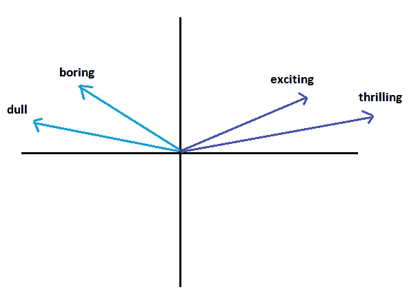
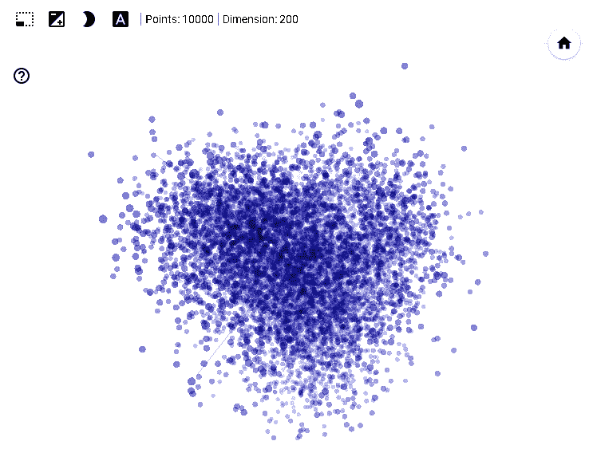
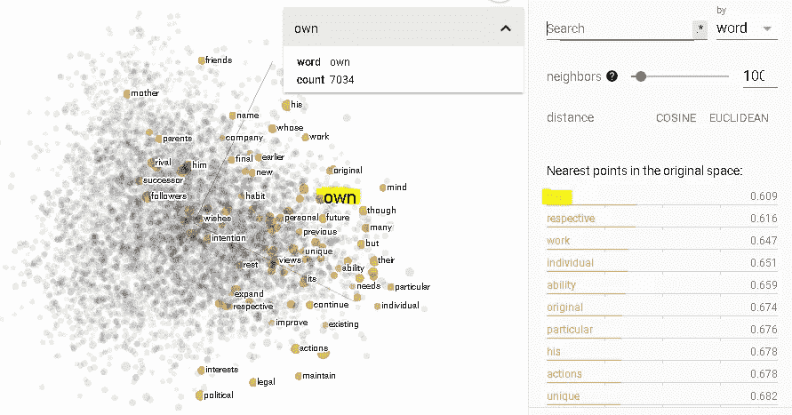
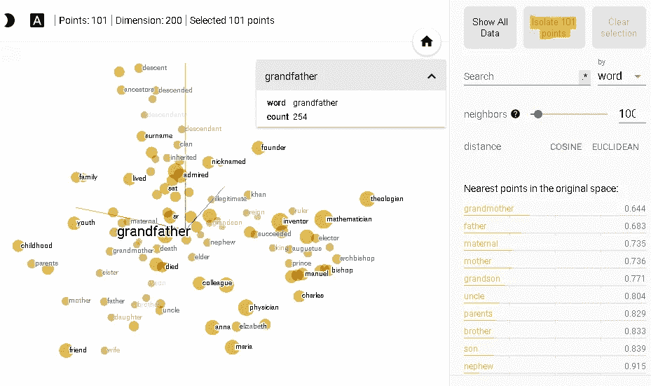

# TensorFlow 的单词嵌入和嵌入投影

> 原文：<https://towardsdatascience.com/word-embeddings-and-embedding-projector-of-tensorflow-c946b98c9b3f?source=collection_archive---------48----------------------->

## 理论解释和实例。

罗斯·乔伊纳在 [Unsplash](https://unsplash.com/s/photos/similar?utm_source=unsplash&utm_medium=referral&utm_content=creditCopyText) 上的照片

单词嵌入是一种在词汇表中表示单词(即记号)的技术。它被认为是自然语言处理中最有用和最重要的概念之一。

在这篇文章中，我将介绍单词嵌入的概念以及它在 NLP 中的作用。然后，我们将通过一个实例来理解使用 TensorFlow 的**嵌入式投影仪**的概念。

单词嵌入是指在 n 维向量空间中用向量表示一个单词。考虑一个包含 10000 个单词的词汇表。在传统的数字编码中，单词用从 1 到 10000 的数字来表示。这种方法的缺点是，我们无法捕捉到任何关于单词含义的信息，因为数字是在不考虑单词含义的情况下分配给单词的。

如果我们使用 16 维的单词嵌入，那么每个单词都用一个 16 维的向量表示。单词嵌入的主要优点是共享相似上下文的单词可以在向量空间中彼此接近地表示。因此，向量承载了一个词的语义。假设我们正在尝试对客户评论进行情感分析。如果我们使用单词嵌入来表示评论中的单词，与积极意义相关的单词会指出一种特定的方式。同样，具有消极意义的单词很可能与具有积极意义的单词指向不同的方向。

一个非常著名的带有单词嵌入思想的类比是国王-王后的例子。它基于“国王”、“王后”、“男人”和“女人”这些词的矢量表示。如果我们从国王中减去男人，然后加上女人，我们将得到一个非常接近女王的向量:

有不同的方法来衡量向量的相似性。最常见的方法之一是**余弦相似度**，它是两个向量之间角度的余弦。与欧几里德距离不同，余弦相似性在测量相似性时不考虑向量的大小。因此，余弦相似性关注向量的方向，而不是长度。

想想“令人兴奋”、“无聊”、“激动人心”和“无聊”这些词。在二维向量空间中，这些单词的向量可能看起来像:

二维空间中的单词嵌入

随着向量之间的角度减小，角度的余弦增加，因此余弦相似性增加。如果两个向量位于同一方向(它们之间的角度为零)，余弦相似度为 1。另一方面，如果两个向量指向相反的方向(它们之间的角度为 180°)，余弦相似度为-1。

当我们使用单词嵌入时，该模型了解到激动人心和激动人心比激动人心和无聊更有可能共享相同的上下文。如果我们用整数来表示单词，模型就不知道这些单词的上下文。

有不同的方法来创建单词嵌入，如 Word2Vec、GloVe 或神经网络的嵌入层。单词嵌入的另一个优点是，我们可以在模型中使用预先训练的嵌入。例如，Word2Vec 和 GloVe 嵌入对公众开放，可以用于自然语言处理任务。我们也可以选择使用神经网络中的嵌入层来训练我们自己的嵌入。例如，我们可以在 **Keras** 的序列模型中添加**嵌入**层。请注意，需要大量数据来训练嵌入层，以实现高性能。

我们用 4 个单词举的例子非常简单，但是抓住了单词嵌入背后的思想和动机。为了可视化和检查更复杂的例子，我们可以使用 TensorFlow 的嵌入式投影仪。

# **嵌入投影仪**

[嵌入投影仪](https://projector.tensorflow.org/)是理解单词嵌入的神奇工具。它允许你加载你自己的嵌入和可视化，以及分析一些预先训练的模型。

我选择了一个预先训练好的嵌入，这是 Word2Vec 10K，但你可以使用 **load** 选项随意上传你自己的嵌入。TensorFlow 有一个关于单词嵌入的信息丰富的教程[也解释了如何将数据加载到嵌入投影仪。](https://www.tensorflow.org/tutorials/text/word_embeddings)

让我们回到 Word2Vec 10K 的例子，它包括 200 个维度中的 10000 个点。

这张图片说明不了什么，但是你可以移动它来看不同的单词。上图中的每个点代表一个单词。如果你点击一个点，它会显示这个单词和附近的单词。例如，我点击了代表单词“own”的点:

投影仪显示“own”在文本和包含最近点的列表中出现的次数。与“own”最接近的点是“their ”,这是有意义的，因为这些词很可能像在“their own”中一样一起出现。

在我们选择了一个特定的单词后，我们可以分离出一定数量的相关单词。

我选取了“爷爷”这个词，隔离出 101 个词。它返回了一个不太密集的视图，这使得可视化分析嵌入更容易。

词嵌入被认为是自然语言处理中最重要的思想之一，它使自然语言处理的研究者和实践者在完成复杂的任务上迈出了一大步。

感谢您的阅读。如果您有任何反馈，请告诉我。