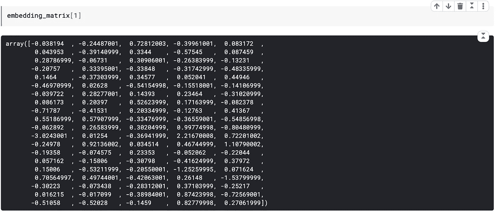
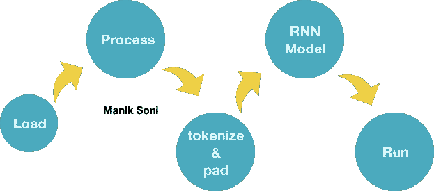
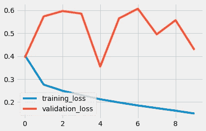
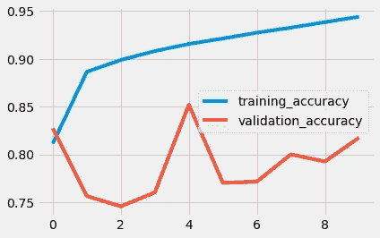
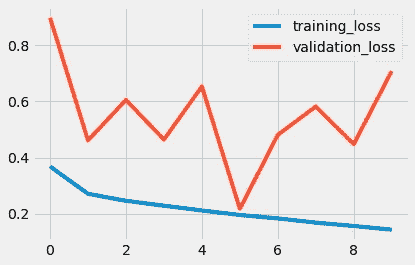
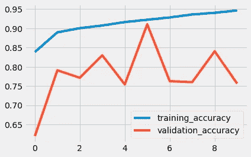

# 从零开始理解单词嵌入| LSTM 模型|

> 原文：<https://towardsdatascience.com/word-embeddings-and-the-chamber-of-secrets-lstm-gru-tf-keras-de3f5c21bf16?source=collection_archive---------7----------------------->

## 直观理解单词嵌入的最终目的…最后


乔恩·泰森在 [Unsplash](https://unsplash.com/s/photos/text?utm_source=unsplash&utm_medium=referral&utm_content=creditCopyText) 上的照片

哟读者！我是[马尼克](https://www.linkedin.com/in/maniksoni)。怎么了？。

> 希望你做得很好，并为你的目标努力工作。如果没有，也不迟。现在就开始，就在此时此刻。

有了这些信息，你将对深度神经网络的序列和文本处理有一个清晰的解释，包括:

1.  什么是一键编码？
2.  使用 keras 的 OneHot 编码。
3.  什么是单词嵌入以及它们相对于一键编码的优势？
4.  单词嵌入想说什么？
5.  使用 LSTM 和 GRU 图层在 keras 中将原始文本转换为单词嵌入的完整示例。

如果你想了解 LSTMs，你可以去这里

[](https://binarykeys.in/2020/07/lstm-cell-architecture-scratch-code/) [## LSTM 细胞:用代码从零开始理解架构

### LSTMs 是一种特殊的 rnn，具有处理长期依赖关系的能力。他们还提供解决方案…

binarykeys.in](https://binarykeys.in/2020/07/lstm-cell-architecture-scratch-code/) 

# 让我们开始吧。

> “你的祖先和我的祖先曾追逐乳齿象或野猪，就像奥林匹克短跑运动员一样，手里拿着长矛，用树叶和虎皮盖住自己，作为他们的早餐”——历史

上面的句子是文本形式的，为了让神经网络理解和吸收它，我们需要将其转换成某种数字形式。两种方法是**一种是热编码**另一种是**字嵌入**。

# 一个热点

这是一种用 0 和 1 的数组来表示每个单词的方法。在数组中，只有一个索引有“1 ”,其余的都是 0。

示例:下面的向量只代表一个单词，在一个有 6 个唯一单词的句子中。


作者图片

# 与 numpy 一夜情

让我们找出句子中所有独特的单词。

```
array(['Yours', 'a', 'after', 'an', 'ancestors', 'and', 'boar,',
       'breakfast', 'covering', 'for', 'had', 'hand', 'in','leaves',
       'like', 'mastodons', 'mine', 'olympic', 'or', 'run', 'skin,',
       'spear', 'sprinter,', 'their', 'themselves', 'tiger', 'wild',
       'with'], dtype='<U10')shape: (28,)
```

现在，给他们每个人一个索引，即创建一个 word_index，其中每个单词在字典中都有一个索引。

您可能已经在上面的代码中观察到，0 没有分配给任何单词。这是 Keras 中的一个保留索引(我们稍后会讲到)。

```
{'Yours': 1, 'a': 2, 'after': 3, 'an': 4, 'ancestors': 5, 'and': 6, 'boar,': 7, 'breakfast': 8, 'covering': 9, 'for': 10, 'had': 11, 'hand': 12, 'in': 13, 'leaves': 14, 'like': 15, 'mastodons': 16, 'mine': 17, 'olympic': 18, 'or': 19, 'run': 20, 'skin,': 21, 'spear': 22, 'sprinter,': 23, 'their': 24, 'themselves': 25, 'tiger': 26, 'wild': 27, 'with': 28}
```

现在，让我们为它们创建一个一次性编码。

示例输出:这就是“你的”是如何表示的。

```
Yours [0\. 1\. 0\. 0\. 0\. 0\. 0\. 0\. 0\. 0\. 0\. 0\. 0\. 0\. 0\. 0\. 0\. 0\. 0\. 0\. 0\. 0\. 0\. 0\. 0\. 0\. 0\. 0.]
```

## *单热 keras 示例*

text_to_matrix 是用于返回独热编码的方法。

按作者

你可以看到，为了表示一个单词，我们实际上浪费了大量的内存来设置 0(稀疏矩阵)。这些一次性编码也不能反映相似单词之间的任何关系。它们只是一些带有“1”的单词的表示。在一键编码中，两个相似的词(如“准确的”和“精确的”)可能位于非常不同的位置。

如果我们可以用更少的空间来表示一个单词，并且让它的表示有一个意义，这样我们就可以学到一些东西。

# 单词嵌入


单词向量示例

*   单词嵌入也表示数组中的单词，不是以 0 和 1 的形式，而是连续的向量。
*   它们可以在几个维度上表示任何单词，主要基于我们文本中独特单词的数量。
*   它们是密集的低维向量
*   不是硬编码的，而是通过数据“学习”的。

## 单词嵌入想说什么？

*   词与词之间的几何关系嵌入词中可以表示词与词之间的语义关系。与彼此远离的单词相比，彼此靠近的单词具有更强的关联性。
*   向量/单词彼此更接近意味着它们之间的余弦距离或几何距离与其他相比更小。
*   可以有向量“男性对女性”,它表示单词和它的阴性之间的关系。这个向量可以帮助我们预测句子中使用“he”时的“king”和使用“Queen”时的“Queen”。

## 单词嵌入是什么样子的？

下面是单行嵌入矩阵，表示来自具有 100K 个唯一单词的文本的 100 维中的单词'*和'*。



**嵌入矩阵中的一行，表示 100 维中的一个单词**

这种矩阵是从数据中学习来的，并且可以在 100、200、1000 或更多维中表示具有数百万字的任何文本(如果使用一键编码，则同样需要 1 毫米的维度)。

让我们看看如何用递归神经网络在 keras 中创建我们的文本嵌入。

## **将原始数据转换为嵌入数据的步骤:**



流动

1.  在数组中加载文本数据。
2.  处理数据。
3.  使用标记器将文本转换为序列，并用 keras . preprocessing . text . pad _ sequences 方法填充它们。
4.  使用**尺寸**(最大字数，表示尺寸，输入尺寸)的嵌入层初始化模型

*   *max_words* :您的数据中唯一单词的个数
*   *表示 _ 维度*:表示你想要表示一个词的维度个数。通常，它是(唯一的 words)^(1/4)的数字
*   input_size:填充序列的大小( *maxlen* )

5 .运行模型

让我们按照上面的步骤来处理 IMDB 原始数据。下面所有的代码都在我的 [Kaggle 笔记本里。](https://bit.ly/30oTCaG)

## 第一步。必要的进口

必要的进口

## 第二步。加载文本数据。

用熊猫加载文本数据。

读取数据

## 第三步:处理数据。

给正面影评打 1 分，给负面影评打 0 分。

过程数据

## 步骤 4:创建和填充序列。

创建 keras 的 Tokenizer 类的一个实例，并将序列填充到“ *maxlen* ”。

定序

## 第五步。初始化我们的模型

一种以嵌入为第一层的简单递归神经网络。

典型递归模型

## 第六步:运行模型！

运行这该死的东西

# 输出

## 与 GRU:



GRU 培训和验证

## 与 LSTM:



LSTM 培训和验证

以上所有代码都呈现在[这里](https://www.kaggle.com/maniksoni/experiments-sentiment-analysis-raw-data-gru-lstm)。

如果这篇文章对你有所帮助，请与他人分享你的知识！

感谢你来到这里！太好了！

[](https://binarykeys.in/) [## 二进制密钥|技术比特的密钥

### 日本横河电机公司(Yokogawa Electric Corp .)决定投资一只基金中的基金，支持印度初创企业 Hello Stardust！今天…

binarykeys.in](https://binarykeys.in/) [](https://www.linkedin.com/in/maniksoni) [## 马尼克索尼- SDE -亚马逊| LinkedIn

### 查看 Manik Soni 在全球最大的职业社区 LinkedIn 上的个人资料。Manik 有 8 个工作列在他们的…

www.linkedin.com](https://www.linkedin.com/in/maniksoni) 

由[凯利·西克玛](https://unsplash.com/@kellysikkema?utm_source=unsplash&utm_medium=referral&utm_content=creditCopyText)在 [Unsplash](https://unsplash.com/s/photos/thanks?utm_source=unsplash&utm_medium=referral&utm_content=creditCopyText) 上拍摄的照片