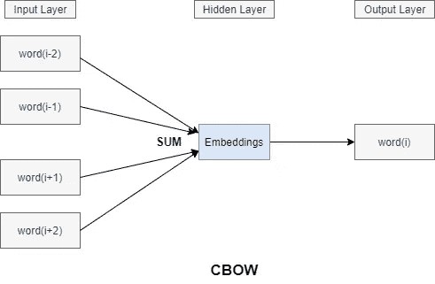
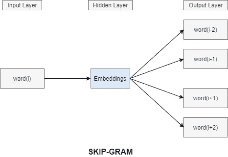
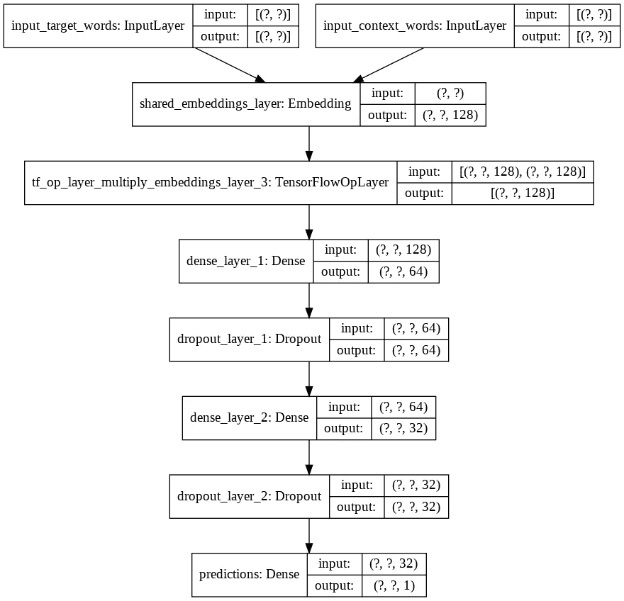
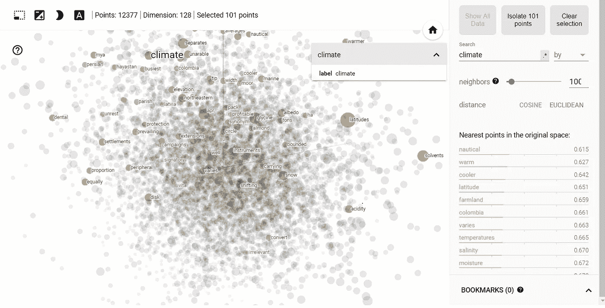
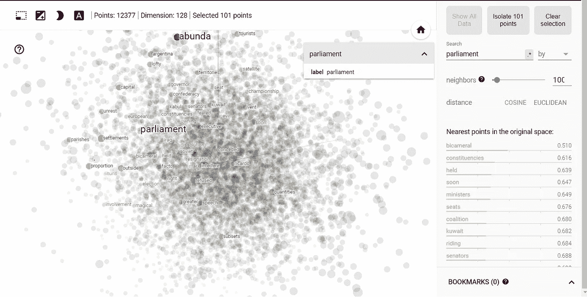
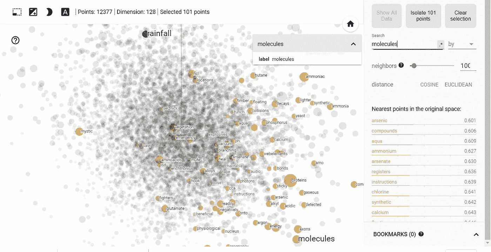

# 单词嵌入深度探究—实践方法

> 原文：<https://towardsdatascience.com/word-embeddings-deep-dive-hands-on-approach-a710eb03e4c5?source=collection_archive---------36----------------------->

## 简要介绍单词嵌入，并深入研究使用 Tensorflow 的实现细节


罗曼·维涅斯在 [Unsplash](https://unsplash.com?utm_source=medium&utm_medium=referral) 上的照片

# 介绍

我敢肯定，随着你在[自然语言处理](https://en.wikipedia.org/wiki/Natural_language_processing)旅程中的进步，你们中的大多数人迟早会被“单词嵌入”这个术语绊倒。单词嵌入已经成为当今最先进的语言模型的最重要的构件之一。至关重要的是，我们要理解它们代表什么，它们是如何计算的，以及它们的区别。因此，让我们从理解它的真正含义开始，并规划它在 NLP 社区中的广泛使用和流行背后的特征和特性。从单词嵌入的基本基础开始，随着文章的深入，我们将逐步探索其深度。本文分享的完整代码可在 [Github](https://github.com/SharvilN/Word-Embeddings) 上获得。

# 单词嵌入

让我们来看看维基百科对单词嵌入是怎么说的—

> 单词嵌入是自然语言处理(NLP)中一组[语言建模](https://en.wikipedia.org/wiki/Language_model)和[特征学习](https://en.wikipedia.org/wiki/Feature_learning)技术的统称，其中来自词汇表的单词或短语被映射到[实数](https://en.wikipedia.org/wiki/Real_numbers)的[向量](https://en.wikipedia.org/wiki/Vector_(mathematics))。

换句话说，单词嵌入是单词的矢量化、固定长度、分布式、密集表示，通过将单词映射到实值向量来解释单词的文本含义。我知道一下子很难接受。我们将把定义分成几部分，一次只关注一部分。

单词嵌入是**固定长度的向量**——这意味着我们词汇表中的所有单词都将由我们决定的固定预定义大小的向量(实数)来表示。大小为 3 的单词嵌入看起来像:“cold”—[0.2，0.5，0.08]，“house”—[0.05，0.1，0.8]

**分布式表示** —单词嵌入基于分布式假设，该假设认为出现在相似上下文中的单词往往具有相似的含义。分布式表示试图通过考虑一个单词的同伴(上下文单词)来理解这个单词的意思。

**密集表示**——这是单词嵌入最显著的特征之一，让它们如此受欢迎。传统上，一种热编码被用于将单词映射成数值。一个热门的编码是将词汇转换成二进制向量的过程。如果词汇大小为 5，单词为{猫，食物，房子，牛奶，水}，猫将被编码为二进制向量[1，0，0，0，0]，牛奶将为[0，0，0，1，0]等等。

您可能已经注意到了，我们只使用整个向量的单词 index 设置了一个元素。随着词汇量的增加，我们最终会使用一个长度很长的稀疏向量来编码一个单词，这将导致性能和存储方面的损失，因为[维数灾难](https://en.wikipedia.org/wiki/Curse_of_dimensionality)。除此之外，这种表示不能学习单词之间的语义关系，而这在处理文本数据时是至关重要的。

## 需要单词嵌入

为了克服一键编码的局限性，传统的信息检索方法也被尝试和实现，希望能够对抗维数灾难——[TF-IDF](https://en.wikipedia.org/wiki/Tf%E2%80%93idf)、[潜在语义分析](https://en.wikipedia.org/wiki/Latent_semantic_analysis#:~:text=Latent%20semantic%20analysis%20(LSA)%20is,to%20the%20documents%20and%20terms.)等。TF-IDF 和 LSA 都使用以文档为中心的方法，使它们局限于 NLP 问题的一个子类。这些技术仍然不能有效地捕捉单词在密集表示中的意思。

单词嵌入消除了所有上述缺点，并为我们提供了丰富而强大的表示，能够捕捉单词之间的上下文和语义相似性。

现在，我们已经了解了单词嵌入的想法和动机，我们将尝试考虑学习单词嵌入的最重要和最广泛使用的算法之一— **Word2Vec** 。我们将详细介绍它，并定义它的显著特性和特征，然后使用 tensorflow 进行彻底的实现。

# Word2Vec

Word2Vec 是一种基于预测的算法，用于生成单词嵌入，最初由 Mikolov 等人在 Google 上提出。为了更深入地理解相关概念，我建议您阅读他们的研究论文— [矢量空间中单词表示的有效估计](https://arxiv.org/pdf/1301.3781.pdf)

它提出了两种新的用于学习单词的分布式和密集表示的体系结构:

*   连续词袋模型
*   跳过 Gram 模型

## CBOW 模型

在 CBOW 模型中，我们试图从上下文窗口(其大小是可配置的，但通常设置为 5)内位于目标单词任一侧的上下文单词(周围单词)来预测目标单词(中间单词)的分布式表示。例如， ***"*** 用五打酒壶装我的箱子 ***"*** ，大小为 2 的上下文窗口会有以下几对——(context _ window，target _ word)——([五个，酒类]，([打，酒壶]，酒类)等等。



CBOW 架构

## 跳过 Gram 模型

Skip-gram 模型类似于 CBOW 模型，但是它不是在给定上下文的情况下预测当前单词，而是尝试从当前单词预测上下文单词。例如， ***"*** 用五打酒壶装满我的箱子 ***"*** ，大小为 2 的上下文窗口将具有以下对— (current_word，context_window) —(一打，[five，liquor])，(liquor，[一打，jugs])等等。



跳格结构

## Skip Gram 与 CBOW——哪个更好？

[据米科洛夫](https://www.quora.com/What-are-the-continuous-bag-of-words-and-skip-gram-architectures):

> Skip-gram:适用于少量的训练数据，甚至可以很好地表示罕见的单词或短语。CBOW:训练速度比 skip-gram 快几倍，对常用词的准确率略高

CBOW 学会在上下文中找出概率最大的单词。上下文单词被平均并被馈送给网络以预测最可能的单词。例如，“猫吃了老鼠”——网络将试图从“猫吃了老鼠”的平均输入中预测“吃了”。在此上下文和其他相关上下文中，随着时间的推移，模型会自动平滑以预测诸如 ate 之类的频繁出现的单词，并且会对“gobbled”给予更少的关注，因为它很少出现。由于这个原因，它们的分布式表示的质量受到影响。

另一方面，Skip gram 学习使用目标单词来预测上下文单词。不是对输入的上下文单词进行平均，而是每一对都可以单独用于输入模型来预测该对中的另一个单词。从“吃”中预测“该”，从“老鼠”中预测“吃”，等等。这种训练行为不会加强“吃”和“吃”之间的竞争，因为两者都将在它们各自的上下文中用于预测上下文单词。关于这个话题的详细讨论可以在[这里](https://groups.google.com/g/word2vec-toolkit/c/LNPeC5gyhmQ/m/p8683JkD6LoJ?pli=1)找到。

我们将使用 Skip-gram 架构结合负采样来实现 word2vec 算法(将在本文后面解释)。所以，让我们直接开始实施吧！

# 负采样跳跃图

出于本文的目的，我们将使用[文本 8](http://mattmahoney.net/dc/textdata.html) 数据集。 **Text8** 是维基百科中第一个 100，000，000 字节的纯文本。它主要用于测试目的。让我们从加载数据开始:

## 预处理数据

**停用词移除** —我们从移除停用词开始，因为它们对我们学习单词嵌入的任务几乎没有价值。

**二次抽样单词** —在一个大型语料库中，最常见的单词很容易出现数亿次，而且这些单词通常不会给表格带来太多信息。降低它们的频率以减轻它所带来的负面影响是至关重要的。例如，“英语”和“西班牙语”的共现比“英语”和“the”或“西班牙语”和“of”的共现更有益。为了平衡生僻词和常用词之间的不平衡。al 想出了下面的启发式公式来确定丢弃特定单词的概率:


其中 t 是阈值(试探性地设置为 1e-5 ), f(w)是单词的频率。

**过滤单词** —单词的频率告诉我们很多关于它们对我们的模型的重要性和意义。只出现一次的单词实际上无法正确表示，因为缺少与之相关的上下文单词。为了从我们的数据中排除这样的噪音(单词)(因为我们没有太多关于它们的位置的信息)，我们在我们的数据中保留至少出现五次的单词。

## 使用 skipgrams 准备张量流数据集

**生成 skipgrams —** 首先，我们对预处理后的文本数据进行记号化，并将其转换为相应的矢量化记号。之后，我们利用 Keras 提供的 *skipgrams* 库来生成(单词，上下文)对。正如它的描述所说:

*生成 skip-gram 单词对。它将单词索引序列(整数列表)转换成单词元组，其形式为:*

*   *(word，word 在同一个窗口)，标签为 1(阳性样本)。*
*   *(词，从词汇中随机抽取的词)，标签为 0(负样本)。
    阅读 Mikolov 等人的这篇精辟论文中关于 Skip-gram 的更多内容:* [*在向量空间中对单词表示的有效估计*](https://arxiv.org/pdf/1301.3781v3.pdf)

**负采样—** 对于我们提供给网络的每个输入，我们使用 softmax 层的输出来训练它。这意味着对于每个输入，我们对数百万个权重进行非常小的改变，即使我们只有一个真实的例子。这使得训练网络非常低效和不可行。预测上下文单词的问题可以被构造为一组独立的二元分类任务。那么目标是独立地预测上下文单词的存在(或不存在)。下面的代码片段生成(目标，上下文)单词对，也称为 skipgrams，对于每个输入(目标，上下文)对，我们还随机抽取一个负(目标，~上下文)对。如需进一步阅读，请参考 Mikolov 等人的论文。铝

## 构建模型

现在让我们通过使用模型子类化方法来构建模型。在大多数情况下，顺序 API 和函数 API 更合适，但是如果你是一个面向对象的开发者，你仍然可以使用模型子类。

对于每个训练输入，我们有一对词(目标词、上下文词),我们将其输入到模型中，并作为二进制值标签(0 或 1)输出，以指示输入元组是负样本还是真样本。两个输入字都被馈送到嵌入层，以生成大小等于嵌入维度的编码表示。这里要注意的关键点是，我们在两个输入之间共享了嵌入层。

这些密集编码的向量然后被逐元素相乘**以构建合并的表示。其在最终尝试预测输入样本的正或负性质之前依次通过密集层和漏失层。**



模型架构(图片由作者提供)

## 培训和结果

有了现在创建的模型，我们就可以直接进入培训了。model fit()方法通常可以满足训练的要求，但是自定义训练可以让您更好地控制优化和与训练相关的其他任务。你可以根据训练的复杂程度选择任何人。这里，我们采用了一种定制的方法来训练模型。

```
Starting epoch: 0
Training acc over epoch: 0.6382
Validation acc over epoch: 0.7458
Time taken: 374.43sStarting epoch: 1
Training acc over epoch: 0.8682
Validation acc over epoch: 0.8237
Time taken: 368.18sStarting epoch: 2
Training acc over epoch: 0.9438
Validation acc over epoch: 0.8494
Time taken: 374.33sStarting epoch: 3
Training acc over epoch: 0.9701
Validation acc over epoch: 0.8604
Time taken: 382.57sStarting epoch: 4  
Training acc over epoch: 0.9800 
Validation acc over epoch: 0.8656
Time taken: 376.69s
```

## 单词嵌入投影仪

对于可视化单词嵌入，tensorflow 提供了一个出色的平台，只需几行代码就可以加载和可视化保存的权重向量！我们是这样做的。首先，提取并存储嵌入层的权重。然后在两个文件中填充单词 embeddings，如下所示:vecs.tsv 存储实际的向量，meta.tsv 包含用于可视化的相关元数据。

之后，跳转到[http://projector.tensorflow.org/](http://projector.tensorflow.org/)并加载前一步创建的文件。就是这样！Tensorflow 会处理剩下的事情。让我们来看看经过 5 个时期的训练后我们在上面学到的单词嵌入。



最接近气候的词(图片由作者提供)



离议会最近的词(图片由作者提供)



分子的最近单词(图片由作者提供)

测试集的结果和准确性非常重要，考虑到模型在半小时内完成训练，而前 500 万字节没有任何 GPU 支持，这是很有希望的！如上图所示，“**气候**编码为与*最接近的航海、温暖、凉爽、温度、盐度、湿度*等等。"**议会**最类似于*两院制，选区，部长，席位，参议员*等。而**分子**则与*砷、化合物、铵、人工合成、钙*等密切相关。感兴趣的读者可以通过使用更复杂的模型架构和更大的数据来进一步探索和增强单词嵌入！

本文分享的完整版本的代码片段，以及图片和学到的单词嵌入可在 [Github](https://github.com/SharvilN/Word-Embeddings) 上获得。如果你喜欢这篇文章或有任何反馈，请在下面的评论区告诉我！