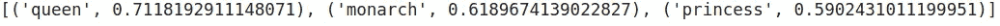

# 2020 年的单词嵌入。查看代码示例

> 原文：<https://towardsdatascience.com/word-embeddings-in-2020-review-with-code-examples-11eb39a1ee6d?source=collection_archive---------9----------------------->

## 当前单词嵌入方法概述:从 Word2vec 到 Transformers


图片由 Rostyslav Neskorozhenyi 使用 [WordCloud](https://github.com/amueller/word_cloud) 模块创建

在本文中，我们将研究单词嵌入——适合机器学习算法处理的单词的数字表示。

最初，我写这篇文章是为了对 2020 年单词嵌入的当前方法进行概述和汇编，我们的[人工智能实验室](http://ai-labs.org/)团队可以不时地使用它作为快速复习。我希望我的文章对更广泛的数据科学家和开发人员有用。文章中的每个单词嵌入方法都有(非常)简短的描述、供进一步研究的链接和 Python 代码示例。所有代码被打包成[谷歌 Colab 笔记本](https://colab.research.google.com/drive/1N7HELWImK9xCYheyozVP3C_McbiRo1nb)。让我们开始吧。

根据维基百科，**单词嵌入**是自然语言处理(NLP)中一组语言建模和特征学习技术的统称，其中来自词汇表的单词或短语被映射到实数的向量。

# 一键或计数向量化

将单词转换成向量的最基本方法是统计每个单词在每个文档中的出现次数。这种方法被称为计数矢量化或一键编码。

这种方法的主要原理是收集一组文档(可以是单词、句子、段落甚至文章)，统计每个文档中每个单词的出现次数。严格来说，得到的矩阵的列是单词，行是文档。

```
from sklearn.feature_extraction.text import CountVectorizer
# create CountVectorizer object
vectorizer = CountVectorizer()
corpus = [
          'Text of the very first new sentence with the first words in sentence.',
          'Text of the second sentence.',
          'Number three with lot of words words words.',
          'Short text, less words.',
]# learn the vocabulary and store CountVectorizer sparse matrix in term_frequencies
term_frequencies = vectorizer.fit_transform(corpus) 
vocab = vectorizer.get_feature_names()# convert sparse matrix to numpy array
term_frequencies = term_frequencies.toarray()# visualize term frequencies 
import seaborn as sns
sns.heatmap(term_frequencies, annot=True, cbar = False, xticklabels = vocab);
```


图像由 Rostyslav Neskorozhenyi 使用 [seaborn](https://seaborn.pydata.org/) 模块创建

countvectorizing 中的另一种方法是，如果在文档中找到该单词，则只放置 1(不管出现的频率如何)，如果在文档中没有找到该单词，则放置 0。在这种情况下，我们得到真正的“一键”编码。

```
one_hot_vectorizer = CountVectorizer(binary=True)
one_hot = one_hot_vectorizer.fit_transform(corpus).toarray()sns.heatmap(one_hot, annot=True, cbar = False, xticklabels = vocab)
```


图像由 Rostyslav Neskorozhenyi 使用 [seaborn](https://seaborn.pydata.org/) 模块创建

# TF-IDF 编码

对于大语料库的文档，一些词如‘a’、‘the’、‘is’等。非常频繁地出现，但是它们没有携带很多信息。使用一键编码方法，我们可以确定这些单词很重要，因为它们出现在许多文档中。解决这个问题的方法之一是停用词过滤，但是这种解决方案是离散的并且不灵活。

TF-IDF(词频—逆文档频)可以较好的处理这个问题。TF-IDF 降低了常用词的权重，提高了只出现在当前文档中的罕见词的权重。TF-IDF 公式如下所示:


其中 TF 是通过将单词在文档中出现的次数除以文档中的单词总数来计算的


IDF(逆文档频率)，解释为文档的逆数量，其中出现了我们感兴趣的术语。n-文档数量，n(t)-具有当前单词或术语 t 的文档数量


```
from sklearn.feature_extraction.text import TfidfVectorizer
import seaborn as snscorpus = [
          'Time flies like an arrow.',
          'Fruit flies like a banana.'
]vocab = ['an', 'arrow', 'banana', 'flies', 'fruit', 'like', 'time']tfidf_vectorizer = TfidfVectorizer()
tfidf = tfidf_vectorizer.fit_transform(corpus).toarray()sns.heatmap(tfidf, annot=True, cbar = False, xticklabels = vocab)
```


图像由 Rostyslav Neskorozhenyi 使用 [seaborn](https://seaborn.pydata.org/) 模块创建

# Word2Vec 和手套

最常用的单词嵌入模型是 [word2vec](https://github.com/dav/word2vec/) 和 [GloVe](https://nlp.stanford.edu/projects/glove/) ，它们都是基于分布假设的无监督方法(出现在相同上下文中的单词往往具有相似的含义)。

Word2Vec 单词嵌入是单词的向量表示，当输入大量文本(例如维基百科、科学、新闻、文章等)时，通常由无监督模型学习。).单词的这些表示在其他属性中捕捉单词之间的语义相似性。Word2Vec 单词嵌入是以这样的方式学习的，意思相近的单词(例如“king”和“queen”)的向量之间的[距离](https://en.wikipedia.org/wiki/Euclidean_distance)比意思完全不同的单词(例如“king”和“carpet”)的距离更近。


图片来自[developers.google.com](https://developers.google.com/machine-learning/crash-course/embeddings/translating-to-a-lower-dimensional-space)

Word2Vec 矢量甚至允许对矢量进行一些数学运算。例如，在这个操作中，我们对每个单词使用 word2vec 向量:

**国王——男人+女人=王后**

```
# Download Google Word2Vec embeddings [https://code.google.com/archive/p/word2vec/](https://code.google.com/archive/p/word2vec/)!wget [https://s3.amazonaws.com/dl4j-distribution/GoogleNews-vectors-negative300.bin.gz](https://s3.amazonaws.com/dl4j-distribution/GoogleNews-vectors-negative300.bin.gz)
!gunzip GoogleNews-vectors-negative300.bin# Try Word2Vec with Gensimimport gensim# Load pretrained vectors from Google
model = gensim.models.KeyedVectors.load_word2vec_format('GoogleNews-vectors-negative300.bin', binary=True)king = model['king']# king - man + woman = queen
print(model.most_similar(positive=['woman', 'king'], negative=['man']))
```



检查单词“女人”和“男人”的向量有多相似。

```
print(model.similarity('woman', 'man'))
```


检查单词“king”和“woman”的向量有多相似。

```
print(model.similarity('king', 'woman'))
```


另一种单词嵌入方法是**手套**(“全局向量”)。它基于单词上下文矩阵的矩阵分解技术。它首先构建一个(单词 x 上下文)共现信息的大矩阵，即对于每个“单词”(行)，计算我们在大型语料库的某些“上下文”(列)中看到该单词的频率。然后，这个矩阵被分解成一个低维(单词 x 特征)矩阵，其中每一行现在存储每个单词的向量表示。一般来说，这是通过最小化“重建损失”来实现的。这种损失试图找到可以解释高维数据中大部分差异的低维表示。

```
# Try Glove word embeddings with Spacy!python3 -m spacy download en_core_web_lgimport spacy
# Load the spacy model that you have installed
import en_core_web_lg
nlp = en_core_web_lg.load()
# process a sentence using the model
doc = nlp("man king stands on the carpet and sees woman queen")
```

查找国王和王后之间的相似性(值越高越好)。

```
doc[1].similarity(doc[9])
```


找出国王和地毯的相似之处。

```
doc[1].similarity(doc[5])
```


检查是否国王-男人+女人=王后。我们将把“男人”和“女人”的向量乘以 2，因为减去“男人”的向量并加上“女人”的向量对“国王”的原始向量没有什么影响，可能是因为那些“男人”和“女人”本身是相关的。

```
v =  doc[1].vector - (doc[0].vector*2) + (doc[8].vector*2)from scipy.spatial import distance
import numpy as np# Format the vocabulary for use in the distance function
vectors = [token.vector for token in doc]
vectors = np.array(vectors)# Find the closest word below 
closest_index = distance.cdist(np.expand_dims(v, axis = 0), vectors, metric = 'cosine').argmin()
output_word = doc[closest_index].text
print(output_word)
```


# 快速文本

[FastText](https://github.com/facebookresearch/fastText) 是 word2vec 的扩展。FastText 是由 2013 年创建 word2vec 框架的 Tomas Mikolov 团队开发的。

FastText 相对于原始 word2vec 向量的主要改进是包含了字符 [n-grams](https://en.wikipedia.org/wiki/N-gram) ，这允许计算没有出现在训练数据中的单词的单词表示(“词汇外”单词)。

```
!pip install Cython --install-option="--no-cython-compile"
!pip install fasttext# download pre-trained language word vectors from one of 157 languges  [https://fasttext.cc/docs/en/crawl-vectors.html](https://fasttext.cc/docs/en/crawl-vectors.html)
# it will take some time, about 5 minutes
import fasttext
import fasttext.util
fasttext.util.download_model('en', if_exists='ignore')  # English
ft = fasttext.load_model('cc.en.300.bin')
```

为单词“king”创建嵌入。

```
ft.get_word_vector('king')
```

获取与单词“king”最相似的单词。

```
ft.get_nearest_neighbors('king')
```


测试模型为未知单词创建向量的能力。

```
'king-warrior' in ft.words
```


获取与未知单词“王者战士”最相似的单词。

```
ft.get_nearest_neighbors('king-warrior')
```


# ELMo(语言模型嵌入)

与 word2vec 和 GLoVe 等传统单词嵌入不同，分配给令牌或单词的 ELMo 向量取决于当前上下文，实际上是包含该单词的整个句子的函数。所以同一个词在不同的语境下可以有不同的词向量。此外，ELMo 表示完全基于字符，因此它们不局限于任何预定义的词汇。

来自官方网站的描述:

[**ELMo**](https://allennlp.org/elmo) 是一种深度语境化的单词表示，它模拟(1)单词使用的复杂特征(例如，句法和语义)，以及(2)这些使用如何在语言语境中变化(即，模拟多义性)。这些单词向量是深度双向语言模型(biLM)的内部状态的学习函数，该模型是在大型文本语料库上预先训练的。它们可以很容易地添加到现有的模型中，并在广泛的具有挑战性的自然语言处理问题中显著提高技术水平，包括问题回答、文本蕴涵和情感分析。

```
# use tensorflow 1.x for ELMo, because trere are still no ELMo for tensorflow 2.0%tensorflow_version 1.ximport tensorflow_hub as hub
import tensorflow as tf# Download pretrained ELMo model from Tensorflow Hub [https://tfhub.dev/google/elmo/3](https://tfhub.dev/google/elmo/3)elmo = hub.Module("[https://tfhub.dev/google/elmo/3](https://tfhub.dev/google/elmo/3)", trainable=True)sentences =  \
['king arthur, also called arthur or aathur pendragon, legendary british king who appears in a cycle of \
medieval romances (known as the matter of britain) as the sovereign of a knightly fellowship of the round table.', 
'it is not certain how these legends originated or whether the figure of arthur was based on a historical person.', 
'the legend possibly originated either in wales or in those parts of northern britain inhabited by brythonic-speaking celts.', 
'for a fuller treatment of the stories about king arthur, see also arthurian legend.']
```

为了将句子发送到模型，我们需要将它们分成单词数组和填充数组，长度相同。此外，我们还将创建“mask”数组，该数组将显示元素是真实单词还是填充符号(在我们的示例中为“_”)。稍后我们将使用“mask”数组来显示真实的单词。

```
words = []
mask = []
masked_words = []for sent in sentences:
  splitted = sent.split()
  for i in range(36):
    try:
      words.append(splitted[i])
    except:
      words.append('_')for word in words:
  if word == "_":
    mask.append(False)
  else:
    mask.append(True)
    masked_words.append(word)
```

使用 ELMo 创建嵌入:

```
embeddings = elmo(
    sentences,
    signature="default",
    as_dict=True)["elmo"]
```

将 Tensorflow 张量转换为 numpy 数组。

```
%%time
with tf.Session() as sess:
  sess.run(tf.global_variables_initializer())
  sess.run(tf.tables_initializer())
  x = sess.run(embeddings)embs = x.reshape(-1, 1024)masked_embs = embs[mask]
```

使用 [PCA](https://en.wikipedia.org/wiki/Principal_component_analysis) 可视化嵌入。

```
from sklearn.decomposition import PCApca = PCA(n_components=10)
y = pca.fit_transform(masked_embs)from sklearn.manifold import TSNEy = TSNE(n_components=2).fit_transform(y)import plotly as py
import plotly.graph_objs as godata = [
    go.Scatter(
        x=[i[0] for i in y],
        y=[i[1] for i in y],
        mode='markers',
        text=[i for i in masked_words],
    marker=dict(
        size=16,
        color = [len(i) for i in masked_words], #set color equal to a variable
        opacity= 0.8,
        colorscale='Viridis',
        showscale=False
    )
    )
]
layout = go.Layout()
layout = dict(
              yaxis = dict(zeroline = False),
              xaxis = dict(zeroline = False)
             )
fig = go.Figure(data=data, layout=layout)
fig.show()
```


图像由 Rostyslav Neskorozhenyi 使用 [plotly](https://plotly.com/) 模块创建

# 变形金刚(电影名)

终于到了当前最先进的方法——变压器的时候了。著名的 [GPT-2](https://openai.com/blog/better-language-models/) 、[伯特](https://github.com/google-research/bert)、 [CTRL](https://blog.einstein.ai/introducing-a-conditional-transformer-language-model-for-controllable-generation/) 都是基于变形金刚的，并且像 ELMo 一样产生上下文敏感的嵌入。但是与 ELMo 变形金刚不使用 [RNN](https://en.wikipedia.org/wiki/Recurrent_neural_network) 不同，它们不需要一个接一个地处理句子中的单词。句子中的所有单词被并行处理，这种方法加快了处理速度并解决了[消失梯度问题](https://en.wikipedia.org/wiki/Vanishing_gradient_problem)。

变形金刚使用[注意力机制](https://arxiv.org/abs/1706.03762)来描述每个特定单词与句子中所有其他单词的联系和依赖性。杰伊·阿拉姆马在一篇插图精美的[文章](http://jalammar.github.io/illustrated-transformer/)中详细描述了这种机制和变压器的主要原理。


图片来自[http://jalammar . github . io](http://jalammar.github.io/illustrated-transformer/)

对于我们的例子，我们将使用 brilliant [Transformers](https://huggingface.co/transformers/) 库，其中包含最新的基于 Transformers 的模型(如 [BERT](https://huggingface.co/transformers/model_doc/bert.html) 、 [XLNet](https://huggingface.co/transformers/model_doc/xlnet.html) 、 [DialoGPT](https://huggingface.co/transformers/model_doc/dialogpt.html) 或 [GPT-2](https://huggingface.co/transformers/model_doc/gpt2.html) )。

让我们和伯特做一些嵌入。首先，我们需要安装变形金刚库。

```
!pip install transformers
```

现在，我们导入 pytorch，这是一个预训练的 BERT 模型，以及一个 BERT 标记器，它将完成将句子转换成适合 BERT 的格式的所有必要工作(标记自身并添加特殊标记，如[SEP]和[CLS])。

```
import torch
torch.manual_seed(0)
from transformers import BertTokenizer, BertModelimport logging
import matplotlib.pyplot as plt
% matplotlib inline# Load pre-trained model tokenizer (vocabulary)
tokenizer = BertTokenizer.from_pretrained('bert-base-uncased', do_lower_case=True)
```

输入一些句子，将其标记出来。

```
sentences =  \
['king arthur, also called arthur or aathur pendragon, legendary british king who appears in a cycle of \
medieval romances (known as the matter of britain) as the sovereign of a knightly fellowship of the round table.', 
'it is not certain how these legends originated or whether the figure of arthur was based on a historical person.', 
'the legend possibly originated either in wales or in those parts of northern britain inhabited by brythonic-speaking celts.', 
'for a fuller treatment of the stories about king arthur, see also arthurian legend.']# Print the original sentence.
print(' Original: ', sentences[0][:99])# Print the sentence splitted into tokens.
print('Tokenized: ', tokenizer.tokenize(sentences[0])[:15])# Print the sentence mapped to token ids.
print('Token IDs: ', tokenizer.convert_tokens_to_ids(tokenizer.tokenize(sentences[0]))[:15])
```


注意，有些记号可能是这样的:['aa '，' ##th '，' ##ur '，' pen '，' ##dra '，' ##gon']。这是因为 BERT tokenizer 是用一个 WordPiece 模型创建的。这个模型贪婪地创建一个由单个字符、子词和单词组成的固定大小的词汇表，它最适合我们的语言数据。BERT tokenizer 使用的词汇包含所有英语字符，以及在模型接受训练的英语语料库中找到的大约 30，000 个最常见的单词和子单词。因此，如果这个单词没有在词汇表中提到，这个单词就被分成子单词和字符。一些子词前的两个散列符号(##)表示该子词是一个更大的词的一部分，前面还有另一个子词。

我们将使用 tokenizer.encode_plus 函数，它将:

*   把句子分成几个标记。
*   添加特殊的[CLS]和[SEP]标记。
*   将令牌映射到它们的 id。
*   将所有句子填充或截短至相同长度。

```
# Tokenize all of the sentences and map tokens to word IDs.
input_ids = []
attention_masks = []
tokenized_texts = []for sent in sentences:
    encoded_dict = tokenizer.encode_plus(
                        sent,                      
                        add_special_tokens = True,
                        truncation=True,
                        max_length = 48,          
                        pad_to_max_length = True,                        
                        return_tensors = 'pt',    
                   ) # Save tokens from sentence as a separate array. 
    marked_text = "[CLS] " + sent + " [SEP]"
    tokenized_texts.append(tokenizer.tokenize(marked_text))

    # Add the encoded sentence to the list.    
    input_ids.append(encoded_dict['input_ids'])# Convert the list into tensor.
input_ids = torch.cat(input_ids, dim=0)
```

**段号**。BERT 接受训练并期望句子对使用 1 和 0 来区分两个句子。我们将对每个句子分别进行编码，因此我们将只对每个句子中的每个标记进行 1 标记。

```
segments_ids = torch.ones_like(input_ids)
```

现在，我们可以调用 BERT 模型，并最终获得模型隐藏状态，从中我们将创建单词嵌入。

```
with torch.no_grad(): outputs = model(input_ids, segments_ids)
    hidden_states = outputs[2]
```

让我们检查一下我们得到了什么。

```
print ("Number of layers:", len(hidden_states), "  (initial embeddings + 12 BERT layers)")
print ("Number of batches:", len(hidden_states[0]))
print ("Number of tokens:", len(hidden_states[0][0]))
print ("Number of hidden units:", len(hidden_states[0][0][0]))
```


```
# Concatenate the tensors for all layers. 
token_embeddings = torch.stack(hidden_states, dim=0)# Swap dimensions, so we get tensors in format: [sentence, tokens, hidden layes, features]
token_embeddings = token_embeddings.permute(1,2,0,3)
```

我们将使用最后四个隐藏层来创建每个单词嵌入。

```
processed_embeddings = token_embeddings[:, :, 9:, :]
```

为每个令牌连接四层以创建嵌入

```
embeddings = torch.reshape(processed_embeddings, (4, 48, -1))
```

让我们检查第一句话的嵌入。首先，我们需要获得需要比较的令牌的 id。

```
for i, token_str in enumerate(tokenized_texts[0]):
  print (i, token_str)
```


我们可以看到单词“king”位于索引 1 和 17 处。我们将检查嵌入 1 和 17 之间的距离。此外，我们将检查单词“arthur”的嵌入是否比单词“table”更接近“king”。

```
from scipy.spatial.distance import cosine

kings = cosine(embeddings[0][1], embeddings[0][17])
king_table = cosine(embeddings[0][1], embeddings[0][46])
king_archtur = cosine(embeddings[0][2], embeddings[0][1])

print('Distance for two kings:  %.2f' % kings)
print('Distance from king to table:  %.2f' % king_table)
print('Distance from Archtur to king:  %.2f' % king_archtur)
```


因此，我们看到两个“国王”的嵌入非常相似，但不相同，阿奇图尔更接近于一个国王，而不是一张桌子。

用[**simple representations**](https://github.com/AliOsm/simplerepresentations)模块事情可能更简单。这个模块完成了我们之前做的所有工作——从 BERT 中提取所需的隐藏状态，并在几行代码中创建嵌入。

```
!pip install simplerepresentationsimport torch
from simplerepresentations import RepresentationModel
torch.manual_seed(0)model_type = 'bert'
model_name = 'bert-base-uncased'representation_model = RepresentationModel(
  model_type=model_type,
  model_name=model_name,
  batch_size=4,
  max_seq_length=48, 
  combination_method='cat', 
  last_hidden_to_use=4 
 )text_a = sentencesall_sentences_representations, all_tokens_representations = representation_model(text_a=text_a)
```

检查拱门、国王和桌子之间的距离。

```
from scipy.spatial.distance import cosinekings = cosine(all_tokens_representations[0][1], all_tokens_representations[0][17])
king_table = cosine(all_tokens_representations[0][1], all_tokens_representations[0][46])
king_archtur = cosine(all_tokens_representations[0][2], all_tokens_representations[0][1])print('Distance for two kings:  %.2f' % kings)
print('Distance from king to table:  %.2f' % king_table)
print('Distance from Archtur to king:  %.2f' % king_archtur)
```


同样的结果，更少的代码。

# 结论

我希望在阅读完这篇文章之后，您已经对当前的单词嵌入方法有了一个概念，并开始理解如何在 Python 中快速实现这些方法。NLP 的世界是多样化的，并且有更多的嵌入模型和方法。在我的文章中，我把重点放在最常见的和我们自己在工作中经常使用的。您可以在**参考文献**部分找到更多信息。

# 参考

*   [伯特单词嵌入教程](https://mccormickml.com/2019/05/14/BERT-word-embeddings-tutorial/)
*   [图示变压器](http://jalammar.github.io/illustrated-transformer/)
*   [图解 GPT-2(可视化变压器语言模型)](http://jalammar.github.io/illustrated-gpt2/)
*   [从预训练的单词嵌入到预训练的语言模型——关注 BERT](/from-pre-trained-word-embeddings-to-pre-trained-language-models-focus-on-bert-343815627598)
*   [用变形金刚和 DialoGPT 微调制作你自己的 Rick Sanchez(机器人)](/make-your-own-rick-sanchez-bot-with-transformers-and-dialogpt-fine-tuning-f85e6d1f4e30)
*   [玩弄文字向量](https://medium.com/swlh/playing-with-word-vectors-308ab2faa519)
*   [理解手套嵌入的直观指南](/light-on-math-ml-intuitive-guide-to-understanding-glove-embeddings-b13b4f19c010)
*   [用 Spacy 和 Gensim 在 Python 中嵌入单词](https://www.shanelynn.ie/word-embeddings-in-python-with-spacy-and-gensim/)
*   [单词嵌入族简评(2019)](https://medium.com/analytics-vidhya/brief-review-of-word-embedding-families-2019-b2bbc601bbfe)
*   [单词嵌入:探索、解释和利用(用 Python 编写代码)](/word-embeddings-exploration-explanation-and-exploitation-with-code-in-python-5dac99d5d795)