# 词嵌入 vs TF-IDF:回答新冠肺炎问题

> 原文：<https://towardsdatascience.com/word-embeddings-vs-tf-idf-answering-covid-19-questions-703e3d99f783?source=collection_archive---------24----------------------->

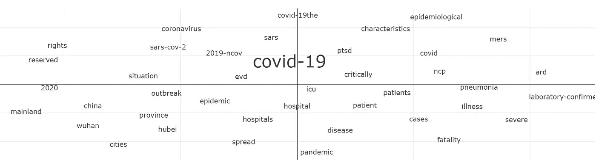

## 回答新冠肺炎问题的文本相似度方法比较。

**数据集:** CORD-19

我们感兴趣的问题:

*   潜在风险因素的数据
*   吸烟、已有肺部疾病
*   合并感染(确定同时存在的呼吸道/病毒感染是否使病毒更易传播或更具毒性)和其他共病
*   新生儿和孕妇
*   社会经济和行为因素，以了解病毒的经济影响和是否有差异。
*   病毒的传播动力学，包括基本繁殖数、潜伏期、序列间隔、传播方式和环境因素
*   疾病的严重程度，包括有症状住院患者和高危患者群体的死亡风险
*   人群易感性
*   可有效控制的公共健康缓解措施

# 预赛

这篇文章假设读者对 NLP 有一个基本的了解，比如单词袋，以及文本是如何用数字表示的。

# 方法 1: TF-IDF 和余弦相似度

TF-IDF 代表词频——逆文档频率，是信息检索任务中常用的方法[1]。我们将使用它来查找与我们的搜索问题相似的句子。

为此，我们需要将每个句子表示为一个向量。TF-IDF 通过根据术语在文档中的流行程度对其进行加权来创建这些向量。如果一个术语出现在语料库中的几乎所有文档中(这意味着该术语是无用的，可以忽略)，公式的 IDF 部分确保它在句子向量中获得非常低的权重。如果一个术语在识别一个句子中很重要(这意味着它不会出现在许多其他句子中)，它将获得很高的权重。

如果我们使用 TF-IDF 对以下三个句子的语料库进行矢量化，请尝试猜测哪些术语将获得高权重，哪些术语将获得较低权重。

句子 1:平均潜伏期

句子 2:平均风险期

第三句:传播的风险

因为单词*出现在所有句子中，所以它相当不重要，并且将获得低权重，而术语*孵化*和*传输*将获得非常高的权重，因为它们分别在识别句子 1 和 2 中很重要。*

*理想情况下，您应该使用二元模型来捕获像“孵化期”这样的术语，但是为了简单起见，让我们坚持使用单元模型。*

*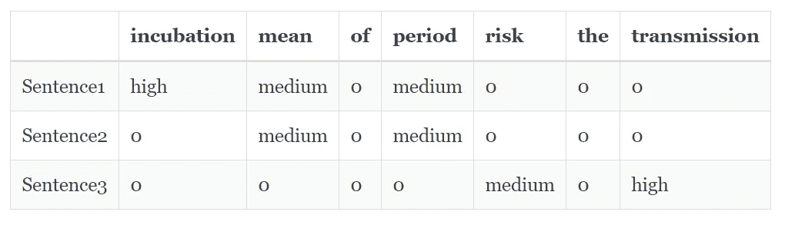*

*Unigrams 的 TF-IDF 矩阵*

*我在这里没有计算任何东西，所以我写了高，中，低，而不是实际的数字。如果你对 TF-IDF 不是太熟悉，我建议你手工计算矩阵，但如果你是，请继续阅读。*

*现在，我们想找到关于“潜伏期”的句子如果我们使用已经构建的 TF-IDF 矩阵对这个搜索查询进行矢量化，我们将得到这个搜索查询的向量:*

*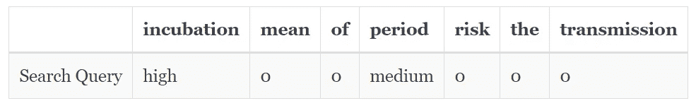*

*请注意，这个向量与句子 1 中的向量非常相似。如果我们计算搜索查询向量与句子向量的接近度，我们会发现它最接近句子 1。我们将使用余弦相似度来计算这种接近度，因为它比正常的欧几里德距离更适合文本数据。*

*你可能已经意识到我们的 TF-DF 方法存在一个主要缺点。同一概念在不同的论文中可能有不同的措辞。例子:术语*婴儿*和*青少年*意思相同，但是如果我们搜索“婴儿的风险因素”，我们会错过将婴儿称为青少年的句子。这就是单词嵌入的用武之地…*

# *方法 2:单词嵌入和单词移动距离*

*TF-IDF 向量不考虑语言中的语义相似性。*青少年*的体重与*婴儿*的体重无关。单词嵌入试图通过依赖一个基本思想来捕捉这些关系:出现在相同上下文中的单词具有相似的含义。我们将使用一个名为 word2vec 的单词嵌入框架，它学习语料库中单词的向量表示[2]。这里有一个例子:*

*在冠状病毒爆发后，默克尔在德国实施了封锁。*

*第二句:新冠肺炎疫情爆发后，德国总理实施了封锁。*

*我们注意到默克尔和总理这两个词可以互换使用；冠状病毒和新冠肺炎也是如此。因此，这两个词应该有某种关系。*

> *单词嵌入不是每个句子都有向量，而是通过为每个单词创建**向量来捕获这些语义关系。在向量空间中，冠状病毒等词的向量与新冠肺炎等类似词的向量非常接近，而与咖啡或纸张等不相关的词则相距较远。***

*在没有标签或手工工作的情况下构建这样一个表示似乎是不可思议的，但是当你理解这个过程时就变得显而易见了。这些向量是使用浅层(1 个隐藏层)神经网络构建的，以预测目标词(如“默克尔”)，给定一些上下文词(如“强制封锁德国”)。这里有一个非常简单的例子，使用了我们之前的句子:*

*训练一个神经网络来预测给定上下文单词的单词。当它试图预测*封锁*给*默克尔的时候，*隐藏的单位会为*默克尔*获得一些权重。*

*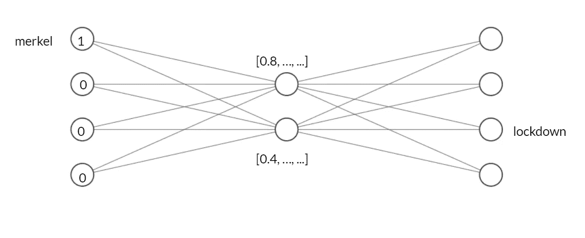*

*x =默克尔，y =封锁*

*类似地，当从*负责人*预测*锁定*时，隐藏单元将获得一些对应于*负责人*的权重，这将有助于预测*锁定*。*

*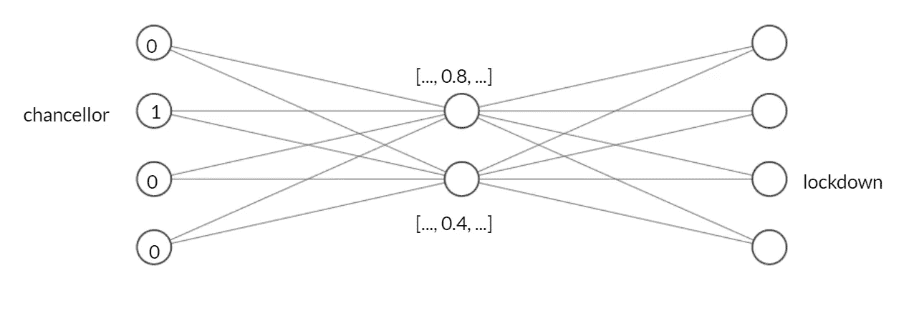*

*x =议长，y =封锁*

*仔细想想，s **因为激活锁定**的输出单元需要一定的权重组合，所以预测*锁定*的任何单词都应该得到类似的权重。*

*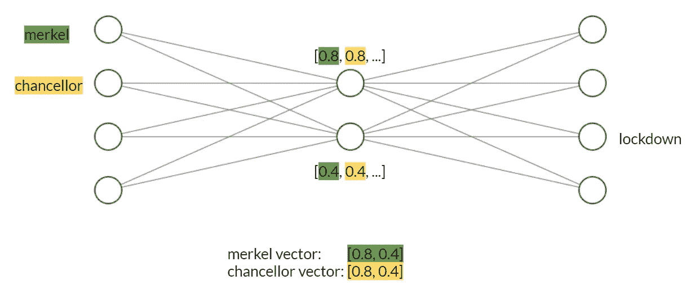*

*T4 冠状病毒和新冠肺炎*也是如此。在预测*爆发和*爆发时，这两个术语应该得到相似的权重，因为*爆发*出现在这两个术语的上下文中。**

> *训练好的网络的隐含层中的权重成为单词的向量，隐含层神经元的数量成为维数。*

*在上面的图像中，请注意隐藏层中有两个神经元，因此，单词向量是二维的。*

*这里有一个包含四个句子的可视化示例:*

*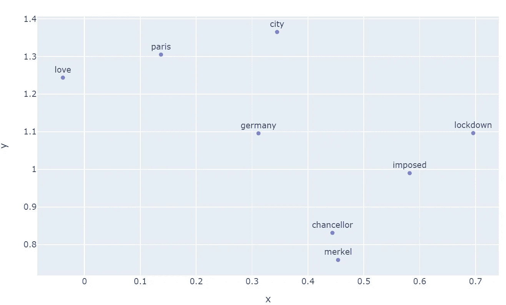*

*该模型能够学习语义关系，例如*默克尔*应该更接近*总理*而不是其他词，例如*巴黎*。*

*在这些例子中，我创建了二维嵌入。然而在现实情况下，通常有 100-300 维的向量。*

*正如您可能已经猜到的，这个过程需要大量的训练数据来学习准确的嵌入，所以在线上有预先训练的单词嵌入，您可以开箱即用。*

*在我们的 CORD-19 数据上训练 word2vec 之后，这里是 ***婴儿的嵌入和类似单词。*** 它们是 100 维的，但我使用了降维技术来将它们可视化。*

*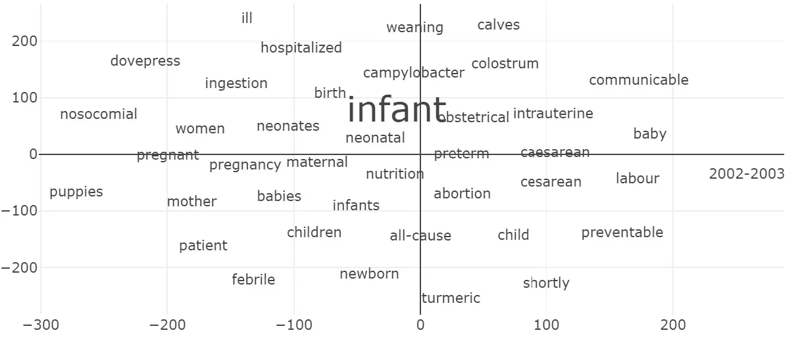*

*来自 CORD-19 数据的单词嵌入*

*那么现在我们有了每个单词的向量，我们如何衡量两个句子之间的相似性呢？*

***单词移动器的距离(WMD)** 通过定位两个句子在单词嵌入空间中的位置并将一个句子转换成另一个句子来完成这项任务[3]。为了计算句子 A 和 B 之间的相似度，它将 A 中的每个单词“驱动”到 B 中最近的单词，直到 A 被转换成 B，反之亦然。大规模杀伤性武器是平均“旅行的距离”的话。*

*第一句:“默克尔实施封锁”*

*第二句:“议长下令封锁”*

*第三句:“巴黎实施封锁”*

**默克尔，第一句中的*，行驶 0.0724“公里”到达第二句中的*总理*；*强制*和*锁定*行进 0 公里，因为它们已经出现在句子 2 中。因此，WMD 为(0.0727 + 0 + 0) = 0.0242*

*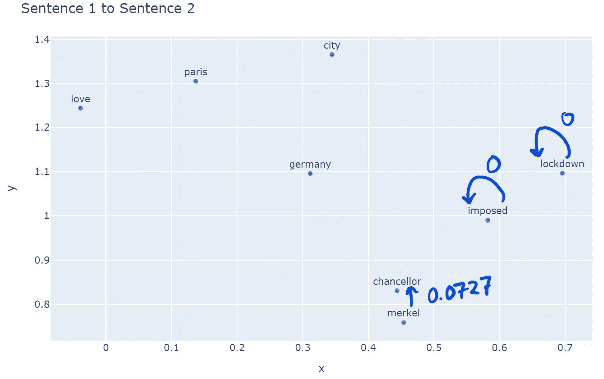*

*第 1 句和第 2 句之间的 WMD*

*这里，*默克尔*行驶 0.6312 公里到达*巴黎*，所以 WMD = (0.6312 + 0 + 0) / 3 = 0.2104*

*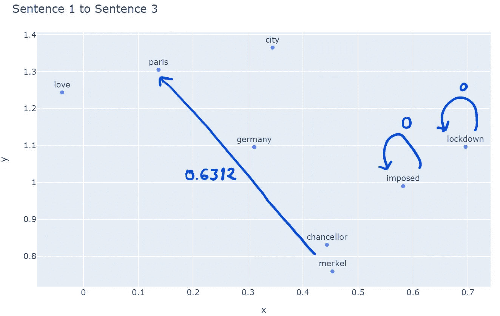*

*第 1 句和第 3 句之间的 WMD*

*所以在单词嵌入的帮助下，我们能够确定句子 1 和 2 比句子 1 和 3 更相似。如果没有单词嵌入，句子 1 将同样类似于句子 2 和 3。*

*现在我们已经了解了理解这些方法的必要基础，让我们尝试一下这些方法，看看我们是否能够检索到与我们的搜索查询有一些相似性的文本。*

*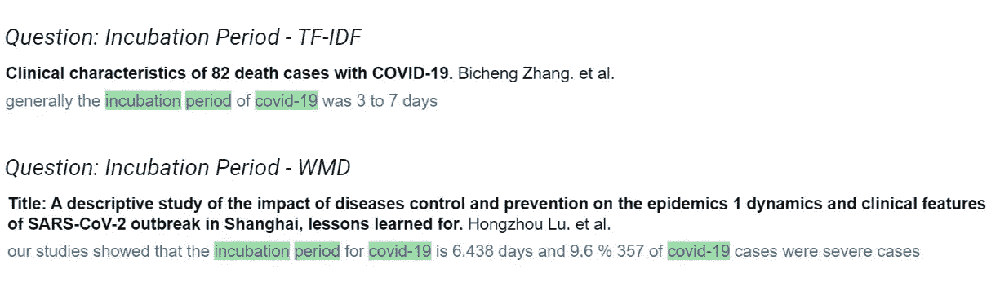**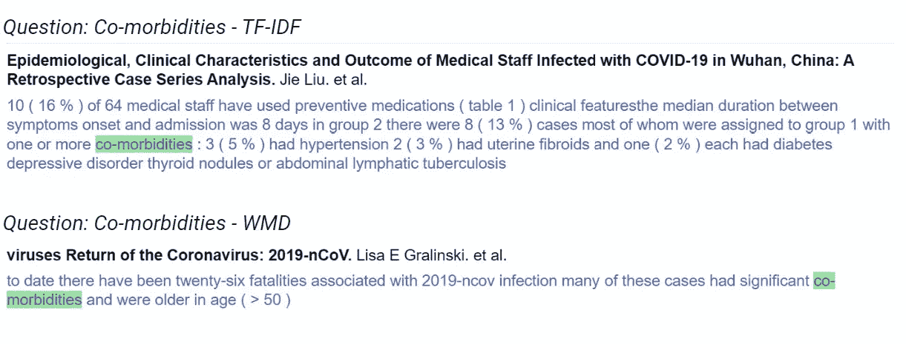**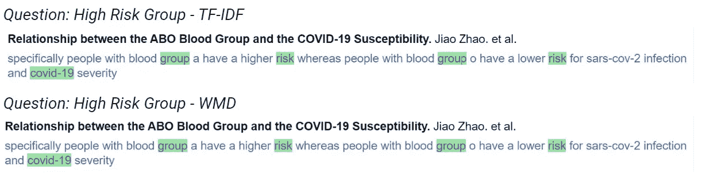**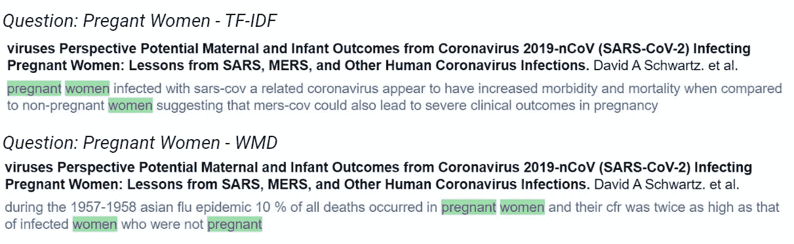**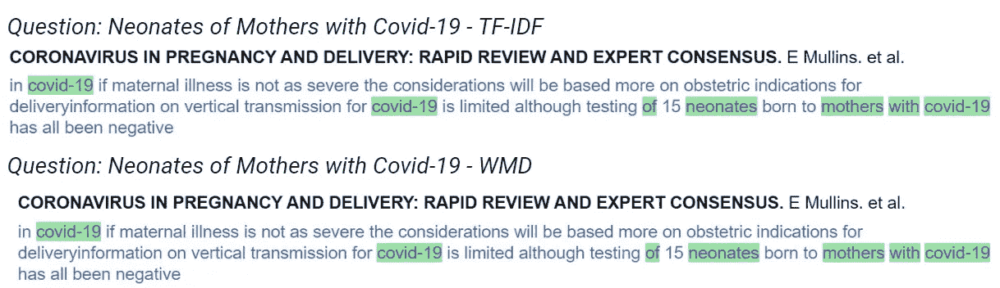*

*我们做到了！两种方法都获得了相当精确的答案。可以通过使用更多的训练数据或使用预训练的嵌入来改进单词嵌入方法。*

# *离别的思绪*

*我们讨论了计算两个文本之间相似性的两种方法，并使用它们来检索与新冠肺炎相关的问题的答案。尽管 WMD 由于其高时间复杂度而不适用于这种类型的任务，但它仍然是一种强有力的方法，并且在许多领域具有巨大的适用性。我可以看到它在检测剽窃方面非常有效。如果一个句子被复制粘贴，几个单词被同义词替换，word2vec 和 WMD 可以很容易地发现它，而 TF-IDF 就不行了。另一种替代 WMD 的方法是用平滑的逆频率对句子的单词向量进行平均，并计算余弦相似度。然而，我们经常不能理解像 TF-IDF 这样的简单方法的力量，正如我们在这里看到的，它们不应该被忽视。*

****编者按:*** [*走向数据科学*](http://towardsdatascience.com/) *是一份以数据科学和机器学习研究为主的中型刊物。我们不是健康专家或流行病学家，本文的观点不应被解释为专业建议。想了解更多关于疫情冠状病毒的信息，可以点击* [*这里*](https://www.who.int/emergencies/diseases/novel-coronavirus-2019/situation-reports) *。**

*这个项目的代码可在笔记本这里[https://github.com/tchanda90/covid19-textmining](https://github.com/tchanda90/covid19-textmining)*

*你可以在这里使用搜索工具[https://tchanda90.github.io/covid19-textmining/](https://tchanda90.github.io/covid19-textmining/)*

*[1]拉莫斯，J. (2003 年，12 月)。使用 tf-idf 确定文档查询中的单词相关性。在*第一届机器学习教学会议论文集*(第 242 卷，第 133-142 页)。*

*[2]t .米科洛夫，陈，k .，科拉多，g .，&迪安，J. (2013 年)。向量空间中单词表示的有效估计。 *arXiv 预印本 arXiv:1301.3781* 。*

*[3]m .库斯纳、孙、n .科尔金和 k .温伯格(2015 年 6 月)。从单词嵌入到文档距离。在*机器学习国际会议*(第 957–966 页)。*