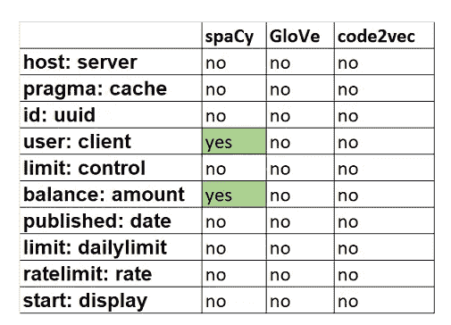

# code2vec、GloVe 和 spaCy 的单词嵌入。

> 原文：<https://towardsdatascience.com/word-embeddings-with-code2vec-glove-and-spacy-5b26420bf632?source=collection_archive---------21----------------------->

## 如何根据您的用例选择单词嵌入算法？


来源:[卢卡斯比耶里](https://pixabay.com/users/lukasbieri-4664461/)经由[皮克斯巴伊](https://pixabay.com/photos/laptop-macbook-home-office-switched-2838917/) (CC0)

改善你的机器学习模型的一个有效方法是使用[单词嵌入](https://en.wikipedia.org/wiki/Word_embedding)。使用单词嵌入，您可以捕获文档中单词的上下文，然后找到语义和句法的相似性。

在本帖中，我们将讨论单词嵌入技术的一个不寻常的应用。我们将努力为 OpenAPI 规范找到最好的单词嵌入技术。作为 OpenAPI 规范的一个例子，我们将使用来自 [apis-guru](https://apis.guru/) 的 OpenAPI 规范的免费资源😎。

最大的挑战是 OpenAPI 规范既不是自然语言，也不是代码。但这也意味着我们可以自由使用任何可用的嵌入模型。在这个实验中，我们将研究三个可能的候选者:code2vec、GloVe 和 spaCy。

[code2vec](https://urialon.cswp.cs.technion.ac.il/wp-content/uploads/sites/83/2018/12/code2vec-popl19.pdf) 是一个学习与源代码相关的类比的神经模型。该模型是在 Java 代码数据库上训练的，但是您可以将其应用于任何代码库。

然后是[手套](https://nlp.stanford.edu/projects/glove/)。GloVe 是自然语言处理(NLP)的一种常用算法。它在维基百科和 Gigawords 上接受了训练。

最后，我们有[空间](https://spacy.io/usage/vectors-similarity)。虽然 spaCy 是最近才开发的，但该算法已经以世界上最快的单词嵌入而闻名。

让我们看看这些算法中哪一个更适合 OpenAPI 数据集，哪一个更适合 OpenAPI 规范👀。我把这篇文章分成六个部分，每一部分都包含代码示例和一些将来使用的技巧，还有一个结论。

1.  下载数据集
2.  下载词汇
3.  提取字段名称
4.  令牌化密钥
5.  创建字段名称的数据集
6.  测试嵌入
7.  结论

现在，我们可以开始了。

# **1。下载数据集✅**

首先，我们需要下载整个[API-guru](https://apis.guru/)数据库。

您会注意到大多数 API-guru 规范都是 Swagger 2.0 格式的。但是……open API 规范的最新版本是 [OpenAPI 3.0](https://github.com/OAI/OpenAPI-Specification/blob/master/versions/3.0.3.md) 。所以让我们通过使用 Unmock 脚本将整个数据集转换成这种格式！您可以按照 [unmock-openapi-scripts 自述文件](https://github.com/meeshkan/unmock-openapi-scripts/blob/master/README.md)中的说明完成此操作。

这可能需要一段时间(你不会变成🧓，但我们说的是几个小时⏰)最终，您将获得一个具有各种规格的大型数据集🎓。

# **2。下载词汇✅**

**代码 2vec**

1.  从 [code2vec GitHub 页面](https://github.com/tech-srl/code2vec)下载模型。按照 README.md 的快速入门部分中的说明进行操作，然后导出训练好的令牌。
2.  使用 [gensim](https://pypi.org/project/gensim/) 库加载。

```
model = word2vec.load_word2vec_format(vectors_text_path, binary=False)model = word2vec.load_word2vec_format(vectors_text_path, binary=False)
```

**手套**

1.  从网站上下载一个[手套](https://nlp.stanford.edu/projects/glove/)词汇。我们选择了最大的一个，因为它找到我们所有单词的几率更高。您可以选择想要下载它的位置，但是为了方便起见，最好将它存储在工作目录中。
2.  手动加载手套词汇。

```
embeddings_dict = {}
with open("../glove/glove.6B.300d.txt", 'r', encoding="utf-8") as f:
    for line in f:
        values = line.split()
        word = values[0]
        vector = np.asarray(values[1:], "float32")
        embeddings_dict[word] = vector
```

**空间**

加载大空间词汇:

```
nlp = spacy.load(‘en_core_web_lg’).
```

# **3。提取字段名称✅**

OpenAPI 规范名称的完整列表可以从`scripts/fetch-list.sh`文件中获得，或者通过使用以下函数(对于 Windows)获得:

```
def getListOfFiles(dirName):
    listOfFile = os.listdir(dirName)
    allFiles = list()
    for entry in listOfFile:
        fullPath = posixpath.join(dirName, entry)
        if posixpath.isdir(fullPath):
            allFiles = allFiles + getListOfFiles(fullPath)
        else:
            allFiles.append(fullPath)

    return allFiles
```

另一件大事是从我们的 OpenAPI 规范中获取字段名。为此，我们将使用 [openapi 类型库](https://pypi.org/project/openapi-typed-2/)。让我们定义一个`get_fields`函数，它采用 OpenAPI 规范并返回一个字段名列表:

```
def get_fields_from_schema(o: Schema) -> Sequence[str]:
    return [
        *(o['properties'].keys() if ('properties' in o) and (type(o['properties']) == type({})) else []),
        *(sum([
            get_fields_from_schema(schema) for schema in o['properties'].values() if not ('$ref' in schema) and type(schema) == type({})], []) if ('properties' in o) and ($        *(get_fields_from_schema(o['additionalProperties']) if ('additionalProperties' in o) and (type(o['additionalProperties']) == type({})) else []),
        *(get_fields_from_schema(o['items']) if ('items' in o) and  (type(o['items'] == type({}))) else []),
    ]

def get_fields_from_schemas(o: Mapping[str, Union[Schema, Reference]]) -> Sequence[str]:
    return sum([get_fields_from_schema(cast(Schema, maybe_schema)) for maybe_schema in o.values() if not ('$ref' in maybe_schema) and (type(maybe_schema) == type({}))], [])

def get_fields_from_components(o: Components) -> Sequence[str]:
    return [
        *(get_fields_from_schemas(o['schemas']) if 'schemas' in o else []),
            ]                                                                                                                                                                       

def get_fields(o: OpenAPIObject) -> Sequence[str]:
    return [
        *(get_fields_from_components(o['components']) if 'components' in o else []),
    ]
```

恭喜你。现在我们的数据集准备好了。

# **4。令牌化密钥✅**

字段名可能包含标点符号，如`_`和`-`符号，或骆驼大小写单词。我们可以把这些单词分割成称为记号的小块。

下面的`camel-case`函数识别这些 camel case 单词。首先，它检查是否有任何标点符号。如果是，那就不是骆驼案。然后，它检查单词中是否有大写字母(不包括第一个和最后一个字符)。

```
def camel_case(example):      
    if  any(x in example for x  in string.punctuation)==True:
        return False
    else:
        if any(list(map(str.isupper, example[1:-1])))==True:
            return True
        else:
            return False
```

下一个函数`camel_case_split`将 camel case 单词拆分成多个片段。为此，我们应该识别大写字母，并标记出大小写变化的地方。该函数返回拆分后的单词列表。例如，字段名`BodyAsJson`转换成列表`[‘Body’, ‘As’,'Json']`。

```
def camel_case_split(word):
    idx = list(map(str.isupper, word))
    case_change = [0]
    for (i, (x, y)) in enumerate(zip(idx, idx[1:])):
        if x and not y:  
            case_change.append(i)
        elif not x and y:  
            case_change.append(i+1)
    case_change.append(len(word))
    return [word[x:y] for x, y in zip(case_change, case_change[1:]) if x < y]
```

这个`camel_case_split`函数然后被用在下面的记号化算法中。这里，我们首先检查单词中是否有标点符号。然后，我们把这个词分成几部分。有可能这些片段是骆驼大小写单词。如果是这种情况，我们可以把它分成更小的块。最后，在拆分每个元素后，整个列表被转换为小写。

```
def tokenizer(mylist):
    tokenized_list=[]
    for word in mylist:

        if '_'  in word:
            splitted_word=word.split('_')
            for elem in splitted_word:
                if camel_case(elem):
                    elem=camel_case_split(elem)
                    for el1 in elem:
                        tokenized_list.append(el1.lower())
                else:    
                    tokenized_list.append(elem.lower())
        elif '-' in word:
            hyp_word=word.split('-')
            for i in hyp_word:
                if camel_case(i):
                    i=camel_case_split(i)
                    for el2 in i:
                        tokenized_list.append(el2.lower())
                else: 
                    tokenized_list.append(i.lower())
        elif camel_case(word):
            word=camel_case_split(word)
            for el in word:
                tokenized_list.append(el.lower())
        else:
            tokenized_list.append(word.lower())
    return(tokenized_list)
tokenizer(my_word)
```

# **5。创建字段名为✅的数据集**

现在，让我们用所有规范中的字段名创建一个大数据集。

下面的`dict_dataset`函数获取文件名和路径列表，并打开每个规范文件。对于每个文件，`get_field`函数返回一个字段名列表。一些字段名称可能在一个规范中重复。为了消除这种重复，让我们使用`list(dict.fromkeys(col))`将字段名列表从列表转换到字典，然后再转换回来。然后我们可以标记列表。最后，我们创建一个字典，以文件名作为键，以字段名列表作为值。

```
def dict_dataset(datasets):
    dataset_dict={}
    for i in datasets:
        with open(i, 'r') as foo:
            col=algo.get_fields(yaml.safe_load(foo.read()))
            if col:
                mylist = list(dict.fromkeys(col))
                tokenized_list=tokenizer(mylist)
                dataset_dict.update({i: tokenized_list})
            else:
                continue
    return (dataset_dict)
```

# **6。测试嵌入✅**

**代码 2vec 和手套**

现在我们可以找出词汇表外的单词(not_identified_c2v)并统计这些单词占 code2vec 词汇表的百分比。以下代码也适用于 GloVe。

```
not_identified_c2v=[]
count_not_indent=[]
total_number=[]

for ds in test1:
    count=0
    for i in data[ds]:
        if not i in model:
            not_identified_c2v.append(i)
            count+=1
    count_not_indent.append(count)
    total_number.append(len(data[ds]))

total_code2vec=sum(count_not_indent)/sum(total_number)*100
```

**空间**

空间词汇是不同的，所以我们需要相应地修改我们的代码:

```
not_identified_sp=[]
count_not_indent=[]
total_number=[]

for ds in test1:
    count=0
    for i in data[ds]:
        f not i in nlp.vocab:
                count+=1
                not_identified_sp.append(i)
    count_not_indent.append(count)
    total_number.append(len(data[ds]))

total_spacy=sum(count_not_indent)/sum(total_number)*100
```

对于 code2vec、GloVe 和 spaCy，未识别单词的结果百分比分别为`3.39, 2.33, 2.09`。由于每个算法的百分比相对较小且相似，我们可以做另一个测试。

首先，让我们用所有 API 规范中应该相似的单词创建一个测试字典:

```
test_dictionary={'host': 'server',
'pragma': 'cache',
'id': 'uuid',
'user': 'client',
'limit': 'control',
'balance': 'amount',
'published': 'date',
'limit': 'dailylimit',
'ratelimit': 'rate',
'start': 'display',
'data': 'categories'}
```

对于 GloVe 和 code2vec，我们可以使用 gensim 库提供的`similar_by_vector`方法。spaCy 还没有实现这个方法——但是我们可以自己找到最相似的单词。

为此，我们需要格式化输入向量，以便在距离函数中使用。我们将在字典中创建每个键，并检查相应的值是否在 100 个最相似的单词中。首先，我们将格式化词汇表，以便在`distance.cdist`函数中使用。这个函数计算词汇表中每对向量之间的距离。然后，我们将从最小距离到最大距离对列表进行排序，取前 100 个单词。

```
from scipy.spatial import distance

for k, v in test_dictionary.items():
    input_word = k
    p = np.array([nlp.vocab[input_word].vector]) closest_index = distance.cdist(p, vectors)[0].argsort()[::-1][-100:]
    word_id = [ids[closest_ind] for closest_ind in closest_index]
    output_word = [nlp.vocab[i].text for i in word_id]
    #output_word
    list1=[j.lower() for j in output_word]
    mylist = list(dict.fromkeys(list1))[:50]
    count=0
    if test_dictionary[k] in mylist:
        count+=1
        print(k,count, 'yes')
    else:
        print(k, 'no')
```

结果总结在下表中。spaCy 显示单词“client”在前 100 个与单词“user”最相似的单词中。它对于几乎所有的 OpenAPI 规范都是有用的，并且可以用于 OpenAPI 规范相似性的未来分析。单词“balance”的向量接近单词“amount”的向量。我们发现它对支付 API 特别有用。



# **结论**

我们已经为 OpenAPI 规范尝试了三种不同的单词嵌入算法。尽管这三个词在这个数据集上都表现得很好，但是对最相似的词的额外比较表明 spaCy 更适合我们的情况。

spaCy 比其他算法更快。与 GloVe 或 code2vec 词汇表相比，spaCy 词汇表上传速度快五倍。然而，缺乏内置函数——比如`similar_by_vector`和`similar_word`——是使用这种算法的一个障碍。

此外，spaCy 适用于我们的数据集这一事实并不意味着 spaCy 对世界上的每个数据集都更好。因此，请随意为您自己的数据集尝试不同的单词嵌入，并在评论中让我们知道哪一种更适合您！

感谢阅读！