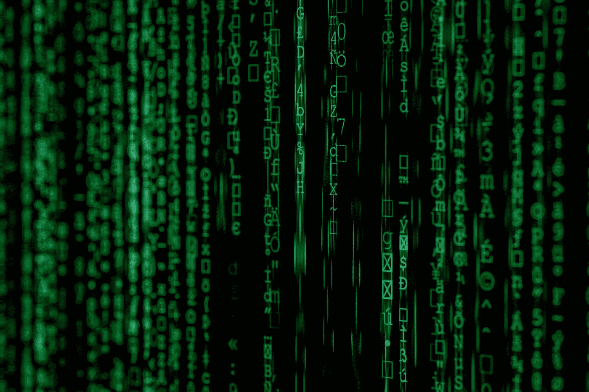
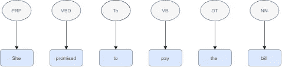
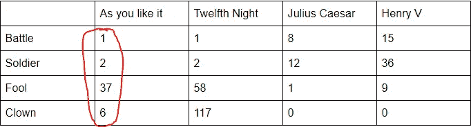
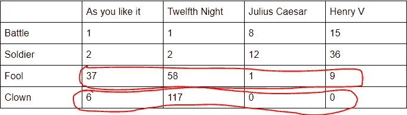
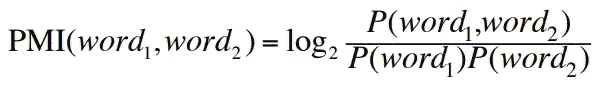
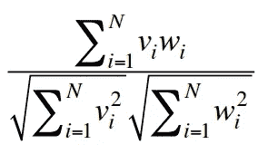
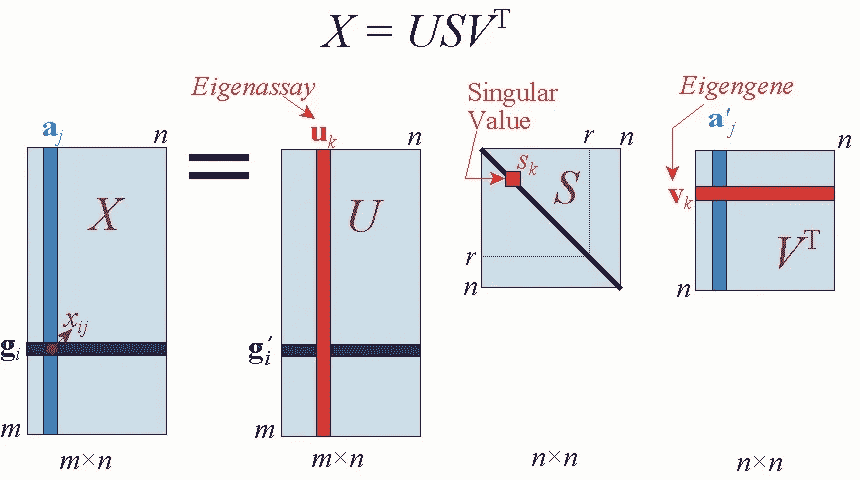
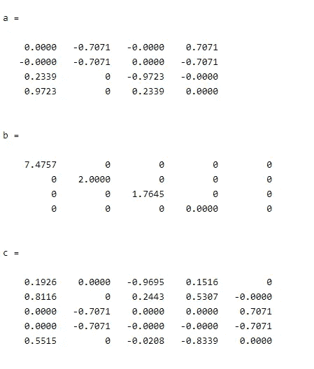
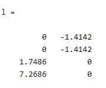
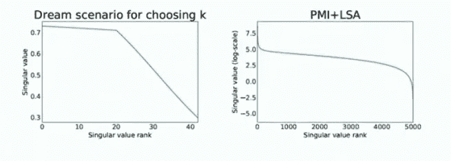

# 词向量和降维

> 原文：<https://towardsdatascience.com/word-vectors-and-decoding-autoencoder-for-dimensionality-reduction-407815ead4b7?source=collection_archive---------28----------------------->

## 将高维数据转换为低维数据并开始使用自动编码器

马库斯·斯皮斯克在 [Unsplash](https://unsplash.com/@markusspiske?utm_source=unsplash&utm_medium=referral&utm_content=creditCopyText) 上的照片

所以这是我的第一篇媒体文章，我写这篇文章是为了从我在自然语言处理领域的研究冒险中休息一下，主要是基于方面的情感分析(ABSA)和机器翻译，所以今天你会读到自然语言理解中最基本的概念之一，即词向量和维数约简(DR)，我们将主要关注 DR，然后讨论自动编码器，因为它们非常流行，并且当前的系统在某种程度上基于相同的思想。首先，我们将深入了解一些历史，然后逐步转向事情本身。

# **词语和语义简史**

所以，如果你读过一些关于单词和语法的知识，你可能会遇到这句名言"*你应该知道它所保持的公司的一个单词*"，作者是弗斯，1957 年，这是我们大部分自然语言知识的基础，也很有逻辑性。一个词在使用时应该和它周围的词有关系。在更高的层面上，我们可以看到，在进行语义和句法分析时，某些词类跟随某些词类，如在句子“她承诺支付账单”中，下面代表的是词性标签，你经常会看到这种结构，介词跟随动词，动词跟随限定词。但这完全是基于句子，我们的语言比未来更模糊。

标有词性标签的例句

所以一个更好的策略是用向量的形式来表示一个句子中的单词，其中一个很容易理解的向量是“一键编码”,我们在单词出现的地方加 1，所以这是一个长 n×1 的向量，其中 n 是句子的长度。所以这个向量将会非常稀疏和巨大，这是不切实际的。所以我们通常使用两种类型的向量，术语文档矩阵和术语上下文矩阵，我们将在下一节讨论。

# **矩阵重装**

让我们从术语文档矩阵开始，这与我们的一次性编码非常相似，但它很简短，因为我们只查看对我们重要的单词。因此，下面的矩阵显示了列中单词和行中文档的计数向量。

突出显示的部分是剧中“如你所愿”的字数。

所以现在如果我们推断这张表，我们就能很好地了解单词之间的相似性。这个想法是，如果单词是相似的，如果他们的计数足够接近。

这说明傻子和小丑很亲近，战斗和士兵也是

我并不反对小丑，但这些都是事实。但是这个模型并不实用，因为从庞大的数据集中提取单词并创建这样一个矩阵会花费很多时间，而且也不实用。我提到的另一个矩阵是术语上下文矩阵。现在，我们不再使用完整的文档，而是使用一些段落来定义单词的上下文。这里是我们的“文集”。

*1。等量的糖，一片柠檬，一汤匙* **杏** *蜜饯或果酱，丁香和肉豆蔻各一撮。*

*2。让他们在船上享受。她小心翼翼地品尝了她的第一个* **菠萝** *和另一种水果，她把它们的味道比作。*

*3。属于递归类型，非常适合在数字计算机上编程。在寻找最优 R 阶段策略时。*

*4。对商业产生实质性影响，目的是收集本*第一部分授权的研究所需的数据和**信息。**

粗体字是我们的 so 目标，我们必须找到类似的单词。所以让我们用上下文做一个矩阵。

在这里，我们可以立即看到，杏和菠萝相似是有道理的，但这对机器来说有什么意义，我们如何将它扩展到更大的集合。所以现在我们必须使用 PMI(逐点突变信息)来获得单词之间的相似度:

这给出了单词一起出现的概率。

这个函数现在做的是，得到单词在上下文中存在的概率，除以单词独立出现的概率。但是为什么呢？因为这将给出相似性的真正本质，即如果单个事件的数量较低，并且总体相对较高，则日志内部的项较大，PMI 较高，相似性也较高。神秘对数函数包装了逆概率。PMI 的另一个变化是 PPMI，它用零代替 PMI 的负值。我们可以做的另一个变化是添加 K 拉普拉斯平滑，它不会导致负值或无关紧要的值。我们可以更进一步，通过余弦距离计算这些单词之间的距离，余弦距离由下式给出

这里 Vi 是单词 V 在 W 的上下文中的 PMI

现在这将告诉我们最终的相似性。

# **尺寸以及为什么要缩小尺寸**

因此，我们人类是复杂的，但我们不会想象超过 3 个维度，如果你想阅读更多关于这个的内容[点击这里](https://science.howstuffworks.com/science-vs-myth/everyday-myths/see-the-fourth-dimension.htm)我只是觉得它太酷了，但《阿凡达》也给出了一个很好的想法。让我们来谈谈这些维度，当我们谈到结构时，它指的是 x，y，z 轴，但这里我们没有任何物理结构，这里我们有数据，数据中的高维意味着有一些不直接可见的信息。所以这就是为什么我们减少它来得到直接依赖和更小的矩阵。尽管这在应用线性代数领域中被广泛研究，但它在 NLP 和一般机器学习领域中非常重要。

> 一个小小的免责声明，通过这篇文章，我希望给你一些自动编码器背后的直觉，但是如果你想了解更多关于降维的数学知识，请参考我的一位教授的 [**论文**](https://ieeexplore.ieee.org/document/9036908/authors#authors) 。

# **潜在语义分析(LSA)**

在这一节中，我将尝试提供 LSA 背后的一点直觉，它是进入自动编码器的一种踏脚石。所以 LSA 是基于一个截断的 SVD(单值分解),如果你知道它在推荐系统中被广泛使用。如果你不知道，这是他们背后的想法，所以你拿一个矩阵，你把它转换成 3 个不同的矩阵，每一个都给出了初始矩阵的一些信息，所以，这里你可以看到我真的打破了我的矩阵，以便更直观地理解它。

[来源](https://images.app.goo.gl/n6f4HXUtKDiHmkqn6)

关于这些矩阵的一个事实是，它们是分层排列的，这意味着它们从最重要的开始排列。那么我们为什么需要这个呢？为了回答这个问题，我们将使用前面给出的术语上下文方法的例子。因此，如果我们计算 SVD，我们将得到这些矩阵:

a、b、c 分别对应于 u、s、V^T 的值

现在，如果我们截断，只看第一个矩阵的前 2 列和所有行，即 b 的前 2×2 子矩阵，然后乘以它，我们得到:

现在这些值告诉我们的是相似性，所以如果你仔细看，前两行是相同的，这意味着我的前两个单词是相似的，后两个也是，它们产生一个正值。现在有两件事提出了一个问题，我是如何选择 2 的，对于截尾，我们是如何得到较远的值的，因为-1.4142 和 1.7486 很接近，但这两个词似乎不相似。第一个问题的答案是，你可以有任何值，而不是两个值，它只取决于矩阵的大小，你也可以尝试绘制性能图，以获得最佳值。

在这里，我们可以看到两种情况，因此最好使用 hit 和 trial。

现在回答第二个问题，我们实际上应该使用我们之前谈到的 PMI 矩阵来获得更好的结果。

**最终解码我们的自动编码器**

再来看我们的第一个深度学习降维方法。这个自动编码器非常酷的一点是，它基于无监督学习的原理工作，我们稍后会讲到。因此，autoencoder 有 2 层和编码器(duh)和一个解码器。

这看起来有点像一个瓶颈([来源](https://miro.medium.com/max/3148/1*44eDEuZBEsmG_TCAKRI3Kw@2x.png))。

在这个模型中，我们可以看到，我们输入计数向量，进行一系列运算，得到一个与向量维数相同的值。实际情况是，你看到的这些层基本上是最小化我的原始计数向量的操作，也就是说，它们正在编码，解码层试图利用瓶颈重新创建原始输入。重建的唯一方法是在我们从瓶颈转移到解码层时使用 back prop。对这种方法一个改进是执行 LDA 以实质上压缩输入向量。

# 结论:

虽然我们在这里更多地讨论了自然语言方面的事情，但降维也是计算机视觉中的一个问题(这里是)，自动编码器仍然发挥着作用(更多[信息](https://www.analyticsvidhya.com/blog/2018/06/unsupervised-deep-learning-computer-vision/))。我希望这篇文章已经很好地解释了维度是如何工作的，以及为什么需要降维，但是这仅仅是朝着这个方向迈出的一步。对于自动编码器的工作来说，还有更多的数学降维是不需要的。要了解更多关于自动编码器的信息，请查看致谢部分。

**致谢:**

 [## 大数据降维技术分析——IEEE 期刊杂志

### 由于数字化，医疗保健、生产等多个行业都产生了大量数据

ieeexplore.ieee.org](https://ieeexplore.ieee.org/document/9036908)  [## 无监督特征学习和深度学习教程

### 到目前为止，我们已经描述了神经网络在监督学习中的应用，其中我们将训练标记为…

ufldl.stanford.edu](http://ufldl.stanford.edu/tutorial/unsupervised/Autoencoders/) 

[http://proceedings.mlr.press/v27/baldi12a/baldi12a.pdf](http://proceedings.mlr.press/v27/baldi12a/baldi12a.pdf)