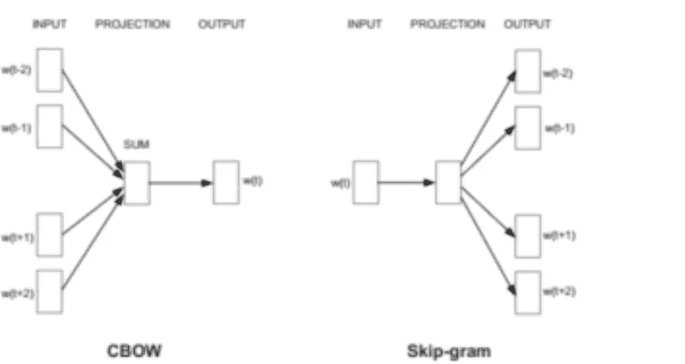
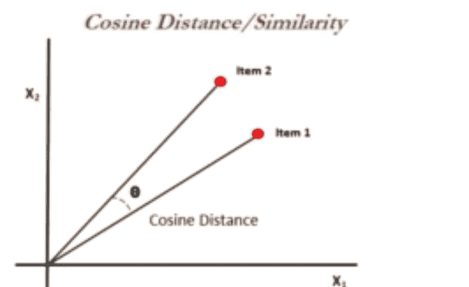

# 词向量和语义

> 原文：<https://towardsdatascience.com/word-vectors-and-semantics-2863e7e55417?source=collection_archive---------49----------------------->

## 观点挖掘还是情感人工智能

Word2vec 是一个处理文本的双层神经网络。它的输入是文本语料库，输出是一组向量，这些向量本质上是该语料库中单词的特征向量。Word2vec 的目的和用途是在向量空间中对相似词的向量进行分组。它用数学方法检测相似性。它创建向量，这些向量是单词特征的分布式数字表示，例如单个单词的上下文，并且它在没有人工干预的情况下完成。

给定足够的数据、用法和上下文，Word2vec 可以根据单词过去的出现对其含义做出高度准确的猜测。这些猜测可以用来建立一个单词与其他单词的联系，就像男人对于男孩就像女人对于女孩一样。

Word2vec 根据输入语料库中与单词相邻的其他单词来训练单词。它通过两种方式实现，或者使用上下文来预测目标单词，或者使用单词来预测目标上下文，这被称为 skip-gram。



它们都是彼此相反的。

CBOW 方法我们有几个输入单词，然后我们的投影基本上是试图预测在给定这些周围单词的上下文的情况下，出现的概率最高的单词是什么。另一方面，Skip-gram 方法需要更长的时间来训练和开发，因为它本质上是在做相反的事情。给定使用自动编码器神经网络投影的单个单词的输入，尝试输出将在该输入单词的上下文周围出现的其他单词的加权概率

我们还必须记住，每个单词都由一个向量来表示。这意味着我们可以使用余弦相似度来衡量单词向量之间的相似程度



# 向量值

那么单词向量是什么样子的呢？因为 spaCy 采用 300 维，所以单词向量被存储为 300 个元素的数组。

注意，我们会看到与 **en_core_web_md** 和 **en_core_web_lg** 相同的一组值，

```
*# Import spaCy and load the language library*
**import** **spacy**nlp = spacy.load('en_core_web_lg')  
*# make sure to use a larger model!*#or*# Import spaCy and load the language library*
**import** **spacy** nlp = spacy.load('en_core_web_md') 
 *# make sure to use a larger model!*doc = nlp(u'The quick brown fox jumped over the lazy dogs.')

doc.vector
```

这将返回一个大数组。(参见 GitHub 链接中的输出)

# 识别相似向量

公开向量关系的最佳方式是通过。文档标记的 similarity()方法。

我们知道狮子和猫有一点相似之处，因为它们都是一个大家庭的成员。此外，猫和宠物之间也有关系，因为猫在世界各地大多作为宠物饲养

```
*# Create a three-token Doc object:*
tokens = nlp(u'lion cat pet') *# Iterate through token combinations:*
**for** token1 **in** tokens:
    **for** token2 **in** tokens:
        print(token1.text, token2.text, token1.similarity(token2)) Output-lion lion 1.0
lion cat 0.526544
lion pet 0.399238
cat lion 0.526544
cat cat 1.0
cat pet 0.750546
pet lion 0.399238
pet cat 0.750546
pet pet 1.0
```

我们看到我们得到了一些正确的和可理解的结果。

# 对立面不一定是不同的

意思相反但经常出现在相同*上下文*中的单词可能有相似的向量。

在这里，我们可以认为喜欢、爱和恨有完全不同的含义，但是如果我们在一个句子中一起使用它们，它是有意义的，并且模型可以识别它。

```
*# Create a three-token Doc object:*
tokens = nlp(u'like love hate') *# Iterate through token combinations:*
**for** token1 **in** tokens:
    **for** token2 **in** tokens:
        print(token1.text, token2.text, token1.similarity(token2)) Output-like like 1.0
like love 0.657904
like hate 0.657465
love like 0.657904
love love 1.0
love hate 0.63931
hate like 0.657465
hate love 0.63931
hate hate 1.0
```

# 向量范数

有时将 300 个维度聚合成一个[欧几里德(L2)范数](https://en.wikipedia.org/wiki/Norm_%28mathematics%29#Euclidean_norm)会很有帮助，这个范数被计算为矢量平方和的平方根。这可作为。vector_norm 令牌属性。其他有用的属性包括。has_vector 和 is_oov 或*出词汇*。

比如我们的 685k 矢量库可能没有“ [nargle](https://en.wikibooks.org/wiki/Muggles%27_Guide_to_Harry_Potter/Magic/Nargle) 这个词。要测试这一点:

```
tokens = nlp(u'dog cat nargle')**for** token **in** tokens:
    print(token.text, token.has_vector, token.vector_norm, token.is_oov) Output-dog True 7.03367 False
cat True 6.68082 False
nargle False 0.0 True
```

事实上，我们看到“nargle”没有向量，所以 vector_norm 值为零，它被标识为词汇表之外的*。*

# 向量运算

信不信由你，我们可以通过加减相关向量来计算新的向量。一个著名的例子表明

```
"queen" - "woman" + "man" = "king"
```

我们来试试吧！

```
**from** **scipy** **import** spatial

cosine_similarity = **lambda** x, y: 1 - spatial.distance.cosine(x, y)

queen = nlp.vocab['queen'].vector
woman = nlp.vocab['woman'].vector
man = nlp.vocab['man'].vector *# Now we find the closest vector in the vocabulary to the result of "man" - "woman" + "queen"*
new_vector = queen - woman + man
computed_similarities = [] **for** word **in** nlp.vocab:
    *# Ignore words without vectors and mixed-case words:*
    **if** word.has_vector:
        **if** word.is_lower:
            **if** word.is_alpha:
                similarity = cosine_similarity(new_vector, word.vector)
                computed_similarities.append((word, similarity))

computed_similarities = sorted(computed_similarities, key=**lambda** item: -item[1])

print([w[0].text **for** w **in** computed_similarities[:10]])['queen', 'king', 'kings', 'queens', 'prince', 'lord', 'throne', 'royal', 'god', 'monarch']
```

你可以在下面提供的我的 Github 库中查看完整的代码。

[](https://github.com/aditya-beri/Word-Vectors-and-Semantics.git) [## aditya-beri/词向量和语义

### 通过在 GitHub 上创建一个帐户，为 aditya-beri/词向量和语义开发做出贡献。

github.com](https://github.com/aditya-beri/Word-Vectors-and-Semantics.git) 

# **结论**

在这篇博客中，我们学习了如何进一步进行机器学习，并试图从复杂的短语中提取出想要表达的意思。一些简单的例子包括:

*   数据科学相对容易学。
*   那是我看过的最好的电影。

然而，像这样的短语会让事情变得更难:

*   我不讨厌绿鸡蛋和火腿。(需要否定处理)

实现的方式是通过复杂的机器学习算法，如 [word2vec](https://en.wikipedia.org/wiki/Word2vec) 。目的是为大型语料库中的每个单词创建数字数组或*单词嵌入*。每个单词都被赋予了自己的向量，在这种方式下，在同一上下文中频繁出现的单词被赋予了相互靠近的向量。结果是一个模型可能不知道“狮子”是一种动物，但知道“狮子”在上下文中比“蒲公英”更接近“猫”。

需要注意的是*构建*有用的模型需要很长时间——训练一个大的语料库需要几个小时或几天——为了我们的目的，最好是导入一个现有的模型，而不是花时间训练我们自己的模型。

# 这只是对什么是语义和词向量以及它们如何工作的一个小小的窥探。
如有任何疑问和澄清，请随时回复本博客。