# Word2Vec 至变压器

> 原文：<https://towardsdatascience.com/word2vec-to-transformers-caf5a3daa08a?source=collection_archive---------3----------------------->

## 单词嵌入的演变，来自 CS224n 的注释。

你的论点是合理的，完全合理

## 介绍

开发有意义的单词表示是 NLP 成立以来的主要目标之一。在 2010 年代，这一基础性任务一直是该领域进步和创新的主要驱动力之一。在这篇文章中，我将介绍完成这项任务的一些主要方法，以及大大提高我们在不同上下文中捕捉词义和相似性的能力的主要观点。

## 一袋单词

解决这个问题最简单的方法叫做词汇袋。这种方法为文本中出现的每个单词分配一个唯一的标记，通常是一个数字。因此，例如短语“你的论点是*声音*，除了*声音*什么都没有”将被表示为*“1-2-3-4-5-6-4”。*通过这种基线方法，我们可以捕捉到单词之间同一性的概念，也就是说，当一个单词被多次使用时，我们可以识别出来。此外，使用像 Tf-Idf 这样的使用单词包的技术，我们可以在一定程度上成功地测量文档之间的相似性，只要基于哪些单词在文档中使用以及使用的频率。使用像 WordNet 这样的资源，一个支持的字典，我们也可以发现文本中单词的多种含义，并将字典中列为同义词的那些连接起来。但是这种表示本身并没有捕捉到单词的相似性，也没有捕捉到单词在我们的文本中被使用的特定意义。

## Word2Vec (CBOW 或 Skip-Gram)

可以说，NLP 在 2010 年代早期的最大发展是 Word2Vec，这是一种无监督的学习技术，用于学习单词的连续表示。在许多方面，Word2Vec 建立在 BoW 的基础上，但它不是为单词分配离散的标记，而是为训练语料库中的每个单词学习连续的多维向量表示。更具体地说，它通过学习预测给定一个中心单词在其周围固定大小的窗口中最有可能出现的单词来做到这一点 *(Skip-Gram)* 。

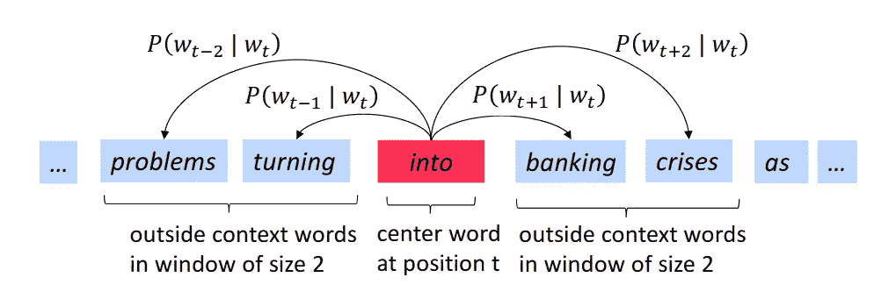

Word2Vec 示例

或者通过学习根据上下文单词*(连续单词袋)*预测中心词。像许多其他机器学习技术一样，Word2Vec 使用梯度下降来最小化整个语料库的交叉熵损失，即预测错误单词的概率。实际上，基本思想是在中心词和外部词的任何给定配置下，最大化给定中心词时预测外部词的条件概率。

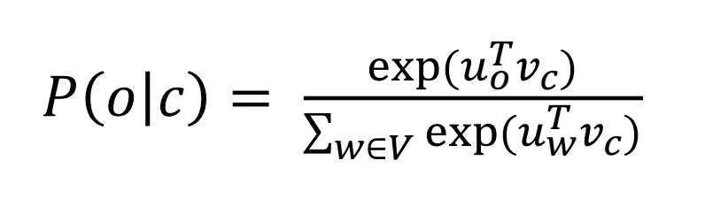

表达式最大化，其中 u_o 是中心词上下文中外部词之一的向量表示，v_c 是中心词的表示。直观上，向量积是线性代数中相似性的度量，因此我们想要最大化当前外部单词和中心单词之间的相似性，该相似性基于中心单词相对于语料库中所有单词的相似性的总和来归一化。指数是用来使一切都为正的。

现在，如果我们想在所有语料库中最大化这种表达，我们需要逐步学习更好地捕捉单词之间相似性的向量。因此，Word2Vec 通过设计来捕捉我们语料库中单词的相似性，这要归功于一个单词在向量空间中与其他单词有多远或多近的概念，即词义的概念。

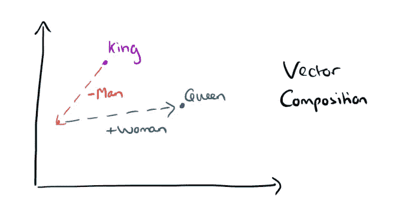

经典的国王-男人+女人=女王 Word2Vec 如何捕捉相似性的直觉。

然而，这种相似性的概念只能带我们到此为止。Word2Vec 的主要问题是，它为一个词提供了一种单一的表示，无论上下文如何，这个词都是相同的。因此，像“*bank”*这样有几个不同含义的词，例如 river bank 和 investment bank，最终会有一个表示，它是没有很好地表示任何一个含义的平均表示。

## 上下文单词嵌入(ELMo)

基于单词出现的上下文来证明每个单词有多个表示是上下文单词嵌入背后的核心思想。这个想法是使用 RNN 语言模型来实现的，该模型以无监督的方式类似于 Word2Vec 来训练。更具体地，我们使用 RNNs 来预测，给定句子中的当前单词，下一个单词。我们使用这些网络是因为它们有能力在隐藏状态下捕获和维护长期依赖关系。

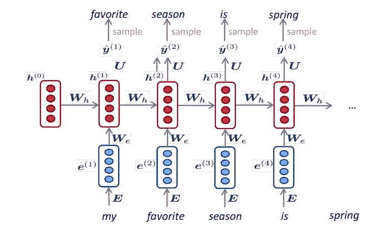

隐藏状态(红色)可以保持关于句子中前一个单词的信息

其思想是，在输入当前单词后，我们可以将隐藏状态连接到通常的 Word2Vec 表示，以维护当前单词和过去上下文的信息。

第一个实现这个想法的系统是 Peters 和 co .的 TagLM。

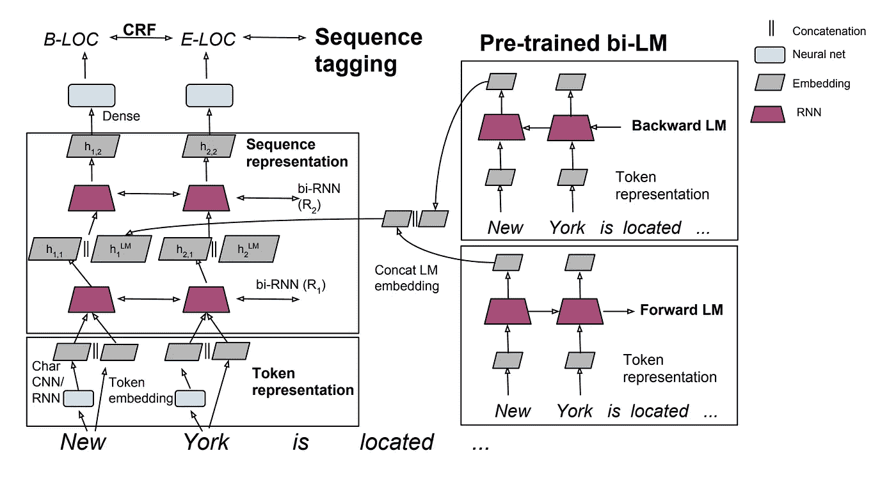

TagLM 使用预训练的双 LSTM 语言模型来产生单词嵌入的“上下文部分”,该单词嵌入连接到 Word2Vec 矢量或更复杂的字符级 CNN/RNN 生成的单词表示。这种表示现在是新的嵌入，有效地取代了 NLP 管道中的 Word2Vec 或 GloVe 向量。

ELMo 嵌入的工作方式非常相似，主要区别在于 ELMo 对预训练语言模型使用两层双 LSTM，而嵌入连接是一种可学习的，在微调期间，两层的组合将针对特定任务进行优化。ELMo 还完全抛弃了 Word2Vec，只依赖字符级的 CNN/RNNs 作为单词表示的第一部分。

## 变形金刚(伯特，GPT)

训练单独的语言模型以产生更好的上下文单词表示的想法已经被证明在许多 NLP 任务中非常成功地改善了 SOTA，但是 RNN 语言模型由于其循环、顺序的性质而倾向于训练缓慢并且非常难以并行化。因此，在 2017 年，Aswani 和他的同事开发了一种非递归替代 RNNs 的方法，其核心是变压器块。

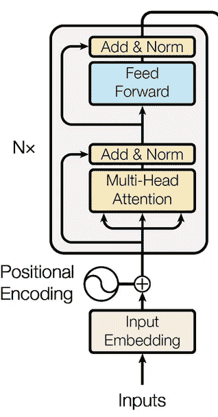

变压器架构的编码器

Transformer 的主要特点是它使用注意力(seq2seq 架构中有助于翻译对齐的概念)来捕捉句子中单词之间的关系，类似于卷积的方式。就像卷积一样，我们可以让多个注意力头来计算每个单词应该将注意力集中在哪里，以及注意力所代表的关系。然而，注意力不同于卷积，因为它捕捉空间中单词之间的相似性，在该空间中，不同头部的权重矩阵投射它们的表示。为了捕捉更远的依赖性，类似于卷积，我们可以堆叠多个变压器块。

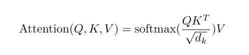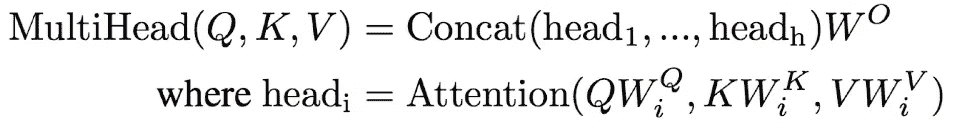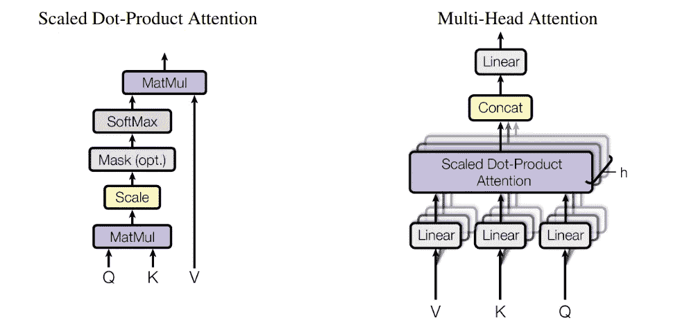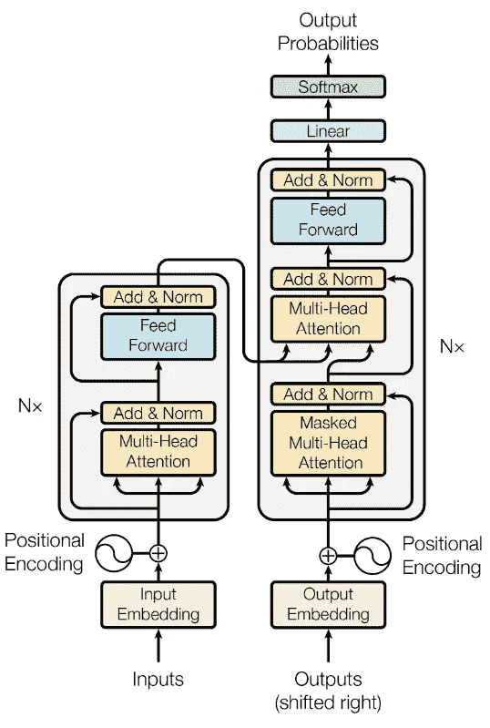

解码器模块的工作方式有些不同，但是你所需要的是引起*注意的图像*纸张让一切变得更加清晰。

BERT 使用 transformer block 来训练一个使用屏蔽技术的语言模型，其中系统的任务不是猜测下一个单词，而是猜测句子中屏蔽掉的一个单词。

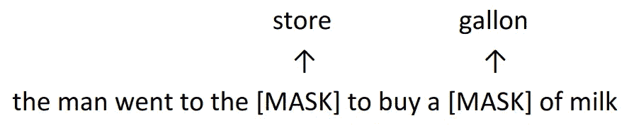

这样，它能够使用整个上下文进行预测，而不仅仅是左上下文。

*这些笔记是对 CS224n Stanford 课堂第 13 和 14 课的最基本的总结。这些材料的学分属于克里斯·曼宁教授和这门课的助教。
更多资料可在* [*课程网站*](http://web.stanford.edu/class/cs224n/) *和*[*YouTube*](https://www.youtube.com/watch?v=5vcj8kSwBCY&feature=youtu.be)*上获得。*