# 构建神经网络时，更聪明地工作，而不是更努力

> 原文：<https://towardsdatascience.com/work-smarter-not-harder-when-building-neural-networks-6f4aa7c5ee61?source=collection_archive---------16----------------------->

## 用一个简单的例子来说明神经网络的设计原则

应用数学中的一个基本技巧是找到一个坐标变换，将一个困难或不可能的问题转化为一个简单的问题。也许我最喜欢的例子是圆的方程。如果我们在笛卡尔坐标中写下单位圆的方程，我们可以将圆的几何概念表达为隐函数:

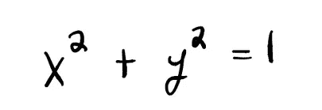

当我们试图通过求解 y 得到一个显式表达式时，情况会变得更糟。

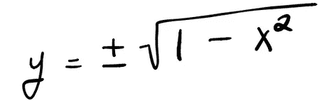

现在我们必须从平方根的两个分支(圆的上半部分和下半部分)拼凑这个简单的函数。超越美学使用这种圆的表示法会使我们看不到一个完美的圆所固有的几何简单性。相比之下，如果我们用极坐标来表示同样的数学对象，那么单位圆就变得非常容易处理。

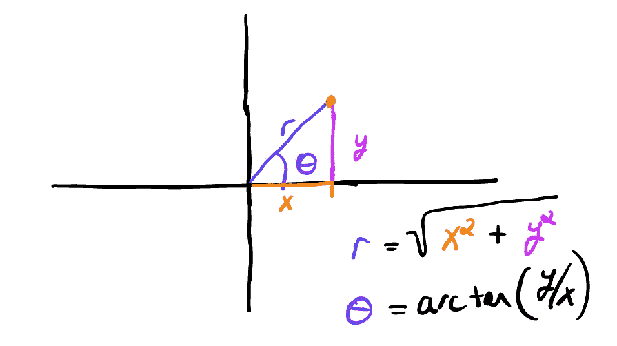

点的极坐标。

在极坐标中，我们的单位圆采用简单的形式 r=1，θ ∈ [0，2π]。所以在极坐标中，圆是矩形的(高=1，宽=2π)。笛卡尔坐标是矩形的自然坐标，极坐标是圆形的自然坐标。在本文中，我将应用这种思路来构建简单的神经网络，并构建一个说明选择正确坐标的重要性的示例。

# 曲线拟合的人工神经网络

如果你正在阅读这篇文章，那么你可能听说过人工神经网络(ANN)。在这次讨论中，我们将集中讨论最简单的人工神经网络，称为前馈网络。简而言之，人工神经网络只是通过将简单的非线性函数(层)链接在一起而构建的网络(函数)。

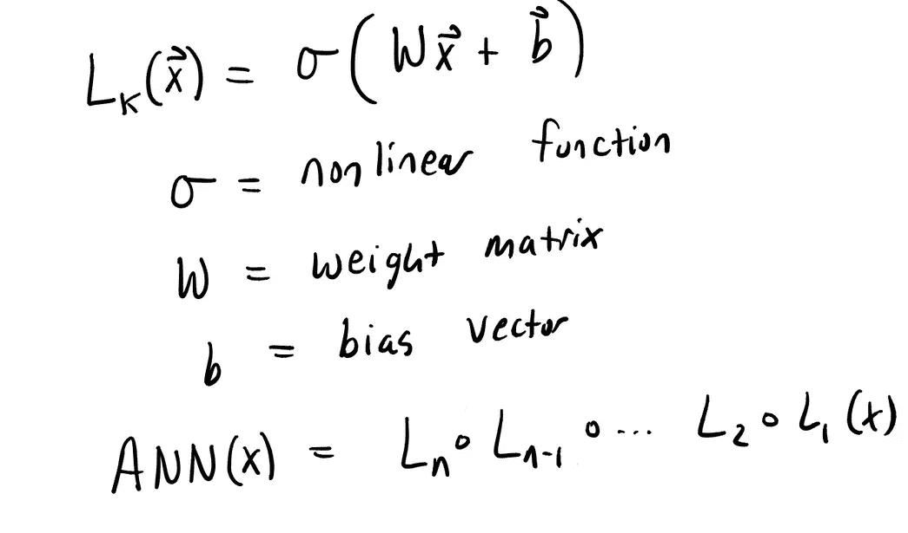

前馈神经网络

通过将(许多)这些简单的层链接在一起，通用逼近定理告诉我们，我们可以将任何(好的)函数表示为具有有限深度和宽度的人工神经网络。在开始的极坐标例子中，这就像说我们可以在极坐标中写下(x，y)平面中的每一点(没有洞)。这是一个很好的必要属性，可以确保我们在改变坐标时不会错过任何东西，但是它没有告诉我们两件事:

*   如何找到实际坐标？
*   如果这是表达信息的好方法。

对于人工神经网络来说，“*坐标*是神经网络的参数(神经网络中每一层的权重和偏差)。对于神经网络，我们没有快速的数学公式来找到这些坐标，而是使用优化来最小化损失函数。损失函数测量我们指定的函数和训练数据之间的距离。

让我们看一个简单的例子，用神经网络来构建正弦函数的近似值。

## 使用神经网络拟合正弦函数

让我们应用这种强大的函数逼近方法来构建简单函数 sin(x)的神经网络版本。我将使用用 Julia 编写的奇妙的神经网络库 [Flux。这个软件包为构建神经网络提供了一个非常简单而强大的框架。它还增加了很少的额外语法来构建神经网络，并让我们专注于基本的构建模块。我将在文章中包含一些代码片段。完整代码请查看](https://github.com/FluxML/Flux.jl)[github repo](https://github.com/khannay/CurveFittingNeuralNets)。

下面的代码使用一个标准的非线性函数 tanh 构建了一个具有两个隐藏层的简单网络。

```
 ann = Chain(Dense(1,20,tanh),Dense(20,20,tanh),Dense(20,1)); 
```

我们可以把这个神经网络想象成:

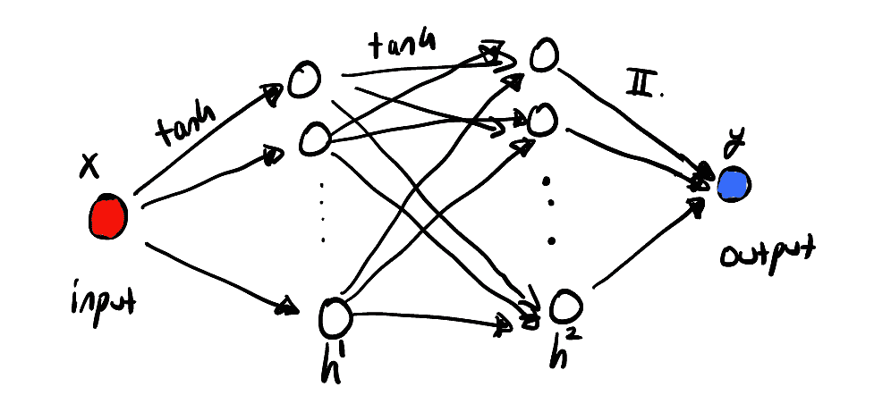

学习正弦函数的简单前馈神经网络

上图显示我们有一个输入和输出值，中间有两个层。这些层被称为隐藏层，因为如果您仅跟踪输入和输出，它们是不可见的。回想一下，该图用于表示某个函数族，其中通过固定参数来指定特定的成员。

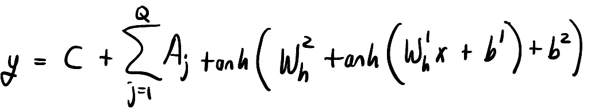

上述神经网络的函数形式。参数由两个权重矩阵 W 和偏置向量 b 给出。参数 C 给出线性输出层的截距。

好，所以我们希望，我们可以用这个函数族中的某个成员来近似表示函数 sin(x)。为了尝试找到最接近这个的成员，我们应该使用一些训练数据来最小化损失函数。

```
function loss(x, y)
    pred=ann(x)
    loss=Flux.mse(ann(x), y)
    #loss+=0.1*sum(l1,params(ann)) #l1 reg
    return loss
end[@epochs](http://twitter.com/epochs) 3000 Flux.train!(loss,params(ann), data, ADAM())
```

拟合我们的神经网络后，我们可以看到它对训练数据和一组测试数据有多好。

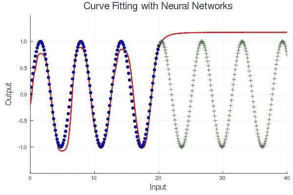

具有 tanh 非线性的前馈神经网络适合 3000 个时期的训练数据，如蓝色圆圈所示。测试数据显示为绿色十字。

显然，这种神经网络在捕捉信号的基本周期特性方面表现不佳。对测试数据(绿色)的异常差的概括突出了这一点。这不仅仅是我的[网络](/can-machine-learn-the-concept-of-sine-4047dced3f11)。

哪里出了问题？经常被引用的[通用逼近定理](https://en.wikipedia.org/wiki/Universal_approximation_theorem)告诉我们，我们可以使用有限深度和宽度的前馈神经网络来表示这个函数。然而，正如我经常重新发现的——有限仍然可以非常大。仅仅因为存在一些权重和偏差，可以用来从典型的神经网络组件中构建这个函数，并不意味着我们可以很容易地找到它们。

我们可以尝试使用蛮力，建立更大的网络或训练更长的时间，等等。然而，一个非常简单的改变会在很短的时间内给我们一个近乎完美的近似值。

## 更好的主意

给定这个数据，我们可以看到它是周期性的。现在，我们还没有将那条信息包含在我们的神经网络设计中。不使用双曲正切非线性函数，*让我们使用正弦函数*。这样，第一层的输出将是周期性的。

下图显示了该系统更好的近似网络的想法。

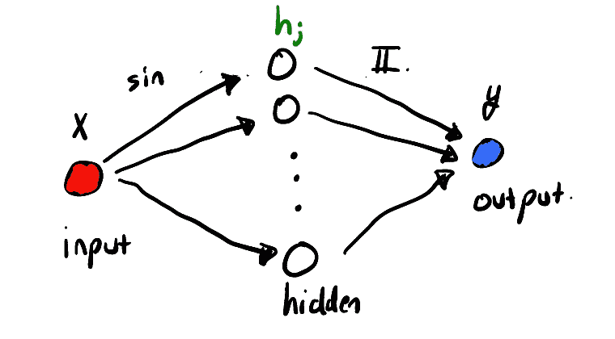

具有正弦非线性神经网络。

以函数形式写出，我们使用的函数族采用以下形式:

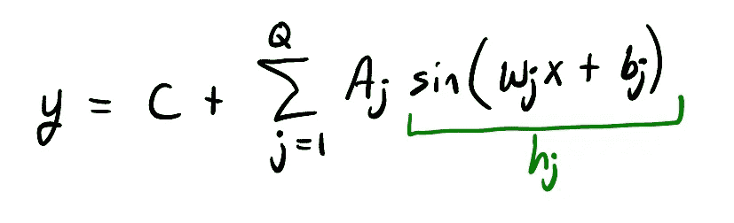

其中 Q 是隐藏层中神经元的数量。这在 Flux 中很容易做到:

```
Q = 20;
ann = Chain(Dense(1,Q,sin),Dense(Q,1));
```

让我们试试这种新型号，看看能否找到更好的型号。

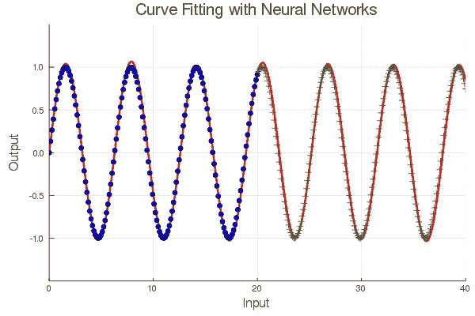

更好的神经网络基础

这是一个更好的模型，因为它抓住了周期性的本质。然而，请注意，我们仍然在训练和测试数据上略有偏差。这是因为我们的模型实际上仍然有一些不需要的额外自由度。我们可以通过对参数应用一些正则化来解决这个问题，但在这种情况下，我们可以求助于一些非常酷的数学来寻求解决方案。

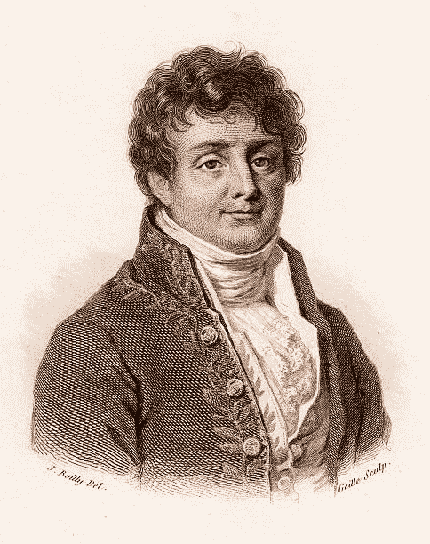

**让·巴普蒂斯特·约瑟夫·傅立叶 1768–1830**

上述神经网络的函数形式非常接近于**傅立叶级数**的形式。傅立叶级数是一个基(一组坐标)，可以用来描述有限域[a，b]上所有的*好的*函数。如果一个函数是周期的，那么有限域上的描述可以扩展到整条实直线上。因此，傅里叶级数常用于周期函数。

傅立叶级数采用以下形式:

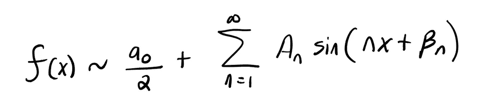

我们的神经网络和傅立叶级数之间的唯一区别是，我们的神经网络允许权重 W 变化，而傅立叶只有 A 系数和偏差(b)项，可以选择它们来拟合函数。

在 Flux library 中，从可训练的参数集中移除第一层中的那些权重参数是足够容易的。通过将它们设置为整数值，我们实际上可以创建一个神经网络，其中**是**傅立叶级数。

```
# Fourier Series ANNQ = 20;
ann = Chain(Dense(1,Q,sin),Dense(Q,1));function loss(x, y)
    pred=ann(x)
    loss=Flux.mse(ann(x), y)
    return loss
endopt = ADAM()ps=params(ann)for j=1:20
    ann[1].W[j]=j
end
delete!(ps, ann[1].W) #Make the first layers weights fixed[@epochs](http://twitter.com/epochs) 3000 Flux.train!(loss,ps, data, opt)
```

以下是使用 sin(x)函数和傅立叶人工神经网络的拟合:

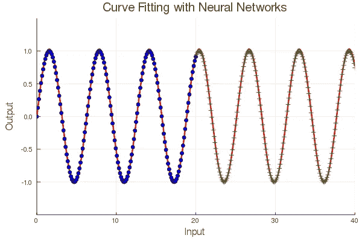

傅立叶人工神经网络方法推广良好。

如果你想知道这种方法对其他更复杂的周期函数也同样适用。考虑一个混有一些高次谐波的周期信号。

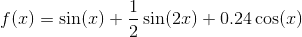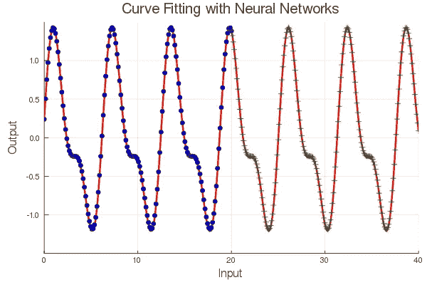

更复杂周期信号的傅立叶级数神经网络的第二个例子。

## 一些外卖课程

这个简单的例子为 ANN 的工作方式以及我们如何改进我们的模型提供了一些重要的见解。

1.  你的神经网络的设计会对结果产生巨大的影响。问题和领域的具体知识会产生巨大的影响。
2.  确保你所知道的关于问题的一切都被传送到神经网络。这里我们看到，告诉函数产生一个周期信号比增加网络规模或训练时间做得更多。
3.  按照上一课的思路，领域知识很重要。
4.  应用数学家和物理学家已经研究函数逼近问题很长时间了。[傅立叶级数在 19 世纪 20 年代被发现](https://en.wikipedia.org/wiki/Fourier_series)用来解决热传导问题。这些技术可能值得您花时间去学习，即使您并不关心应用程序。
5.  用人工神经网络计算傅立叶级数是非常愚蠢的。[上世纪十大算法之一](https://www.google.com/url?sa=t&rct=j&q=&esrc=s&source=web&cd=2&cad=rja&uact=8&ved=2ahUKEwiRqv7B2-3oAhUESa0KHQZnDYMQFjABegQICxAF&url=http%3A%2F%2Fpi.math.cornell.edu%2F~ajt%2Fpresentations%2FTopTenAlgorithms.pdf&usg=AOvVaw2_lak1K8xxoCtcAZLEb8mm)就是为了这种计算而发明的。重点是展示一个小小的改变，加入更多的领域知识，是如何极大地改善结果的。

关于构建更智能的神经网络，我推荐查看[内森·库兹的作品](https://faculty.washington.edu/kutz/)。