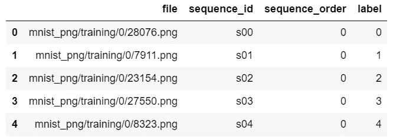
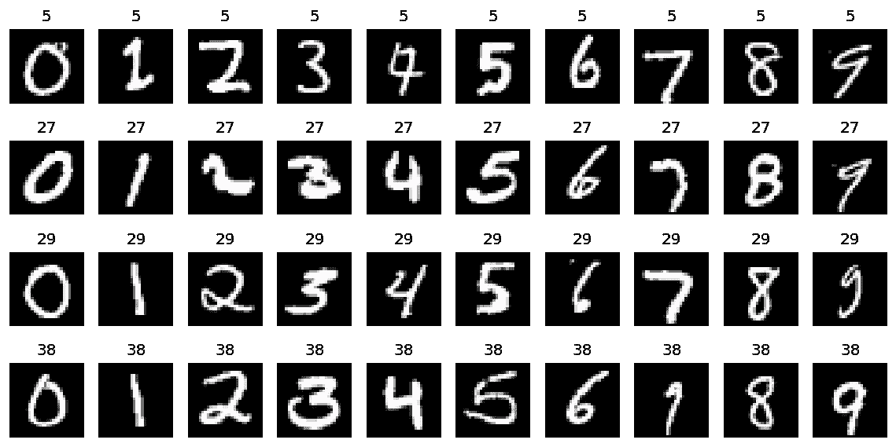
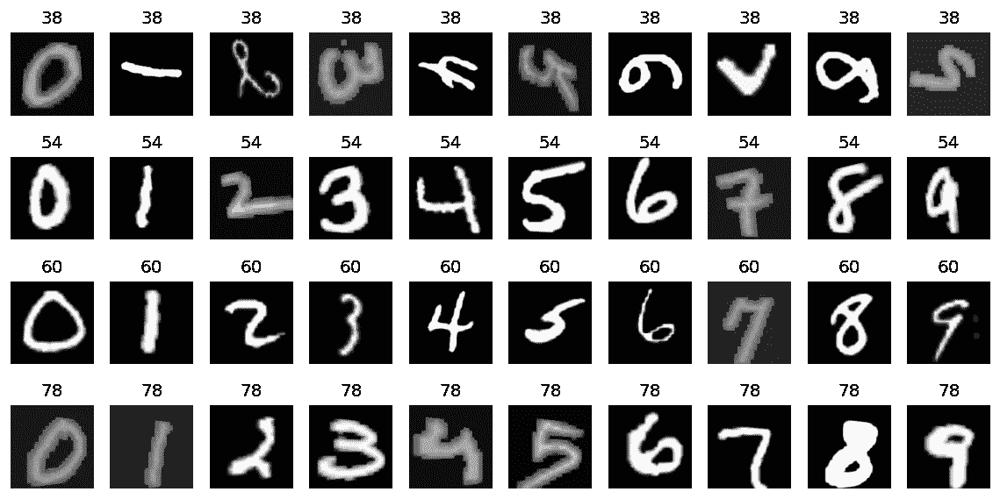

# 使用 3D 数据— fastai2

> 原文：<https://towardsdatascience.com/working-with-3d-data-fastai2-5e2baa09037e?source=collection_archive---------50----------------------->

## 了解 fastai 数据块并创建构建块以处理深度学习应用程序的图像序列


奥拉夫·阿伦斯·罗特内在 [Unsplash](https://unsplash.com/s/photos/rubik-cube?utm_source=unsplash&utm_medium=referral&utm_content=creditCopyText) 上拍摄的照片。

## 介绍

处理 3D 数据或图像序列对于许多应用程序都很有用。假设您正在处理 3D 医疗数据、视频数据、卫星图像的时间序列，甚至是一幅更大图像的几个片段。如果你正在处理这样的问题，除了简单的基于图像的问题之外，你还需要一些额外的考虑。如何对 3D 数据进行增强？这些转换应该应用于图像方式还是序列方式，或者两者都应用？如何洗牌训练数据？是否应该保留序列顺序？这些问题的答案取决于问题的类型。然而，拥有一个能够适应所有这些不同可能性的框架是有用的。fastai 是模块化的，非常通用，这使它成为深度学习实践者和研究人员非常有用的工具。

在这个故事中，我将从 fastai **数据块**的一个基本例子开始——创建数据加载器的构建块。然后，我将展示如何编写附加功能，以允许使用数据块创建包含 3D 数据的数据加载器，包括图像序列的扩充。

在[这个 Kaggle 内核](https://www.kaggle.com/mnpinto/fastai2-working-with-3d-data)上提供了一个工作示例。

## fastai 数据块

下面的代码显示了一个典型的基于图像的数据集的 fastai **DataBlock** 类的示例。如果你是 fastai 的新手，你可以在 fastai 文档中找到更多的例子。

```
dblock **=** DataBlock(blocks     **=** (ImageBlock, CategoryBlock),
                   get_items  **=** get_image_files,
                   get_y      **=** label_func,
                   splitter   **=** RandomSplitter(),
                   item_tfms  **=** Resize(224),
                   batch_tfms **=** aug_transforms())
```

*   **块** —该参数接收一个元组，该元组定义了**数据块**的输入类型和目标。在这种情况下，我们有 **ImageBlock** 和 **CategoryBlock，**因此 **DataBlock** 需要图像输入和分类目标——顾名思义。
*   **get_items** —该参数接收一个返回项目列表的函数。在这种情况下， **get_image_files** 简单地返回所有图像文件的路径是一些目录和子目录。
*   **get_y** —该参数接收一个定义标签的函数。在这种情况下是相应项目的类别。 **get_x** 也可以用在一些情况下，我们稍后会看到。请记住， **get_x** 和 **get_y** 接收 **get_items** 的输出，并分别定义 **ImageBlock** 和 **CategoryBlock** 将接收哪些信息。在本例中，不需要 **get_x** ，因为 **get_image_files** 已经返回了图像的列表路径，这是 **ImageBlock** 所需要的。
*   **拆分器** —用于指示如何将数据拆分为训练集和验证集。
*   **item_tfms** —用于定义应用于 CPU 上每个图像的变换。
*   **batch_tfms** —用于定义应用于 GPU 上每个批处理的转换。

如您所见，这种结构非常灵活，几乎可以处理任何类型的数据，只要相应地定义了每个参数。对于更高级的应用，可能需要定义自定义块类型和函数来创建批处理。处理 3D 数据就是这种情况。然而，正如我将在下面的六个步骤中展示的，一旦你熟悉了**数据块**的结构，这个过程就相当简单了。

## 步骤 0。数据源

在这个例子中，我将使用 MNIST 的数据。我将从 0 到 9 的数字序列定义为我们的图像序列——这使得调试更加容易。下表显示了数据帧的组织方式。



数据帧的例子。作者创造的形象。

数据框架中的列有:

*   **文件** : 每个图像的路径；
*   **sequence_id** :每个序列的唯一标识符；
*   **sequence_order** :序列中元素的顺序——在这种情况下，对应于从 0 到 9 的数字；
*   **标签**:每个序列的目标标签。

## 第一步。定义**图像序列块**

为了定义一个**图像序列块**，我使用了以下代码:

```
class **ImageSequence**(Tuple):
    *@classmethod*
    def create(cls, image_files): 
        return cls(tuple(PILImage.create(f) for f in image_files))

def **ImageSequenceBlock**(): 
    return TransformBlock(type_tfms  = ImageSequence.create,
                          batch_tfms = int2float)
```

*   首先，创建一个**图像序列**。它只是一个元组，包含 **image_files** 列表中给出的所有图像。
*   那么 **ImageSequenceBlock** 只是一个使用 **ImageSequence** 返回 fastai **TransformBlock** 的函数。这是对**图像块**的 fastai 代码的简单改编。

## 第二步。定义获取项目功能

请注意， **ImageSequence** 中的 create 函数接收图像文件列表作为参数。我们需要创建将返回这样的列表的函数，并将其交给**数据块中的 **get_items** 参数。**

基于数据源格式(步骤 0 中的 dataframe ),我定义了以下类来创建序列和标签列表:

```
class **SequenceGetItems**():
    def __init__(self, filename_col, sequence_id_col, label_col):
        self.fn    = filename_col
        self.seq   = sequence_id_col
        self.label = label_col

    def __call__(self, df):
        data = []
        for fn in progress_bar(df[self.seq].unique()):
            similar = df[self.seq] == fn
            similar = df.loc[similar]
            fns = similar[self.fn].tolist()
            lbl = similar[self.label].values[0]
            data.append([*fns, lbl])
        return data
```

*   该类所需的属性只是数据帧上对应于文件名、唯一序列标识符和标签的列名。
*   调用时，__call__ 方法将接收数据帧“df”作为参数，并将返回一个列表列表。每个子列表由序列的图像文件名和子列表最后一个元素中的相应标签组成。

现在，请记住上面的**数据块**示例，即 **get_x** 和 **get_y** 接收来自 **get_items** 的输出，并且应该将输入和目标分开。在这种情况下，它们就像这样简单:

```
get_x = lambda t : t[:-1]
get_y = lambda t : t[-1]
```

*   如你所见， **get_x** 将选择列表中的所有元素，但最后一个将由 **get_y** 选择。这只是前面讨论的序列创建方式的结果——标签只是每个子列表中的最后一个元素。

## 第三步。把所有东西放在数据块里

有了上面两步定义的代码，为我们的图像序列构建一个**数据块**是一项简单的任务:

```
dblock = DataBlock(
    blocks    = (ImageSequenceBlock, CategoryBlock),
    get_items = SequenceGetItems('file', 'sequence_id', 'label'), 
    get_x     = lambda t : t[:-1],
    get_y     = lambda t : t[-1],
    splitter  = RandomSplitter())
```

*   注意，对于**块**参数，我们现在给出步骤 1 中定义的**图像序列块**。
*   然后对于 **get_items** 参数，我们使用在步骤 2 中定义的 **SequenceGetItems** 类。
*   **get_x** 和 **get_y** 非常简单，如前一节所述。
*   对于**分离器，**可以使用常用的 fastai 功能。另一个常见的选项是 **IndexSplitter** ，它允许精确地指定哪些项在验证集上。

我还没有包含任何 **item_tfms** 或 **batch_tfms** ，但是我很快就会包含。然而，让我们首先来看一个重要的附加部分——创建数据加载器。

## 第四步。创建数据加载器

为了从**数据块**中创建一个数据加载器，我们需要定义一个自定义函数来告诉如何创建批处理。到目前为止，我们只有图像序列。我们想要的是 PyTorch 张量。

```
def **create_batch**(data):
    xs, ys = [], []
    for d in data:
        xs.append(d[0])
        ys.append(d[1])
    xs = torch.cat([TensorImage(torch.cat([im[None] for im in x], dim=0))[None] for x in xs], dim=0)
    ys = torch.cat([y[None] for y in ys], dim=0)
    return TensorImage(xs), TensorCategory(ys)
```

*   这段代码将单个图像张量连接成一个具有额外维度的新张量，然后将单个序列成批连接在一起。如果图像是 3 通道，128×128 大小，序列的长度是 10，批量大小是 8，那么张量将具有[8，10，3，128，128]的形状。
*   注意，当我返回张量时，我使用了 **TensorImage** 和 **TensorCategory** 。这些是 fastai 类型，提供了非常有用的功能。

现在，要创建数据加载器，下面一行代码可以完成:

```
dls = dblock.dataloaders(df, bs=8, create_batch=create_batch)
```

*   请注意， **df** 是我们在步骤 0 中提到的数据帧， **bs** 是批量大小，并且给出了一个自定义的 **create_batch** 函数。

## 第五步。可视化数据

这一步对于功能来说并不是最基本的，但是能够显示数据并检查是否一切正常总是好的！

```
def **show_sequence_batch**(max_n=4):
    xb, yb = dls.one_batch()
    fig, axes = plt.subplots(ncols=10, nrows=max_n, figsize=(12,6), dpi=120)
    for i in range(max_n):
        xs, ys = xb[i], yb[i]
        for j, x in enumerate(xs):
            axes[i,j].imshow(x.permute(1,2,0).cpu().numpy())
            axes[i,j].set_title(ys.item())
            axes[i,j].axis('off')
```

**show_sequence_batch** 函数

****

**show_sequence_batch 函数的结果作者创造的形象。**

**请注意，每个图像上方的数字对应于序列标识符，这就是为什么在本例中它们在每一行都是相同的。**

## **第六步。添加图像和序列增强**

**由于我们的批次有一个“额外的”维度—对应于序列长度—我们不能开箱即用地应用 fastai 图像增强。此外，正如在本文的引言中所讨论的，在一些问题中，我们需要按顺序应用变换，以便在我们可能希望提供给 3D 卷积模型的序列元素之间保持空间一致性。**

**获得想要的结果的最简单的方法——或者至少是我能想到的最简单的方法——是注意到变换被同样地应用到每个图像通道。因此，如果我们使用张量形状——使用 PyTorch **view** 方法——我们可以按顺序或按图像应用基本的图像变换。变换之后，我们可以把张量重塑回原来的形状。**

**为此，我定义了两个类:**sequence FMS**和 **BatchTfms** 。这两个类被定义为 fastai **Transform** 的子类。关于 fastai **转换**需要注意的一个方面是**编码**方法类似于 PyTorch 模块中的 **forward** 方法或者 Python 类中常见的 **__call__** 方法。**

```
class **SequenceTfms**(Transform):
    def __init__(self, tfms): 
        self.tfms = tfms

    def encodes(self, x:TensorImage): 
        bs, seq_len, ch, rs, cs = x.shape
        x = x.view(bs, seq_len*ch, rs, cs)
        x = compose_tfms(x, self.tfms)
        x = x.view(bs, seq_len, ch, rs, cs) 
        return x

class **BatchTfms**(Transform):
    def __init__(self, tfms): 
        self.tfms = tfms

    def encodes(self, x:TensorImage): 
        bs, seq_len, ch, rs, cs = x.shape
        x = x.view(bs*seq_len, ch, rs, cs)
        x = compose_tfms(x, self.tfms)
        x = x.view(bs, seq_len, ch, rs, cs) 
        return x
```

*   **这两个类都用要应用于数据的扩充列表进行初始化。**
*   ****sequence FMS**按顺序应用变换(同一序列中所有图像的变换相同)。**
*   ****BatchTfms** 按图像方式应用变换。**

**完整的**数据块**现在看起来像这样:**

```
affine_tfms, light_tfms = aug_transforms(flip_vert=True)
brightness = lambda x : x.brightness(p=0.75, max_lighting=0.9)
contrast   = lambda x : x.contrast(p=0.75, max_lighting=0.9)

dblock = DataBlock(
    blocks     = (ImageSequenceBlock, CategoryBlock),
    get_items  = SequenceGetItems('file', 'sequence_id', 'label'), 
    get_x      = lambda t : t[:-1],
    get_y      = lambda t : t[-1],
    splitter   = RandomSplitter(valid_pct=0.2, seed=2020),
    item_tfms  = Resize(128),
    batch_tfms = [SequenceTfms([affine_tfms]), 
                  BatchTfms([brightness, contrast])])

dls = dblock.dataloaders(df, bs=8, create_batch=create_batch)
```

**注意:到目前为止，我还不能用这种方法使用由 **aug_transforms** 给出的**light _ tfms**——这就是为什么我手动定义了**亮度**和**对比度**转换，它们只是 **ImageTensor** fastai 类型的方法。**

****show_sequence_batch** 可视化的结果如下:**

****

**使用图像和序列增强的 show_sequence_batch 函数的结果。作者创造的形象。**

*   **请注意，在第一行中，图像是旋转的，但由于仿射变换是按顺序应用的，因此它们在序列中是一致旋转的。**
*   **对于亮度和对比度变换，请注意它们是随机应用于各个图像的。**

**如您所见，该框架可以根据数据/问题的类型轻松定制。**

## ****结论****

**在这个故事中，我讲述了如何使用 fastai **DataBlock** 为深度学习应用处理 3D 数据。这个代码的一个工作示例在[这个 Kaggle 内核](https://www.kaggle.com/mnpinto/fastai2-working-with-3d-data)上提供。**

**我花了一些时间和几次迭代才得到这里展示的代码，但所有这些学习过程让我对 fastai **DataBlock** 有了更好的理解，以及它是如何如此通用的！**

# **关于我**

**[](/my-3-year-journey-from-zero-python-to-deep-learning-competition-master-6605c188eec7) [## 我的 3 年历程:从零 Python 到深度学习竞赛高手

### 自从 2017 年开始学习 Python 以来，我一直遵循的道路是成为一名独自参加 Kaggle 比赛的大师…

towardsdatascience.com](/my-3-year-journey-from-zero-python-to-deep-learning-competition-master-6605c188eec7) 

*感谢阅读！如果你对这个话题还有其他问题，请随时发表评论。***