# 在数据科学中使用 APIs 探索新加坡 HDB 转售市场中的位租理论

> 原文：<https://towardsdatascience.com/working-with-apis-in-data-science-explore-bit-rent-theory-in-singapores-hdb-resale-market-d7760fdfc601?source=collection_archive---------25----------------------->

你在数据分析和机器学习方面 80%的工作是争论和清理数据，这可能是非常乏味的工作。使用 API 实现数据提取、数据丰富和数据清理的自动化可以节省大量手工提取的工作。

本文的重点将是如何在 Python 中与 API 交互，我们将在新加坡公共住房数据集的背景下工作，并探索住房市场中的出价-租金理论。它将更侧重于 Python 脚本，而不是实际分析，所以如果本文的任何部分缺乏学术和统计的严谨性，请原谅我。

完整代码 Github 链接:[https://github . com/yuan-西野/hdb-转售-api/blob/master/script.py](https://github.com/yuan-yexi/hdb-resale-api/blob/master/script.py)

## 比特租金理论

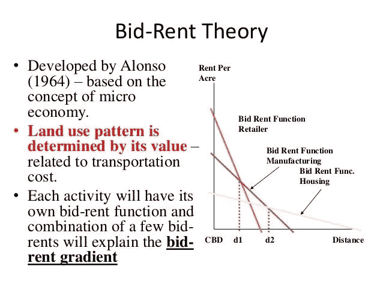

我们基本上是在探索每平方米价格和房产到 CBD 的距离之间的关系。

## 我们想要实现的目标:

*   从转售 API 查询 2017 年 1 月以后的所有交易数据
*   获取交易地址的地理位置(纬度，经度)
*   获取所有捷运站(新加坡地铁)的地理位置(经度，纬度)
*   获取所有购物中心的地理位置(纬度，经度)
*   获取每笔交易与最近的捷运站和购物中心之间的距离
*   获取每次交易到中央商务区(莱佛士广场)的距离
*   不要使用一行 PD . read _ CSV()；)

太好了，既然已经不碍事了，那就让我们进入正题吧。

## 首先让我们检查一下我们今天将使用的 API:

1.  https://data.gov.sg/dataset/resale-flat-prices[——Data.gov.sg 的转售价格提供了自 1990 年以来的历史交易数据。我们将专门检查 2017 年 1 月以后的数据集。](https://data.gov.sg/dataset/resale-flat-prices)
2.  https://docs.onemap.sg/[—一个强大的 API，提供特定于新加坡的位置坐标、交通、路线、人口数据等数据。我们将利用这个 API 来获取这个练习所需的地理坐标。](https://docs.onemap.sg/)

## 通过 API 获取数据并转换成 Pandas 数据框架

首先，我们将从导入一些基本库开始

```
import json
import requests
import pandas as pd
import numpy as np
import matplotlib.pyplot as plt
```

为了发出我们的第一个 API 请求，我们将使用请求库。但在此之前，让我们检查一下浏览器中的 API:

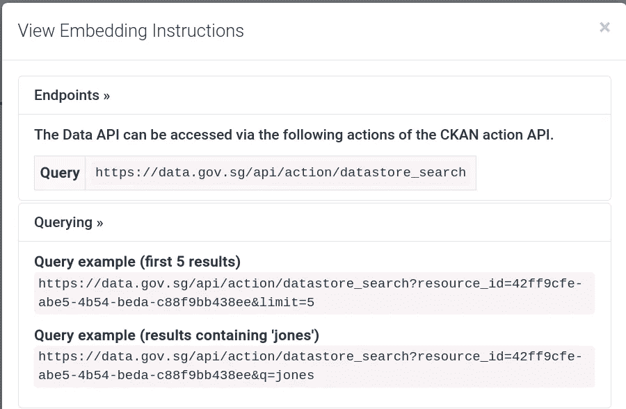

这是我们将发出的 HTTP GET 请求，用于请求数据集的服务

我们可以看到，我们可以通过使用“limit”或“q”参数来查询结果，以获得搜索结果。既然我们需要整个数据集，我们只需要指定整个数据集的限制。

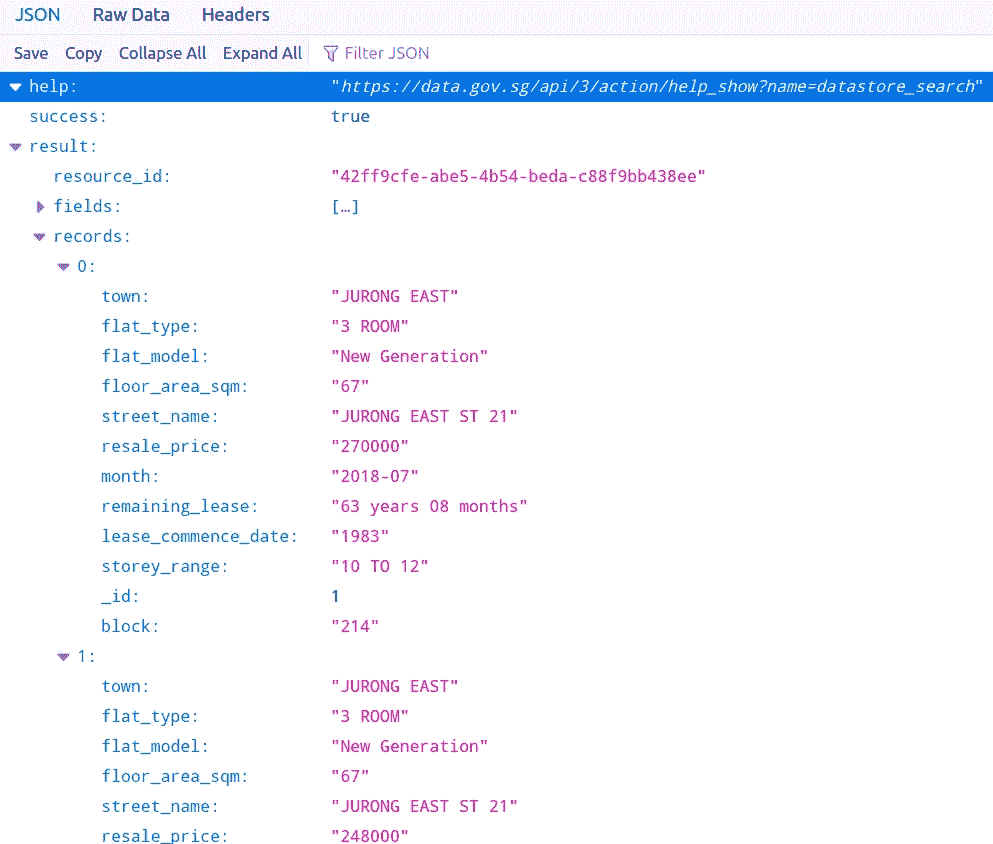

快速检查我们浏览器中的示例查询，我们可以看到我们感兴趣的事务的“记录”嵌套在 JSON 响应的“结果”数组中。有了我们正在处理的数据结构的概念，我们可以移动到我们的 Python IDE 并查询我们的数据。

```
query_string='[https://data.gov.sg/api/action/datastore_search?resource_id=42ff9cfe-abe5-4b54-beda-c88f9bb438ee&limit=500'](https://data.gov.sg/api/action/datastore_search?resource_id=42ff9cfe-abe5-4b54-beda-c88f9bb438ee&limit=500')
resp = requests.get(query_string)#Convert JSON into Python Object 
data = json.loads(resp.content)
```

因为这是一个相当大的数据集(在撰写本文时有 101994 条)，所以在转移到整个数据库之前，我们将对 500 条记录进行采样，以便于处理。在使用 API 的探索阶段，这是一个很好的实践，可以避免耗尽不必要的服务器资源，重复查询巨大的数据集。现在，让我们在 IDE 中检查一下服务返回给我们的内容。

```
# Notice that data type is actually 'dict'
print(type(data))#Output
<class 'dict'>
```

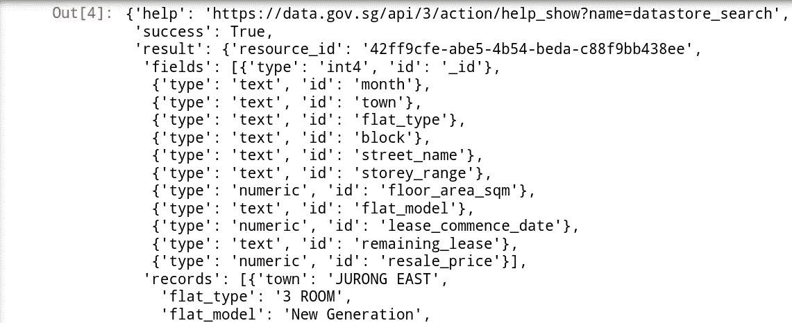

这看起来类似于我们在浏览器中看到的返回的 JSON

不错，从服务器返回的 JSON 对象基本上是大家熟悉的 Python 字典！我们的工作变得简单了一点，不需要额外的工作来转换我们的 JSON 对象，使其在 Python 中工作。

```
len(data['result']['records'])#Output
500
```

我们所要做的就是访问 dictionary 对象中的 records 键，以获得存储为 dictionary 键-值对的事务数据列表。

```
# Access the first record in our list
hdb_price_dict_records[0]#Output
{'town': 'JURONG EAST',
 'flat_type': '3 ROOM',
 'flat_model': 'New Generation',
 'floor_area_sqm': '67',
 'street_name': 'JURONG EAST ST 21',
 'resale_price': '270000',
 'month': '2018-07',
 'remaining_lease': '63 years 08 months',
 'lease_commence_date': '1983',
 'storey_range': '10 TO 12',
 '_id': 1,
 'block': '214'}
```

既然我们已经习惯了遍历嵌套数据，那么让我们创建 Pandas 数据框。

在上面的示例中，我们创建了一个 for 循环，将每个记录中的字典值附加到相关列表中，该列表将构成数据框中的每一列。

```
df_hdb_price = pd.DataFrame({
    'town': town,
    'flat_type': flat_type,
    'flat_model': flat_model,
    'floor_area_sqm': floor_area_sqm,
    'street_name': street_name,
    'resale_price': resale_price,
    'month': month,
    'remaining_lease': remaining_lease,
    'lease_commence_date': lease_commence_date,
    'storey_range': storey_range,
    '_id': _id,
    'block': block
})
```

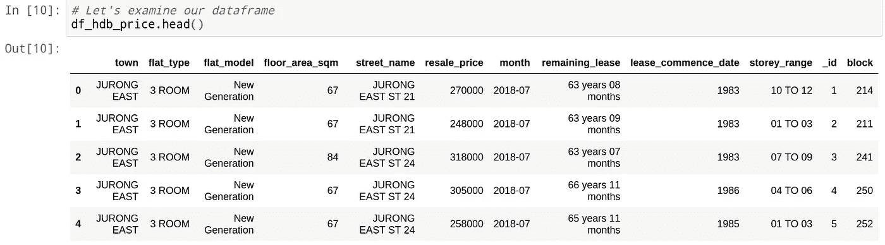

酷！我们的数据框看起来不错！

## 通过 OneMap API 获取经度和纬度数据

接下来的部分有点棘手。我们需要使用地理位置坐标(纬度、经度)找到 HDB 单位所在的最近的捷运站。我们将使用另一个 API 来实现这一点 OneMap API。

首先让我们创建一个新加坡所有捷运站的列表。由于 MRT 站点随时间变化相对较慢，我们可以利用静态列表来代替。我获得了(好的 ole 副本和面食；) )维基百科的数据，其中也提供了即将到来的捷运站的数据。我们暂时只考虑现有的捷运站。

```
list_of_mrt = [
    'Jurong East MRT Station',
    'Bukit Batok MRT Station',
    'Bukit Gombak MRT Station',
    'Choa Chu Kang MRT Station',
    'Yew Tee MRT Station',
    'Kranji MRT Station',
    'Marsiling MRT Station',
    ....
    ]
```

快速查看 OneMap API —我们可以看到，我们需要将我们的地址输入到 URL 的“searchVal”参数中，如下所示:

```
[https://developers.onemap.sg/commonapi/search?searchVal='+str(address)+'&returnGeom=Y&getAddrDetails=Y](https://developers.onemap.sg/commonapi/search?searchVal='+str(query_address)+'&returnGeom=Y&getAddrDetails=Y')
```

让我们使用 OneMap API 来获取每个 MRT 站的(lat，long)坐标。下面的 for 循环遍历 MRT 车站列表并返回结果，然后我们将获取响应的第一个结果，类似于我们之前遍历转售 JSON 对象时所做的。

然后我们将它存储到一个新的数据帧中:

```
# Store this information in a dataframe
mrt_location = pd.DataFrame({
    'MRT': list_of_mrt,
    'latitude': mrt_lat,
    'longitude': mrt_long
})
```

现在，让我们找出使用相同方法处理的每个单元的地理位置。但是等一下，这是一个很大的数据集..我们可以让它更有效率。我们知道，在同一个 HDB 公寓区会有多个单位进行交易。我们可以对我们的数据帧进行重复数据消除，并仅获得数据帧中的唯一地址。

```
# Let's combine the block and street name to form the address of our transacted unit.
df_hdb_price['address'] = df_hdb_price['block'] + " " + df_hdb_price['street_name']# Dedup Address List
df_dedup = df_hdb_price.drop_duplicates(subset='address', keep='first')
len(df_dedup)
```

我们现在可以通过 OneMap API 获得(经度，纬度)坐标

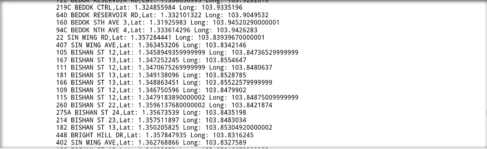

当我们遍历地址列表时，我们在控制台中打印出坐标数据

完成后，让我们将它保存到一个日期框架中:

```
df_coordinates = pd.DataFrame({
    'latitude': latitude,
    'longitude': longitude,
    'blk_no': blk_no,
    'road_name': road_name,
    'postal_code': postal_code,
    'address': address
})
len(df_coordinates)
```

我们需要为下一个任务找到解决方案，为数据框中的每个地址找到最近的 MRT，并获得以米为单位的距离。

## 寻找坐标列表之间的最短距离


来源:维基百科

我们将使用哈弗辛公式来获得曲面上两点之间的距离。或者，我们也可以使用毕达哥拉斯定理，因为我们两点之间的距离并不大。但是为了简单起见，我们将使用 geopy 包来计算哈弗辛公式。

```
***# Lists of all the coordinates we will need to iterate through***
list_of_lat = df_coordinates['latitude']
list_of_long = df_coordinates['longitude']
mrt_lat = mrt_location['latitude']
mrt_long = mrt_location['longitude']***# Zipping the respective Lat and Long lists together as a list of tuples***
list_of_coordinates = []
for lat, long in zip(list_of_lat, list_of_long):
    list_of_coordinates.append((lat,long))for lat, long in zip(mrt_lat, mrt_long):
    list_of_mrt_coordinates.append((lat, long)) 
```

要获得地图上任意给定点的最近的 MRT 车站，我们需要:

*   遍历我们的地址列表
*   获取地址和所有捷运站之间的距离
*   将它存储到列表中
*   从那里我们将采取最短的距离作为最近的捷运站

上面我们有一个嵌套的 for 循环，它遍历 2 组坐标，为数据集中的每个唯一地址获取最近的 MRT。尽管这肯定不是最有效的解决方案。例如，我们可以将我们的地址分组到新加坡的各个地区，并且只检查位于给定距离内的 MRT 站列表，而不是整个列表。但是现在我们将依靠 CPU 的强大力量来为我们制造这些数字:)

我们将同样计算到 CBD 的距离和到最近的购物中心的距离。

```
***# Storing our distance into our data frame as a new column***
df_coordinates['min_dist_mrt'] = min_dist_mrt
df_coordinates['min_dist_mall'] = min_dist_mall
df_coordinates['cbd_dist'] = cbd_dist
```

## 把它们放在一起

最后，我们将使用外部连接将距离数据与主数据框合并。

```
combined = df_coordinates.merge(df_hdb_price, on="address", how='outer')
```

## 一些数据卫生步骤

```
# Converting to the right data types
combined['resale_price'] = combined['resale_price'].astype('float')
combined['floor_area_sqm'] = combined['floor_area_sqm'].astype('float')combined['lease_commence_date'] = combined['lease_commence_date'].astype('int64')
combined['lease_remain_years'] = 99 - (2019 - combined['lease_commence_date'])
combined.columnscombined.dropna(inplace=True)combined['price_per_sqm'] = combined['resale_price'].div(combined['floor_area_sqm'])
```

我们已经准备好绘制我们的价格/平方米到 CDB 的距离关系图！

## 绘制钻头租金关系

```
g = sns.scatterplot(x=combined['cbd_dist'],y=combined['price_per_sqm'], hue=combined['flat_type'], ax=ax1)box = g.get_position()
g.set_position([box.x0, box.y0, box.width * 0.85, box.height]) # resize positiong.legend(loc='center right', bbox_to_anchor=(1.2, 0.5), ncol=1)plt.show()
```

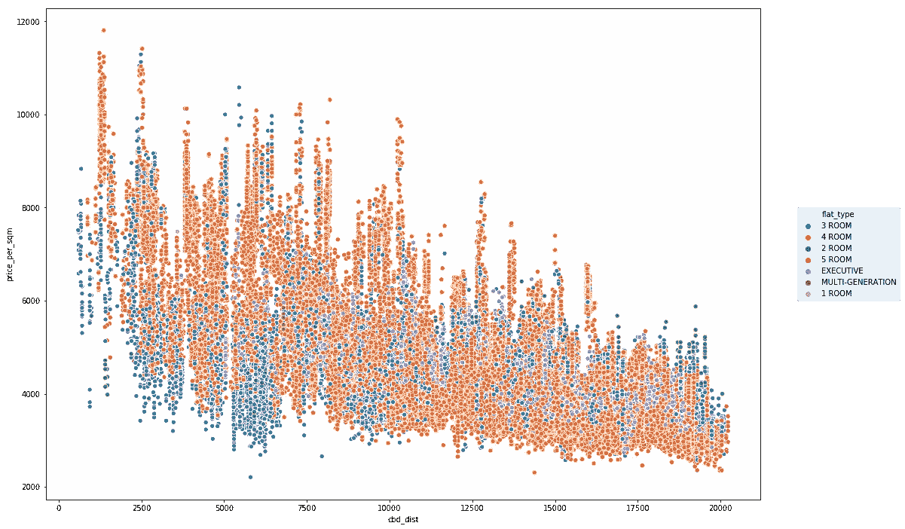

新加坡转售组屋的位租关系

从我们的数据中，我们明确看到了距离和每平方米价格之间的负相关关系。但是在房地产和中央商务区之间的某些距离间隔上也有很大的差异。除了我们的 cdb_dist 变量之外，肯定还有其他决定地价的解释性因素。让我们探索变量之间的相关性。

```
corrMatrix = df_numerical_cols.corr()
sns.heatmap(corrMatrix, 
        xticklabels=corrMatrix.columns,
        yticklabels=corrMatrix.columns,
        cmap='coolwarm',
        annot=True)
```

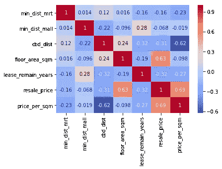

看起来，到关键设施的距离，如捷运和购物中心，对我们的土地价格有影响。而土地租赁也可以解释部分价格。

## 线性回归模型

我们将使用一个简单的多元线性回归模型进一步探索我们的特征的解释能力。让我们设计我们需要的功能。

```
**# Separate our numerical and categorical variables**
cat_features = ['town', 'flat_type', 'storey_range']
num_features = ['min_dist_mrt', 'min_dist_mall', 'cbd_dist','floor_area_sqm', 'lease_remain_years', 'resale_price', 'price_per_sqm']
target = ['resale_price']**# New data frame for our regression model**
df_reg = combined[['town', 'flat_type', 'storey_range', 'min_dist_mrt', 'min_dist_mall', 'cbd_dist','floor_area_sqm', 'lease_remain_years', 'resale_price', 'price_per_sqm']]
```

映射序数分类特征:

```
flat_type_map = {
    'EXECUTIVE': 7,
    'MULTI-GENERATION': 6,
    '5 ROOM': 5,
    '4 ROOM': 4,
    '3 ROOM': 3,
    '2 ROOM': 2,
    '1 ROOM': 1
}df_reg['flat_type_mapped'] = df_reg['flat_type'].map(lambda x: flat_type_map[x])def split_mean(x):
    split_list = x.split(' TO ')
    mean = (float(split_list[0])+float(split_list[1]))/2
    return meandf_reg['storey_mean'] = df_reg['storey_range'].apply(lambda x: split_mean(x))
```

一键编码我们的“城镇”功能:

```
# One-Hot Encoding for our categorical variables and drop 1 of our dummy variables
df_reg = pd.get_dummies(data=df_reg, columns=['town'], drop_first=True)
```

创建我们的回归模型:

```
import statsmodels.api as sm

X = df_reg[['min_dist_mrt', 'min_dist_mall',
       'cbd_dist', 'floor_area_sqm', 'lease_remain_years',
       'flat_type_mapped', 'storey_mean']] 
y = df_reg["price_per_sqm"]X = sm.add_constant(X)model = sm.OLS(y, X).fit()
predictions = model.predict(X)# Print out the statistics
model.summary()
```

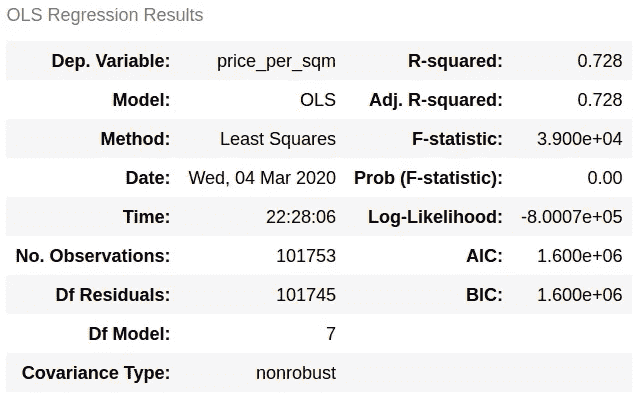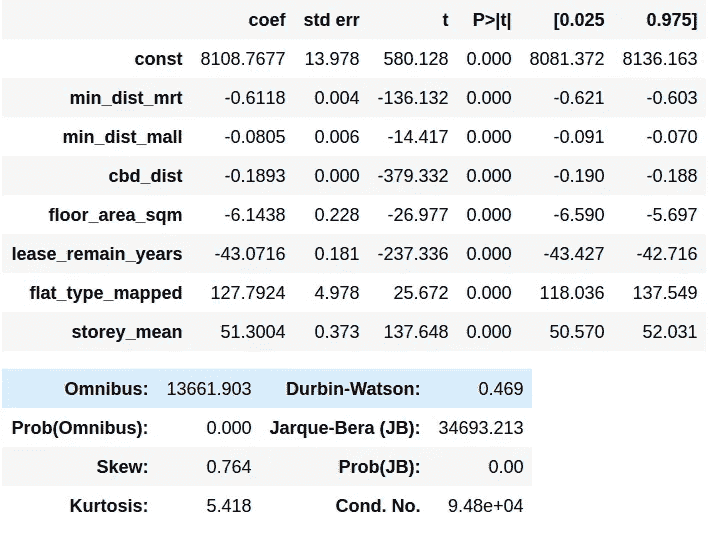

## 解释我们的结果

*   r 平方-这是预测的解释方差的百分比。我们的模型只能解释约 0.728 或 72.8%的数据差异
*   我们的系数的统计显著性-我们在模型中的 p 值很小(< 0.05)，因此我们可以拒绝零假设，并得出结论，我们的变量与我们的每平方米价格有因果关系。事实上，我们与 CDB 的距离每增加 1 米，每平方米的价格就会下降 0.19 美元

## 检查回归误差指标

```
from sklearn import metricsprint('Mean Absolute Error:', metrics.mean_absolute_error(df_reg["price_per_sqm"], predictions))  
print('Mean Squared Error:', metrics.mean_squared_error(df_reg["price_per_sqm"], predictions))  
print('Root Mean Squared Error:', np.sqrt(metrics.mean_squared_error(df_reg["price_per_sqm"], predictions)))***# Output***
Mean Absolute Error: 476.06461056219956
Mean Squared Error: 395453.2820071103
Root Mean Squared Error: 628.8507629057234
```

平均结果误差给出了模型预测的实际数据的平均绝对值。与我们的数据集中每平方米价格的范围和平均值相比，我们的 MAE 相当小。

从我们的 RMSE 值来看，我们的模型的预测平均会与实际价值相差 628.85 美元。如果我们将 RMSE 作为每平方米平均价格的一个百分比，那么我们将得到 14%的误差率，这是相当高的。

## 改进我们的模型

让我们通过在回归中引入分类变量来提高模型的解释力。

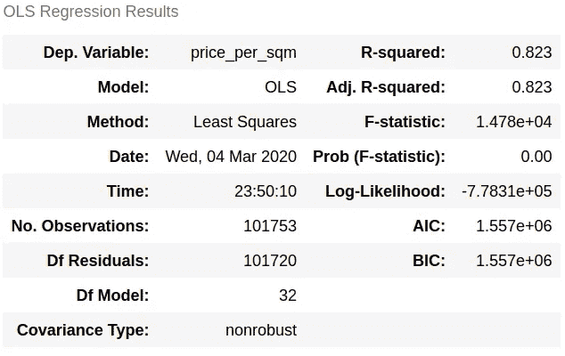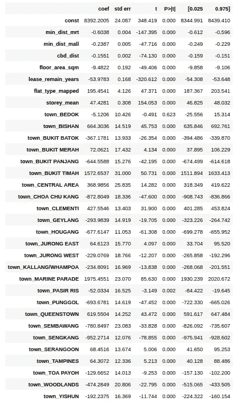

*   我们可以看到，我们的 R 平方值提高了，可以解释我们数据集中 82.3%的方差
*   我们看到，房产所属的城镇对其每平方米价格有着巨大而显著的影响
*   武吉提马、海洋游行、碧山，这些都是新加坡非常受欢迎的房地产，与芽笼(红灯区)、后港(反对党)等传统上不太受欢迎的地区相比，溢价要高得多

```
Mean Absolute Error: 382.26714892132696
Mean Squared Error: 257854.07863672107
Root Mean Squared Error: 507.7933424501754
```

我们的平均误差、均方误差和 RSME 都降低了，这意味着我们的模型有了更高的精度。我们的 RMSE/均值也降到了 11.2%。

## 结论

显然，从统计数据来看，到中央商务区的距离和每平方米的价格之间存在显著的关系。但是，这并不能完全解释新加坡 HDB 的房价。从我们的回归模型中，我们看到住宅地产定价有更多的因素，如设施、政治边界、物业的成熟度以及它所在的地产，这些因素可能比到中央商务区的距离具有更强的解释力和预测力。

感谢阅读到最后！这是一篇很长的文章，希望它能帮助你更好地理解如何与 Python 中的 API 进行交互，以及它如何帮助你自动化数据处理和分析工作流！更多数据和 Python 相关内容请关注我:)