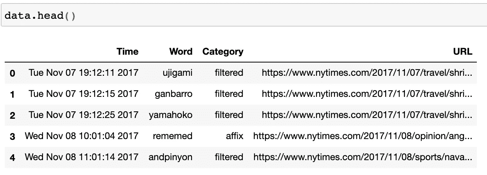

# 处理数据:纽约时报“新词”数据集

> 原文：<https://towardsdatascience.com/working-with-data-new-york-times-new-words-dataset-524d7a550beb?source=collection_archive---------34----------------------->

由[卢克·切瑟](https://unsplash.com/@lukechesser?utm_source=medium&utm_medium=referral)在 [Unsplash](https://unsplash.com?utm_source=medium&utm_medium=referral) 上拍摄的照片

> 在本文中，我将介绍和分析我用来清理、构建和可视化这个数据集的几个步骤。

几周前，我在推特上看到一个数据集。这个数据集是由两个 NLP 的博士生放在一起的，目的是激励 NLP 和语言学研究。在最初检查了数据集并与创建者交谈后，我从 GitHub 中分出了存储库，并开始探索数据([https://github.com/yuvalpinter/nytwit](https://github.com/yuvalpinter/nytwit))。

我碰到的原推文(谢谢，推特！)

在处理这个数据集时，我首先采取了一些初步的 EDA 措施:

1.  查看我们正在使用的数据集的类型
2.  检查形状(行、列)
3.  查看头部和尾部(第一行和最后 5 行)
4.  检查所有行和列(。信息())
5.  获取一些介绍性的统计数据(。describe())
6.  用获取值计数。值计数()

# 1.查看数据集的类型

这将使我们更好地理解我们正在处理的数据，以及可用于转换数据和检索见解的方法。为此，我们只需运行以下代码:

类型(数据)告诉我们，我们正在处理一个熊猫数据帧

告诉我们，我们正在处理一个“二维的、大小可变的、潜在异构的表格数据集”虽然这个语句中有很多内容需要解开，但这意味着我们的数据具有可以转换和过滤(大小可变)的行和列(二维)，并且这些可转换的行和列包含潜在的异构数据类型(int64、float64、object、bool、datetime64 的混合)。

# 2.检查形状(行、列)

接下来，为了检查数据集中有多少行和列，我们编写以下代码行:

data.shape 将返回数据集的行数和列数

如上所述，`(2587, 4)`告诉我们有 2587 行和 4 列。

# 3.查看头部和尾部(第一行和最后 5 行)

现在我们对数据的大小和类型有了更好的了解，我们想检查一下我们正在处理哪种单元格值和列。这将让我们更好地了解我们可以用数据集合理地计算/测量什么。以下代码行将完成这一任务:

data.head()将返回数据集的前五行

data.tail()将返回数据集的最后 5 行

# 4.检查所有行和列

在我们知道数据的类型、大小和条目之后，分析每一列的数据类型是很重要的。这是通过使用。info()，如下面的操作所示:

。info()正在运行！

因此，到目前为止，我们的一些主要收获是:

1.  我们正在处理一个熊猫数据框架
2.  我们有 2587 行和 4 列
3.  这 4 列是时间、单词、类别和 URL。时间列统一表示为`{Day of Week} {Month} {Day of Month} {Minutes}:{Hours}:{Seconds} {Year}`。这将很容易将时间和日期分成单独的列，并通过索引访问特定的值。最后，类别和时间列包含重复的条目(我们可以从。头()和。tail())。
4.  我们的列中没有空值，所有的数据类型(Dtype)都是`Object`(我们正在处理*干净的*数据)。

这些都是我们可以用**来构建的好点子。形容()**和**。value_counts()** ！

# 5.获取一些介绍性的统计数据(。describe())

现在，关键是我们要对数据集进行一些基本的统计测量。即使我们所有的数据类型都是对象(而不是 int64)，我们仍然可以通过使用。describe(include = NP . object)(**注意:** `**include = np.object**` **当你有*对象*和*非对象* Dtypes 时很有帮助，但也可以只包含对象 Dtypes** )。代码如下所示:

。描述(include=np.object)

在这里，我们找到了数据集中最频繁出现的时间、单词、类别和 URL 值。这让我们深入了解我们可以可视化的内容(使用直方图、散点图等)。)以及我们可能需要在数据集中清理的东西(冗余行、不正确或意外的值等)。).接下来，我们需要更好地了解数据集列中的唯一值。这将有助于我们发现创建有效子数据集和将重要值分组在一起的方法。

# 6.用获取值计数。值计数()

我们可以利用。value_counts()在我们所有的列上，但是为了这个例子，我将把重点放在“Category”列上。代码如下:

类别列中的所有唯一值及其频率。

现在，我们对数据集有了很好的感觉，并准备构建一些可视化工具来传达我们发现的信息。首先，让我们使用 Plotly 和我们的“T3”数据框架构建一个直方图。

我喜欢 Plotly 的一点是它的简单性和交互性，这是我构建的每个情节的标准。虽然下面的截图不会包括交互式触摸，但我鼓励你去看看他们的图形库([https://plotly.com/](https://plotly.com/))。代码如下:

这是输出结果:

简单易用的直方图

最后，让我们用 Seaborn 构建一个 distplot。在这里，我们将可视化每个月的每个日期有多少单词被添加到数据集(跨所有月份)。下面是我们将编写的代码，用于设置适当的 panda 系列和 distplot:

我们输入 sns.distplot()的熊猫系列代码

这里，我们创建一个空列表(`date_df`)，我们可以用来自`df['Time']`的值填充它。每次我们遍历`df['Time']`时，我们都会将`val[8:10]`(一个月中的几天)添加到`date_df`列表中。我们用`[8:10]`索引`val`,因为这是`{Day of Week} {Month} {**Day of Month**} … {Year}` 中日期索引出现的地方。在这之后，我们将`date_df`转换成熊猫系列(因为我们想要一个**一维数组**，而不是一个列表)。最后，我们用`kde = False`(删除内核密度估计值)、`fit = norm`(用正态分布拟合我们的图)和`color='g'`(将我们的频率条格式化为绿色)来配置 distplot。总的来说，这产生了以下视觉效果:

使用 Seaborn 快速简单地构建 distplot()。

这是一个非常基本的视觉需要一些工作，但它是一个良好的开端，为我们提供了宝贵的信息！

在本文中，我们讨论了 ed a 的许多重要部分。在接下来的几周里，我希望通过使用其他数据集和讨论我在处理数据时采取的其他重要步骤来继续建立这一基础。一些策略可能广泛适用于不同的数据集，而另一些策略可能专门针对我在文章中讨论的那个数据集。无论如何，我相信它会帮助你继续像数据科学家一样思考！直到下次，

丹·m。

附注:和往常一样，请随时向 danielmurph8@gmail.com 提出问题、意见和担忧。谢谢！