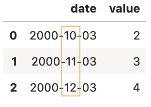
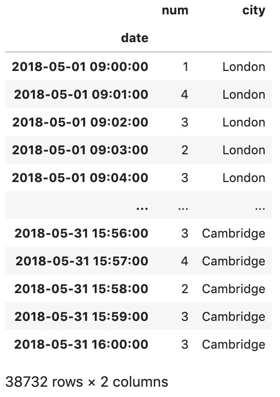

# 在 Pandas 数据框架中使用日期时间

> 原文：<https://towardsdatascience.com/working-with-datetime-in-pandas-dataframe-663f7af6c587?source=collection_archive---------0----------------------->

## 帮助你开始数据分析的一些熊猫技巧


照片由[卢卡斯·布拉塞克](https://unsplash.com/@goumbik?utm_source=unsplash&utm_medium=referral&utm_content=creditCopyText)在 [Unsplash](https://unsplash.com/s/photos/pandas-time?utm_source=unsplash&utm_medium=referral&utm_content=creditCopyText) 上拍摄

Datetime 是数据科学项目中常见的数据类型。通常，您会使用它并遇到问题。我发现 Pandas 是一个了不起的库，它包含了处理日期和时间的广泛功能和特性。

在本文中，我们将讨论以下常见的日期时间问题，应该可以帮助您开始数据分析。

1.  将字符串转换为日期时间
2.  从多个列组合一个日期时间
3.  获取年、月和日
4.  获取一年中的星期、星期几和闰年
5.  从出生日期得到年龄
6.  通过将日期列设置为索引来提高性能
7.  选择特定年份的数据并执行聚合
8.  选择具有特定月份和特定日期的数据
9.  选择两个日期之间的数据
10.  处理缺失值

源代码请查看我的 [Github repo](https://github.com/BindiChen/machine-learning/blob/master/data-analysis/008-pandas-datetime/pandas-datetime.ipynb) 。

# 1.将字符串转换为日期时间

Pandas 有一个名为`to_datetime()`的内置函数，可以用来将字符串转换为日期时间。让我们看一些例子

## 使用默认参数

Pandas `to_datetime()`能够将任何有效的日期字符串解析为 datetime，而不需要任何额外的参数。例如:

```
df = pd.DataFrame({**'date': ['3/10/2000', '3/11/2000', '3/12/2000']**,
                   'value': [2, 3, 4]})df['date'] = **pd.to_datetime(df['date'])** df
```


## 首日格式

默认情况下，`to_datetime()`会先解析月( **MM/DD** 、 **MM DD、**或 **MM-DD** )格式的字符串，这种安排在美国是比较独特的。

在世界上的大多数地方，日期是先写的( **DD/MM** 、 **DD MM** 或 **DD-MM** )。如果你想让熊猫先考虑日子而不是月份，你可以将参数`dayfirst`设置为`True`。

```
df = pd.DataFrame({**'date': ['3/10/2000', '3/11/2000', '3/12/2000']**,
                   'value': [2, 3, 4]})df['date'] = pd.to_datetime(df['date'], **dayfirst=True**)
df
```



或者，您可以向参数`format`传递一个自定义格式。

## 自定义格式

默认情况下，使用来自`dateutil.parser.parse`的 Pandas 内置解析器解析字符串。有时，您的字符串可能是自定义格式，例如， **YYYY-DD-MM HH:MM:SS** 。熊猫`to_datetime()`有一个名为`format`的参数，它允许你传递一个自定义格式:

```
df = pd.DataFrame({**'date': ['2016-6-10 20:30:0', 
                            '2016-7-1 19:45:30', 
                            '2013-10-12 4:5:1']**,
                   'value': [2, 3, 4]})df['date'] = pd.to_datetime(df['date'], **format="%Y-%d-%m %H:%M:%S"**)
df
```


## 用`infer_datetime_format`加速解析

如果不是 ISO8601 格式而是常规格式，传递`infer_datetime_format=True`通常可以加快解析速度。根据[1]，在某些情况下，这可以将解析速度提高 5-10 倍。

```
# Make up 3000 rows
df = pd.DataFrame({'date': ['3/11/2000', '3/12/2000', '3/13/2000'] * 1000 })%timeit pd.to_datetime(df['date'], **infer_datetime_format=True**)
100 loops, best of 3: **10.4 ms** per loop%timeit pd.to_datetime(df['date'], **infer_datetime_format=False**)
1 loop, best of 3: **471 ms** per loop
```

## 处理解析错误

如果日期字符串不符合时间戳格式，您将得到一个**类型错误**。

```
df = pd.DataFrame({'date': ['3/10/2000', **'a/11/2000'**, '3/12/2000'],
                   'value': [2, 3, 4]})
df['date'] = pd.to_datetime(df['date'])
```


`to_datetime()`有一个名为`errors`的参数，允许您忽略错误或将无效值强制给`NaT`。

```
df['date'] = pd.to_datetime(df['date'], **errors='ignore'**)
df
```


```
df['date'] = pd.to_datetime(df['date'], **errors='coerce'**)
df
```


此外，如果您想在从 CSV 文件中读取数据时解析日期列，请查看下面的文章

[](/4-tricks-you-should-know-to-parse-date-columns-with-pandas-read-csv-27355bb2ad0e) [## 您应该知道的用 Pandas read_csv()解析日期列的 4 个技巧

### 一些最有用的熊猫把戏

towardsdatascience.com](/4-tricks-you-should-know-to-parse-date-columns-with-pandas-read-csv-27355bb2ad0e) 

# 2.从多个列组合一个日期时间

`to_datetime()`也可以用于从多个列组合一个日期时间。键(列标签)可以是常见的缩写，如 **['年'，'月'，'日'，'分钟'，'秒'，' ms '，' us '，' ns'])** 或相同的复数。

```
df = pd.DataFrame(**{'year': [2015, 2016],
                   'month': [2, 3],
                   'day': [4, 5]}**)df['date'] = pd.to_datetime(df)
df
```


# 3.获取年、月和日

`dt.year`、`dt.month`和`dt.day`是从熊猫日期时间对象中获取年、月和日的内置属性。

首先，让我们创建一个伪 DateFrame 并将 **DoB** 解析为 datetime。

```
df = pd.DataFrame({'name': ['Tom', 'Andy', 'Lucas'],
                 'DoB': ['08-05-1997', '04-28-1996', '12-16-1995']})
df['DoB'] = **pd.to_datetime(df['DoB'])**
```

得到年、月、日

```
df['year']= **df['DoB'].dt.year**
df['month']= **df['DoB'].dt.month**
df['day']= **df['DoB'].dt.day**
df
```


# 4.获取一年中的星期、星期几和闰年

类似地，`dt.week`、`dt.dayofweek`和`dt.is_leap_year`是获取一年中的星期、星期几和闰年的内置属性。

```
df['week_of_year'] = **df['DoB'].dt.week**
df['day_of_week'] = **df['DoB'].dt.dayofweek**
df['is_leap_year'] = **df['DoB'].dt.is_leap_year**
df
```


请注意，Pandas `**dt.dayofweek**`属性返回一周中的某一天，并且假设该周从星期一开始，用 0 表示，到星期天结束，用 6 表示。要用全名替换号码，我们可以创建一个映射并将其传递给`map()`:

```
**dw_mapping={
    0: 'Monday', 
    1: 'Tuesday', 
    2: 'Wednesday', 
    3: 'Thursday', 
    4: 'Friday',
    5: 'Saturday', 
    6: 'Sunday'
}** 
df['day_of_week_name']=df['DoB'].dt.weekday**.map(dw_mapping)**
df
```


# 5.从出生日期得到年龄

获得年龄的最简单方法是减去年份:

```
**today = pd.to_datetime('today')**
df['age'] = **today.year - df['DoB'].dt.year**df
```


然而，这是不准确的，因为人们今年可能还没有过生日。更准确的解决方案是考虑生日

```
# Year difference
today = pd.to_datetime('today')
diff_y = today.year - df['DoB'].dt.year
# Haven't had birthday
b_md = df['DoB'].apply(lambda x: (x.month,x.day) )
**no_birthday = b_md > (today.month,today.day)**df['age'] = **diff_y - no_birthday**
df
```


# 6.通过将日期列设置为索引来提高性能

按日期选择数据的常见解决方案是使用布尔马克斯。例如

```
condition = (df['date'] > start_date) & (df['date'] <= end_date)
df.loc[condition]
```

该解决方案通常要求`start_date`、`end_date`和**日期**列为日期时间格式。事实上，当您在大型数据集中按日期进行大量选择时，这种解决方案会很慢。

如果您要按日期进行大量选择，首先将日期列设置为索引会更快，这样您就可以利用 Pandas 内置的优化。然后，您可以使用`df.loc[start_date:end_date]`按日期选择数据。让我们看一个示例数据集 city_sales.csv，它有 1，795，144 行数据

```
df = pd.read_csv('data/city_sales.csv',parse_dates=['date'])
df.info()RangeIndex: **1795144** entries, 0 to 1795143
Data columns (total 3 columns):
 #   Column  Dtype         
---  ------  -----         
 0   date    datetime64[ns]
 1   num     int64         
 2   city    object        
dtypes: datetime64[ns](1), int64(1), object(1)
memory usage: 41.1+ MB
```

将日期列设置为索引

```
**df = df.set_index(['date'])**
df
```


# 7.选择特定年份的数据并执行聚合

假设我们想要选择 2018 年的所有数据

```
df.loc['2018']
```


并对选择执行聚合，例如:

获取 2018 年总人数

```
df.loc**['2018','num'].sum()****1231190**
```

获取 2018 年每个城市的总人数

```
df['2018']**.groupby('city').sum()**
```


# 8.选择具有特定月份和特定日期的数据

选择特定月份的数据，例如 2018 年 5 月

```
df.loc[**'2018-5'**]
```



类似地，选择一个月中特定日期的数据，例如 2018 年 5 月 1 日

```
df.loc[**'2018-5-1'**]
```


# 9 选择两个日期之间的数据

要选择两个日期之间的数据，可以使用`df.loc[start_date:end_date]`例如:

选择 2016 年到 2018 年之间的数据

```
df.loc[**'2016' : '2018'**]
```

选择 2018 年 5 月 2 日 10 点到 11 点之间的数据

```
df.loc[**'2018-5-2 10' : '2018-5-2 11'** ]
```

选择 2018 年 5 月 2 日 10:30 至 10:45 之间的数据

```
df.loc[**'2018-5-2 10:30' : '2018-5-2 10:45'** ]
```

而要选择时间之间的数据，我们要用`between_time()`，比如 10:30 和 10:45

```
df.**between_time('10:30','10:45')**
```

# 10 处理缺失值

我们经常需要计算窗口统计，例如**滚动平均值**或**滚动总和。**

让我们计算 3 个窗口期间的滚动总和，然后看看前 5 行。

```
df['rolling_sum'] = **df.rolling(3).sum()**
df.head()
```


我们可以看到，只有当有 3 个周期可以回顾时，它才开始有有效值。处理这个问题的一个解决方案是通过**回填数据**。

```
df['rolling_sum_backfilled'] = **df['rolling_sum'].fillna(method='backfill')**
df.head()
```


有关回填的更多细节，请查看以下文章

[](/working-with-missing-values-in-pandas-5da45d16e74) [## 处理熊猫中缺失的值

### 关于 Pandas 中缺失值以及如何使用内置方法处理它们的教程

towardsdatascience.com](/working-with-missing-values-in-pandas-5da45d16e74) 

# 好了

感谢阅读。

请在我的 Github 笔记本上查看源代码。

如果你对机器学习的实用方面感兴趣，请继续关注。

以下是为您挑选的一些文章:

*   [处理熊猫中缺失的值](/working-with-missing-values-in-pandas-5da45d16e74)
*   [用熊猫 read_csv()解析日期列的 4 个技巧](/4-tricks-you-should-know-to-parse-date-columns-with-pandas-read-csv-27355bb2ad0e)
*   [熊猫 read_csv()加快数据分析速度你应该知道的小技巧](/all-the-pandas-read-csv-you-should-know-to-speed-up-your-data-analysis-1e16fe1039f3)
*   [加快数据分析速度你应该知道的 6 个熊猫技巧](/6-pandas-tricks-you-should-know-to-speed-up-your-data-analysis-d3dec7c29e5)
*   数据科学项目开始时应该包括的 7 个设置。

# 参考

*   [1] [熊猫来 _ 日期时间官方文件](https://pandas.pydata.org/pandas-docs/stable/reference/api/pandas.to_datetime.html)