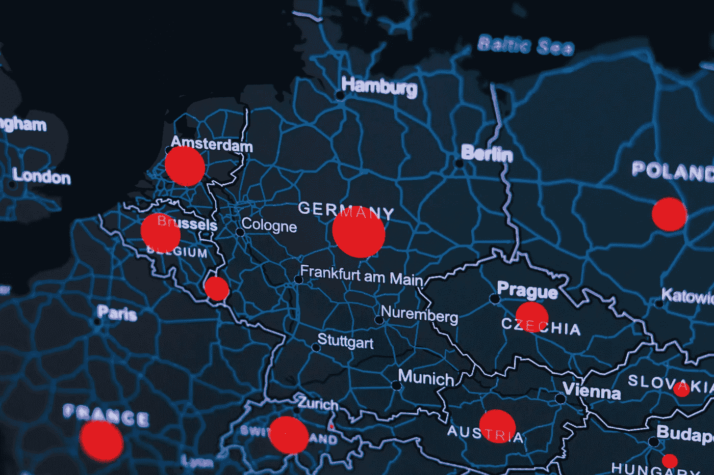
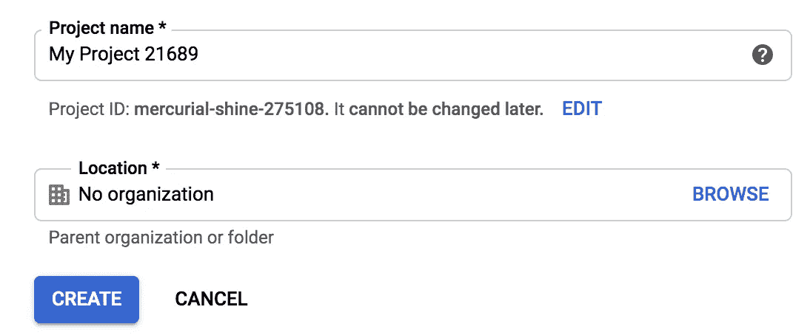
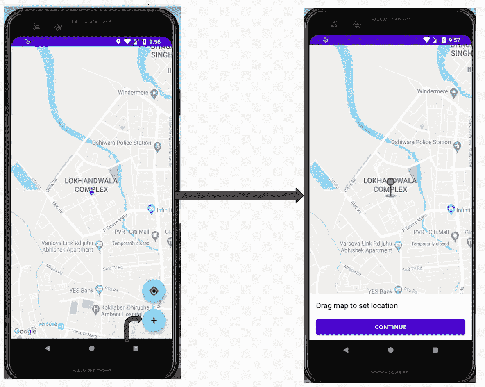
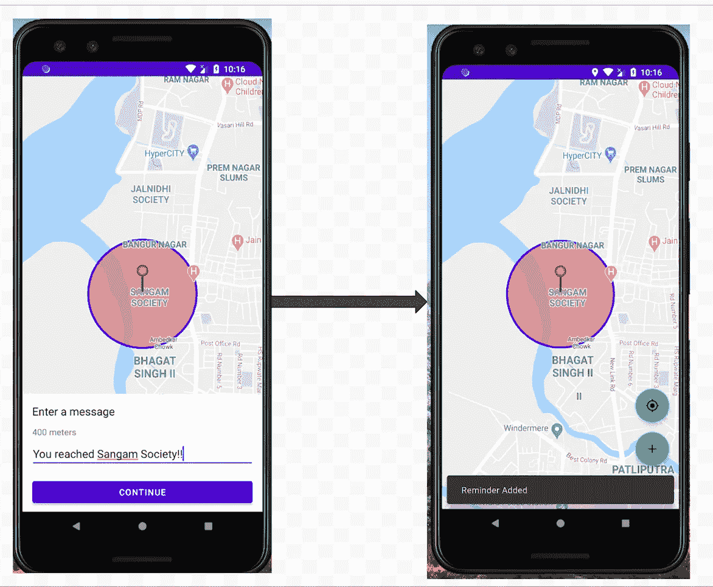
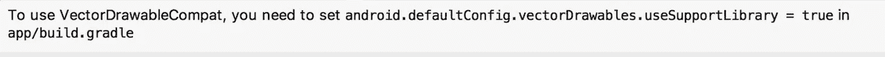
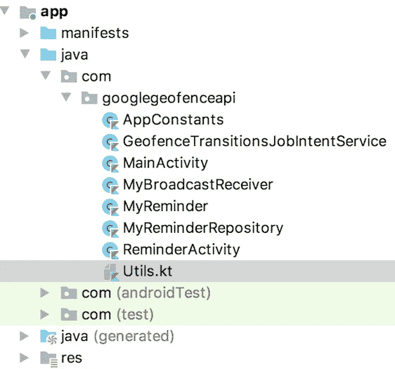
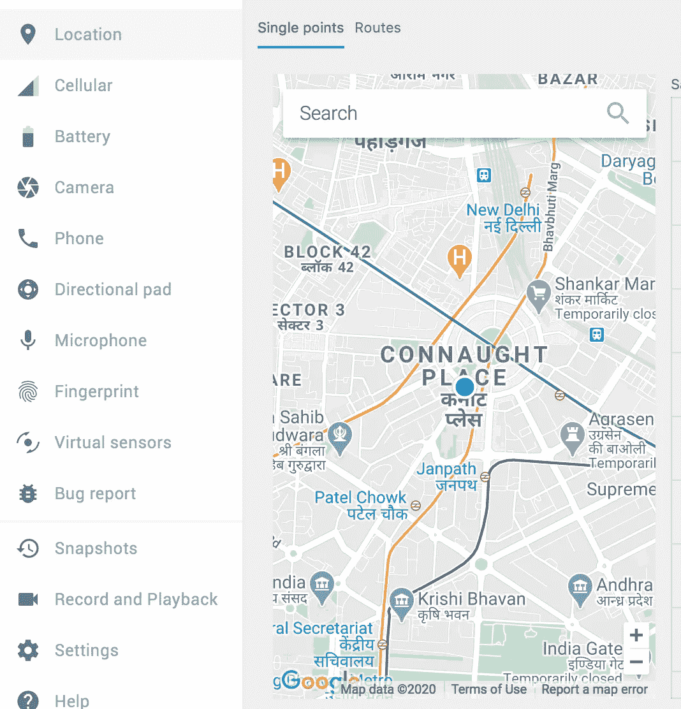
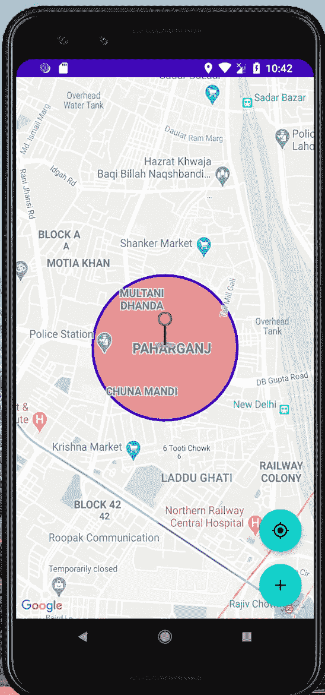
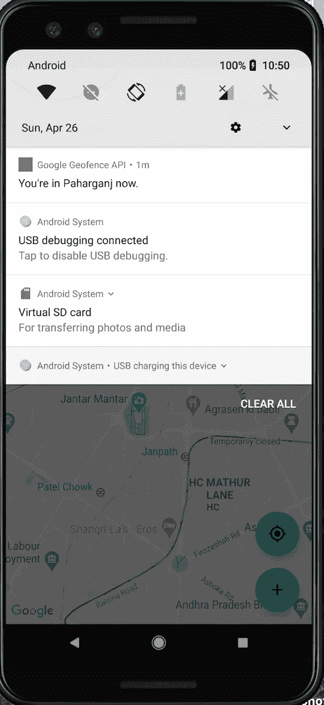

# 使用 Geofence API 锁定特定区域的用户

> 原文：<https://towardsdatascience.com/working-with-google-geofence-api-2e04a227ff27?source=collection_archive---------32----------------------->

## Geofence API 为设备提供了监控全球圆形区域的能力



[KOBU 机构](https://unsplash.com/@kobuagency?utm_source=unsplash&utm_medium=referral&utm_content=creditCopyText)在 [Unsplash](https://unsplash.com/s/photos/google-map?utm_source=unsplash&utm_medium=referral&utm_content=creditCopyText) 上拍摄的照片

当你想通知用户他们是否在世界上的特定区域附近(如购物中心、机场、餐馆等)时，可以使用谷歌地理围栏 API。).例如，客户安装了一个在线购物应用程序，如果他们在与该应用程序有联系的商店附近，商店可以在应用程序中生成通知，让客户知道他们附近的商店正在为他们提供特价。这样你可以吸引更多的用户。

# 获取谷歌地图 API 密钥

要使用 Geofence API，您必须通过以下步骤获取 Google Maps API 密钥。

*   点击 [**这个**](https://console.cloud.google.com/projectcreate) 链接打开谷歌云平台，如果你还没有登录，那么请先登录并创建项目。



你可以给这个项目起任何名字，或者你可以让它保持原样，然后现在点击**创建**。

*   现在确保您已经选择了新创建的项目。


*   现在点击左边的菜单图标，选择**API&服务**，然后从子列表中选择**库**。
*   搜索 **Maps SDK for Android** 和**启用**该 API(不要忘记启用 API，因为这很重要)
*   现在再次点击左侧的菜单图标，选择**凭证**，然后选择 **+创建凭证**，最后点击 **API 键**
*   复制这个 API 键并将其粘贴到 string.xml 文件中

# 我们将要建造的

我们将构建一个应用程序，允许您在地图上设置您的位置(或者准确地说是特定区域)。当你到达指定位置时，你的应用程序会用你在设置位置时定义的消息通知你。

最后，你会有一个看起来像这样的应用程序。



要在地图上设置位置，您可以将标记拖到所需的位置。指定位置后，您可以点击**继续**按钮继续。



你现在兴奋吗？我相信你会的。

# 我们会学到什么？

*   谷歌地图 API
*   谷歌地理围栏 API
*   服务
*   广播收音机
*   创建通知
*   在共享首选项中存储和检索自定义对象

现在，让我们快速设置我们的项目并继续。

# 设置 Android 项目

*   创建一个新的 Android 项目，选择空的 activity，给你的项目起一个你想要的名字。
*   在您的应用程序级 **build.gradle** 中添加以下依赖项

```
implementation **'com.google.android.gms:play-services-location:16.0.0'** implementation **'com.google.android.gms:play-services-maps:16.0.0'** implementation **'com.google.code.gson:gson:2.8.5'** implementation **"com.google.android.material:material:1.1.0-alpha02"**
```

*   如果在 activity.xml 文件中遇到以下错误



然后在您的 **build.gradle** 中添加以下代码行

```
android{ defaultConfig {
vectorDrawables.useSupportLibrary = **true**}}
```

*   在您的`**AndroidManifest.xml**`文件中添加以下权限

```
<**uses-permission android:name="android.permission.INTERNET"** />
<**uses-permission android:name="android.permission.ACCESS_FINE_LOCATION"** />
```

*   现在将下面的元数据标签添加到您的`**AndroidManifest.xml**`文件中的`**<application>**`标签内，稍后我们将在这里添加 **API_KEY** 。

```
<**meta-data
    android:name="com.google.android.geo.API_KEY"
    android:value="API_KEY"**/>
```

*   最后，同步项目和设置完成。

让我们快速熟悉一下这个应用中使用的一些 android 组件

**服务:**服务是一个 android 组件，用来执行后台任务。任务可以是任何类型的，例如上传照片、同步服务器上的用户数据和生成通知等。

**广播接收器:**广播接收器也是 android 的一个基本组件，当你想在你的应用程序中执行一些基于未来事件的操作时，它会很方便。例如，您只希望在手机连接到 WIFI 时将用户数据上传到您的服务器，另一个例子是，您希望在用户重启手机时启动后台服务。

**pending content:**`PendingIntent`类似于正常意图，只是不会立即执行。

# 让我们了解我们的班级

我把所有的类、实用函数和常量都放在根包中。



让我们逐一了解。

*   **MainActivity.kt:** 这是我们的主屏幕，它将向您显示谷歌地图和右下角的两个操作按钮。第一个按钮将允许您放大地图，加号操作按钮将打开新活动`**ReminderActivity.kt**`，在此屏幕上您可以选择您的位置，设置消息并保存提醒。
*   **ReminderActivity.kt:** 正如我所解释的，这个活动将允许您设置位置并将提醒保存在共享首选项中。当您选择位置并保存它时，您将看到您指定的位置周围的圆圈。这个圆是你将在代码中定义的边界或半径。圆圈越大，意味着它将覆盖更大的区域。当你进入这个区域，你会收到一个通知。
*   **MyBroadcast Receiver:** 这是一个广播接收器，当用户到达指定位置时会被触发。当这个广播接收器触发时，它将执行后台服务。
*   这是一个将由我们的广播接收机执行的服务，当它执行时，它生成通知，让用户知道他已经到达他的目的地。
*   这是一个数据类，在它的构造函数中，我接受了四个参数，它们是唯一的 id、纬度、经度、半径和一条消息。我们将把这些信息保存在共享首选项中，同时，我们将设置待定意向来生成通知。
*   **myreminderRepository . kt:**如你所知，repository 帮助我们获得应用程序的核心方法来执行我们为应用程序定义的操作。所以只有这个类负责添加一个新的提醒，删除提醒和设置挂起的意图。我们将总是创建这个类的对象并执行动作。
*   **Utils.kt:** 这是我们的实用程序类，包含四个方法。`**vectorToBitmap()**`方法将矢量图像转换为位图，`**showReminderInMap()**`方法在地图上显示提醒，这是围绕指定位置画圆的方法。而`**sendNotification()**`方法创建了通知，这个方法由我们的后台服务调用。最后一个方法是`**getUniqueId()**`，它显然返回唯一的 id。
*   **AppConstants.kt:** 这个类包含了这个应用使用的所有常量。这个类还包含一个服务方法和两个调用`MainActivity.kt`和`ReminderActivity.kt`活动的方法。

说够了吗？让我们回到正题…

当您创建一个项目时，您将拥有一个默认的 ActivityMain.kt 类。我要你再创建一个类，命名为 ReminderActivity.kt，在这个类中扩展`AppCompatActivity()`类，实现`OnMapReadyCallback`谷歌地图的接口，实现其方法`onMapReady()`。现在，让一切保持原样。

现在我们将创建我们的 AppConstants 类，并定义所有的常量和一些方法。

在这个类中，我们定义了我们的常量和三个方法，**newintentforminactivity()**方法将调用`MainActivity.kt`类，**newIntentForReminderActivity()**将调用`ReminderActivity.kt`类。我们的广播接收器将调用 enqueueWork()方法来生成通知。
**提示:**所有的常量和方法都定义在`**companion object**`里面，这是因为无论何时我们需要调用这些方法中的任何一个，我们都不必创建这个类的对象。

现在我们将创建 **Utils.kt** 并添加以下方法

## vectorToBimap()

当我们调用这个方法时，我们必须传递两个参数，即`context.resources`和需要转换成位图的图像的 id。`context.*resources*` 为您的应用程序返回一个资源实例。在这个方法中，我得到了 drawable 对象，创建了**位图**和**画布**对象。我们现在在`vectorDrawable`中有了我们的图像，我们将把这个对象转换成`bitmap`，然后在画布上绘制位图，设置它的边界并返回。

**提示:**如果你不熟悉**画布**，那么你可以把它想象成一张白纸，你可以在上面画出任何形状。

## showReminderInMap()

`**showReminderInMap()**`方法将上下文、 **GoogleMap** 对象和 **MyReminder** 类对象作为参数，并检查`myReminder`是否有值，然后继续执行，否则不执行任何操作。在`***if***`语句中，我从 myReminder 对象中获取纬度和经度，并将其转换为`LatLng`，在第二个`***if***`语句中，我在指定位置周围画圆。一般来说，这种方法用于在指定的位置上画圆。

## 发送通知()

`sendNotification()`方法非常简单，它除了创建通知之外什么也不做。从服务中调用此方法来显示通知。

## MyBroadcastReceiver.kt 类

现在在您的根目录中创建这个类，并将这个广播接收器添加到您的`**AndroidManifest.xml**`文件中。

```
<**receiver
    android:name=".MyBroadcastReceiver"
    android:enabled="true"
    android:exported="true"** />
```

这个类扩展了抽象类`BroadcastReceiver()`并实现了它的`onReceive()`方法。当 onReceive()方法被执行时，它将执行`AppConstants.kt.`的`enqueueWork()`方法

当您添加提醒时，该接收器将通过`PendingIntent`注册。

## GeofenceTransitionService.kt

创建这个类并在`AndroidManifest.xml`文件中声明它

```
<**service
    android:name=".GeofenceTransitionService"
    android:exported="true"
    android:permission="android.permission.BIND_JOB_SERVICE"** />
```

**注意:**如果在清单中声明了一个作业服务，但没有使用 **BIND_JOB_SERVICE** 权限保护，该服务将被系统忽略。

这是一个扩展了`JobIntentService`类的服务，IntentService 或 JobIntentService 是一个在后台独立线程上运行的服务，它在任务完成时被销毁。要使用这个类，我们必须实现它所需的方法`**onHandleWork()**`。

```
**class** GeofenceTransitionService : JobIntentService() {**override fun** onHandleWork(intent: Intent) {

    **val** geofencingEvent = GeofencingEvent.fromIntent(intent)
    **repositoryMy** = MyReminderRepository(**this**)

    **if** (geofencingEvent.hasError()) {
        Log.e(AppConstants.**LOG_TAG**, **"An error occured"**)
        **return** }
    handleEvent(geofencingEvent)
}
}
```

在这个方法中，我们可以完成我们的任务。我在这个方法中获取`**GeofencingEvent**`类的对象，如果有问题，我们显示错误消息，否则我们调用`handleEvent()`方法。

```
**private fun** handleEvent(event: GeofencingEvent) {

    **if** (event.*geofenceTransition* == Geofence.*GEOFENCE_TRANSITION_ENTER*) {

        **val** reminder = getFirstReminder(event.*triggeringGeofences*)
        **val** message = reminder?.**message
        val** latLng = reminder?.**latLng
        if** (message != **null** && latLng != **null**) {
            *sendNotification*(**this**, message, latLng)
        }
    }
}
```

在此方法中，我们首先使用 GeofencingEvent 对象，检查用户是否进入了指定区域，如果是，则从存储库中获取 reminder 对象，检索其数据并发送通知。

```
**private fun** getFirstReminder(triggeringGeofences: List<Geofence>): MyReminder? {
    **val** firstGeofence = triggeringGeofences[0]
    **return repositoryMy**.get(firstGeofence.*requestId*)
}
```

`**getFirstReminder()**`方法从`MyRepository`类返回`MyReminder`类的对象。

下面是这个服务类的完整代码

**提示:** `**lateinit**` 是 Kotlin 中的一个关键字，可以让你在声明的时候不用初始化它，但是在使用之前应该初始化它，否则你会遇到 **NullPointerException** 。

## MyReminderRepository.kt

您可以将该类视为本地服务器，这意味着它为我们提供了在地图上执行任何操作所需的一切，例如添加提醒或删除提醒以及维护所有提醒。

以下代码片段创建了一个 **GeofencingClient** 对象，帮助您操作地理围栏。

```
**private val geofencingClient** = LocationServices.getGeofencingClient(**context**)
```

这里我们得到了 **SharedPreference** 对象和 **Gson** 对象

```
**private val preferences** = **context**.getSharedPreferences(*PREFS_NAME*, Context.*MODE_PRIVATE*)
**private val gson** = Gson()
```

在`SharedPreference`中，我们将存储提醒，并使用`Gson`对象将 json 字符串转换成 Java 对象，反之亦然。既然 SharedPreference 只能保存键值对形式的原始值，但是我们想要存储我们的类对象，那么这怎么可能呢？。显然，我们可以将我们的对象转换成 json 字符串并存储在 SharedPreference 中，每当我们需要使用它时，我们都会将其转换成一个真实的对象。

## buildGeofence():

纬度、经度和半径的组合称为地理围栏。它是地图上特定位置的圆形区域。每当用户进入这个区域，应用程序就会触发特定的行为。

```
**private fun** buildGeofence(myReminder: MyReminder): Geofence? {
    **val** latitude = myReminder.**latLng**?.**latitude
    val** longitude = myReminder.**latLng**?.**longitude
    val** radius = myReminder.**radius

    if** (latitude != **null** && longitude != **null** && radius != **null**) {
        **return** Geofence.Builder()
            .setRequestId(myReminder.**id**)
            .setCircularRegion(
                latitude,
                longitude,
                radius.toFloat()
            )
            .setTransitionTypes(Geofence.*GEOFENCE_TRANSITION_ENTER*)
            .setExpirationDuration(Geofence.*NEVER_EXPIRE*)
            .build()
    }

    **return null** }
```

看看代码，我们正在使用 **Geofence 构建地理围栏。构建器()**。

在方法 **setRequestId()** 中，我传递了唯一的 Id，因为每个 geofence 都是唯一的，您将从您的模型类中获得这个 id。

在 **setCircularRegion()** 中，我正在设置我的纬度、经度和半径，**所有这些参数一起在一个特定的位置上形成一个圆**。

**setTransitionTypes()** 定义了过渡类型，可以使用`*GEOFENCE_TRANSITION_ENTER*` 在用户进入定义区域时触发事件。

**setExpirationDuration()**方法设置 geofence 的到期时间，我们使用的是`*NEVER_EXPIRE*` ，这意味着它永远不会到期，直到用户删除它。

## buildFencingRequest():

您将使用此方法构建 geofence 请求。

```
**private fun** buildGeofencingRequest(geofence: Geofence): GeofencingRequest {
    **return** GeofencingRequest.Builder()
        .setInitialTrigger(0)
        .addGeofences(*listOf*(geofence))
        .build()
}
```

这里，您将**setinitiatrigger()**设置为 0，这意味着您不希望您的应用程序在已经位于 geofence 内部时触发事件。下一个 addGeofences()方法将请求添加到 geofence。

## 建筑地理围栏待定内容:

正如您在代码片段中看到的，我们在 intent 对象中传递 MyBroadcastReceiver，这意味着当调用此待定 intent 时，它将调用 BroadcastReceiver，而此 Receiver 将调用**geofencetransationservice。**

```
**private val geofencePendingIntent**: PendingIntent **by** *lazy* **{
    val** intent = Intent(**context**, MyBroadcastReceiver::**class**.*java*)
    PendingIntent.getBroadcast(
        **context**,
        0,
        intent,
        PendingIntent.*FLAG_UPDATE_CURRENT* )
**}**
```

该代码只有在`*GEOFENCE_TRANSITION_ENTER*`事件被触发时才会被执行。

**提示:通过** *惰性属性，*该值仅在第一次使用时计算。

## 添加():

这个`add()`方法将提醒添加到 SharedPreference 中，并将请求添加到 geofence 中。

```
**fun** add(myReminder: MyReminder, success: () -> Unit, failure: (error: String) -> Unit)
{
    **val** geofence = buildGeofence(myReminder)
    **if** (geofence != **null** && ContextCompat.checkSelfPermission(**context**, android.Manifest.permission.*ACCESS_FINE_LOCATION*) == PackageManager.*PERMISSION_GRANTED*) {
        **geofencingClient**.addGeofences(buildGeofencingRequest(geofence), **geofencePendingIntent**)
            .addOnSuccessListener **{** saveAll(getAll() + myReminder)
                success()
            **}** .addOnFailureListener **{** failure(**"An error occured"**)
            **}** }
}
```

首先，我们检查权限是否被授予，然后我们继续，接下来，我们使用 **geofencingClient** 创建地理围栏。如果成功，那么只有我们将保存在共享首选项中，否则报告错误消息。

## 移除():

这个方法只是从列表中删除提醒。

```
**fun** remove(myReminder: MyReminder) {
    **val** list = getAll() - myReminder
    saveAll(list)
}
```

## saveAll():

此方法会将列表中的所有提醒事项添加到共享偏好设置中。

```
**private fun** saveAll(list: List<MyReminder>) {
    **preferences** .edit()
        .putString(*REMINDERS*, **gson**.toJson(list))
        .apply()
}
```

注意，我们将列表转换为 Json 字符串，然后存储它。

## getAll():

该方法返回我们存储在共享首选项中的所有提醒列表。

```
**fun** getAll(): List<MyReminder> {
    **if** (**preferences**.contains(*REMINDERS*)) {
        **val** remindersString = **preferences**.getString(*REMINDERS*, **null**)
        **val** arrayOfReminders = **gson**.fromJson(
            remindersString,
            Array<MyReminder>::**class**.*java* )
        **if** (arrayOfReminders != **null**) {
            **return** arrayOfReminders.*toList*()
        }
    }
    **return** *listOf*()
}
```

## getLast():

这个函数返回添加到列表中的提醒。

```
**fun** getLast() = getAll().*lastOrNull*()
```

注意这个函数首先调用返回列表的`getAll()`方法，我们调用`lastOrNull()`函数，它是`List`类的一个方法，这个方法返回最后一个值。

## get():

如果列表不是`null.`，该方法从列表中返回第一个提醒

```
**fun** get(requestId: String?) = getAll().*firstOrNull* **{ it**.**id** == requestId **}**
```

`{it.id == requestId }`是执行空值检查的 lambda 表达式。当 lambda 表达式中只有一个参数时，可以使用`**it**`。

MyReminderRepository.kt 的完整代码

## ReminderActivity.kt:

这个活动允许我们在指定的位置添加新的提醒。

首先，在本活动中创建这些对象。

```
**private lateinit var map**: GoogleMap

**lateinit var myRepository**: MyReminderRepository

**private var reminder** = MyReminder(latLng = **null**, radius = **null**, message = **null**)
```

现在将下面的代码粘贴到您的`onCreate()`方法中

```
**override fun** onCreate(savedInstanceState: Bundle?) {
  **super**.onCreate(savedInstanceState)
  setContentView(R.layout.*activity_new_reminder*)
  **myRepository** = MyReminderRepository(**this**)
  **val** mapFragment = *supportFragmentManager* .findFragmentById(R.id.*map*) **as** SupportMapFragment
  mapFragment.getMapAsync(**this**)

  instructionTitle.*visibility* = View.*GONE* radiusDescription.*visibility* = View.*GONE* message.*visibility* = View.*GONE* }
```

在这个 onCreate()方法中，我初始化了我的存储库实例变量并设置了映射。最初，我隐藏了所有的文本视图。

## 中央摄像机():

在这种方法中，我从意图中获取缩放值，并将相机设置在位置的中心。

```
**private fun** centerCamera() {
  **val** latLng = *intent*.*extras*?.get(AppConstants.**LAT_LNG**) **as** LatLng
  **val** zoom = *intent*.*extras*?.get(AppConstants.**ZOOM**) **as** Float
  **map**.moveCamera(CameraUpdateFactory.newLatLngZoom(latLng, zoom))
}
```

## showReminderUpdate():

此方法更新提醒。在调用这个方法的时候，它会显示出这个位置周围的圆圈。

```
**private fun** showReminderUpdate() {
  **map**.clear()
  *showReminderInMap*(**this**, **map**, **reminder**)
}
```

## showConfigurationLocationStep():

这种方法只是指导您如何在地图上导航。

```
**private fun** showConfigureLocationStep() {
  marker.*visibility* = View.*VISIBLE* instructionTitle.*visibility* = View.*VISIBLE* radiusDescription.*visibility* = View.*GONE* message.*visibility* = View.*GONE* instructionTitle.*text* = **"Drag map to set location"** next.setOnClickListener **{
    reminder**.**latLng** = **map**.*cameraPosition*.**target** showConfigureRadiusStep()
  **}** showReminderUpdate()
}
```

## showConfigurationMessageStep():

这个方法和上面的方法一样，它指导你如何添加消息。当您收到通知时，会显示此消息。

```
**private fun** showConfigureMessageStep() {
  marker.*visibility* = View.*GONE* instructionTitle.*visibility* = View.*VISIBLE* message.*visibility* = View.*VISIBLE* instructionTitle.*text* = **"Enter a message"** next.setOnClickListener **{

    reminder**.**message** = message.*text*.toString()

    **if** (**reminder**.**message**.*isNullOrEmpty*()) {
      message.*error* = **"Message Error"** } **else** {
      addReminder(**reminder**)
    }
  **}** showReminderUpdate()
}
```

## addReminder():

该方法从 MyReminderRepository 类调用 add 方法并添加提醒。如果提醒添加成功，那么它会在底部显示一条消息“提醒已添加”,否则会显示一条失败消息。

```
**private fun** addReminder(myReminder: MyReminder) {

  **myRepository**.add(myReminder,
      success = **{** setResult(Activity.*RESULT_OK*)
        finish()
      **}**,
      failure = **{** Snackbar.make(main, **it**, Snackbar.*LENGTH_LONG*).show()
      **}**)
}
```

最后修改您的 onMapReady()

```
**override fun** onMapReady(googleMap: GoogleMap) {
  **map** = googleMap
  **map**.*uiSettings*.*isMapToolbarEnabled* = **false** centerCamera()

  showConfigureLocationStep()
}
```

在这个方法中，我们将`GoogleMap`对象分配给我们的地图，然后配置设置。

此活动的完整代码

此活动的布局文件

在<fragment>标签中你唯一能注意到的是"**Android:name = " com . Google . Android . GMS . maps . supportmapfragment "**行，这一行帮助你在屏幕上添加谷歌地图。这是添加地图最简单的方法。这个文件中的其余代码对您来说一定非常熟悉。</fragment>

## 主活动. kt:

最后，这是我们代码的最后一部分。这是我们的家庭活动，当你第一次与应用程序互动时，你会看到它。

首先，在您的活动中添加这些侦听器，并实现它的所有方法。

```
**class** MainActivity : AppCompatActivity(), OnMapReadyCallback, GoogleMap.OnMarkerClickListener
```

现在创建这些实例变量。

```
**lateinit var myRepository**: MyReminderRepository

 **private var map**: GoogleMap? = **null

 private lateinit var locationManager**: LocationManager
```

## onCreate():

在这个方法中，我们首先初始化实例变量，然后从 activity_main.xml 文件的一个片段和动作按钮上的侦听器中获取一个映射。最初，这些按钮将不可见，直到用户给予 **ACCESS_FINE_LOCATION** 权限**。**当用户授予权限时，我们在`**onMapAndPermissionReady()**`方法中使按钮对用户可见。

看看下面的代码，我在按钮上附加了一个监听器，在 lambda 表达式中，我调用了 Google map 类的`**run**`方法。这个`run`也是一个λ函数。当用户按下 **(+)** 动作按钮时，我们将用户带到 ReminderActivity.kt 类。

```
actionNewReminder.setOnClickListener **{
    map**?.*run* **{
        val** intent = AppConstants.newIntentForReminderActivity(
            **this**@MainActivity,
            *cameraPosition*.**target**,
            *cameraPosition*.**zoom** )
        startActivityForResult(intent, AppConstants.**REMINDER_REQUEST_CODE**)
    **}
}**
```

## onMapAndPermissionReady():

当许可被授予并且地图不等于`null`时，那么我们使我们的按钮可见并且添加一个监听器到`actionCurrentLocation`按钮。现在，如果用户按下`actionCurrentLocation`按钮，我们将获得位置提供者和用户的最后已知位置。如果这个不为空，那么我们将把摄像机移动到最后一个已知的位置。

## onMarkerClick():

当用户点击标记时，会弹出一个警告对话框，询问用户是否想删除提醒，如果他按“是”，那么该提醒会从列表中删除。

```
**override fun** onMarkerClick(marker: Marker): Boolean {
    **val** reminder = **myRepository**.get(marker.*tag* **as** String)

    **if** (reminder != **null**) {
        showReminderRemoveAlert(reminder)
    }

    **return true** }
```

**showreminderemovealert():**

这个方法只创建一个有两个选项的警告对话框，即 **OK** 和 **Cancel** ，如果用户点击“OK”，那么我们调用 removeReminder()来删除它。

```
**private fun** showReminderRemoveAlert(myReminder: MyReminder) {
    **val** alertDialog = AlertDialog.Builder(**this**).create()
    alertDialog.*run* **{** setMessage(**"Reminder Removed"**)
        setButton(
            AlertDialog.*BUTTON_POSITIVE*,
            **"OK"** ) **{** dialog, _ **->** removeReminder(myReminder)
            dialog.dismiss()
        **}** setButton(
            AlertDialog.*BUTTON_NEGATIVE*,
            **"Cancel"** ) **{** dialog, _ **->** dialog.dismiss()
        **}** show()
    **}** }
```

ActivityMain.kt 文件的完整代码

现在，我们终于有了 activity_main.xml 文件

# 运行和测试

*   运行应用程序并给予许可。
*   如果你在模拟器上运行应用程序，然后点击三个点，你会看到下面的屏幕。现在设置任何你想要的位置(我设置了新德里的康诺特广场)。并保存该位置。



*   现在，单击应用程序上的第一个操作按钮，您会看到您的地图将导航到指定的位置。
*   现在通过点击(+)操作按钮添加提醒，拖动地图设置您的位置，点击继续，现在输入您的消息，再次点击继续。现在您的提醒已保存。



*   现在再次点击三个点，改变位置到模拟器的其他地方，并保存它。
*   点击应用程序的第一个按钮，你将到达你在模拟器上设置的位置。
*   最后，在模拟器中，设置保存提醒时的位置。等几秒钟，你会收到通知。



如果你的项目有任何困难，那么你可以从我的 [Github](https://github.com/himanshujbd/Google-Geofence) 项目中寻求帮助。

我希望你喜欢读这篇文章，你也可以访问我的 [**网站**](http://thehimanshuverma.com/) ，在那里我会定期发布文章。

[**订阅**](https://mailchi.mp/b08da935e5d9/himanshuverma) 我的邮件列表，以便在您的收件箱中直接获得我的文章，并且不要忘记关注我自己在 Medium 上发表的文章[**The Code Monster**](https://medium.com/the-code-monster)来完善您的技术知识。

# 结论

我们已经了解了如何在自己的项目中使用谷歌地图和 Geofence APIs，还了解了服务和广播接收器。除此之外，我们还学习了一个技巧，使用 Gson 在 SharedPreference 中存储自定义 java 对象，并使用相同的方法检索它们。