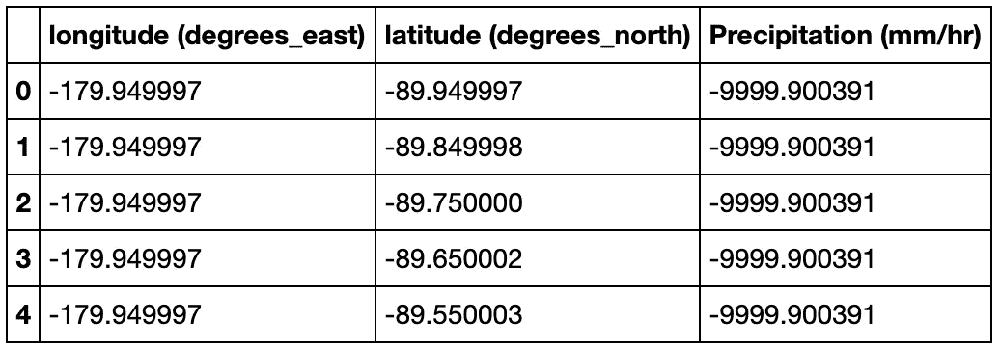

# 使用 HDF5 文件和创建 CSV 文件

> 原文：<https://towardsdatascience.com/working-with-hdf5-files-and-creating-csv-files-1a7d212d970f?source=collection_archive---------6----------------------->

## HDF5 至 CSV 转换

由[杯先生/杨奇煜·巴拉尔](https://unsplash.com/@iammrcup?utm_source=medium&utm_medium=referral)在 [Unsplash](https://unsplash.com?utm_source=medium&utm_medium=referral) 上拍摄的照片

在我的上一篇文章中，我讨论了从 GES 光盘下载 NASA 数据的步骤。下载的数据文件为 HDF5 格式。HDF5 是一种文件格式和技术，支持管理非常大的数据集合。因此，它在存储信息方面非常受欢迎。要获得 NASA 的数据，请先查看下面的文章:

 [## 为你的下一个地理项目获取 NASA 数据

### 访问 GES 光盘数据文件

towardsdatascience.com](/getting-nasa-data-for-your-next-geo-project-9d621243b8f3) 

每当我处理数据集时，我最喜欢 CSV 文件。因此，当我得到 HDF5 文件后，我决定想办法将它们转换成 CSV 文件。我在 Python 中找到了包`h5py`，它支持 HDF5 文件的读入。因此，本文阐述了使用`h5py`并将 HDF5 转换为 CSV 的步骤。您可以通过参考下面链接中的完整笔记本来跟进。

 [## kb22/美国航天局数据探索

### permalink dissolve GitHub 是超过 5000 万开发人员的家园，他们一起工作来托管和审查代码，管理…

github.com](https://github.com/kb22/NASA-data-exploration/blob/master/Coverting%20HDF5%20to%20CSV.ipynb) 

# 导入库

对于这项工作，我们需要两个库。第一个库是`h5py`，它可以选择读取和处理 HDF5 文件([文档](http://docs.h5py.org/en/stable/))。我们需要的第二个包是用于数组的`numpy`。最后，我们将导入`pandas`,这样我们就可以创建一个数据帧，然后保存为 CSV 文件。

# 加载数据集

下一步是载入 HDF5 文件。请注意，对于这个示例，我正在处理从 GES 光盘收集的 2020 年 1 月全球的 GPM 数据。它位于 GitHub repo 中的 **data** 文件夹内(从 [GES 光盘网站](https://disc.gsfc.nasa.gov/)下载)。

我将使用`h5py`库中的`File`方法来读取 HDF5 文件，并将其保存到名为`dataset`的变量中。我指定文件名和完整路径作为第一个参数，并将第二个参数设置为`r`,表示我正在以只读模式处理这个文件。

# 浏览数据集

既然文件已经加载完毕，我们就可以开始研究数据集了。这个文件的元素类似于 Python 字典。因此，它由键值对组成。所以，我从查看这个文件中的各种键开始。

正如我们在上面的结果中看到的，只有一个名为`Grid`的键。因为我们看不到任何数据，数据可能在这个键的值里面；这就是我所做的，我用`dataset[’Grid’]`将它的值读入`grid`，并查看它的键。

最后我们看数据。我们有几个可以使用的特性。所有这些都代表键，它们会有相应的值，这就是我们要找的。对于这项工作，我只对纬度、经度和该经纬度组合下的降雨量感兴趣。

让我们逐一看看这些特性。

## 经度

我打印经度键及其属性。我们发现经度有 3600 个值。在属性中，`units`和`standard_name`是我想使用的两个东西。

## 纬度

类似于经度，我检查键及其属性。有 1800 个纬度值和`units`和`standard_name`对我有用。

## 沉淀

我打印沉淀的键和属性。

降水数据是一个三维数组，降水值存储为二维矩阵。它的形状为(3600，1800 ),这意味着它具有所有经度和纬度组合的降水量值。此外，降水的单位在属性`units`中被发现为`mm/hr`。

# 创建数据框架

现在我们知道了我们想要在最终的 CSV 文件中捕获的所有内容，我们将直接开始捕获它。

我们的数据集将有 6，480，000 行(3600x1800)。这些行中的每一行都有经度和纬度的唯一组合。因此，对于每个经度，我们有一个纬度和相应的降雨量。

为了创建所有降水值的经度值列表，我们需要将经度列表中的每个值重复 1800 次。使用`np.repeat()`将其保存为总长度为 6，480，000 个值的`longitude_values`(3600 个经度值，每个值表示 1800 次)。

对于每个经度值，我们需要所有的纬度值。因此，为了创建最终的`latitude_values`列表，我们将完整的列表乘以 3600，创建一个 6，480，000 长的列表，其中纬度列表重复 3600 次。

最后，为了转换降水值的矩阵，我使用了`flatten()`函数将其转换为一个长列表。

然后，我将这些列表保存为标签为`lon`、`lat`和`precipitation`的`dataset`数据帧的列。我用上面提取的标签和单位来重命名这些列。注意，由于字节编码，字符串用`b`保存，所以我将这些属性附加上`decode()`以获得字符串值。

dataset.head()

一些降水值没有被捕获或丢失，在数据集中用`-9999.900391`表示，所以我用值`0`屏蔽它们。

最后一步，我将数据帧作为 CSV 文件`precipitation_jan_2020.csv`保存在**数据**文件夹中。

就是这样！我们有 CSV 文件。

# 结论

在本文中，我描述了用 Python 加载 HDF5 文件、读取其元素并最终创建可以保存为 CSV 文件的数据帧的步骤。对于任何其他 HDF5 文件，也可以复制相同的步骤。

希望你喜欢这篇文章。如果你有任何问题、建议或想法，请在评论中提出。