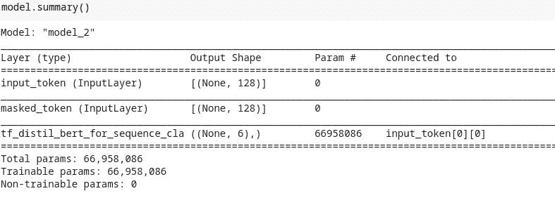
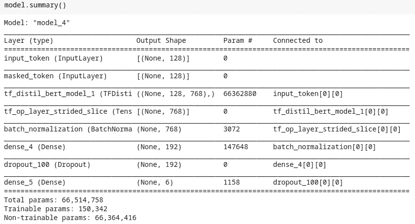
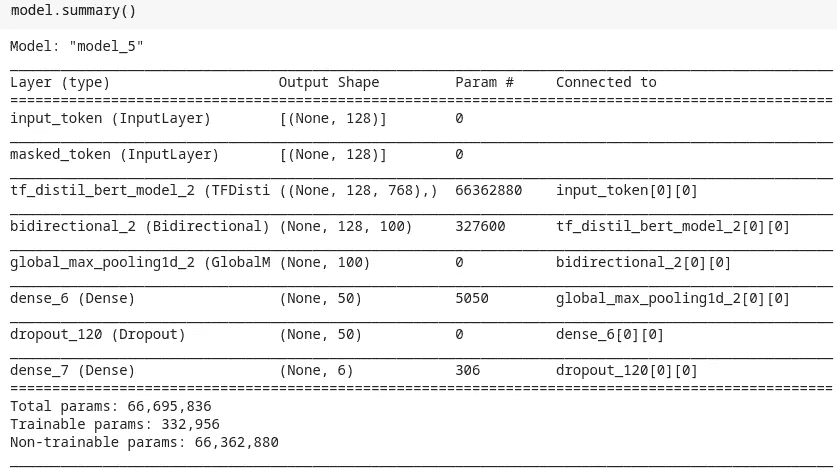

# 使用拥抱脸变形金刚和 TF 2.0

> 原文：<https://towardsdatascience.com/working-with-hugging-face-transformers-and-tf-2-0-89bf35e3555a?source=collection_archive---------3----------------------->

## 基于变形金刚的模型是当前 NLP 世界的热点。拥抱脸的变形金刚库提供了所有的 SOTA 模型(像 BERT，GPT2，RoBERTa 等)用于 TF 2.0，这个博客旨在展示它的接口和 API


# 0.放弃

我假设你知道变形金刚和它的注意力机制。这个博客的主要目的是展示如何在 TF 2.0 中使用 Hugging Face 的 transformer 库，也就是说，它将是一个更加关注代码的博客。

# 1.介绍

拥抱脸最初只支持 PyTorch，现在 TF 2.0 也很支持。在 PyTorch 上使用 transformer 库，你可以找到很多高质量的教程，但是在 TF 2.0 上就不一样了(这是这篇博客的主要动机)。

使用 BERT 甚至 AlBERT 是相当容易的，TF 2.0 中的标准流程由 tensorflow_hub 提供，但 GPT2、RoBERTa、DistilBERT 等就不一样了。抱脸的变形金刚库来救援了。它们提供了直观的 API 来从头构建定制模型，或者为大量基于 transformer 的模型微调预先训练的模型。

它支持广泛的自然语言处理应用，如文本分类、问答系统、文本摘要、标记分类等。前往他们的[文档](https://huggingface.co/transformers/)了解更多细节。

本教程将基于 [Kaggle 的有毒评论分类挑战](https://www.kaggle.com/c/jigsaw-toxic-comment-classification-challenge)的多标签文本分类。

以下是任何变压器型号的通用管道:

标记器定义→文档的标记化→模型定义→模型训练→推理

现在让我们一个接一个地检查它们，我还将尝试涵盖多个可能的用例。

# 2.拥抱面变压器总管道

## 2.1 标记器定义

每个基于 transformer 的模型都有一个独特的标记化技术，特殊标记的独特使用。transformer 库为我们解决了这个问题。它支持与它相关联的每个模型的标记化。

→每个变压器型号都有类似的令牌定义 API

→这里我使用了一个来自预训练模型的记号化器。

→这里，

*   add_special_tokens:用于添加特殊字符，如<cls>、<sep>、<unk>等正在使用的 w.r.t 预训练模型。它应该永远保持真实</unk></sep></cls>
*   max_length:任何要标记的句子的最大长度，这是一个超参数。(最初 BERT 的最大长度为 512)
*   pad_to_max_length:执行填充操作。

## 2.2 文档的标记化

下一步是在文档上执行标记化。它可以通过 encode()或 encode_plus()方法来执行。

→任何变压器模型通常需要三个输入:

*   输入 id:与他们的词汇相关联的单词 id
*   关注面膜:必须关注哪个 id；1 =注意。简单地说，它告诉模型哪些是原始单词，哪些是填充单词或特殊标记
*   令牌类型 id:它与使用多句子的模型相关联，如问答模型。它告诉模型句子的顺序。

→虽然不是必须提供所有这三个 id，只有输入 id 也可以，但是注意力屏蔽有助于模型只关注有效单词。因此，至少对于分类任务，这两者都应该提供。

## 2.3 培训和微调

现在是最关键的部分，即“训练”。我将要讨论的方法绝不是训练的“唯一可能的方法”。虽然经过大量的实验，我发现这个方法是最可行的。我将讨论训练模型的三种可能方式:

1.  直接使用预训练模型作为分类器
2.  提取嵌入并将其用作另一个分类器的输入的转换器模型。
3.  在定制配置和数据集上微调预训练的转换器模型。

**2.3.1 直接使用预训练模型作为分类器**

这是最简单的，但也是应用最少的。拥抱脸的变形金刚库提供了一些具有序列分类能力的模型。这些模型有两个头部，一个是作为基础的预训练模型架构&一个分类器作为顶部头部。

标记器定义→文档的标记化→模型定义



直接作为分类器的预训练模型的总结

→注:顺序分类的模型仅适用于此。

→定义适当的配置在这里至关重要。正如您在第 6 行看到的，我正在定义配置。“num_labels”是当模型是分类模型时要使用的类的数量。它还支持各种配置，请继续查看他们的文档。

→这里需要注意的一些关键事项是:

*   这里只有预训练模型的权重可以被更新，但是更新它们不是一个好主意，因为它将违背迁移学习的目的。所以，实际上这里没有什么要更新的。这是我最不喜欢这个的原因。
*   它也是最不可定制的。
*   你可以尝试的一个技巧是使用 no 更高的 num_labels，最后在末尾添加一个可以训练的密集层。

```
# Hack
config = DistilBertConfig(num_labels=64)
config.output_hidden_states = Falsetransformer_model=TFDistilBertForSequenceClassification.from_pretrained(distil_bert, config = config) input_ids = tf.keras.layers.Input(shape=(128,), name='input_token', dtype='int32')
input_masks_ids = tf.keras.layers.Input(shape=(128,), name='masked_token', dtype='int32')
X = transformer_model(input_ids, input_masks_ids)[0]
X = tf.keras.layers.Dropout(0.2)(X)
X = tf.keras.layers.Dense(6, activation='softmax')model = tf.keras.Model(inputs=[input_ids, input_masks_ids], outputs = X)for layer in model.layer[:2]:
    layer.trainable = False
```

**2.3.2 提取嵌入的变压器模型，并将其用作另一个分类器的输入**

这种方法需要两个层次或两个独立的模型。我们使用任何变换器模型来提取单词嵌入&然后使用这个单词嵌入作为任何分类器(例如逻辑分类器、随机森林、神经网络等)的输入。

我建议你阅读由[杰伊·阿拉姆马](https://medium.com/u/34369d020458?source=post_page-----89bf35e3555a--------------------------------)撰写的这篇[文章](http://jalammar.github.io/a-visual-guide-to-using-bert-for-the-first-time/)，它非常详细清晰地讨论了这种方法。

因为这个博客是关于神经网络的，所以让我给你一个关于神经网络的例子。



模型摘要

→11 号线是这里的关键。我们只对可以使用切片操作提取的模型的<cls>或分类令牌感兴趣。现在我们有了 2D 的数据，并按照我们的要求建立了网络。</cls>

→与 2.3.1 方法相比，这种方法通常每次都更有效。但是它也有一些缺点，比如:

*   它不太适合生产，因为您必须使用 transformer 模型作为唯一的特征提取器，因此您现在必须维护两个模型，因为您的分类器头是不同的(像 XGBoost 或 cat saw)。
*   在将 3D 数据转换为 2D 时，我们可能会错过有价值的信息。

如果您只想提取单词嵌入，transformers 库提供了一个很好的工具。

```
import numpy as np
from transformers import AutoTokenizer, pipeline, TFDistilBertModel
model = TFDistilBertModel.from_pretrained('distilbert-base-uncased')tokenizer = AutoTokenizer.from_pretrained('distilbert-base-uncased')pipe = pipeline('feature-extraction', model=model, 
                tokenizer=tokenizer)features = pipe('any text data or list of text data',
                pad_to_max_length=True)features = np.squeeze(features)
features = features[:,0,:]
```

**2.3.3 微调预应变变压器型号**

这是我最喜欢的方法，因为这里我们充分利用了任何变压器模型的潜力。在这里，我们将使用预训练变压器模型的权重，然后对我们的数据进行微调，即迁移学习。



→请看第 17 行，因为 3D 数据是在嵌入层之前生成的，我们可以使用 LSTM 提取更多细节。

→下一步是将 3D 数据转换为 2D，以便我们可以使用 FC 层。您可以使用任何池层来执行此操作。

→另外，注意第 18 和 19 行。我们应该总是冻结变压器模型的预训练权重&永远不要更新它们，只更新剩余的权重。

**一些临时演员**

→每种方法都有两个共同点:

1.  config . output _ hidden _ States = False；因为我们正在训练&对输出状态不感兴趣。
2.  x = transformer _ model(…)[0]；这在 config.output_hidden_states 中是内联的，因为我们只需要顶部的头。

→config 是字典。因此，要查看所有可用配置，只需简单地打印它。

→小心选择基本型号，因为 TF 2.0 支持是新的，所以可能会有错误。

## 2.4 推理

由于该模型基于 tf.keras 模型 API，我们可以使用 keras 常用的 model.predict()方法

我们甚至可以使用 transformer 库的管道实用程序(请参考 2.3.2 中所示的示例)。这个实用程序非常有效，因为它在一个通用的简单 API 下统一了标记化和预测。

# 3.结束注释

拥抱脸真的很容易使用他们的任何模型，现在与 tf.keras。它有很大的可能性。

他们还使得在交叉库中使用他们的模型变得非常容易(从 PyTorch 到 TF，反之亦然)。

我建议访问他们的文档，因为他们有非常直观和中肯的文档。

你可以通过 [LinkedIn](https://www.linkedin.com/in/akashdesarda) 联系我