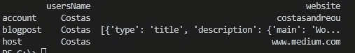
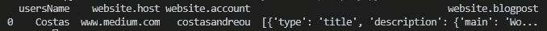

# 在 Python 中使用 JSON

> 原文：<https://towardsdatascience.com/working-with-json-in-python-a53c3b88cc0?source=collection_archive---------15----------------------->

## 在 5 分钟内学会基础知识


丹尼斯·帕夫洛维奇在 [Unsplash](https://unsplash.com?utm_source=medium&utm_medium=referral) 上的照片

在这篇博文中，我们将学习 JSON。我们将学习 JSON 是什么，它为什么存在，人们为什么使用它，以及最终如何利用 python 的能力来帮助我们处理它。

作为一名数据科学家、程序员或者仅仅是一名技术爱好者，理解 JSON 是什么以及如何使用它是很重要的。我确信，一旦你理解了它，你会发现它的许多应用。

# JSON 是什么？

JSON 代表 JavaScript 对象符号，它本质上是一种表示数据的方式。JSON 遵循一种人类可以自然理解的格式，它真正的力量来自于它捕捉复杂数据关系的能力。

您可以在以下示例中看到这一点:

```
{
 "usersName": "Costas",
 "website": {
    "host": "[www.medium.com](http://www.medium.com)",
    "account": "costasandreou",
    "blogpost": [
        {
            "type": "title",
            "description": {
                "main" : "Working with JSON in Python",
                "sub" : "the info you need"
            }
        }
    ]
  }
}
```

注意 JSON 是如何在键值对中构造的，同时还保存数组对象(注意“blogpost”下面有几个类型)。如果你来自一个平面数据结构背景(想想 Excel 或 Pandas dataFrames)，这一点非常重要。

# JSON 为什么会存在？

JSON 创建于千禧年之初，是为了将我们从 Flash 和 Java 小程序中拯救出来。如果你碰巧不记得那些浏览器内置插件，请认为你非常幸运，因为它们是噩梦的素材！但是我跑题了。JSON 是为无状态实时服务器到浏览器的通信提供协议而构建的。

如果您已经熟悉 XML，那么您可以将 JSON 视为一种轻量级的、更容易使用、更快速的替代方案。

# 人们为什么使用 JSON？

据信，第一家开始提供服务并因此普及 JSON 应用的大公司是 2005 年的雅虎。现在认为 JSON 是最常用的数据格式。

人们使用 JSON 的三大原因是:

1.  非常易于阅读、书写和操作
2.  通过网络传输非常快
3.  受所有主流浏览器支持，后端技术堆栈

# 阅读 JSON

当您必须使用 JSON 时，您想做的第一件事就是将它读入您的 Python 应用程序。Python 中的 json 库期望 JSON 以字符串的形式出现。

假设您的数据 JSON 数据已经是一个字符串:

```
obj = '{ "usersName": "Costas",  "website": { "host": "www.medium.com", "account": "costasandreou", "blogpost": [ { "type": "title", "description": { "main" : "Working with JSON in Python", "sub" : "the info you need" } } ] } }'import json
json_obj = json.loads(obj)
print('obj: ',type(obj))
print('obj.usersName: ', json_obj['usersName'])
```

它返回:

```
obj:  <class 'str'>
obj.usersName:  Costas
```

另一方面，如果您将 json 保存在 Python 对象中(比如字典)，JSON 库允许您将它转换回字符串，以便进一步处理。

```
obj1 = { "usersName": "Costas",  "website": { "host": "[www.medium.com](http://www.medium.com)", "account": "costasandreou", "blogpost": [ { "type": "title", "description": { "main" : "Working with JSON in Python", "sub" : "the info you need" } } ] } }print('obj1: ',type(obj1))
json_obj1str = json.dumps(obj1)
print('json_obj1str: ', type(json_obj1str))
json_obj1 = json.loads(json_obj1str)
print('obj1.usersName: ', json_obj1['usersName'])
```

它返回:

```
obj1:  <class 'dict'>
json_obj1str:  <class 'str'>
obj1.usersName:  Costas
```

# 使用 JSON

既然我们已经看到了如何将 JSON 数据加载到 Python 应用程序中，那么让我们看看使用 JSON 的选项。

## ***直接查询***

从 JSON 中提取信息就像定义我们要寻找的路径并提供键值对的名称一样简单。我们来看几个例子。

```
>>> print(json_obj['usersName'])
Costas>>> print(json_obj['website'])
{'host': '[www.medium.com'](http://www.medium.com'), 'account': 'costasandreou', 'blogpost': [{'type': 'title', 'description': {'main': 'Working with JSON in Python', 'sub': 'the info you need'}}]}>>> print(json_obj['website']['host'])
[www.medium.com](http://www.medium.com)>>> print(json_obj['website']['blogpost'])
[{'type': 'title', 'description': {'main': 'Working with JSON in Python', 'sub': 'the info you need'}}]>>> print(json_obj['website']['blogpost'][0]['description']['sub'])
the info you need
```

一旦我们可以像上面那样提取数据，我们就可以很容易地将它们存储在列表或数据库中，以便进一步处理。

# ***用熊猫*** 处理你的数据

如果您已经习惯了 Pandas，并且希望使用平面数据，有一种快速的方法可以将数据放入数据框中。首先，你可以将*的第一层数据*添加到数据帧中。

```
df = pd.read_json(obj)
```



如您所见，read_json 接受 string 数据类型，并且只允许我们查看顶级信息。换句话说，它不会使任何结构变平。我们需要一种方法来浏览较低层次的数据。

我们可以通过使用 json_normalise pandas 方法将数据*进一步扁平化*。

```
obj = json.loads(obj)
df1 = pd.json_normalize(obj)
```



# 扁平化 JSON

在某些情况下，您只是想将数据展平。它当然可以使数据分析有时更快，并可以允许大量记录的可视化检查(想想 Excel 类型的数据过滤)。

您可以使用第三方库来实现。首先，安装库:

```
pip install json-flatten
```

然后，运行以下命令:

```
>>> import json
>>> obj = json.loads(obj)>>> import json_flatten
>>> print(json_flatten.flatten(obj)){'usersName': 'Costas', 'website.host': '[www.medium.com'](http://www.medium.com'), 'website.account': 'costasandreou', 'website.blogpost.0.type': 'title', 'website.blogpost.0.description.main': 'Working with JSON in Python', 'website.blogpost.0.description.sub': 'the info you need'}
```

# 交叉记录分析

到目前为止，我们研究的所有内容都集中在处理单个 JSON 记录上。然而，在现实世界中，您可能需要处理许多 JSON 文档，并且需要跨记录进行聚合。

您可以考虑使用以下任何一种方法来支持您的分析:

*   MongoDB 存储数据，然后在其上运行聚合
*   扁平化数据，用熊猫做运营
*   展平数据并导出到 Excel 以供进一步操作
*   选择您想要的属性，并将它们加载到 SQL DB 中以供进一步分析

# 结论

这就是了。在 5 分钟内，您就知道了开始使用 JSON 所需的一切。我鼓励你花些时间去熟悉它。它应用广泛，当然是你简历上的必备！

## 参考资料:

```
{
 "References" : [
  { 
   "¹" : "[https://en.wikipedia.org/wiki/JSON#History](https://en.wikipedia.org/wiki/JSON#History)"
  },
  { 
   "²" : "guru99.com/json-vs-xml-difference.html"
  },
  { 
   "³" : "[https://pypi.org/project/json-flatten/#description](https://pypi.org/project/json-flatten/#description)"
  },
 ]
}
```