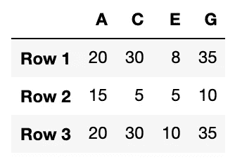

# 处理熊猫中缺失的值

> 原文：<https://towardsdatascience.com/working-with-missing-values-in-pandas-5da45d16e74?source=collection_archive---------6----------------------->

## 关于 Pandas 中缺失值以及如何使用内置方法处理它们的教程


真实世界的数据很少是干净和同质的。特别是，许多有趣的数据集将会丢失一些值。

在本文中，我们将讨论缺失值在 Pandas 中是如何表示的，如何处理其他字符表示，以及 Pandas 处理缺失值的内置方法。

概述

*   熊猫身上缺失的价值观
*   处理其他字符表示
*   处理缺失值

# 熊猫身上缺失的价值观

用于指示缺失值存在的方案通常围绕两种策略之一[1]:

1.  全局指示缺失值的*掩码*。
2.  指示缺失条目的*标记值*。

在*屏蔽*方法中，它可能是相同大小的布尔数组表示，或者使用一个位来表示丢失条目的本地状态。

在*标记值*方法中，标签值用于指示缺失值，如`NaN`(非数字)、`null`或作为编程语言一部分的特殊值。

这些方法没有一个是没有权衡的[1]。*屏蔽*方法需要分配额外的布尔数组，这增加了存储和计算的开销。一个*标记值*缩小了可以表示的有效值范围，可能需要 CPU 和 GPU 运算中的额外逻辑。

Pandas 使用 *sentinels* 来处理缺失值，更具体地说，Pandas 使用两个已经存在的 Python 空值:

*   Python `None`对象。
*   特殊浮点`NaN`值，

## Python 无对象

熊猫使用的第一个 *sentinel* 值是`None`，这是一个 Python `‘object’`数据，最常用于 Python 代码中的缺失数据。因为是 Python 对象，`None`不能在任何任意的 NumPy/Pandas 数组中使用，只能在数据类型为`‘object’`的数组中使用。

```
import numpy as np
import pandas as pdarr1 = np.array([1, **None**, 2, 3])
arr1
```

会输出

```
array([1, None, 2, 3], **dtype=object**)
```

在数组中使用 Python 对象也意味着，如果执行类似于`sum()`或`min()`的聚合，通常会出现错误。

## Python 浮点 NaN 值

熊猫使用的第二个 *sentinel* 值是`NaN`，是*的首字母缩写，而不是数字*，一个特殊的浮点值使用标准的 IEEE 浮点表示法。

```
arr2 = np.array([1, **np.nan**, 3, 4]) 
arr2.dtype
```

会输出

```
dtype('**float64**')
```

请记住，`NaN`是一个浮点值；整数、字符串或其他类型没有等价的值。你应该知道，不管运算如何，用`NaN`运算的结果将是另一个`NaN`。例如

```
arr2.sum()
arr2.min()
arr2.max()
```

将全部输出`NaN`。NumPy 确实提供了一些特殊的聚合来忽略缺失的数据，比如`nansum()`、`nanmin()`和`nanmax()`。

## 熊猫中的 None 和 NaN

Pandas 可以几乎互换地处理`None`和`NaN`，在适当的时候在它们之间转换:

```
pd.Series([1, **np.nan**, 2, **None**])0    1.0
1    NaN
2    2.0
3    NaN
dtype: **float64**
```

对于没有可用 sentinel 值的类型，当`NaN`值出现时，Pandas 会自动进行类型转换。

比如我们用`dtype=int`打造一个熊猫系列。

```
x = pd.Series(range(2), **dtype=int**)
x0    0
1    1
dtype: **int64**
```

如果我们将一个整数数组中的值设置为`np.nan`，它将自动被转换为浮点类型以适应`NaN`:

```
**x[0] = None**
x0    NaN
1    1.0
dtype: **float64**
```

# 处理其他字符表示

并不是所有丢失的值都干净利落地出现`np.nan`。如果我们知道哪种字符用作数据集中的缺失值，我们可以在使用`na_values`参数创建数据帧时处理它们:

```
df = pd.read_csv("source.csv", **na_values = ['?', '&']**)
```

当数据帧已经创建时，我们可以使用 pandas `replace()`函数来处理这些值:

```
df_clean = df.replace(**{ "?": np.nan, "&": np.nan }**)
```

# 处理缺失值

在我们深入细节之前，让我们创建一个带有一些缺失值的数据帧:

```
import numpy as np
import pandas as pddf = pd.DataFrame(**{'A': [20, 15, 20],
                  'B': [np.nan, 50, 4],
                  'C': [30, 5, 30,],
                  'D': [15, 2, np.nan],
                  'E': [8, 5, 10],
                  'F': [45, 7, np.nan],
                  'G': [35, 10, 35]},**
                  index = ['Row 1', 'Row 2',  'Row 3'])
df
```


## 检测缺失值

Pandas 有两个有用的方法来检测缺失值:`isnull()`和`notnull()`。任何一个都将返回数据的布尔掩码。例如:

`df.isnull()`返回一个相同大小的布尔数据帧，指示值是否丢失


df.isnull()的输出

`df.notnull()`返回一个大小相同的布尔数据帧，与`isnull()`正好相反


df.notnull()的输出

当数据集很大时，您可以计算缺失值的数量。

`df.isnull().sum()`返回每列缺失值的个数(熊猫系列)

```
df.isnull()**.sum()**A    0
B    1
C    0
D    1
E    0
F    1
G    0
dtype: int64
```

`df.isnull().sum().sum()`返回缺失值的总数

```
df.isnull()**.sum().sum()**3
```

## 丢弃丢失的数据

除了之前使用的屏蔽之外，还有一个方便的方法`dropna()`来删除丢失的值【2】。该方法定义为:

```
dropna(axis=0, how=’any’, thresh=None, subset=None, inplace=False)
```

*   `axis`:行用`0`，列用`1`
*   `how` : `‘any’`用于删除存在 NaN 值的行或列。`‘all’`如果所有值都是 NaN，则删除列的行。
*   `thresh`:要求多个非 NaN 值
*   `subset`:类似数组的值。要考虑的沿其他轴的标签，例如，如果您要删除行，这些将是要包括的列的列表。
*   `inplace`:如果为真，就地操作，不返回。

概括地说，这是我们正在使用的数据框架`df`


如果存在任何 NaN 值，则删除行:

```
df.dropna(**axis = 0**)
```


df.dropna 的输出(轴= 0)

如果存在任何 NaN 值，则删除列:

```
df.dropna(**axis = 1**)
```



`df.dropna(axis = 1)`的输出

如果非 NaN 的数量小于 6，则删除该行。

```
df.dropna(**axis = 0**, **thresh = 6**)
```


`df.dropna(axis = 0, thresh = 6)`的输出

## 替换丢失的值

数据是宝贵的资产，所以我们不应该轻易放弃它。此外，机器学习模型几乎总是倾向于在更多数据的情况下表现更好。因此，根据具体情况，我们可能更喜欢替换丢失的值，而不是丢弃。

有一个方便的方法`fillna()`来替换丢失的值【3】。该方法定义为:

```
fillna(value=None, method=None, axis=None, inplace=False)
```

*   `value`:用于替换 NaN 的值
*   `method`:用于替换 NaN 的方法。`method='ffill'`※正向替换。`method='bfill'`进行反向替换。
*   `axis`:行用`0`，列用`1`。
*   `inplace`:如果为真，就地运算，不返回。

概括一下，这是我们正在使用的数据图表`df`


用标量替换所有 NaN 值

```
df.fillna(**value=10**) 
```


`df.fillna(**value=10**)`的输出

To 用前一行中的值替换 NaN 值。

```
df.fillna(**axis=0**, **method='ffill'**)
```


`df.fillna(**axis=0**, **method=’ffill’**)`的输出

用前一列中的值替换 NaN 值。

```
df.fillna(**axis=1**, **method='ffill'**)
```


`df.fillna(**axis=1**, **method=’ffill’**)`的输出

同样，您也可以用下一行或下一列中的值替换 NaN 值。

```
# Replace with the values in the next row
df.fillna(**axis=0**, **method='bfill'**)# Replace with the values in the next column
df.fillna(**axis=1**, **method='bfill'**)
```

另一种常见的替换是用平均值替换 NaN 值。例如，用平均值替换 B 列中的 NaN 值。

```
df[**'B'**].fillna(value=**df['B'].mean()**, inplace=True)
```


`df[**‘B’**].fillna(value=**df[‘B’].mean()**, inplace=True)`的输出

# 好了

仅此而已。感谢阅读。

# 参考资料:

*   [1] [Python 数据科学手册](https://jakevdp.github.io/PythonDataScienceHandbook/03.04-missing-values.html)
*   熊猫官方文件——dropna
*   [3] [熊猫官方文档——菲尔娜](https://pandas.pydata.org/pandas-docs/stable/reference/api/pandas.DataFrame.fillna.html)