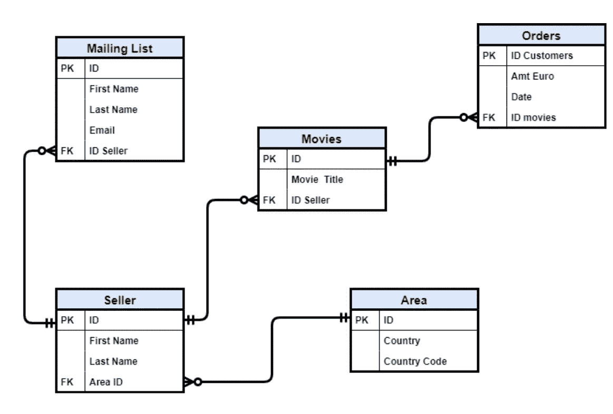
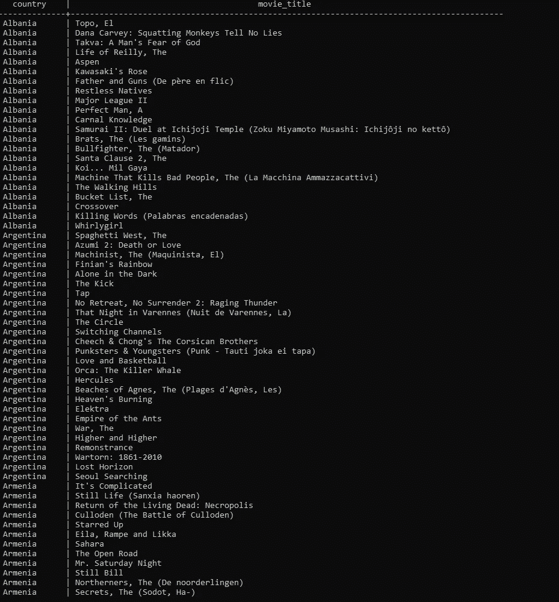
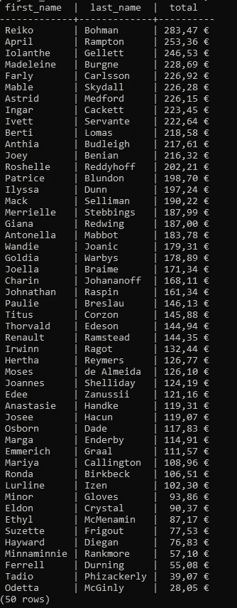
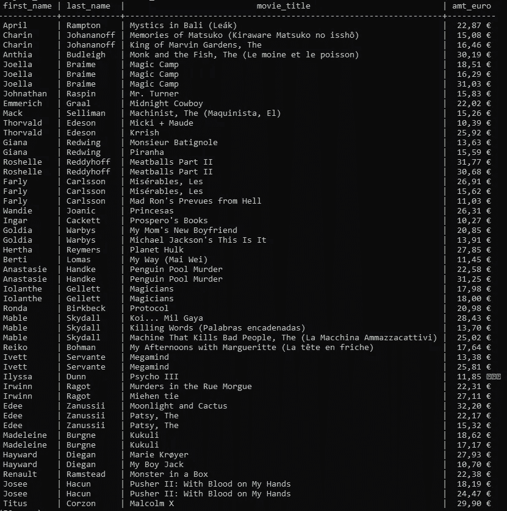

# 得益于 SQL 和 ERD，可以处理多个表

> 原文：<https://towardsdatascience.com/working-with-multiple-tables-thanks-to-sql-and-erd-9cb5dcb99228?source=collection_archive---------59----------------------->

## [带 PostgreSQL 的 SQL 教程](https://towardsdatascience.com/tagged/Sql%20Tutorial)

## ERD 和 SQL 的一些基础知识


由[埃菲社](https://unsplash.com/@efekurnaz?utm_source=unsplash&utm_medium=referral&utm_content=creditCopyText)在 [Unsplash](/@efekurnaz?utm_source=unsplash&utm_medium=referral&utm_content=creditCopyText) 上拍摄的照片

**简介**

对于我的[教程](https://towardsdatascience.com/tagged/Sql%20Tutorial)的第二课，我生成了一个包含五个表的数据库，您可以从我的 [GitHub](https://github.com/moryba/SQL_Tutorial) 中名为 SQL tutorial 的文件夹下载。

我们将对一家名为 **Space Odyssey** 的虚构公司进行研究，正如我在上一课中承诺的那样，我将向您介绍 ERD 的概念(即实体关系图)和一些关于 SQL 的基础知识。

我将使用 PostgreSQL，这是我在教程的第一部分中介绍的 RDMS。

所以，我们开始吧！

**第一部分:什么是实体关系图？**

实体关系图是一个流程图，可以了解存储在数据库中的实体之间的关系。这些实体具有强调特定礼仪的属性。

下面，您可以观察我为本课创建的表之间的关系。正如您所看到的，每个表都有一个主键和一个外键。这两把钥匙可以把一张桌子和另一张桌子连接起来。



作者图片

由于主键和外键，了解表之间的连接对于从数据库中合并、操作和提取信息以及更好地了解我们的工作环境是必不可少的。

在这节课中，我们将对这些表格进行一些组合，以便更好地理解在线公司**太空漫游**。

这家在线公司向 100 个国家销售电影，作为数据分析师，我们必须协调一个由 50 名卖家组成的团队，他们管理着 501 名客户的邮件列表。

《太空漫游》储存了 1000 部电影，在 2020 年 3 月至 2020 年 6 月期间卖出了 360 部。

**第二部分:连接表以获得洞察力**

现在，假设市场部想要一个列表，表示每个地区有哪些电影。我可以简单地使用一个 Join 来连接一个表和另一个表。所以:

```
project_movies=# SELECT a.country, m.movie_title
project_movies-# FROM area as a
project_movies-# JOIN seller as s
project_movies-# ON a.ID = s.area_id
project_movies-# JOIN movies as m
project_movies-# ON s.area_id = m.id_seller
project_movies-# ORDER BY a.country;
```

出局:



作者图片

正如你在上面观察到的每个国家，我们都有可用的电影。为此，我必须考虑主键和外键的概念。

现在，总经理需要一份清单，列出我们工作期间每个销售人员获得的欧元金额。在这种情况下，我们可以通过。

```
project_movies=# SELECT s.first_name, s.last_name, SUM(o.amt_euro)              project_movies=# AS total
project_movies-# FROM seller AS s
project_movies-# JOIN movies AS m
project_movies-# ON s.id = m.id_seller
project_movies-# JOIN orders AS o
project_movies-# ON m.id = o.id_movie
project_movies-# GROUP BY s.first_name, s.last_name
project_movies-# ORDER BY total DESC;
```

出局:



作者图片

我们有一个卖家列表，从获利多的卖家到获利少的卖家排序。

**第三部分:用子查询查找信息**

假设我们想知道电影的不同价格，这些电影的标题以 P 或 M 或 K 开头，同时我们需要看到这些电影的卖家。回答这个问题的一种方法是使用子查询，如下所示。

```
project_movies=# SELECT s.first_name, s.last_name, m.movie_title, project_movies=# o.amt_euro
project_movies-# FROM seller AS s
project_movies-# JOIN (
project_movies(# SELECT id, movie_title, id_seller FROM movies
project_movies(# WHERE movie_title LIKE ‘P%’ or movie_title LIKE        ‘M%’ or movie_title LIKE ‘K%’) AS m
project_movies-# ON s.id = m.id_seller
project_movies-# JOIN orders AS o
project_movies-# ON m.id = o.id_movie;
```

出局:



作者图片

因此，我们得到了一个表，其中包含了销售以 P、M 或 k 开头的电影的每个卖家的姓名。此外，我们还知道这些电影的价格。

**结论**

在本教程的第二部分中，您已经看到了一个简单的数据库是如何工作的，以及如何从中提取信息。无论如何，我建议你通过下载我的 [GitHub](https://github.com/moryba/SQL_Tutorial/tree/master/SQL_Tutorial) 中的表格自己练习，并尝试找到其他信息。

我认为数据分析是对你自己的一个挑战，你可以看到你的数据能给你带来多少深度，你能看透你的数据多远。

在本教程的[下一部分也是最后一部分，我们将看到 SQL 中使用的其他有用技术。敬请关注。](/window-functions-and-other-concepts-of-sql-d53ca756e254)

有点好奇:你可能已经猜到了，这个虚构的公司的名字叫做**太空漫游**来自斯坦利·库布里克的著名电影《2001:太空漫游》。

也可以在我的电报群 [**数据科学新手群联系。**](https://t.me/DataScienceForBeginners)