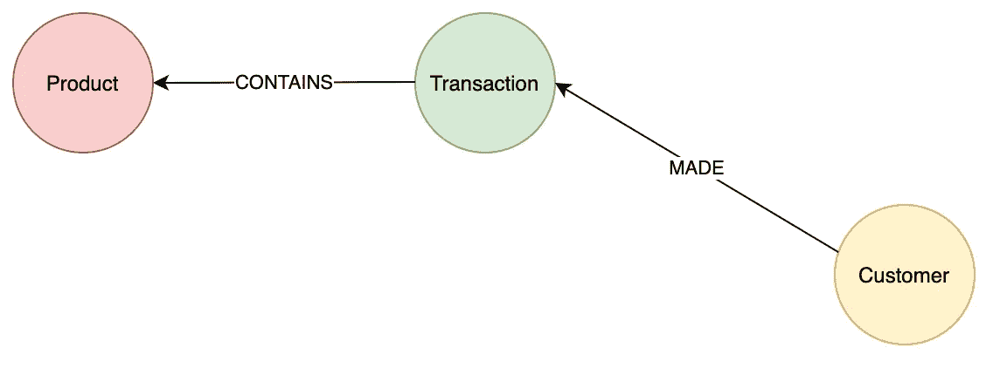
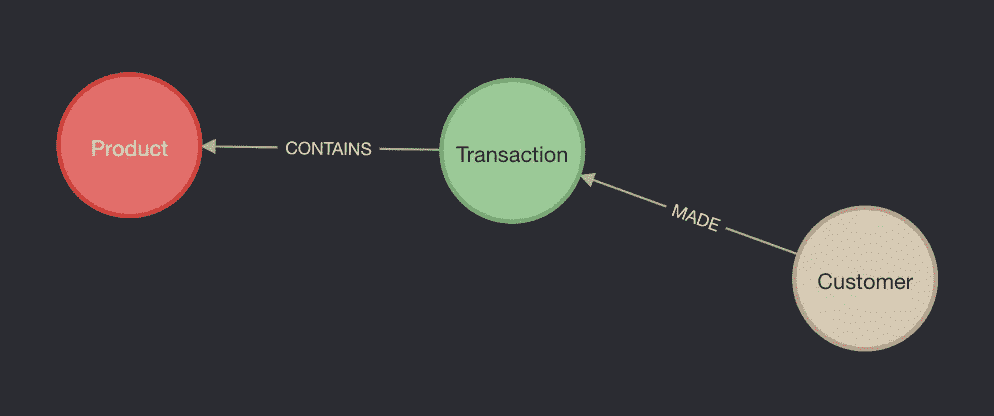
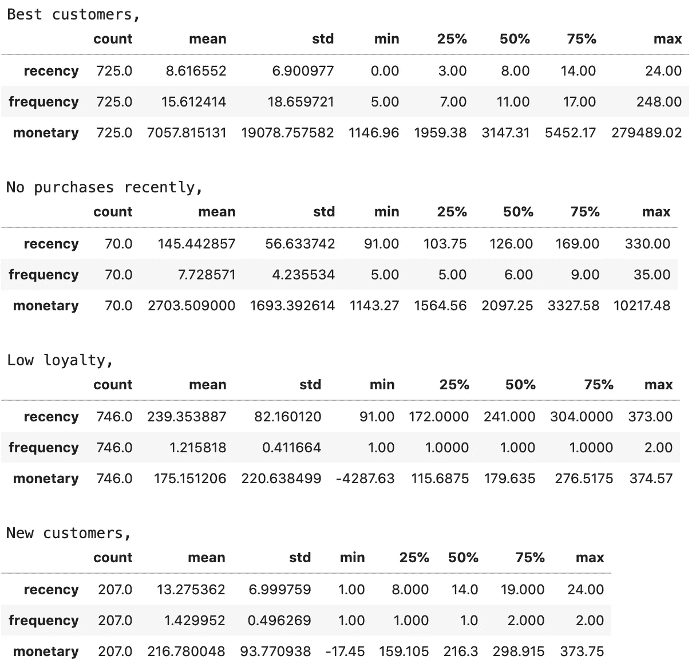
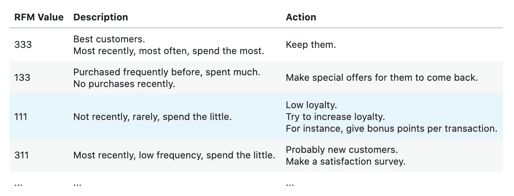

# 使用 Neo4j

> 原文：<https://towardsdatascience.com/working-with-neo4j-rfm-analysis-using-e-commerce-data-721f5bd5c851?source=collection_archive---------28----------------------->

## 使用电子商务数据的 RFM 分析


图片来自 [Pixabay](https://pixabay.com/?utm_source=link-attribution&amp;utm_medium=referral&amp;utm_campaign=image&amp;utm_content=551344) 的 [Gerd Altmann](https://pixabay.com/users/geralt-9301/?utm_source=link-attribution&amp;utm_medium=referral&amp;utm_campaign=image&amp;utm_content=551344)

关系数据库是管理数据的逻辑方法，但另一方面，图形数据库等替代方法在许多情况下可能更有用。众所周知，各行各业的大公司，如易贝、Airbnb、思科和许多其他公司都使用图形数据库[1]。此时，Neo4j 显示自己是一个用于管理数据的图形数据库平台。

在本文中，我将尝试解释如何使用 Neo4j 从电子商务数据中创建一个示例图，同时也涉及 RFM 分析。

# 数据

首先，你可以在这里找到我之前[提到的电商数据。乍一看，很明显数据是由事务组成的。因此，数据包括一系列列，如客户、购买的产品、数量和交易日期。](https://www.kaggle.com/carrie1/ecommerce-data)

在向 Neo4j 插入数据之前规划模式将是朝着正确方向迈出的一步。本研究要建立的模式如下:



作者图片

我们现在可以从顾客开始了。在创建节点之前创建一个约束既可以防止重复，又可以提高性能，因为它使用了`MERGE`锁[2]。您可以按如下方式创建约束，

```
CREATE CONSTRAINT ON (customer:Customer) ASSERT customer.customerID IS UNIQUE
```

请注意，只有当属性存在时，属性值的唯一性在图中才有用。然后，您可以按如下方式创建客户节点，

```
:auto 
USING PERIODIC COMMIT
LOAD CSV WITH HEADERS
FROM '[https://git.io/JkIjD](https://git.io/JkIjD)'
AS line
WITH 
  toInteger(line.CustomerID) AS CustomerID, 
  line WHERE NOT line.CustomerID IS null
MERGE(customer:Customer {customerID: CustomerID})
ON CREATE SET customer.country = line.Country
```

创建客户节点后，创建产品和交易节点将变得更加容易。同样，首先为产品节点创建约束是正确。

```
CREATE CONSTRAINT ON (product:Product) ASSERT product.stockCode IS UNIQUE
```

这里有很重要的一点，当你创建一个约束时，Neo4j 会创建一个索引。Cypher 将使用该索引进行查找，就像其他索引一样。因此，没有必要创建单独的索引。事实上，如果您试图在已经有一个索引的情况下创建一个约束，您将会得到一个错误。

在考虑了所有这些因素之后，您可以如下创建产品节点，

```
:auto 
USING PERIODIC COMMIT
LOAD CSV WITH HEADERS
FROM '[https://git.io/JkIjD](https://git.io/JkIjD)'
AS line
MERGE(product:Product {stockCode: line.StockCode})
ON CREATE SET product.description = line.Description
```

如上所述，创建节点时使用了`ON CREATE`语句。如果需要创建节点，请合并节点并设置属性。类似地，如果节点已经存在，也可以使用语句`ON MATCH`[3]。

在开始处理如下关系之前创建事务节点是很好的，

```
CREATE CONSTRAINT ON (transaction:Transaction) ASSERT transaction.transactionID IS UNIQUE;:auto 
USING PERIODIC COMMIT
LOAD CSV WITH HEADERS
FROM '[https://git.io/JkIjD](https://git.io/JkIjD)'
AS line
MERGE(transaction:Transaction {transactionID: line.InvoiceNo})
ON CREATE SET transaction.transactionDate = line.InvoiceDate
```

查看上面的 Cypher 语句，可以看到分号用于分隔 Cypher 语句。一般情况下，不需要用分号结束一个 Cypher 语句，但是如果要执行多个 Cypher 语句，就必须将它们分开[2]。

图中的节点都准备好了，但是这些节点彼此没有连接。连接捕获了图中节点的语义关系和上下文[2]。众所周知，图中有三种类型的节点:客户、交易和产品。正如我在本节开始时提到的，在客户-交易和交易-产品之间建立关系将使这个图更加符合逻辑。客户**与**达成交易，交易**包含**产品。这是 Cypher 关于建立人造关系的声明，

```
:auto 
USING PERIODIC COMMIT
LOAD CSV WITH HEADERS
FROM '[https://git.io/JkIjD](https://git.io/JkIjD)'
AS line
WITH toInteger(line.CustomerID) AS CustomerID, 
  line.InvoiceNo AS InvoiceNo
MATCH (customer:Customer {customerID: CustomerID})
MATCH (transaction:Transaction {transactionID: InvoiceNo})
MERGE (customer)-[:MADE]->(transaction)
```

让我们通过创建包含关系来完成图表，

```
:auto USING PERIODIC COMMIT
LOAD CSV WITH HEADERS
FROM 'https://git.io/JkIjD'
AS line
WITH toInteger(line.Quantity) AS Quantity, 
    toFloat(line.UnitPrice) AS UnitPrice,
    line.InvoiceNo AS InvoiceNo, 
    line.StockCode AS StockCode
MATCH (transaction:Transaction {transactionID: InvoiceNo})
MATCH (product:Product {stockCode: StockCode})
MERGE (transaction)-[r:CONTAINS]->(product) 
    ON CREATE SET r.quantity = Quantity, 
        r.price = UnitPrice * Quantity 
    ON MATCH SET r.quantity = r.quantity + Quantity, 
        r.price = r.price + UnitPrice * Quantity
```

现在，您可以使用语句`CALL db.schema.visualization()`来检查图表的模式。结果是这样的，



作者图片

请记住，您可以用不同的方式创建图表。例如，事务可能是一个关系，而不是一个节点，我们可以称之为 buy。可以想象，选择哪一个取决于你的业务问题。此时，您应该设置规则并相应地构建结构。

# RFM 分析

RFM 分析是一种基于行为的方法，将客户分为不同的细分市场。它根据客户以前的购买交易对客户进行分组。[4].这是 RFM 的三个维度，

*   **R** 紧急程度:*客户最近购买了什么？*
*   频率:*他们多久购买一次？*
*   一元值:他们花了多少钱？

对于在许多行业销售的公司来说，使用 RFM 分析对客户进行细分是一个重要的点。因为公司希望了解对他们有价值的客户，并确保所有客户的忠诚度。

在提到 RFM 的维度和客户细分的重要性之后，我们可以使用下面的 python 代码获得最近度、频率和货币价值。

然后，通过为维度创建百分位数来定义细分将是一个正确的步骤。请记住，这里的细分可以达到一个更高的水平，而且通常没有那么简单。现实世界的问题可能更复杂。

当您运行上面的 python 代码时，您将看到如下结果，



作者图片

正如您在输出中所看到的，有对段的描述性统计。例如，查看*最佳客户*的统计数据，可以看到他们最近购买、频繁购买，并且货币价值相当高。因此，公司留住这个细分市场的客户非常重要。

对其他部分将有不同的方法。考虑到分段的目的，这是很自然的。为细分市场开发不同的方法和提高客户忠诚度有很大的影响。例如，您可以看到对以下四个部分的描述和所需的操作，



作者图片

# 结论

正如我在文章开头提到的，可能需要不同的方法来解决商业生活中的问题。此时，有必要很好地识别问题，并逐步构建解决方案。虽然这不是解决所有问题的可行方案，但尝试不同的方法来解决问题对你的公司和职业发展都有好处。

我希望这篇文章对您了解 Neo4j 和客户细分有所帮助。

感谢您的阅读！如果你想了解更多，请访问我的知识库！

[](https://github.com/egemenzeytinci/neo4j-example) [## egemenzeytinci/neo4j-示例

### 在本研究中，使用 Neo4j 从电子商务数据创建示例图，然后进行客户细分

github.com](https://github.com/egemenzeytinci/neo4j-example) 

# 参考

[1] Helen Vdovychenko， [Neo4j 数据库:您的项目的用例与优势](https://apiko.com/blog/neo4j-database-advantages) (2020)

[2] [充分利用 Neo4j](https://neo4j.com/graphacademy/online-training/v4/07-introneo-3-5-getting-more-out-of-neo4j/)

[3] [在创建和匹配时使用](https://neo4j.com/docs/cypher-manual/current/clauses/merge/#query-merge-on-create-on-match)

[4] Avinash Navlani，[Python 中的客户细分介绍](https://www.datacamp.com/community/tutorials/introduction-customer-segmentation-python) (2018)