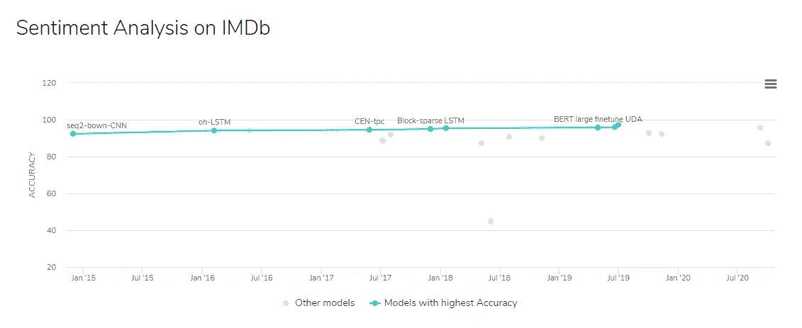
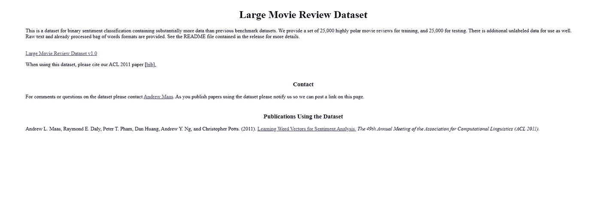
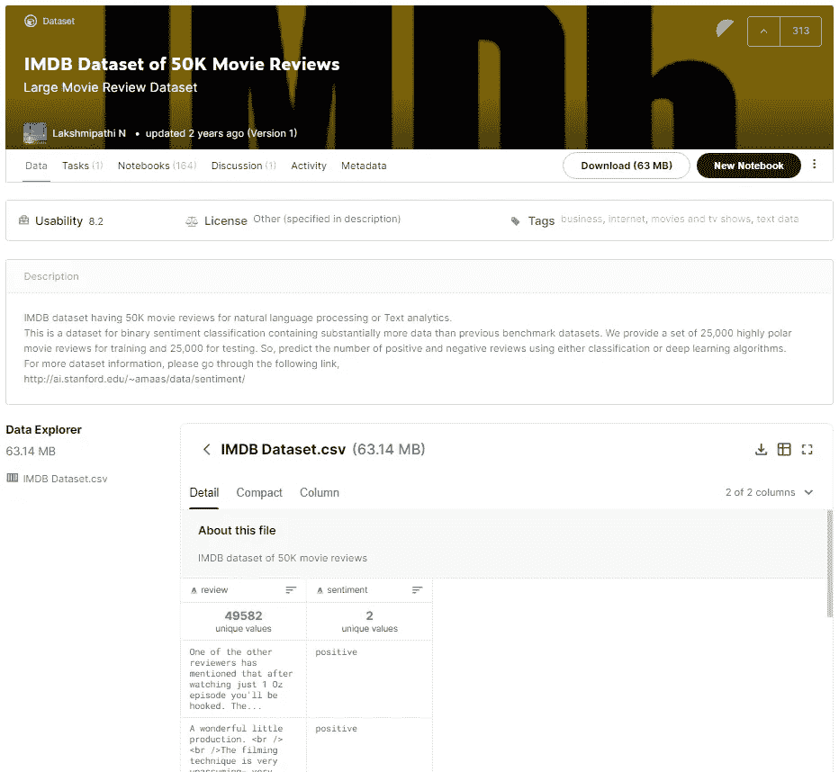
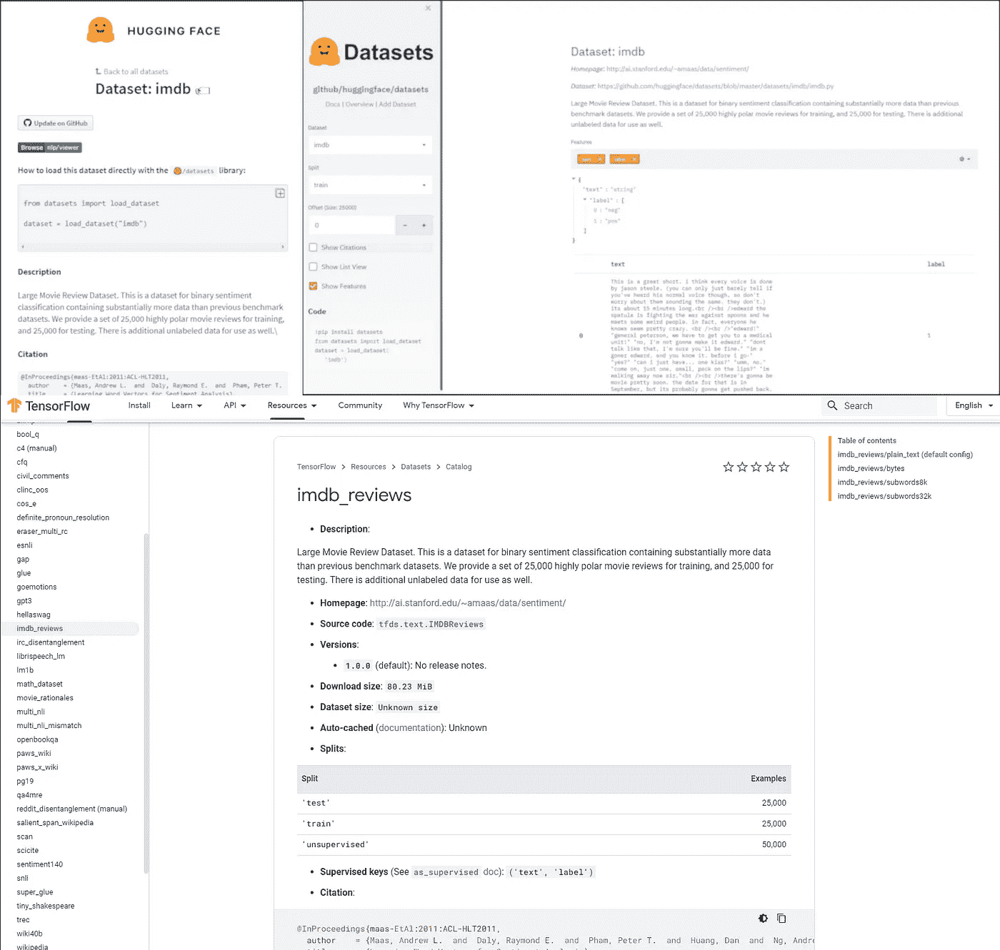
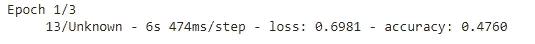

# 在 Python 中使用 NLP 数据集

> 原文：<https://towardsdatascience.com/working-with-nlp-datasets-in-python-7030a179e9fa?source=collection_archive---------35----------------------->

## 教程:将新的 HuggingFace 数据集库与 TensorFlow 数据集库和其他选项进行比较

在深度学习领域，数据集是每个项目必不可少的一部分。为了训练一个可以处理新情况的神经网络，人们必须使用一个代表世界即将到来的场景的数据集。在动物图像上训练的图像分类模型在汽车分类任务上表现不好。

除了训练最佳模型，研究人员还使用公共数据集作为模型性能的基准。我个人认为易于使用的公共基准是帮助促进研究过程的最有用的工具之一。这方面的一个很好的例子是代码为的[论文和最先进的图表。](http://paperswithcode.com)

另一个很棒的工具是现成的数据集库。在这篇文章中，我将以 IMBD 情感分析数据集为例，回顾新的 [HuggingFace 数据集](https://huggingface.co/docs/datasets/index.html)库，并使用 Keras biLSTM 网络将其与 [TensorFlow 数据集](https://www.tensorflow.org/datasets/catalog/overview?hl=en)库进行比较。这个故事也可以作为使用这些库的教程。

所有代码都可以在 Google Colab 上找到。

[IMDb 纸上情绪分析图代码](https://paperswithcode.com/sota/sentiment-analysis-on-imdb)

# 原始数据集出版物

当有人发布一个新的数据集库时，最直接的做法就是在研究团队的网页中进行分享。例如，IMDB 情感分析数据集由斯坦福大学的研究人员团队发布，并可在他们自己的网页上获得:[大型电影评论数据集](http://ai.stanford.edu/~amaas/data/sentiment/)。在科学出版物的情况下，它通常带有一篇发表的文章:例如，见 Maas 等人[1]。

[IMDB 情感数据集的原始发布页面](http://ai.stanford.edu/~amaas/data/sentiment/)

我认为，这有两个主要问题:1)很难找到，尤其是如果你是一个早期携带者科学家；2)没有存储数据的标准化格式，使用新的数据集必须有特定的预处理步骤。

# 在线数据集集合

要使数据集可访问，不仅要使它可用，还要确保用户能找到它。谷歌意识到了它的重要性，他们在 datasetsearch.research.google.com 为数据集开发了一个搜索平台。然而，搜索 IMDB 大型电影评论情感数据集[，结果](https://datasetsearch.research.google.com/search?query=IMDB%20Large%20Movie%20Reviews%20Sentiment%20Dataset&docid=exXzLiK1WI6YWyHzAAAAAA%3D%3D)不包括该研究的原始网页。浏览谷歌数据集搜索结果，你会发现 [Kaggle](https://www.kaggle.com/) 是最大的在线公共数据集集合之一。

## 卡格尔

Kaggle 是世界上最大的在线机器学习社区，拥有各种竞赛任务、数据集集合和讨论主题。如果你从未听说过 Kaggle，但对深度学习感兴趣，我强烈建议你去看一看。在 Kaggle 中，任何人都可以上传新的数据集(限制为 10GB )，社区可以根据数据集的文档、机器可读性和代码示例的存在对数据集进行评级。

Kaggle 上的 [IMDB 情感数据集有 8.2 分和 164 个公共笔记本示例来开始使用它。用户可以阅读数据集的文档，并在下载之前进行预览。](https://www.kaggle.com/lakshmi25npathi/imdb-dataset-of-50k-movie-reviews)

值得注意的是，该数据集不包括数据的原始分割。这无助于模型的再现性，除非构建者描述它们的分裂函数。

[ka ggle 上的 IMDB 数据集](https://www.kaggle.com/lakshmi25npathi/imdb-dataset-of-50k-movie-reviews)

使用 Kaggle 数据集时，最重要的预防措施是 1)确保您使用准确的数据集，因为许多用户共享数据集的更改/改进版本，2)确保您拥有使用它的许可证，并且正确的人对此负责。Kaggle 上的许多数据集不是由原始创建者共享的。

# 数据集库

虽然数据集集合的主要原因是将所有数据集存储在一个地方，但数据集库侧重于随时可用的可访问性和性能。

机器学习库通常带有一些数据集示例。[这里的](https://scikit-learn.org/stable/datasets/index.html)是 Scikit-learn 数据集的列表。我选择 IMDB 数据集，因为这是 Keras 中包含的唯一文本数据集。

TensorFlow 团队专门为数据集开发了一个包。它包括几个数据集，并与 TensorFlow 和 Keras 神经网络兼容。

在下文中，我将比较 TensorFlow 数据集库和新的 [HuggingFace 数据集](https://huggingface.co/docs/datasets/index.html)库，重点关注 NLP 问题。

## 公共数据集

目前，TensorFlow 数据集列出了来自机器学习各个领域的 155 个条目，而 HuggingFace 数据集包含 165 个专注于自然语言处理的条目。以下是共享相同名称的数据集列表(39):

`tfds_list = tfds.list_builders(); hfds_list = datasets.list_datasets(); list(set(tfds_list).intersection(set(hfds_list)))`

`[‘xnli’, ‘multi_news’, ‘multi_nli_mismatch’, ‘wikihow’, ‘squad’, ‘xsum’, ‘super_glue’, ‘cos_e’, ‘newsroom’, ‘lm1b’, ‘eraser_multi_rc’, ‘aeslc’, ‘civil_comments’, ‘gap’, ‘cfq’, ‘gigaword’, ‘esnli’, ‘multi_nli’, ‘scan’, ‘librispeech_lm’, ‘opinosis’, ‘snli’, ‘reddit_tifu’, ‘wikipedia’, ‘scicite’, ‘tiny_shakespeare’, ‘scientific_papers’, ‘qa4mre’, ‘c4’, ‘definite_pronoun_resolution’, ‘flores’, ‘math_dataset’, ‘trivia_qa’, ‘para_crawl’, ‘movie_rationales’, ‘natural_questions’, ‘billsum’, ‘cnn_dailymail’, ‘glue’]`

请注意，IMDB 数据集不在列表中！在 TensorFlow 数据集中，它被命名为`imdb_reviews`，而 HuggingFace 数据集将其称为`imdb`数据集。我认为这是非常不幸的，图书馆的建设者应该努力保持相同的名字。

## 数据集描述

HuggingFace 数据集有一个[数据集查看器站点](https://huggingface.co/nlp/viewer/?dataset=imdb)，在此呈现数据集的样本。该网站显示了数据的分割，原始网站的链接，引用和例子。除此之外，他们还有另一个[数据集描述站点](https://huggingface.co/datasets/imdb)，其中显示了导入使用和相关模型。

TensorFlow 数据集有一个单独的[数据集描述站点](https://www.tensorflow.org/datasets/catalog/imdb_reviews)，在这里可以获得前面提到的元数据信息。与 HugginFace 网站相比，TensorFlow 提供了多种下载选项:纯文本和编码数字单词令牌。

HuggingFace(上图)和 TensorFlow(下图)IMDb 数据集描述页面

# 情感分析的 Keras 示例

在 IMDB 数据集的 [Keras 版本](https://keras.io/api/datasets/imdb/)中，纯文本已经过预处理。我使用相同的处理步骤来说明其他库的用例。步骤如下:

1.  加载数据集
2.  将纯文本标记化并编码
3.  截断长示例
4.  Pad 简短示例
5.  洗牌，批量处理数据
6.  为每个数据集拟合相同的模型

最初由 fchollet 构建 Keras 模型

Keras 网络将期望 200 个令牌长整数向量，词汇表为[0，20000]。词汇表中的单词基于数据集的词频。该网络由用于输入读取的`Input`层、用于将单词表示从整数投影到 128 维向量空间的`Embedding`层、两个双向`LSTM`层和用于匹配输出维度的`Dense`层组成。

由于数据已经过预处理，最初的步骤只有几行:

最初由 fchollet 预处理 Keras 数据

和训练线:

使用最初由 fchollet 提供的 Keras 数据[训练模型](https://keras.io/examples/nlp/bidirectional_lstm_imdb/)

在 Colab 计算机上训练的历元在 CPU 上是 450 秒长，在 GPU 上是 55 秒长，在测试数据上的最终精度是 0.8447。

# 用于情感分析的 TensorFlow 数据集

TensorFlow 提供了非常好的教程，它们很详细，但阅读起来篇幅相对较短。如果你想了解更多，从这里开始。

从 tensorflow_datasets 加载 IMDB 数据集

第一个参数按名称指定数据集。接下来，`split`参数告诉库应该包含哪些数据分割。也可以是分成的百分比:`train[:10%]`。`as_supervised`参数指定了格式，它允许 Keras 模型从 TensorFlow 数据集进行训练。`with_info`向列表中添加一个新的返回值，它包含来自数据的各种信息。我最喜欢的是显示原始数据构建团队的信用的引文。

我认为 TensorFlow 数据集库最强大的工具是，您不必一次加载全部数据，而只需分批加载。不幸的是，为了建立基于词频的词汇表，我们必须在训练前加载数据。

张量流数据集的符号化和截断

记号赋予器的构建基于[本教程](https://www.tensorflow.org/tutorials/load_data/text)。但是，我添加了一个`Counter`来统计这些词在训练数据集中的出现频率。代码首先用空格分隔句子。然后，`Counter`统计词频。为了匹配 Keras 模型的词汇大小，计数器只保留顶部的`max_features-2`。额外的两个标记是填充标记(`0`)和不在词汇表中的标记(OOV)，用于不包括在最常用列表中的单词(`max_features-1`)。接下来的几行代码构建了一个编码器，以确保词汇表中的每个单词都有唯一的整数值。`encode_map_fn`函数将编码器包装在 TensorFlow 函数中，以便数据集对象可以使用它。这段代码还包含了`truncate` 函数:它通过截掉句子的结尾来确保句子的长度不会太长。

TensorFlow 数据集管道

代码的下一部分为处理步骤构建管道。首先，它读取`(sentence,label)`对，然后将其编码为`(integer_list,label)`对，并截断长句(列表)。如果数据可以存储在内存中，那么`cache`就可以加快工作速度。`shuffle`部分只对训练数据是必要的:`buffer_size=1024`参数指定程序在数据的较小窗口上随机化，而不是一次全部随机化。如果数据太大而无法放入存储器，这是有用的，但是，只有当此`buffer_size`大于数据样本数时，才能实现真正的随机。流水线的`padded_batch`步骤将数据分成 32 个一组，并将较短的句子填充到 200 个标记中。在这个步骤之后，输入形状是`(32,200)`，输出是`(32,1)`。最后，`prefetch`步骤与多处理一起工作:当模型在一个批次上训练时，算法在下一个批次中加载，因此当模型完成前一个批次时，它们将准备好。

最后，数据已准备好训练模型:

第一个历元在 GPU 上较慢(82s)，但在将处理后的数据加载到缓存后，历元持续时间与 Keras(55s)相似。测试数据的最终精度为 0.8014。如果您运行代码，您可以看到 Keras fit verbose 无法猜测第一个 epoch 的持续时间:管道在不知道其最终长度的情况下读取数据！

一次读取一批数据(在 CPU 上)，而不知道数据的结尾

# 基于拥抱人脸数据集的情感分析

首先，我想谈谈 HugginFace 软件包的名称:该公司有 3 个 pip 软件包，`transformers`、`tokenizers` 和`datasets`。虽然我理解保护这些短名称的 PR 值，并且可能 transformers 和 tokenizers 是它们中的第一个，但我不喜欢它们的名称，因为它可能会令人困惑。例如，如果我使用 TensorFlow 数据集库和 HuggingFace 数据集库，如果一个人的名字是 Datasets，我无法确定哪个是它。我想如果 Tensorflow 用名字命名他们的库(像`tensorflow_datasets`)，如果 HuggingFace 这样做就好了。

其次，与`tokenizers` 和`datasets`一起工作，我不得不注意到，虽然`transformers` 和`datasets` 有很好的文档，但`tokenizers` 图书馆缺乏。此外，在按照文档构建这个示例的过程中，我遇到了一个问题——这个问题在 6 月份被报告给了他们。

HuggingFace 数据集可以构建一个类似于 TensorFlow 的管道来处理大数据。在这个实验中，我没有使用它，如果你需要，请阅读教程！

HuggingFace 数据集读取 IMDB 数据集

数据加载的工作方式与前一个类似。HuggingFace 库可以处理百分比和张量流。Dataset 对象将数据信息作为引用信息等属性。

## 标记化者

HuggingFace 库的一个强大功能来了:由于该公司专注于自然语言处理，它比 TensorFlow 有更多更适合该领域的功能。如果我们想要使用一个特定的 transformer 模型，我们可以从相应的包中导入它的 tokenizer。或者我们可以从头开始训练一个新的。我在以前的一篇文章中谈到了记号赋予者之间的区别，[如果你感兴趣，可以在这里](/comparing-transformer-tokenizers-686307856955)阅读。

在这个实验中，我基于训练数据构建了一个单词块[2]标记器。这就是著名的 BERT 模型[3]使用的记号化器。此外，我还展示了如何使用前一部分的词汇表作为标记器的数据来实现相同的功能。

使用训练数据构建单词块[2]—[基于此通过 HuggingFace](https://github.com/huggingface/tokenizers/tree/91f602f744f7fee72f2f5fa8d6c7c48bb1d72d3b/bindings/python)

这个代码示例展示了如何基于标记器实现构建一个单词块。不幸的是，训练器只处理文件，因此我不得不临时保存 IMDB 数据集的纯文本。词汇表的大小可通过`train`功能定制。

构建频率列表标记器

为了用最常用的单词构建标记器，应该更新词汇表。唯一的诀窍是跟踪特殊的令牌。要查看 tokenizer 内部的数据，一种可能的方法是将其保存到一个 JSON 文件中:它是可读的，并且包含所有需要的信息。

如果使用句子*“这是一个藏身之处”，区别就很明显了*。第一个版本分割*藏身处*并识别“.”字符，但第二种方法将整个单词作为标记，但不包括标点字符。缺省情况下，记号赋予器使这个数据小写，我在以前的版本中没有使用这个步骤。

`WordPiece: [‘this’, ‘is’, ‘a’, ‘hide’, ‘##out’, ‘.’]`

`From Vocab: [‘this’, ‘is’, ‘a’, ‘hideout’, ‘[UNK]’]`

为了确保我没有使用相同的令牌，我在两次运行之间调用了`[datasets.Dataset.cleanup_cache_files()](https://huggingface.co/docs/datasets/package_reference/main_classes.html#datasets.Dataset.cleanup_cache_files)` 。

## 为 Keras 训练格式化为张量流数据集

实现数据集教程中的示例，我们可以将数据加载到 TensorFlow 数据集格式，并用它训练 Keras 模型。

将人脸数据集绑定到张量流数据集— [基于本教程](https://huggingface.co/docs/datasets/quicktour.html)

这段代码类似于 HuggingFace 教程中的代码。唯一的区别在于使用了不同的记号赋予器。本教程使用来自`transformers`库的 BERT 模型的标记器，而我使用来自`tokenizers`库的`BertWordPieceTokenizer`。不幸的是，来自同一家公司不同库中的这两个逻辑上相似的类并不完全兼容。

HuggingFace 数据的管道和培训

最后一步几乎与使用张量流数据的步骤相同。唯一不同的是`shuffle`缓冲器。HuggingFace 数据集的 IMDB 数据库中的样本按标签排序。在这种情况下，这不是一个问题，但它禁用了 TensorFlow 的功能，这些功能允许一次只加载部分数据。如果我们只用一个小窗口混洗这些数据，在几乎所有的情况下这个窗口只包含一个标签值。希望其他数据集不会出现这种情况。

两个模型的最终精度相似:0.8241 和 0.8224。

托比亚斯·菲舍尔在 [Unsplash](https://unsplash.com/s/photos/database?utm_source=unsplash&utm_medium=referral&utm_content=creditCopyText) 上拍摄的照片

# 摘要

在这个故事中，我展示了 TensorFlow 和 HuggingFace 的数据集库的使用。我谈到了为什么我认为建立数据集集合对研究领域很重要。总的来说，我认为专注于 NLP 问题的 HuggingFace 将是该领域的一个伟大推动者。该库已经拥有比 TensorFlow 更多的 NLP 数据集。我认为他们与 TensorFlow(以及 PyTorch)紧密合作以确保两个库的每个特性都能被恰当地利用是很重要的。

# 参考

[1]安德鲁·马斯、雷蒙德·戴利、彼得·范、黄丹、安德鲁·吴和克里斯托弗·波茨。(2011).[学习用于情感分析的词向量。](http://ai.stanford.edu/~amaas/papers/wvSent_acl2011.pdf) *计算语言学协会第 49 届年会(ACL 2011)。*

[2]吴，m .舒斯特，陈，z .乐，Q. V .，m .马切里，w .，… &克林纳，J. (2016)。[谷歌的神经机器翻译系统:弥合人类和机器翻译之间的鸿沟。](https://arxiv.org/abs/1609.08144)arXiv 预印本 arXiv:1609.08144 。

[3] Devlin，j .，Chang，M. W .，Lee，k .，& Toutanova，K. (2018 年)。 [Bert:用于语言理解的深度双向转换器的预训练。](https://arxiv.org/abs/1810.04805) *arXiv 预印本 arXiv:1810.04805* 。