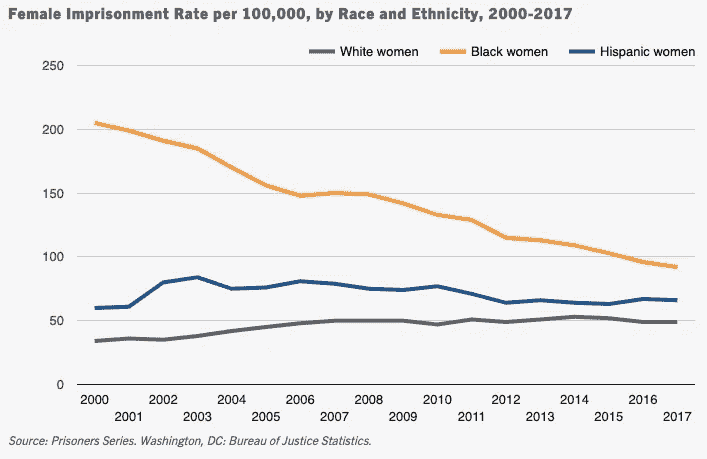
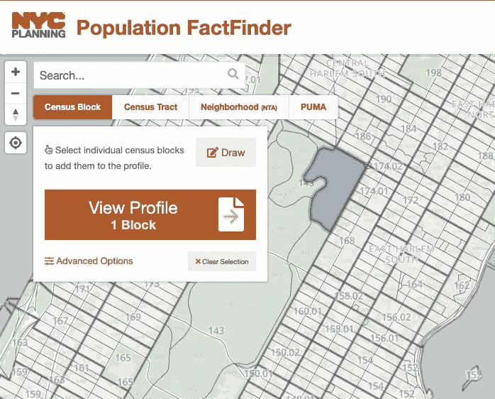

# 使用普查 API

> 原文：<https://towardsdatascience.com/working-with-the-census-api-7ed105448f13?source=collection_archive---------41----------------------->

## 收集数据研究公共卫生和治安

我是塔夫茨大学的一名软件开发人员，我的主要项目是一个区域绘图网站[Districtr.org](https://districtr.org)，它涵盖了所有形式的学校、城市、县和立法区。我们通过仔细使用人口普查数据来检查各区的人口是否相等(并允许用户评估他们的计划)。

你可能知道现在的人口普查(请填写！)但是，如果你是一名数据科学家或政治活动家，你应该知道在哪里可以为你的当前项目找到以前的人口普查记录。

# 社区项目受益于人口普查数据

今年 3 月，我的同事开始使用我们的人口普查工作来绘制人口统计数据，特别是冠状病毒风险高的人口统计数据——特别是老年人、集体住房和不讲英语的家庭。了解这些人群的集中程度和医院的容纳能力，可以指导我们的研究，并为决策者提供建议。

研究人员还通过人口普查数据，将其他警务数据集——911 电话、交通堵塞、逮捕、警察暴力、判决——与当地人口进行比较。例如，我们可以查看国家一级的监禁与种族和族裔数据:

来自:[https://www . sentencing project . org/publications/infined-women-and-girls/](https://www.sentencingproject.org/publications/incarcerated-women-and-girls/)

今年 6 月，约翰·基夫(John Keefe)向多个城市的警区发布了一系列关于从 2010 年人口普查中收集种族和族裔数据的操作指南:

 [## 明尼阿波利斯种族和族裔数据，由 Datasette 提供

### 明尼阿波利斯警方报告了街区的停车和其他事故，所以我决定计算一下…

johnkeefe.net](https://johnkeefe.net/minneapolis-race-and-ethnicity-data-by-neighborhood-served-with-datasette) 

这是一个有趣的项目，但我想提出两点:

1.  2010 年的数字可能已经过时，尤其是在城市。可能很难确定哪些社区正在中产阶级化，这是警察偏见研究的主要焦点之一([第 1 条](https://www.cssny.org/news/entry/New-Neighbors)、[第 2 条](https://onlinelibrary.wiley.com/doi/full/10.1111/cico.12473))。
2.  今年早些时候，当我遇到一个警察偏见项目时，他们没有将自己的记录与人口普查区进行比较(他们的大部分逮捕、交通拦截和雇佣都涉及到他们城市以外的人)。

如果你想成为一名人口普查数据科学家，你应该熟悉十年一次的人口普查和美国社区调查(ACS)。在撰写本文时，我们最好和最新的来源之一是 2014-2018 年 5 年 ACS。

# 普查地理数据

## 获得适当的详细程度

为什么我们不在所有事情上使用更新的 ACS？十年一次的人口普查公布了每个“人口普查区块”的人口数量。ACS 有更新更详细的统计数据，但我们必须缩小一个级别到“数据块组”。对于其他数据点(如语言和民族血统)，我们必须再次缩小到“地域”级别。

层次结构如下所示:

[https://learn . ArcGIS . com/en/related-concepts/United States-census-geography . htm](https://learn.arcgis.com/en/related-concepts/united-states-census-geography.htm)

当你观察城市、农村或沿海地区时，每个“人口普查区块”或地域的大小并不一致。一些街区覆盖了无人居住的公园、河流和机场；有些是城市街区或监狱。

探索纽约市[popfactfinder.planning.nyc.gov](https://popfactfinder.planning.nyc.gov/)的街区和道路地图

比较人口普查区块大(在中央公园)和小(上东区，岛屿)

## 下载人口普查形状文件

您可以在 GIS 软件中查看地图数据。领先的免费/开源应用叫做 QGIS:[qgis.org](https://www.qgis.org/en/site/)

你可以从
[census.gov/cgi-bin/geo/shapefiles/index.php](https://www.census.gov/cgi-bin/geo/shapefiles/index.php)下载 2010 块或 2018 块组作为 shapefiles

# 人口普查数据

现在您已经有了形状，让我们从 Census API 中收集几列数据。
**如果你因为电脑或互联网设置无法安装 Python 和 pip，或者无法访问人口普查网站**，你很可能会在 Google CoLab 或 NextJournal 上获得[一个免费笔记本](https://www.dataschool.io/cloud-services-for-jupyter-notebook/)。

## 获取人口普查 API 密钥

免费的！[https://api.census.gov/data/key_signup.html](https://api.census.gov/data/key_signup.html)

## 下载一个助手库？

如果您想提前完成一些 API 代码，请尝试 DataMade 的这个 Python 包:

 [## 数据制作/人口普查

### 美国人口普查局 API 的简单包装。提供对 ACS、SF1 和 SF3 数据集的访问。pip 安装…

github.com](https://github.com/datamade/census) 

大概也有 R 包吧。留下你最喜欢的评论。

## 写剧本

这就是我如何找到我想要的列并从 Census API 下载它们的方法。你的方法可以有所不同。

1.  从人口普查规范中查找变量名称，此处[为 2010 年十年的](https://api.census.gov/data/2010/dec/sf1/variables.html)，此处[为最近 5 年的 ACS。这个引用令人困惑，所以你可能想从 SocialExplorer 上的 ACS](https://api.census.gov/data/2018/acs/acs5/variables.html) [表名](https://www.socialexplorer.com/data/ACS2018_5yr/metadata/?ds=ACS18_5yr)开始。
2.  安装 Python、pip 和任何依赖项(`pip install requests`)
3.  使用您的 API 键、州、县和列编辑这个 Python 脚本。

如果你用 2010 年的人口普查，你会改变什么？

*   列名
*   API 终点([http://api.census.gov/data/2010/dec/sf1/](http://api.census.gov/data/2010/dec/sf1/)
*   `for=block:*`
*   `blockid =`线的末端应该参考块，而不是块组

# 组合人口表和 shapefiles

据我所知，有两种主要方法:

*   [GeoPandas](https://geopandas.org/io.html) (比较常见的一种)。如果你熟悉熊猫，这对你来说是有意义的。将 shapefile 作为地理数据框加载，然后根据下载的数据分配各列。
*   [GDAL](https://pypi.org/project/GDAL/) (我常用的方法)。你需要安装一个本地 libgdal，然后`pip install gdal`。然后这段代码摘录就可以工作了(或者你可以把它附加到你的下载脚本的末尾)

# 从一个层估计另一个层中的数据

块符合块组的内部，块组符合区域的内部，因此我们可以对它们求和并精确地计算种群。如果我们在地图上绘制其他形状，例如地铁站周围的步行距离，这种拟合就不再完美；我们只能估计里面的人口。

*   [MAUP](https://github.com/mggg/maup) 是我在 MGGG 重划实验室的同事使用 GeoPandas 开发的库。它可以处理重叠区域；例如，如果一个街区被平均分成两个选区，我们可以假设它的人口也是平均分配的。然而，人口、房屋和事件(如逮捕)在地图上并不是均匀分布的，尤其是当该区域包括空地或水域时。我以前曾使用 QGIS 从图层中移除水域，但即使这样也不会完全准确。
*   约翰·基夫的[笔记本](https://github.com/jkeefe/census-by-precincts/blob/master/notebooks/washington_dc.ipynb)描述了如何使用 QGIS 将每个街区与其官方人口普查街区质心(而非几何质心)进行匹配，并将每个街区分配给一个选区或街区。
    我喜欢这个理论，但是不太了解它，特别是如何下载质心的国家文件，或者它对块组的翻译有多好。
*   您可以通过在 QGIS 中划分图层来执行上述操作的手动版本:
    矢量>研究工具>按位置选择
    然后图层>另存为> [x]仅保存所选要素
    但这将需要一些时间，并且您需要管理您的数据以确保只计算一次重叠区域。如果您想知道不重叠的几个研究区域内有多少人，这将是一个很好的应用程序。
*   我更熟悉将 shapefile 加载到 PostgreSQL(如果您安装了 GDAL 或 PostgreSQL，那么您已经完成了一部分)和运行查询。这可以估计重叠区域，如果您赶时间，无需 PostGIS 扩展即可完成。对于许多项目来说，这是多余的。

# 更新？

本文来自 2020 年 7 月。有关任何新的建议，请参见我的 GitHub 自述文件[GitHub . com/mapmeld/use-this-now/blob/main/README . MD # census-API](https://github.com/mapmeld/use-this-now/blob/main/README.md#census-api)