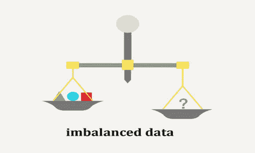
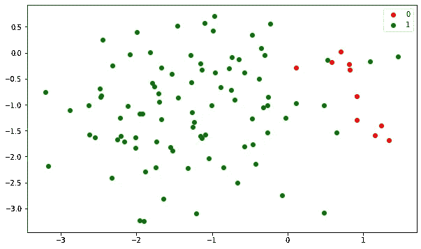
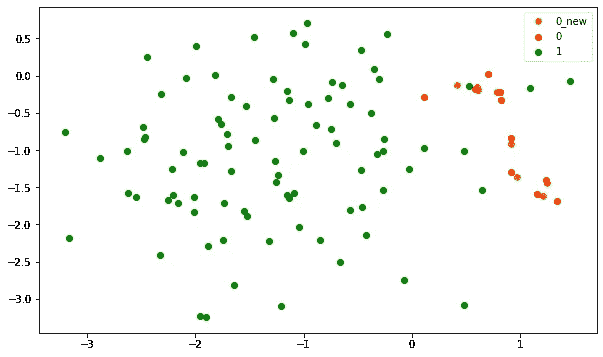
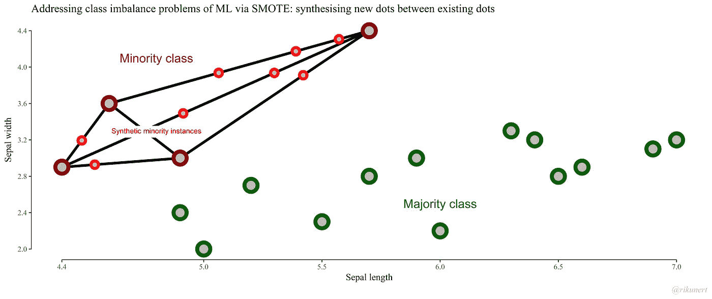

# 使用不平衡的数据集

> 原文：<https://towardsdatascience.com/working-with-unbalanced-dataset-8405465630d7?source=collection_archive---------23----------------------->

## SMOTE 简介

在建立机器学习模型时会遇到的一个典型问题是处理不平衡的数据集，其中感兴趣的标签非常少，即欺诈检测。在有偏见的数据集上直接应用机器学习模型可能会在少数标签的预测方面得到不好的结果。原因很简单，因为模型很少看到小类的训练样本，当然，当看不见的数据点出现时，它很难区分它们。

为了解决由不平衡数据集引入的问题，需要更多次类的数据点。除了通用方法，如上采样和下采样，SMOTE 可能是一个更聪明的选择，因为它通过简单地重复现有的数据点来生成数据点。在本帖中，让我们走进 SMOTE 的逻辑，通过直观地看到样本生成来更好地理解。

来源:[https://www . nexsoftsys . com/articles/what-is-unbalanced-data . html](https://www.nexsoftsys.com/articles/what-is-imbalanced-data.html)

# SMOTE 的想法

SMOTE，也称为合成少数过采样技术，顾名思义，是一种对少数类进行过采样的技术。它遵循以下步骤:

1.  对于每个少数类，找到它的 k-最近邻
2.  从它的一个邻居中选择，并在邻居和原始点之间画一条线
3.  在直线上随机选择一个点(相当于选择一个介于 0 和 1 之间的比率参数，并应用该比率来获得两点之间的一个点)
4.  重复操作，直到达到预期的样本数量

所以逻辑基本上是线性的，**所有生成的样本实际上都是现有样本的线性组合。**

# 示范

为了清楚地了解这些点是如何产生的，让我们用一个例子来形象化这个过程。

首先，让我们创建一个不平衡的数据集:

看起来像是:

不平衡数据集

其中标签 0 的红点是少数。

为了使用 SMOTE 进行上采样，我们可以使用现有的 python 包[这里是](https://imbalanced-learn.readthedocs.io/en/stable/generated/imblearn.over_sampling.SMOTE.html):

其中`k_neighbors`是上面描述的要选择的邻居的数量，并且`sampling_strategy = 0.2`告诉算法将少数标签采样到`0.2 x 90 = 18`。

让我们将生成的点可视化，

橙色的点是合成的。你可以注意到，所有这些点实际上都位于原始点的直线之间。更清晰的演示可能是这样的:

来源:[http://rikunert.com/SMOTE_explained](http://rikunert.com/SMOTE_explained)

上图显示，所有合成实例都是现有实例的线性组合(此处[代码为](https://github.com/MJeremy2017/Machine-Learning-Models/tree/master/SMOTE))。

最后说一下 SMOTE 的一些缺点。首先，最初的 SMOTE 不支持分类特征。如您所见，合成数据是由原始数据的线性组合生成的，因此分类特征不适合这种情况。这里讨论[类似的问答](https://stackoverflow.com/questions/47655813/oversampling-smote-for-binary-and-categorical-data-in-python)。第二，小类可能不是简单的线性组合，在这种情况下，SMOTE 对预测没有帮助。

参考:

[1]http://rikunert.com/SMOTE_explained

[2][https://en . Wikipedia . org/wiki/over sampling _ and _ under sampling _ in _ data _ analysis # SMOTE](https://en.wikipedia.org/wiki/Oversampling_and_undersampling_in_data_analysis#SMOTE)