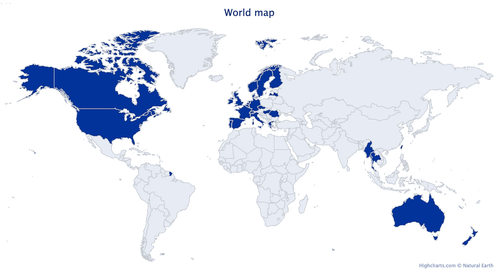

# R 中所访问国家的世界地图

> 原文：<https://towardsdatascience.com/world-map-of-visited-countries-in-r-d46b9be7d52b?source=collection_archive---------35----------------------->

L 和我一样，如果你和 R 一样喜欢旅行，你可能会想画一张你在 R 访问过的国家的世界地图。下面是一个我在 2020 年 1 月访问过的国家的例子:



突出显示到访国家的世界地图示例

要在 R 中绘制这个地图，您需要以下软件包:

```
library(highcharter)
library(dplyr)
library(maps)
```

像往常一样，在用`library()`加载软件包之前，您需要将它们安装在您的机器上。可以用命令`install.packages("name_of_package")`安装包。

加载完包后，我们将使用来自`{maps}`包的名为`iso3166`的数据集，并将其重命名为`dat`。以下是数据集的前 6 行:

```
dat <- iso3166
head(dat)##   a2  a3       ISOname               mapname sovereignty
## 1 AW ABW         Aruba                 Aruba Netherlands
## 2 AF AFG   Afghanistan           Afghanistan Afghanistan
## 3 AO AGO        Angola                Angola      Angola
## 4 AI AIA      Anguilla              Anguilla    Anguilla
## 5 AX ALA Aland Islands Finland:Aland Islands     Finland
## 6 AL ALB       Albania               Albania     Albania
```

我们将变量`a3`重命名为`iso-a3`:

```
dat <- rename(dat, "iso-a3" = a3)
head(dat)##   a2 iso-a3       ISOname               mapname sovereignty
## 1 AW    ABW         Aruba                 Aruba Netherlands
## 2 AF    AFG   Afghanistan           Afghanistan Afghanistan
## 3 AO    AGO        Angola                Angola      Angola
## 4 AI    AIA      Anguilla              Anguilla    Anguilla
## 5 AX    ALA Aland Islands Finland:Aland Islands     Finland
## 6 AL    ALB       Albania               Albania     Albania
```

我们将访问过的国家保存在一个名为`countries_visited`的向量中。要了解您访问过的国家的 ISO 代码，请检查数据集中的列`ISOname`，并从列`iso-a3`中提取 ISO 代码:

```
countries_visited <- c("AUS", "BEL", "CAN", "CZE", "DNK", "FIN", "FRA", "DEU", "GRC", "HUN", "IRL", "ITA", "LVA", "LUX", "MCO", "MMR", "NLD", "NZL", "NOR", "PRT", "ROU", "SGP", "ESP", "SWE", "CHE", "TWN", "THA", "GBR", "USA")
```

我们现在创建一个名为`visited`的新变量，如果你去过这个国家，它等于 1，否则等于 0:

```
dat$visited <- ifelse(dat$`iso-a3` %in% countries_visited, 1, 0)
head(dat)##   a2 iso-a3       ISOname               mapname sovereignty visited
## 1 AW    ABW         Aruba                 Aruba Netherlands       0
## 2 AF    AFG   Afghanistan           Afghanistan Afghanistan       0
## 3 AO    AGO        Angola                Angola      Angola       0
## 4 AI    AIA      Anguilla              Anguilla    Anguilla       0
## 5 AX    ALA Aland Islands Finland:Aland Islands     Finland       0
## 6 AL    ALB       Albania               Albania     Albania       0
```

最后，由于来自`{highcharter}`包的`hcmap()`命令，我们已经准备好绘制世界地图了:

```
hcmap(
  map = "custom/world-highres3", # high resolution world map
  data = dat, # name of dataset
  joinBy = "iso-a3",
  value = "visited",
  showInLegend = FALSE, # hide legend
  nullColor = "#DADADA",
  download_map_data = TRUE
) %>%
  hc_mapNavigation(enabled = FALSE) %>%
  hc_legend("none") %>%
  hc_title(text = "World map") # title
```

根据你的需要改变论点，你就可以开始了。更进一步，您还可以添加一个列表，其中包括您访问过的所有国家，这要归功于以下代码:

```
dat <- subset(dat, dat$visited == 1)
sort(dat$ISOname) # sort is to have the visited countries in alphabetical order##  [1] "Australia"                                           
##  [2] "Belgium"                                             
##  [3] "Canada"                                              
##  [4] "Clipperton Island"                                   
##  [5] "Czech Republic"                                      
##  [6] "Denmark"                                             
##  [7] "Finland"                                             
##  [8] "France"                                              
##  [9] "Germany"                                             
## [10] "Greece"                                              
## [11] "Hungary"                                             
## [12] "Ireland"                                             
## [13] "Italy"                                               
## [14] "Latvia"                                              
## [15] "Luxembourg"                                          
## [16] "Monaco"                                              
## [17] "Myanmar"                                             
## [18] "Netherlands"                                         
## [19] "New Zealand"                                         
## [20] "Norway"                                              
## [21] "Portugal"                                            
## [22] "Portugal"                                            
## [23] "Portugal"                                            
## [24] "Romania"                                             
## [25] "Singapore"                                           
## [26] "Spain"                                               
## [27] "Spain"                                               
## [28] "Sweden"                                              
## [29] "Switzerland"                                         
## [30] "Taiwan"                                              
## [31] "Thailand"                                            
## [32] "United Kingdom of Great Britain and Northern Ireland"
## [33] "United States"
```

数一数去过的国家:

```
paste(
  "Total: ",
  sum(dat$visited),
  " countries."
)## [1] "Total:  33  countries."
```

总之，下面是绘制世界地图的完整代码，其中突出显示了访问过的国家，按字母顺序列出了所有国家和访问过的国家数:

```
library(highcharter)
library(dplyr)
library(maps)dat <- iso3166
dat <- rename(dat, "iso-a3" = a3)
countries_visited <- c("AUS", "BEL", "CAN", "CZE", "DNK", "FIN", "FRA", "DEU", "GRC", "HUN", "IRL", "ITA", "LVA", "LUX", "MCO", "MMR", "NLD", "NZL", "NOR", "PRT", "ROU", "SGP", "ESP", "SWE", "CHE", "TWN", "THA", "GBR", "USA")
dat$visited <- ifelse(dat$`iso-a3` %in% countries_visited, 1, 0)hcmap(
  map = "custom/world-highres3", # high resolution world map
  data = dat, # name of dataset
  joinBy = "iso-a3",
  value = "visited",
  showInLegend = FALSE, # hide legend
  nullColor = "#DADADA",
  download_map_data = TRUE
) %>%
  hc_mapNavigation(enabled = FALSE) %>%
  hc_legend("none") %>%
  hc_title(text = "World map") # titledat <- subset(dat, dat$visited == 1)
sort(dat$ISOname) # sort is to have the visited countries in alphabetical orderpaste(
  "Total: ",
  sum(dat$visited),
  " countries."
)
```

感谢阅读。我希望这篇文章能帮助你画出一张世界地图，用 r 标出你去过的国家。

和往常一样，如果您有与本文主题相关的问题或建议，请将其添加为评论，以便其他读者可以从讨论中受益。

**相关文章:**

*   [安装和加载 R 包的有效方法](https://www.statsandr.com/blog/an-efficient-way-to-install-and-load-r-packages/)
*   我的数据符合正态分布吗？关于最广泛使用的分布以及如何检验 R 中的正态性的注释
*   [R 中的 Fisher 精确检验:小样本的独立性检验](https://www.statsandr.com/blog/fisher-s-exact-test-in-r-independence-test-for-a-small-sample/)
*   [R 中独立性的卡方检验](https://www.statsandr.com/blog/chi-square-test-of-independence-in-r/)
*   [如何在简历中创建时间线](https://www.statsandr.com/blog/how-to-create-a-timeline-of-your-cv-in-r/)

*原载于 2020 年 1 月 9 日 https://statsandr.com**[*。*](https://statsandr.com/blog/world-map-of-visited-countries-in-r/)*