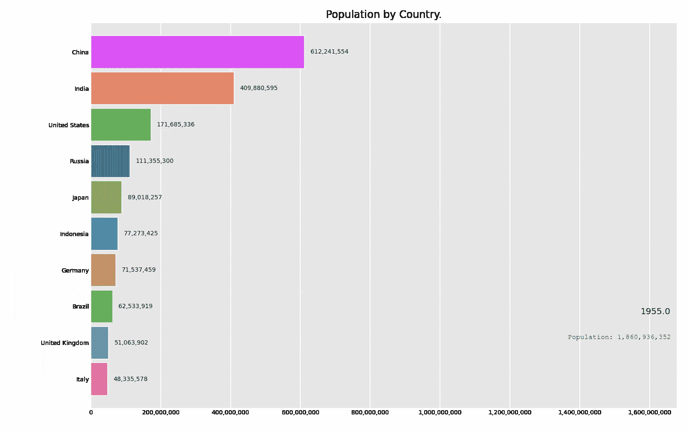

# 从 1955 年到 2020 年的世界人口条形图竞赛

> 原文：<https://towardsdatascience.com/world-population-from-1955-to-2020-bar-chart-race-166ff307c48e?source=collection_archive---------34----------------------->

## 数据科学 100 天的第 6 天



由 [Durgesh Samariya](https://medium.com/u/9cd373b50e1b?source=post_page-----166ff307c48e--------------------------------) 创作。

欢迎回到我的 100 天数据科学挑战之旅。第六天，我用 Python 制作了条形图比赛动画。对于今天的任务，我将使用从 1955 年到 2020 年的国家人口数据。

你可以在这里阅读我以前的故事:

[](/analysing-and-visualising-the-country-wise-population-from-1955-to-2020-with-pandas-matplotlib-70b3614eed6b) [## 用熊猫分析和可视化 1955 年至 2020 年的乡村人口

### 100 天数据科学的第 1、2、3 天。

towardsdatascience.com](/analysing-and-visualising-the-country-wise-population-from-1955-to-2020-with-pandas-matplotlib-70b3614eed6b) 

最近，我看到了一篇关于 Ted Petrou 发布的[官方发布 bar_chart_race](https://medium.com/dunder-data/bar-chart-race-python-package-official-release-78a420e182a2) 的帖子。在他的文章中，他提供了一个关于如何使用 bar_chart_race 包创建条形图比赛的优秀教程。点击查看官方文件[。](https://pypi.org/project/bar-chart-race/)

## 内容

*   条形图比赛包的安装
*   导入所需的库
*   加载数据
*   创建条形图竞赛

# 条形图比赛包的安装

使用 pip 安装:

```
pip3 install bar_chart_race
```

或者使用 anaconda:

```
conda install -c conda-forge bar_chart_race
```

# 导入所需的库

对于这个项目，我们只需要熊猫，条形图种族库。

```
# to load data
import pandas as pd#bar chart race
import bar_chart_race as bcr
```

# 正在加载数据集

```
%time population = pd.read_csv('./data/Countries Population from 1995 to 2020.csv')
```

在条形图比赛中，您的数据必须采用特定的格式:

*   每个条目代表一个时间
*   每个特征都有某个特定值
*   时间应该设置为。指数

让我们看看我们的数据是什么样子的。

```
population.head()
```

所以很明显，我们的数据格式不适合输入 bar_chart_race。首先，对数据进行相关修改。

**步骤 1** —删除除年份、国家和人口之外的所有列。

```
pop = population.drop(['Yearly % Change', 'Yearly Change', 'Migrants (net)', 'Median Age', 'Fertility Rate', 'Density (P/Km²)', 'Urban Pop %', 'Urban Population', 'Country**\'**s Share of World Pop %', 'World Population', 'Country Global Rank' ], axis = 1)
```

**第二步** —从 pop 数据帧创建 pivot_table，其中`Year`为索引；每个国家作为列，人口作为值。

```
df = pop.pivot_table('Population',['Year'], 'Country')
```

有时候你的数据是不有序的，所以一定要把时间列排序。在我们的例子中，它是`Year`。

```
df.sort_values(list(df.columns),inplace=True)
df = df.sort_index()
df
```

现在我们的数据已经准备好了，所以让我们创建一个条形图比赛。

# 创建条形图竞赛

你可以简单地使用`bcr`中的`.bar_chart_race()`方法。

```
bcr.bar_chart_race(df)
```

上面给的步骤很简单，没有我想要的那么吸引人。所以还是定制吧。让我们看看最终的代码。您可以在 [bar_chart_plot 文档](https://www.dexplo.org/bar_chart_race/)中找到所有功能和不同的可能性。

```
bcr.bar_chart_race(
    df=df,
    filename=None,
    orientation='h',
    sort='desc',
    n_bars=10,
    fixed_order=False,
    fixed_max=True,
    steps_per_period=10,
    interpolate_period=False,
    label_bars=True,
    bar_size=.90,
    period_label={'x': .99, 'y': .25, 'ha': 'right', 'va':'center'},
    period_summary_func=lambda v, r: {'x': .99, 'y': .18,
             's': f'Population**{**v.nlargest(39).sum()**:**,.0f**}**',
             'ha': 'right', 'size': 8, 'family': 'Courier New'},
    period_length=500,
    figsize=(6.5,5),
    dpi=144,
    cmap='dark12',
    title='Population by Country',
    title_size='',
    bar_label_size=7,
    tick_label_size=5,
    shared_fontdict={'family' : 'Helvetica','color' : '.1'},
    scale='linear',
    writer=None,
    fig=None,
    bar_kwargs={'alpha': .7},
    filter_column_colors=True)
```


最终输出。由 [Durgesh Samariya](https://medium.com/u/9cd373b50e1b?source=post_page-----166ff307c48e--------------------------------) 创作。

我要感谢 [Ted Petrou](https://medium.com/u/cf7f60f2eeb3?source=post_page-----166ff307c48e--------------------------------) 创建了这么棒的库和教程。除此之外，还要感谢 Vinay Shaw——这个[内核](https://www.kaggle.com/vinayshaw/india-s-covid-19-recovery-bar-chart-race)的作者，他向我介绍了这个美丽的库。

# 最后的话

今天到此为止。今天，我学习并创建了我的第一个条形图比赛可视化。未来期待从中创造一些有趣的东西。我希望这篇文章对你有帮助。所有数据分析和可视化的代码都可以在这个 [GitHub 库](https://github.com/themlphdstudent/100DaysofDataScience)或者 [Kaggle 内核](https://www.kaggle.com/themlphdstudent/country-wise-population-bar-chart-race)中找到。

**感谢阅读。**

我感谢任何反馈。

# 100 天的数据科学进步

[](/analysing-and-visualising-the-country-wise-population-from-1955-to-2020-with-pandas-matplotlib-70b3614eed6b) [## 用熊猫分析和可视化 1955 年至 2020 年的乡村人口

### 100 天数据科学的第 1、2、3 天。

towardsdatascience.com](/analysing-and-visualising-the-country-wise-population-from-1955-to-2020-with-pandas-matplotlib-70b3614eed6b) 

## 关于我

我是 [Durgesh Samariya](https://durgeshsamariya.github.io) ，澳大利亚费杜尼大学机器学习博士三年级学生。

## 在互联网上:

在 [LinkedIn](https://www.linkedin.com/in/durgeshsamariya/) 、 [Instagram](https://www.instagram.com/themlphdstudent/) 、 [Kaggle](https://www.kaggle.com/themlphdstudent) 、 [GitHub](https://github.com/themlphdstudent) 、 [Medium](https://pub.towardsai.net/@themlphdstudent) 上关注我。

如果你喜欢阅读这样的故事，并希望支持我的写作，可以考虑成为一名[灵媒](https://medium.com/@themlphdstudent/membership)。每月支付 5 美元，你就可以无限制地阅读媒体上的故事。如果你使用我的注册链接，我会收到一小笔佣金。

**已经是会员了**？[订阅](https://medium.com/subscribe/@themlphdstudent)在我发布时得到通知。