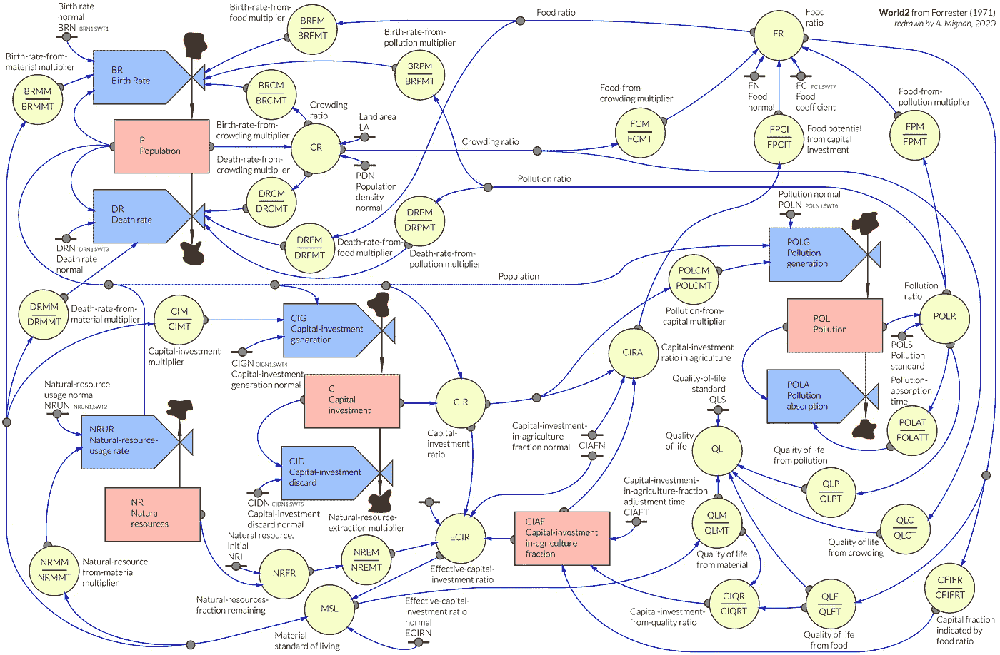
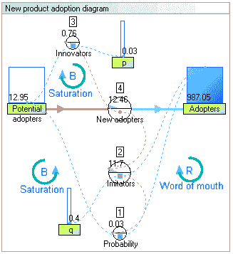
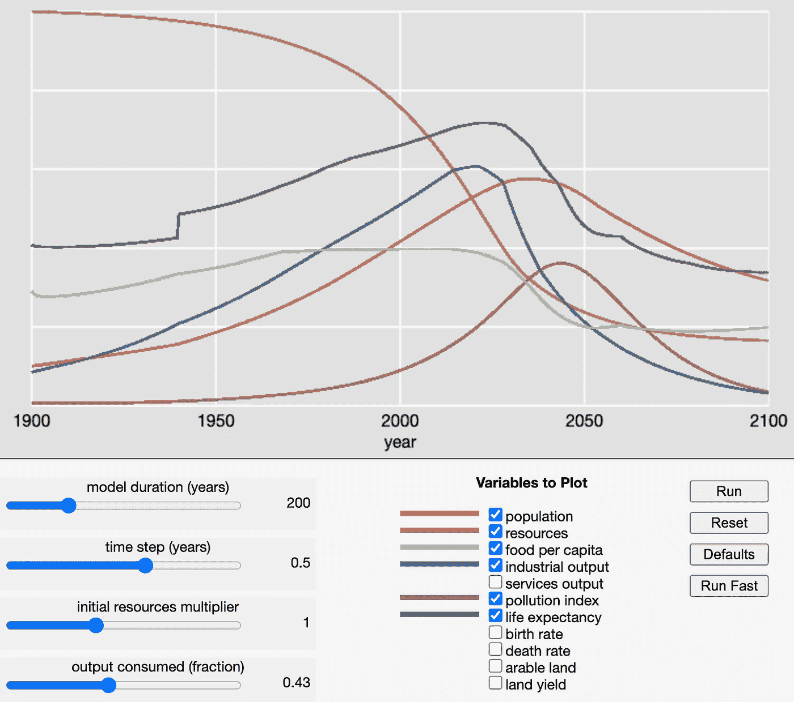
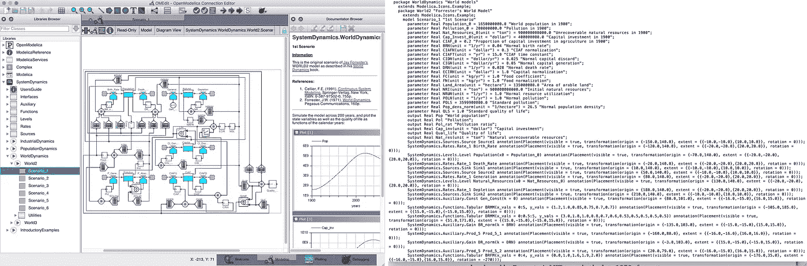
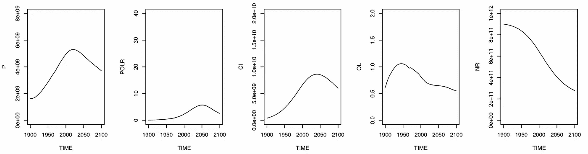

# 世界 2 模型，从发电机到 R

> 原文：<https://towardsdatascience.com/world2-model-from-dynamo-to-r-2e44fdbd0975?source=collection_archive---------14----------------------->



**世界动态**，如 Forrester (1971)的 World2 模型中所定义。

## 第一个世界末日计算机模型，基于 Forrester 的系统动力学，用 R 编程语言重新审视

*“1972 年，一本名为《*[](http://www.donellameadows.org/wp-content/userfiles/Limits-to-Growth-digital-scan-version.pdf)**》的平装小书大张旗鼓地出版了。这本书警告说，世界正在走向灾难。如果方向没有重大改变，在 50 年或 100 年内，人类将会耗尽食物和自然资源，或者因自身污染而窒息(Hayes，1993)。**

***杰伊·赖特·福雷斯特**(1918–2016)是美国计算机工程师和系统科学家，**被誉为系统动力学**的“创始人”。虽然比写了《增长的极限》(Meadows et al .，1972)的 Meadows 夫妇更少为人所知，但 Forrester 的世界动力学模型 World2 (Forrester，1971)是所有后续模型的基础**预测到 21 世纪中叶我们的社会技术自然系统将崩溃**。本文从编程的角度重新审视了这项开创性的工作，将过时的 DYNAMO 代码重写为 r。它将提供世界动力学模型的全新视角，并可以在以后用作机器学习练习的输入模型。*

## *《世界动力学》简史*

*Forrester 于 1989 年在德国斯图加特的系统动力学学会上发表的一次演讲的文字记录为我们提供了媒体对他的**世界末日计算机模型**的发表的反应的第一手资料:*

> *“《世界动态》于 1971 年 6 月的第一周出版。六月的最后一周，伦敦《观察家报》的头版对此进行了评论。我收到了纽约一位大学教授的来信，要求提供更多的信息，因为他在《新加坡时报》上读到了这本书。8 月份，这本书占据了《基督教科学箴言报》第二版的整个头版，9 月份占据了《财富》的一个半版，10 月份占据了《华尔街日报》的一个专栏。它出现在美国中部报纸的社论栏中，它是欧洲黄金时间纪录片电视的主题，它在环境媒体、人口零增长媒体和反体制的地下学生媒体中被辩论。而且，如果你不喜欢你的文学作品中既有当权派右派也有当权派左派，那么就在政治光谱的中间，在《世界动态》出版九个月后，《增长的极限》在《花花公子》上发表了一篇完整的文章。信息基本上是一样的，尽管做了更多的工作，这本书也更受欢迎……”*—杰伊·w·福瑞斯特，1989**

**

*继 Sterman (2001)之后，系统动力学学派的现任领袖，两次授予 Jay W. Forrester 系统动力学最佳出版作品奖。来源:[维基百科](https://en.wikipedia.org/wiki/System_dynamics#/media/File:Adoption_SFD_ANI_s.gif)。*

***系统动力学是一种理解复杂系统随时间变化的非线性行为的方法**，使用股票、流量、内部反馈回路、表格函数和时间延迟([维基百科](https://en.wikipedia.org/wiki/System_dynamics))。事实上，它来源于早期的控制论著作。*

*World2 不是 Forrester 在系统动力学方面的第一个主要工作，因为他已经将该方法应用于“工业动力学”中的工厂规划(Forrester，1961)，然后应用于“城市动力学”中的城市规划(Forrester，1969；有趣的是，这后来对电子游戏《模拟城市》的创作产生了影响；Lobo，2007)。Forrester 在城市动力学方面的工作引起了罗马俱乐部的注意，这引发了对全球可持续性的讨论，并在 1971 年出版了《世界动力学》一书，其中提出了 World2 模型。 **Meadows 的团队并行开发了模型的扩展，产生了 World3 版本** (Meadows 等人，1972；梅多斯，1974；Meadows 等人在 2004 年更新；另见 Randers，2012 年)。有趣的是，Forrester 在他与瑞士罗马俱乐部的会议结束后，在回家的飞机上草拟了一个模型的初步版本，名为 world 1(Hayes，1993)。*

*World1 模型的初步结果。2 分 35 秒:“我们来到 2020 年，它真的回来了。当然，更多的人意味着你开始消耗你的自然资源，这是这条曲线，N 曲线，显示了…*

## *重新运行模型 World2 和 World3*

> *“1971 年的‘世界动态’*似乎已经具备了保证不引起公众注意的一切必要条件。首先，在书的中间有**40 页的方程式**，这足以压制公众的兴趣。第二，有趣的信息是以**电脑输出图**的形式出现的，而大多数公众并不理解这样的演示。” *—杰伊·w·福雷斯特，1989 年***

**在纸上阅读一个模型的特征和输出不足以完全掌握其潜在的机制和假设。由于世界 2 和世界 3 模型在系统动力学中的历史重要性以及随后 50 年的争论，重温源代码是值得的。**

**虽然我认为很容易找到这些模型的现代版本，但事实上我不得不深入挖掘以找到一些开放源代码，并最终决定在阅读 Forrester (1971)的基础上，用 R 从头开始重做 World2 模型。下面是我通往 [**Rworld2**](https://github.com/amignan/hist_gc_sysdyn/blob/master/Rworld2.R) **项目**的旅程总结:**

*   **在 R 中找不到代码；**
*   **提到了一个法国团队在 2018 年创建的 Python 代码( [PDF1](https://raweb.inria.fr/rapportsactivite/RA2018/steep/steep.pdf) ， [PDF2](http://courtoisthomas.pythonanywhere.com/static/pdf/Python%20-%20World3%20Ressources.pdf) )，但显然不能直接访问；**

****

**截图来自 javascript 的 World3 测试版，来自[bit-player.org](http://bit-player.org/extras/limits/ltg.html)。**

*   **事情变得越来越具体:存在一个 [Javascript 仪表板](http://bit-player.org/extras/limits/ltg.html)，允许用户尝试 World3 模型的不同参数化，并绘制结果。然而，[的免责声明](http://bit-player.org/wp-content/extras/limits/)声明“t *这是一个正在进行的工作，很可能有严重的错误*”这与该工具的作者 Brian Hayes 的一篇非常好的文章有关，他在《美国科学家》杂志上写了几篇关于“增长的极限”的文章。2012).下面是这篇文章的一个重要内容:“*最初的 World3 模型运行在大型机硬件上——IBM 360 和 370 机器。“迪纳摩计划的其他金块如下，以下是四个要点。***
*   **Hayes 提到“*有几种更通用、更值得信赖的实现方式*”，并提供了下面的[链接](http://live.simgua.com/World)，不幸的是，到 2020 年这个链接已被打破。**
*   **Scott Fortmann-Roe 通过 Insightmaker (Fortmann-Roe，2014 年)提供了一个值得信赖的 World3 实现——然而，使用一个基于 web 的图形模型构造的通用工具与我最初想到的简单脚本的灵活性不一致。**

****

**在[https://insight maker . com/insight/1954/The-World3-Model-A-Detailed-World-predictor](https://insightmaker.com/insight/1954/The-World3-Model-A-Detailed-World-Forecaster)对 World 3 模型进行在线模拟。**

*   **最可靠和最好记录的开源版本的 [World2](https://build.openmodelica.org/Documentation/SystemDynamics.WorldDynamics.World2.html) 和 [World3](https://build.openmodelica.org/Documentation/SystemDynamics.WorldDynamics.World3.html) 是由弗朗索瓦·e·塞利耶在 [Modelica](https://en.wikipedia.org/wiki/Modelica) 中编写的(塞利耶，2007；2008;卡斯特罗等人，2014)。World3 的文档提供了一些有价值的历史信息:“*Jay Forrester 在他的书《世界动力学》中列出了他的整个模型，而 Dennis Meadows 只在《增长的极限》中谈到了使用他的模型获得的结果。型号本身没有列出。然而，梅多斯从未试图隐藏自己的模型，以躲避公众的审视。事实上，他写了一份 637 页的* ***内部报告，描述了他的*** *模型的方方面面。1974 年，他将这份内部报告作为独立的一本书出版了:《有限世界中的增长动力学》。*“Cellier(2008)补充道:“*虽然 Forrester 和 Meadows 的著作在 70 年代初首次出版时引起了不小的轰动，但世界建模很快就变得不流行了，因为基本上所有的资金来源都因为政治原因而枯竭了。* ***只是最近，在石油峰值事件迫在眉睫的背景下，并且因为正在进行的关于全球变暖的讨论，世界建模才再次变得受人尊敬*** *。这使得 Rworld2 成为一个及时的项目，特别是因为 Modelica 代码虽然可用，但不太可能直接用于任何现代数据科学项目。***

****

**左图:显示 World2 场景 1 的 OpenModelica OMEdit 平台；右图:Modelica 中 World2 程序的摘录(OpenModelica 库的一部分，可在文件夹/om library/system dynamics 2.1/package . mo 中找到)。**

*   **回到起点！既然 Modelica 程序本身是从 Forrester (1971)提供的原始 DYNAMO 代码翻译而来，为什么还要翻译它呢？ [**迪纳摩(动力学模型)**](https://en.wikipedia.org/wiki/DYNAMO_(programming_language)#:~:text=DYNAMO%20(DYNAmic%20MOdels)%20is%20a,resource%20studies%20and%20urban%20planning.) **最初是由 Forrester 的 MIT 团队在 20 世纪 50 年代末开发的，用于系统动力学计算**。世界 2 和世界 3 最初都是用 DYNAMO 编写的。自从《增长的极限》出版后，这种语言就不再使用了。 [Hayes](http://bit-player.org/2012/world3-the-public-beta) 描述得很好:“*在词汇和句法结构上，DYNAMO 是你对穿孔卡片时代的语言的期望——六个字母的变量名和全部大写——但在其他方面，它是一个有趣的早期实验，其编程风格介于过程式和声明式之间。*“这是 Forrester (1971:136)的附录 B‘世界模型的方程式’的摘录，显示了 DYNAMO 中的一些代码行:**

```
*** WORLD DYNAMICS W5
L P.K=P.J+(DT)(BR.JK-DR.JK)
N P=PI
C PI=1.65E9
R BR.KL=(P.K)(CLIP(BRN,BRN1,SWT1,TIME.K))(BRFM.K)(BRMM.K)(BRCM.K)
X (BRPM.K)
C BRN=.04
C BRN1=.04
C SWT1=1970
A BRMM.K=TABHL(BRMMT,MSL.K,0,5,1)
T BRMMT=1.2/1/.85/.75/.7/.7
A MSL.K=ECIR.K/(ECIRN)**
```

## **世界 2 从零开始**

**现在让我们看一下模型的结构，乍一看可能会让人不知所措。我建议先看看世界 3 的结构，使世界 2 的复杂性更加相关(世界 2 中有 43 个控制方程，而世界 3 中有 150 个)。**

****

****世界 2 模型的完整图表**涉及五个层次的变量——人口、自然资源、资本投资、农业资本投资和污染，摘自 Forrester(1971:20–21，图 2–1)。因此，World2 是一个 5 阶微分方程模型。这个图怎么看？首先，确定 5 个级别(红色)，然后是代表流入和流出的比率(蓝色)，最后是许多因素(黄色)。水平、比率和因素之间的相互关系(蓝色)在 World2 等式中定义。**

**我发现 Forrester (1971)第 3 章中提供的 DYNAMO 脚本比附录 b 中给出的完整代码更容易理解。我通过遵循书中相同的编号系统来识别不同的“*方程*”(即[赋值语句](http://bit-player.org/2012/world3-the-public-beta))以进行直接匹配。类似地，我保留了相同的变量和函数名。在 DYNAMO 中顺序并不重要，所以 R 中最繁琐的步骤是对 World2 的 43 个等式和所谓的乘数(见下文)进行重新排序，以便正确定义和更新所有变量(因此我手动完成了 DYNAMO 编译器的工作。将 R 中的 World2 编码为一个图，然后应用拓扑排序，这将是一个挑战，尽管很诱人。**

**等式的一个例子在下面的 R 中给出:**

```
**# logical function used as time switch to change parameter value
CLIP <- function(FUNCT1, FUNCT2, THRESH.K, VAL) if(THRESH.K >= VAL) return(FUNCT1) else return(FUNCT2)DT <- .2
TIME <- seq(1900, 2100, DT)   # CALENDAR TIME (YEARS)
n <- length(TIME)# (...)## (2) Birth rate BR ##
# BR.KL = P.K CLIP(BRN, BRN1, SWT1, TIME.K) BRFM.K BRMM.K BRCM.K BRPM.K
# BRFM = BIRTH-RATE-FROM-FOOD MULTIPLIER ()
# BRMM = BIRTH-RATE-FROM-MATERIAL MULTIPLIER ()
# BRCM = BIRTH-RATE-FROM-CROWDING MULTIPLIER ()
# BRPM = BIRTH-RATE-FROM-POLLUTION MULTIPLIER ()
BR <- numeric(n)    # BIRTH RATE (PEOPLE/YEAR)
BRN <- .04          # BIRTH RATE NORMAL (FRACTION/YEAR)
BRN1 <- .04         # BIRTH RATE NORMAL no. 1 (FRACTION/YEAR)
SWT1 <- 1970        # SWITCH TIME no. 1 FOR BRN (YEARS)# (...)for(K in 2:n){
  J <- K - 1 # (...) BR[K] <- P[J] * CLIP(BRN, BRN1, SWT1, TIME[J]) * BRMM(MSL[J]) * BRCM(CR[J]) * BRFM(FR[J]) * BRPM(POLR[J])  # (2-3,16-18) # (...)**
```

**BR 是出生率，是人口 P、MSL 物质生活水平、拥挤 CR、食物 FR 和污染 POL (POLR 是污染比率)的函数。BR 与 P 成比例增长，并通过称为乘数的单值函数依赖于其他变量(BR *.variable.* M)。现在是一个乘数示例，基于 Forrester 定义的查找表:**

```
**library(signal)  # interp1()## (3) Birth-rate-from-material multiplier BRMM ##
BRMM = function(MSL.K){
  # MSL   = MATERIAL STANDARD OF LIVING ()
  # BRMMT = BIRTH-RATE-FROM-MATERIAL MULTIPLIER TABLE
  lookup.table <- data.frame(MSL = seq(0, 5, 1), 
                             BRMMT = c(1.2, 1., .85, .75, .7, .7))
  return(interp1(lookup.table$MSL, lookup.table$BRMMT, MSL.K))
}**
```

**为了清晰地解释 Forrester 构建 World2 的方法，我推荐 Castro 和 Cellier 的这个 [2016 演示文稿](https://openmodelica.org/images/M_images/Moses206/moses2016-25-RodrigoCastro-Overview-of-the-Modelica-based-World2-and-Wold3-models.pdf)。由于 Rworld2 代码大约有 500 行长(包括许多与 Forrester，1971 年的第 3 章直接匹配的注释)，所以这里没有给出它的全文，但是可以在我的 GitHub repo[hist _ GC _ sys dyn](https://github.com/amignan/hist_gc_sysdyn)(History _ global distoriates _ system dynamics 的简称)中找到。最后，让我们画出结果。**

```
**# basic plots with same y-range as in Fig. 4-1 of Forrester (1971)plot(TIME, P, type = 'l', ylim = c(0, 8e9))
plot(TIME, POLR, type = 'l', ylim = c(0, 40))
plot(TIME, CI, type = 'l', ylim = c(0, 20e9))
plot(TIME, QL, type = 'l', ylim = c(0, 2))
plot(TIME, NR, type = 'l', ylim = c(0, 1000e9))**
```

****

****Rworld2**人口 P、污染率 POLR、资本投资 CI、生活质量 QL 和自然资源 NR 的原始结果。**

**通过将结果与 Forrester (1971 年)的图 4–1 进行比较，很容易验证 R 代码是否正确— **参见 GitHub** 上的图。《Rworld2》很粗糙，但我想保留弗雷斯特原著中 20 世纪 70 年代的精髓。未来的工作将包括一个交互式仪表板，正如 javascript 和 Insight Maker 已经提供的那样。另一个步骤是用 R 写 World3(如果 Rworld2 花了我一整天的工作，Rworld3 应该花了大约半个星期)。一个长期的项目是将模型定义为一个图。**

## **最终注释**

**这篇中型文章的目的是从编程的角度展示 World2 模型，并提供一个 R 版本，这是以前所缺乏的。围绕各种世界末日场景的争论不是本文的主题，但读者可能会问，在 2020 年运行 World2 是否有任何用处。因此，让我引用 Cellier (2008)关于这种过时模型的有用性的话:“*事实证明，Forrester 和 Meadows 的评估基本上是正确的，尽管他们的模型与现实世界的动态相比非常粗糙。*“这些“简单”模型的有效性已经在最近的研究中得到证实，这些研究将过去的预测与观察结果进行了比较(Turner，2008；2014).**

## **参考**

**Castro R，Fritzson P，Cellier F，Motesharrei S，Rivas J (2014)，【Modelica 世界建模中的人与自然互动。 *Proc。第十届国际 Modelica 会议*，瑞典隆德，477–488。
Cellier FE (2007)，[生态足迹，能源消耗，以及即将到来的崩溃](http://people.inf.ethz.ch/fcellier/Pubs/World/tod_07.pdf)。*油桶*。
Cellier FE (2008)，[Modelica 中的 World3:在 Modelica 框架中创建系统动力学模型](http://people.inf.ethz.ch/fcellier/Pubs/World/modelica_08_world3.pdf)。*过程。2008 年 modelica*，2393400 英镑。
福瑞斯特·JW(1961 年)*产业动态*。麻省理工学院出版社，剑桥，464 页
福瑞斯特·JW(1969)*城市动力学*。飞马通信公司，沃尔瑟姆，285 页。
福瑞斯特·JW(1971)，*《世界动态》*。Wright-Allen Press，Inc .，Cambridge，144 页。
Fortmann-Roe S (2014)， [Insight Maker:基于 web 的建模通用工具&模拟](https://reader.elsevier.com/reader/sd/pii/S1569190X14000513?token=C3364F48EDB942331B78E88514475EBB386DDE1FAC883A8BD26CC81D5044A4D72AD050BAC218C50895FB68A8A6DCFF6E)。*模拟建模实践与理论*，47，28–45。
海斯 B(1993)[计算科学:在铅笔尖上保持平衡](http://bit-player.org/wp-content/extras/bph-publications/AmSci-1993-11-Hayes-Limits-to-growth.pdf)。*美国科学家*，81(6)，510–516。
Hayes B (2012)，[计算科学:计算和人类困境，增长的极限和计算机建模的极限](https://www.americanscientist.org/sites/americanscientist.org/files/2012491358139046-2012-05Hayes.pdf)。*美国科学家*，100(3)，186–191。
Lobo DG (2007)，玩转都市生活。在 von Borries 等人(编辑)的文章中，*时空玩电脑游戏，建筑和城市化:下一个层次*。伯克豪泽，495 页。
梅多斯 DH，梅多斯 DL，兰德斯 J，伯伦斯三世 WW(1972)[*增长的极限*](http://www.donellameadows.org/wp-content/userfiles/Limits-to-Growth-digital-scan-version.pdf) 。宇宙图书，纽约，205 页。
梅多斯 DL(1974)*有限世界中的增长动力学*。赖特艾伦出版社，剑桥，637 页
梅多斯 D，梅多斯 D，兰德斯 J(1992)*超越极限*。切尔西格林出版社，300 页。
梅多斯 D，兰德斯 J，梅多斯 D (2004)，*增长的极限:30 年更新*。切尔西格林出版社，338 页。
兰德斯 J (2012)， *2052:未来四十年全球预测*。切尔西格林出版社，416 页。
斯特曼法学博士(2001)，[系统动力学建模:复杂世界中的学习工具](https://www.researchgate.net/publication/3228150_System_dynamics_modeling_Tools_for_learning_in_a_complex_world)。*加州管理评论*，43(4)，8–25
特纳通用汽车(2008)，[*增长的极限*与 30 年现实](https://www.sciencedirect.com/science/article/abs/pii/S0959378008000435)的比较。*全球环境变化*，18，397–411。
特纳通用汽车(2014)，[全球崩溃是否迫在眉睫？*增长的极限*与历史数据](https://sustainable.unimelb.edu.au/__data/assets/pdf_file/0005/2763500/MSSI-ResearchPaper-4_Turner_2014.pdf)的最新比较。MSSI 研究论文№4，*墨尔本可持续社会研究所*，墨尔本大学，共 21 页**