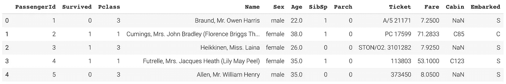
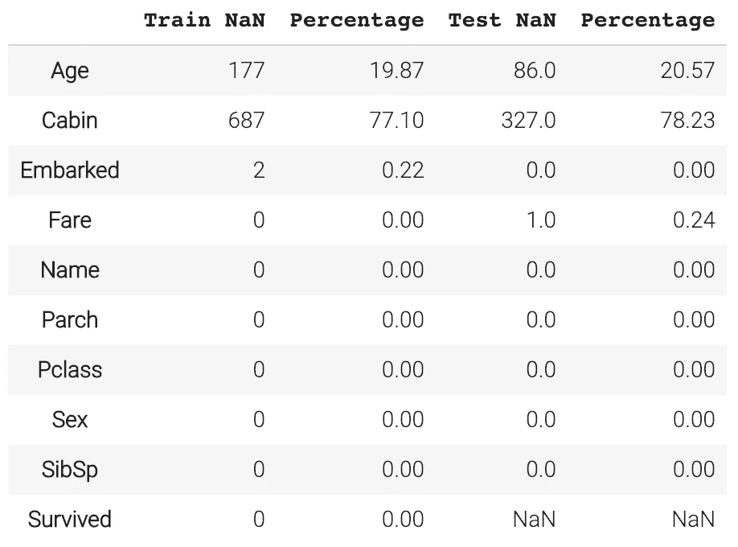
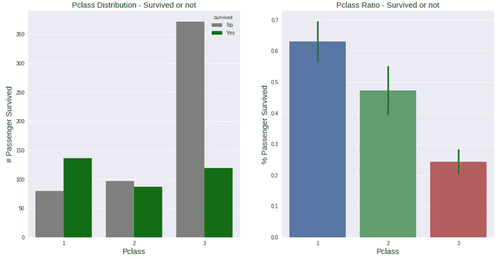
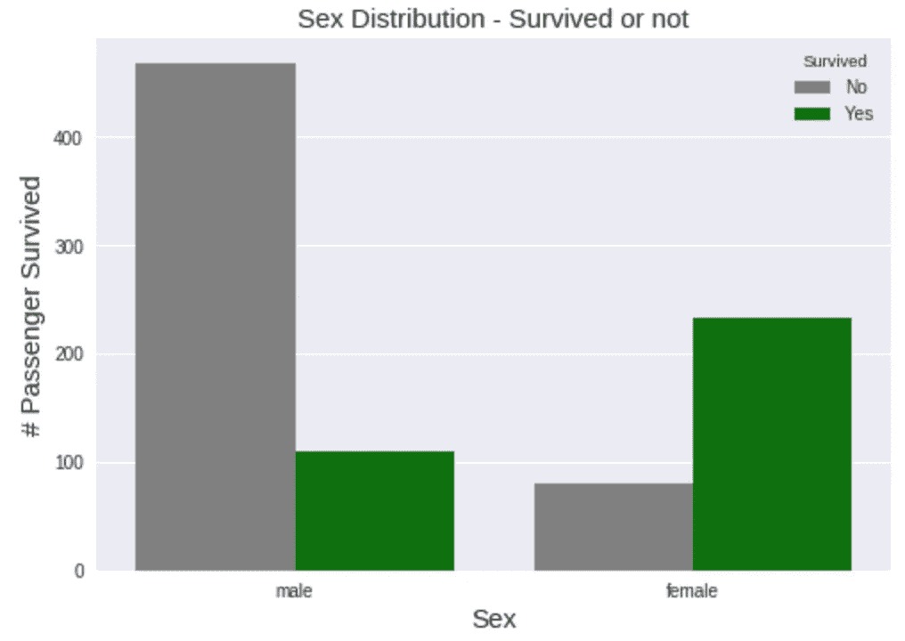
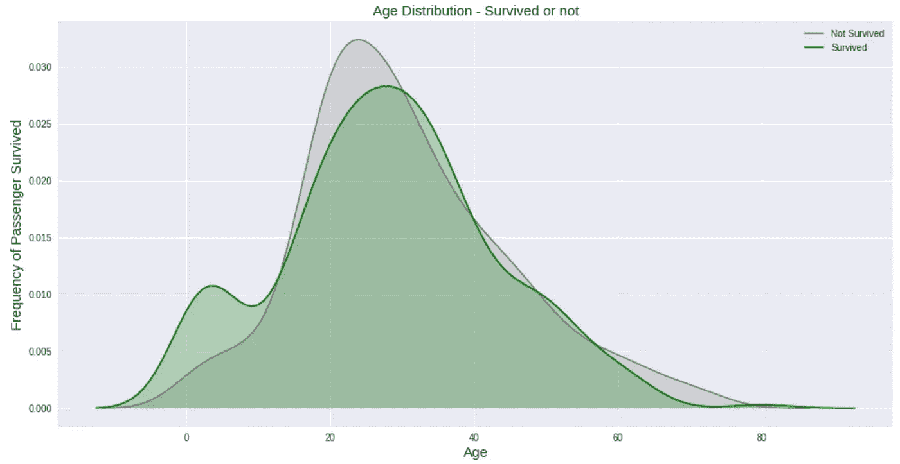
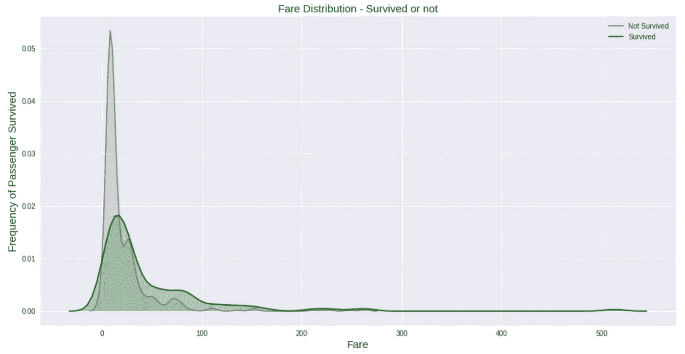
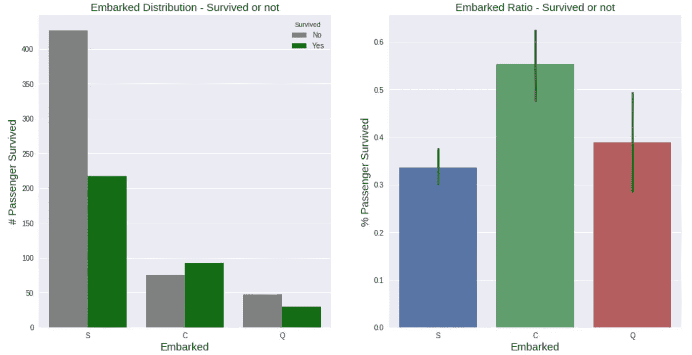
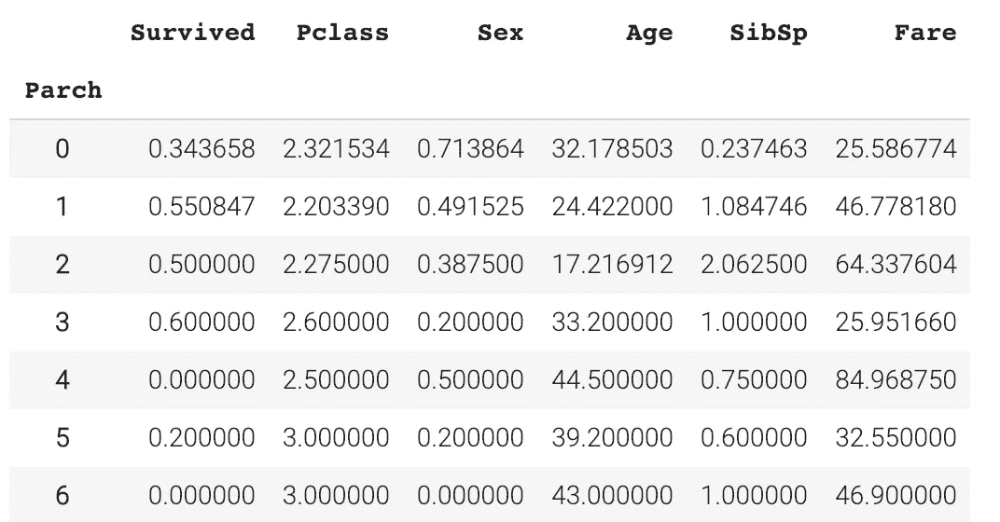
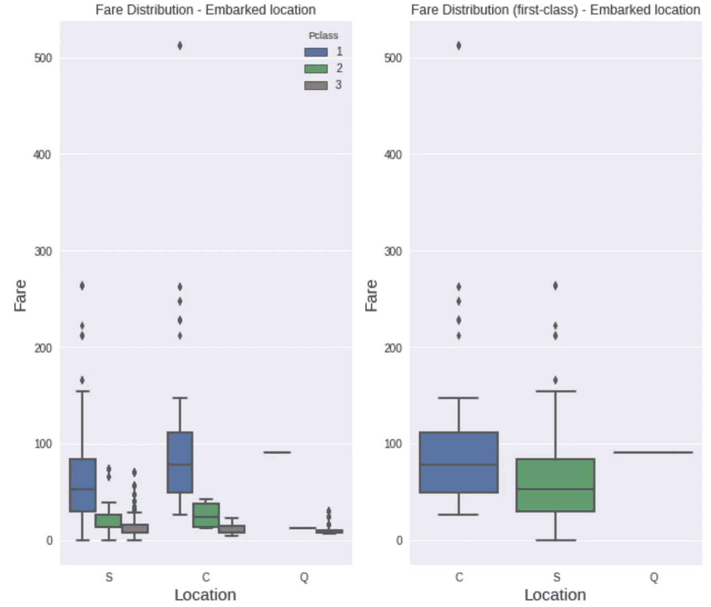
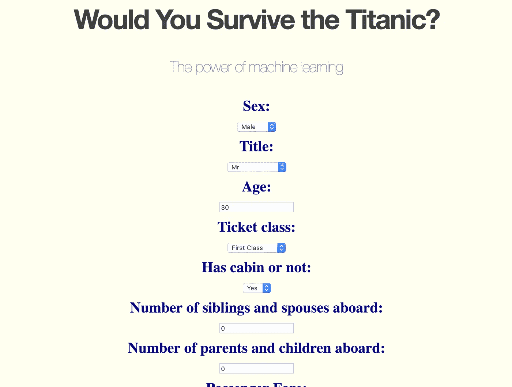

# 你会在泰坦尼克号上幸存吗？——对 Kaggle 的经典挑战

> 原文：<https://towardsdatascience.com/would-you-survive-the-titanic-a-classic-challenge-on-kaggle-3efaa22bfb5e?source=collection_archive---------34----------------------->

## 关于如何开始 Kaggle 之旅的 7 步指南


安东尼·梅特卡夫在 [Unsplash](https://unsplash.com?utm_source=medium&utm_medium=referral) 上的照片

## 卡格尔

Kaggle 是数据科学家共享数据、交流思想和**在预测分析问题上竞争的平台**。人们经常认为 Kaggle 不适合初学者，或者它有一个非常**陡峭的学习曲线**。

**他们没有错。但是它们确实给像你我一样刚刚起步的人带来了挑战。作为一名(初级)数据科学家，我无法抗拒搜索有趣的数据集来开始我的 Kaggle 之旅。 ***和我撞上了泰坦尼克号。*****

> Kaggle 是数据科学家的 Airbnb 这是他们度过夜晚和周末的地方。齐尚·哈桑·乌斯马尼

## 泰坦尼克号

该数据集包含泰坦尼克号上乘客的信息。

我使用了 *Python* 来可视化和理解更多关于数据集的内容。我训练了一个分类器的**集合，使用 *scikit-learn* 来预测一个人的**生存几率**。然后，我使用 *pickle* 保存这个模型，并使用 *Flask* 将它作为 **Web App** 部署在本地主机上。最后，我利用 AWS 来云托管它。**

该代码可在 [GitHub](https://github.com/edenau/Titanic) 上获得。

***坐稳了，我们走！***


[和 hika Soreng](https://unsplash.com/@dhika88?utm_source=medium&utm_medium=referral) 在 [Unsplash](https://unsplash.com?utm_source=medium&utm_medium=referral) 上的照片

# 1.数据检查

首先要做的事。我把数据导入到一个*熊猫* ***数据框*** 中。它包括乘客 ID、幸存者、机票等级、姓名、性别、年龄、船上兄弟姐妹和配偶的数量、船上父母和子女的数量、机票号、乘客票价、客舱号和出发港。



前 5 行数据

我立即想到的是:

*   `PassengerId`是每个条目唯一的**键**，
*   `Survived`是我们要用**推断**的目标，
*   `Name`可能没有帮助，但是他们的**头衔**可能有帮助，
*   `Ticket`是一团**乱**，而且
*   有**缺失数据**标注为`NaN`。

为了简单起见，我决定暂时去掉变量`Ticket`。它可能包含有用的信息，但提取这些信息需要大量的特征工程。我们应该从最容易的开始，并从那里着手。



缺失数据的比率

另一方面，让我们仔细看看缺失的数据。变量`Embarked`和`Fare`中有几项缺失。另一方面，大约 20%的乘客年龄没有被记录**。这可能会给我们带来一个问题，因为`Age`可能是数据集中的关键预测值之一。“妇女和儿童优先”在当时是一种行为准则，报告表明他们确实是首先被拯救的。`Cabin`中有 **> 77%的漏项**，不太可能有太大帮助，暂且不提。**

# **2.数据可视化**

****Pair plot** (下面未显示)通常是我在数据可视化任务开始时的首选，因为它通常很有帮助，并且它具有很高的信息与代码行数比率。一条单线`seaborn.pairplot()`给你 **n 个图**(技术上是 n(n+1)/2 个不同的图)，其中 n 代表变量的数量。它让你对每一对变量之间的关系，以及每个变量本身的分布有一个基本的了解。让我们深入研究不同的变量。**

****

**我们首先逐个检查目标变量`Survived`与每个预测值的关系。到了`seaborn.countplot()`，我们发现大多数人属于第三类，这并不奇怪；总的来说，他们存活的概率较低。即使有这个单一的预测因素， ***考虑到其他一切未知的*** ，我们可以推断一个**头等舱乘客**更有可能幸存，而这对于一个三等舱乘客来说不太可能。**

****

**同时，妇女和儿童更有可能幸存，这与前面提到的 ***【妇女和儿童优先】*** 理论相一致。如果我们只考察三个变量`Pclass`、`Sex`和`Age`，头等舱的年轻女性乘客现在将是最有可能生还的人。**

****

**然而，解释**乘客票价**的**密度图**可能会更难。对于“幸存”和“未幸存”两类，它们的跨度很大，其中“未幸存”类的均值和方差较小。请注意，在“幸存”等级的分布中有一个**有趣的尾巴**，它对应于三个人每人获得 512 美元的头等舱机票。他们都是在瑟堡港上船的，所有人都活了下来。**

****

**另一方面,**出发港**似乎也在决定谁将幸存的问题上扮演了一个角色。大多数人在南安普顿港上船——旅程的第一站，他们的存活率最低。也许他们被分配到离出口更远的船舱，或者在游轮上花更多的时间会让人放松或疲惫。或者，这可能只是由第三个变量间接导致的——比如说，在第一个港口上船的妇女/儿童/头等舱乘客可能更少。需要进一步调查。**

****

**如果你喜欢**表格**而不是图表，我们也可以通过`pandas.DataFrame.groupby()`将数据可视化，并取每一类的平均值。但是，我觉得下面的`Parch`的表格中并没有一个清晰的模式显示出来。**

********

****由`seaborn.heatmap()`生成的相关矩阵**说明了任意两个变量之间的相关强度。如您所见，`Sex`与`Survived`的相关性最高，而`Fare`与`Pclass`的相关性最高。`SibSp`和`Parch`似乎在预测一个人的生存机会方面没有太大作用，尽管我们的本能表明情况并非如此。**

# **3.缺失数据插补**

**我们之前在*数据检查*中发现有很多**缺失数据条目**。例如，我们似乎不知道一位 60 岁的托马斯·斯托里买票花了多少钱。直觉告诉我们，机票价格在很大程度上取决于机票等级和出发港口，我们可以用上面的相关矩阵进行交叉检查。因此，我们将只取南安普敦三等舱票价的平均值。这只是一个有根据的猜测，可能是错误的，但已经足够好了。请记住，不可能有无噪声的数据，机器学习模型应该对噪声具有鲁棒性。**

****

**还有两个女人，我们不知道她们是从哪里上船的。这应该与机票等级和票价密切相关。因为他们都花了 80 美元买了一张头等舱的票，所以我把我的钱押在瑟堡(图中的 C)。**

**如果某个特定变量中只有几个缺失条目，我们可以使用上面的技巧，通过基本上采用 ***最大似然*** 值来进行有根据的猜测。尽管如此，如果我们有更多丢失的数据，做同样的事情真的很危险，就像在`Age`中，大约有 20%的数据丢失。**

**我们再也不能通过观察做出有根据的猜测了。因为我们丢弃了变量`Cabin`，并且所有其他缺失的条目都被填充，所以我们可以利用所有其他变量通过随机森林回归来推断缺失的`Age`。有 80%的‘训练’数据来推断剩下的 20%。**

# **4.特征工程**

**虽然大多数人都有“先生”、“夫人”和“小姐”的头衔，但也有不少不太常见的头衔——“博士”、“牧师”、“上校”等。有些只出现一次，如“Lady”、“DOA”、“Captain”等..他们罕见的出现对模特训练没什么帮助。为了用数据科学找到**模式**，你需要数据。一个基准点没有任何模式。让我们把所有那些相对罕见的标题归类为“罕见”。**

**分类数据在模型训练之前需要格外小心。分类器无法处理字符串输入，如“Mr”、“Southampton”等..虽然我们可以把它们映射成整数，比如说('先生'，'小姐'，'夫人'，'稀有')→ (1，2，3，4)，但是头衔之间不应该有排序的概念。 ***成为博士并不能让你高人一等*** 。为了不误导机器，不小心构建了一个性别歧视的人工智能，我们应该**对它们进行一次性编码**。它们变成了:**

**( (1, 0, 0, 0), (0, 1, 0, 0), (0, 0, 1, 0), (0, 0, 0, 1) )**

**另一方面，我决定再添加两个变量— `FamilySize`和`IsAlone`。加上`FamilySize = SibSp + Parch + 1`更有意义，因为全家人会一起待在游轮上。你不想和你的伴侣在一起，但却抛弃你的父母，是吗？此外，独处可能是关键因素之一。你可能更容易做出鲁莽的决定，或者你可能更灵活，不需要照顾家庭。通过一次添加一个变量，我发现它们在模型中的出现提高了整体的可预测性。**

****

**Alex Siale 在 [Unsplash](https://unsplash.com?utm_source=medium&utm_medium=referral) 上拍摄的照片**

# **5.模型评估**

**我尝试了我所知道的最流行的分类器——随机森林、SVM、KNN、AdaBoost 等等。XGBoost 最终以 87%的测试准确率脱颖而出。为了增加我们的分类器的鲁棒性，训练具有不同性质的分类器的集成，并且通过**多数投票**获得最终结果。**

**最后，我提交给 Kaggle，并取得了 **80%** 的准确率。还不错。总有改进的余地。**

**例如，在`Cabin`和`Ticket`中肯定有一些有用的信息**隐藏在**中，但是为了简单起见，我们省略了它们。我们还可以创建更多的特征，例如一个二进制类`Underage`，如果`Age < 18`为 1，否则为 0。**

**但是我现在要继续前进了。**

# **6.作为 Web 应用程序部署**

***Flask* 是 Python 中一个易于使用的 web 框架。**

```
from flask import Flask
app = Flask(__name__)[@app](http://twitter.com/app).route("/")
def hello():
    return "<h1>Write something here.</h1>"app.run(host='0.0.0.0', port=60000)
```

**瞧！您可以在本地主机中浏览它。**

****

**安德鲁·弗尔兰在 [Unsplash](https://unsplash.com?utm_source=medium&utm_medium=referral) 上拍摄的照片**

**我们还需要什么？我们希望人们填写表格来收集所需的数据，并将其传递给机器学习模型。该模型将有一个输出，我们将用户重定向到该页面。**

**我们将使用 *WTForms* 在 Python 中构建一个表单，单个表单由一个类定义，如下图所示:**

```
from wtforms import Form, TextField, validators, SubmitField,  DecimalField, IntegerField, SelectFieldclass ReusableForm(Form):sex = SelectField('Sex:',choices=[('1', 'Male'), ('0', 'Female') ],
                   validators=[validators.InputRequired()])fare = DecimalField('Passenger Fare:',default=33,places=1,
                     validators=[validators.InputRequired(),
                                 validators.NumberRange(min=0,
                                                        max=512,

                         message='Fare must be between 0 and 512')])submit = SubmitField('Predict')
```

**我从 Will Koehrsen 那里找到了一个 HTML 模板，并在它的基础上构建。**

> **你看看那些在你之前的人，那些以前处理过这个问题的人，那些建立了意大利面条代码的人，你非常感谢他们使它开源，**你给他们荣誉**，你把他们做的东西放进你的程序里，你永远不会再看它。—汤姆·斯科特**

# **7.云托管**

**现在可以通过我的本地主机查看网页了，一切正常。最后一步是把它放在网上。现在有 3 个主要的云托管服务——AWS、GCP 和 Azure。AWS 是目前最受欢迎的，所以我选择了它的 12 个月免费版。**

**我用我的私钥连接到 Linux 服务器实例，将我的存储库迁移到服务器，运行我的脚本，它工作了！**

****

**嗯…那对我来说不太好…**

****

## **相关文章**

**感谢您的阅读。你可以[注册我的时事通讯](http://edenau.mailchimpsites.com/)来接收我的新文章的更新。如果您对数据科学感兴趣，以下文章可能会有用:**

**[](/5-python-features-i-wish-i-had-known-earlier-bc16e4a13bf4) [## 我希望我能早点知道的 5 个 Python 特性

### 超越 lambda、map 和 filter 的 Python 技巧

towardsdatascience.com](/5-python-features-i-wish-i-had-known-earlier-bc16e4a13bf4) [](/6-new-features-in-python-3-8-for-python-newbies-dc2e7b804acc) [## Python 3.8 中针对 Python 新手的 6 项新特性

### 请做好准备，因为 Python 2 不再受支持

towardsdatascience.com](/6-new-features-in-python-3-8-for-python-newbies-dc2e7b804acc) [](/4-common-mistakes-python-beginners-should-avoid-89bcebd2c628) [## Python 初学者应该避免的 4 个常见错误

### 我很艰难地学会了，但你不需要

towardsdatascience.com](/4-common-mistakes-python-beginners-should-avoid-89bcebd2c628) 

*最初发布于*[*edenau . github . io*](https://edenau.github.io)*。***