# 把你的头缠在梯度下降上(有漫画！)

> 原文：<https://towardsdatascience.com/wrapping-your-head-around-gradient-descent-with-pictures-3fbd810235f5?source=collection_archive---------20----------------------->

## 为什么我们需要另一篇关于梯度下降的文章？

因为数学很难，我们中的一些人需要更慢、更直观的方法。

*TL；dr —没有 TL；博士我们在预测未来。描述细节而不使你愤怒退出需要几句话。*

理解这篇文章的唯一前提是知道什么是线性函数。我们看到线性函数有许多不同的表述方式，但今天我将坚持使用“*y = MX+b”*，因为它可能是应用最广泛的。

如果我问“*函数 y = mx + b 的变量是什么？*”，你可能会说“ *x* ”。

通常，你是对的，但是梯度下降的第一个“问题”是它是反向的。

不是“*给定这个线性函数，找到这些数据点*”，而是说“*给定这些数据点，找到线性函数*”

让它深入人心，因为它超级怪异。

把 *x* 和 *y* 更像是一堆常数。我们需要找到符合这些点的“ *m* ”和“ *b* ”的值。然后，我们可以用这条线来预测新的点。

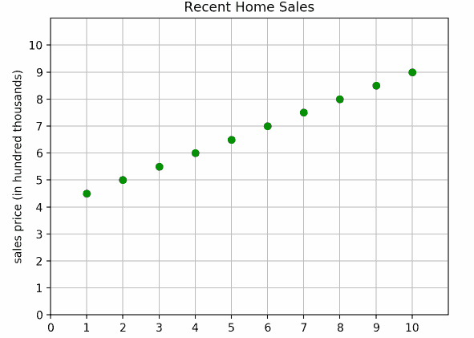

如果看手相的人教会了我们什么的话，预测未来并不是一门精确的科学。一般来说，没有一条线能完美地穿过这些点，所以我们想找出哪条线最接近到达这些点。

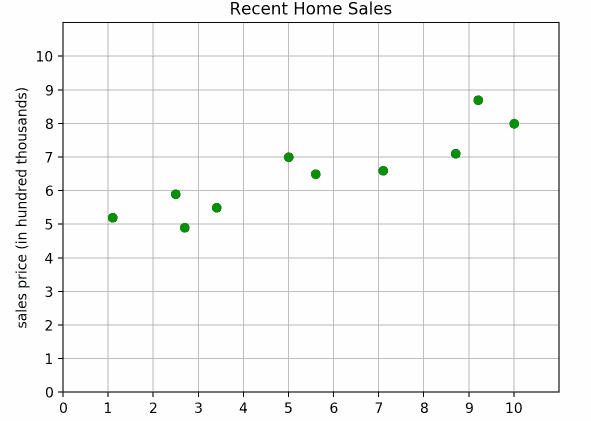

# 什么是“紧密”配合？

这似乎是一个愚蠢的问题。看起来你应该能够测量每个点离直线有多远，然后除以点的数量来计算出直线离每个点有多近。

然而，考虑下面两行，问问自己哪一行更好地代表了这两个数据点:

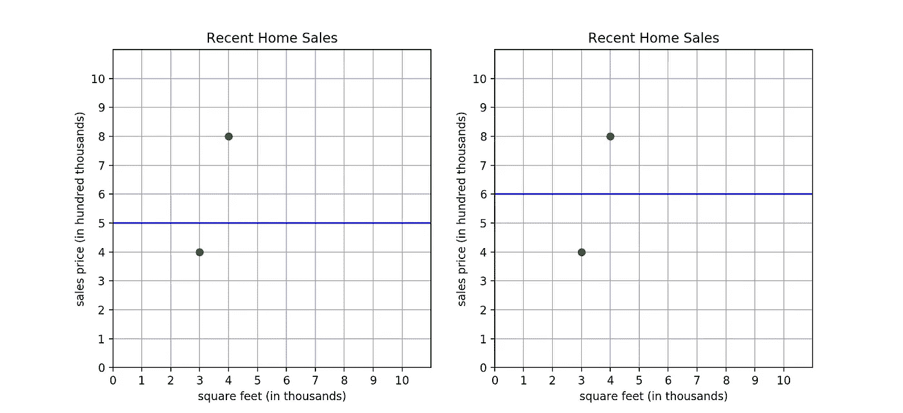

第一条线向底部倾斜。第二条线直接在数据点之间分开。第二行感觉更准确地表示了数据，但平均误差是一样的:

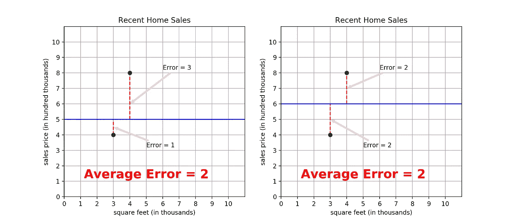

由于这个原因和其他原因，我们通常用距离直线的平方来衡量一个数据点的“接近度”。这也确保了只有一个“最佳”位置。

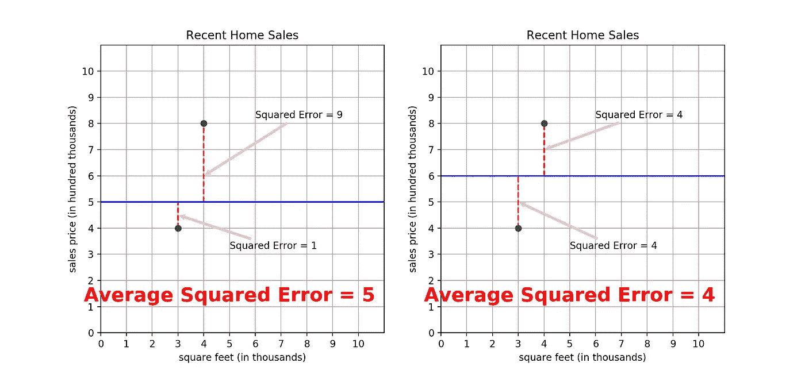

通过使用平均平方误差，我们可以看到，将线放在中间比放在顶部更好。

# 太好了，我怎么找到平均平方误差最小的地方？

这有几种方法。最简单的方法叫做[普通最小二乘法](/understanding-the-ols-method-for-simple-linear-regression-e0a4e8f692cc)，但是在复杂问题上表现不佳。为了解决复杂的问题，我们经常使用一种叫做“梯度下降”的方法。很多机器学习都建立在这个概念上。

首先，让我们假设等式中没有" *mx* "，而*只是*试图为" *b* "找到好的值。这更简单，因为你只有一个变量需要求解。

*y = b*

这听起来可能很荒谬。这意味着“ *m* ”锁定在零(一条水平线)。不管你得到什么输入，你总是要猜测同样的输出。

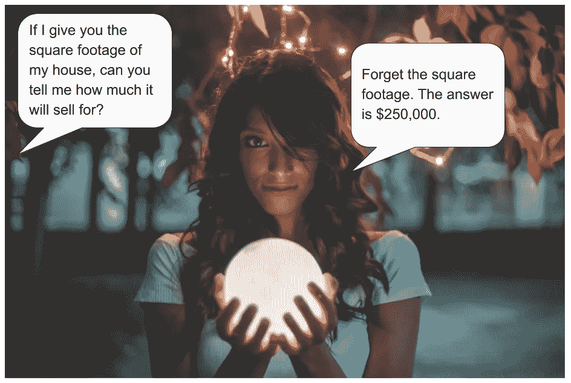

照片来自 [Oleg Magni](https://pxhere.com/en/photographer/616233) 在 [pxhere](https://pxhere.com/en/photo/1554717) 上

稍等一下。很快就会变得疯狂。

为简单起见，假设我们只有两个数据点。这些数据点代表了最近的房屋销售。我们知道每栋房子的面积和售价。

我准备把这些数据点称为“东方先生的房子”和“西方先生的房子”(因为一个更靠近图形的东侧，另一个更靠近西侧)。

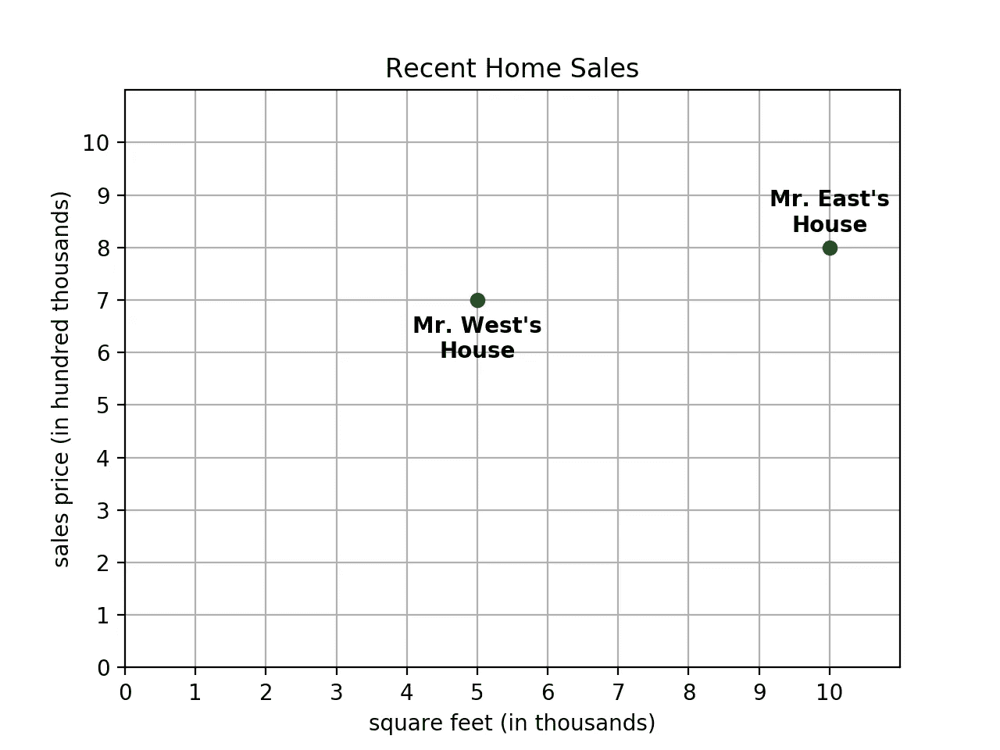

我们试图找到一条线 *y = b* ，使 East 先生的房子和 West 先生的房子的平均平方误差最小。

我知道你在想什么。“哦……就拿平均销售价”。

*b = 7.5*

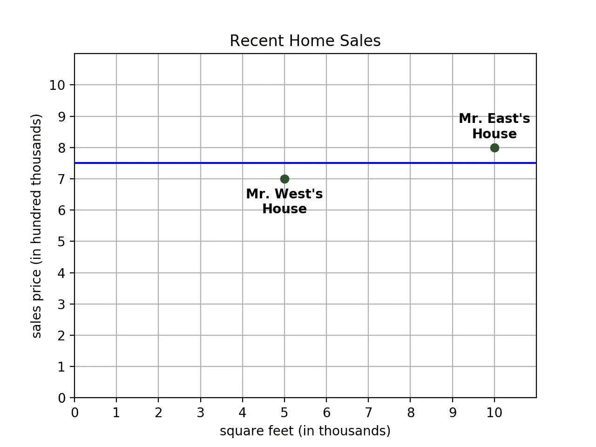

你说得对。这种方法是可行的，它可以最小化平方误差。然而，这不是梯度下降。这个可爱的“平均”小技巧不适用于更复杂的问题，所以让我们用梯度下降法来求这个值。

在梯度下降中，我们首先将线放在一个随机的点上。我要把它放在这里:

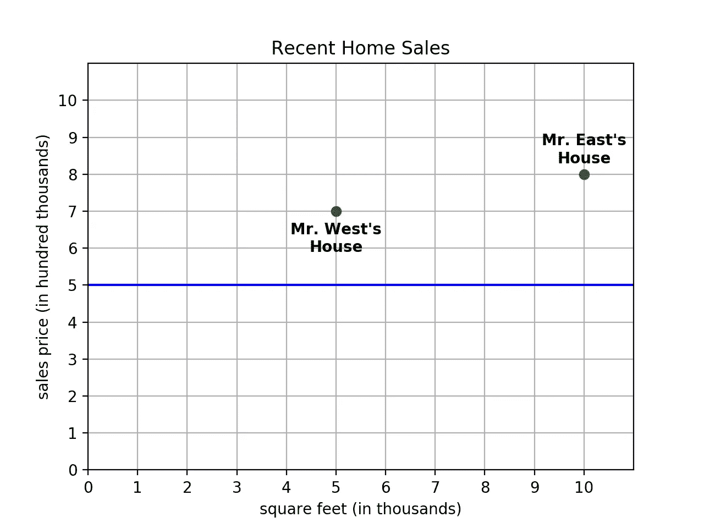

我们希望这条线尽可能靠近所有的房子。所以我们对附近进行了调查。我们敲开每一扇门，并问“*我们应该把线移到哪个方向？*”。我将称之为**移动调查**:

# 移动调查#1

**叩叩叩**

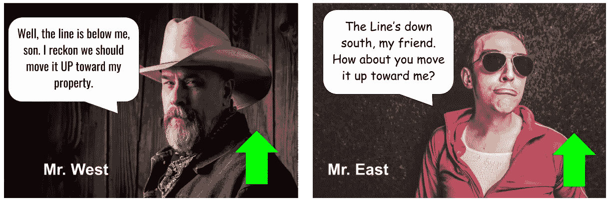

左图由 [Brett Sayles](https://www.pexels.com/@brett-sayles) 在 [pexels](https://www.pexels.com/photo/man-wearing-cowboy-hat-2250519/) 上拍摄。右图来自 [pixnio](https://pixnio.com/people/male-men/portrait-photo-model-fashion-sunglasses-person-man-handsome)

移动调查后，投票是一致的，所以我们把线向上移动。假设我们将其移动到 7.1

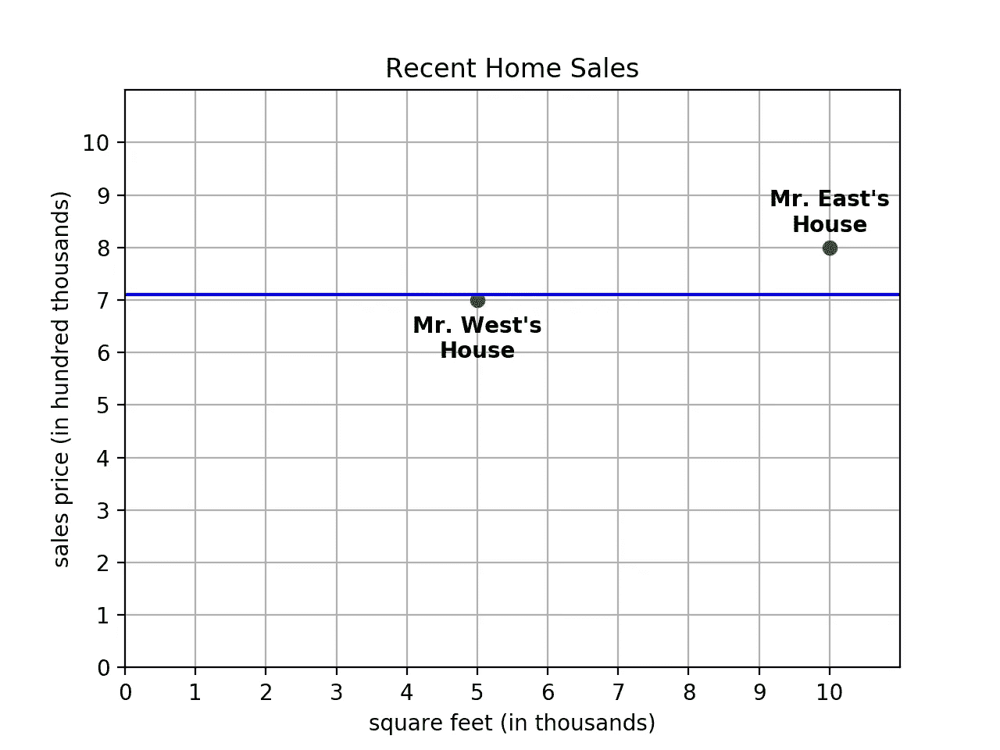

现在我们进行另一项运动调查:

# 移动调查#2

**叩叩叩**

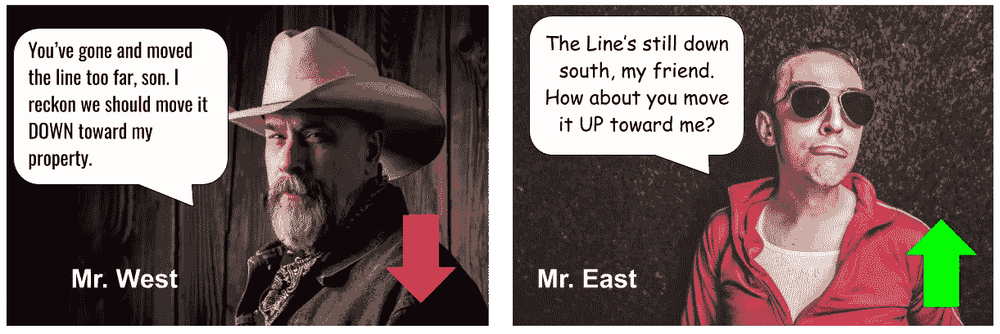

现在越来越有趣了。韦斯特先生想把线下移，而伊斯特先生想把线上移。想象一下这些邻居在拔河(每个人都希望线离他们的财产更近)。

照片来自 [pxhere](https://pxhere.com/en/photo/498377)

那么我们如何决定把线移到哪里呢？

站在房主的角度想想这个问题:

*   如果你的属性正好在线上，你就没有平方误差。
*   现在，如果我们把线从你的财产上拉开 1 格，你的平方误差是 1 (1)。
*   如果我们将线*拉离你的财产另一个*空间，你的平方误差是 4 (2)。
*   如果我们把线*拉离你的财产另一个*空间，你的平方误差是 9 (3)。

如此处所示，每次搬家都比上一次更贵。

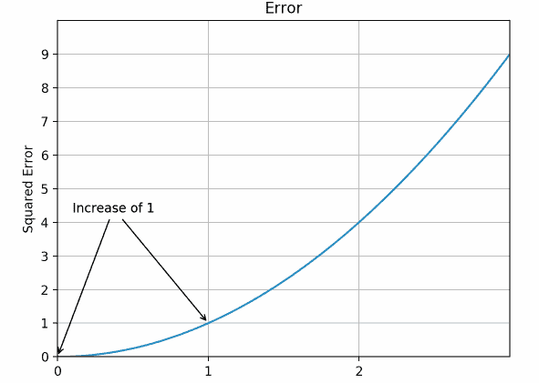

错误在近距离非常便宜，在远距离就变得非常昂贵。

看着这两栋房子:

*   韦斯特先生接近错误是廉价的那条线。
*   伊斯特先生远离错误代价高昂的前线。

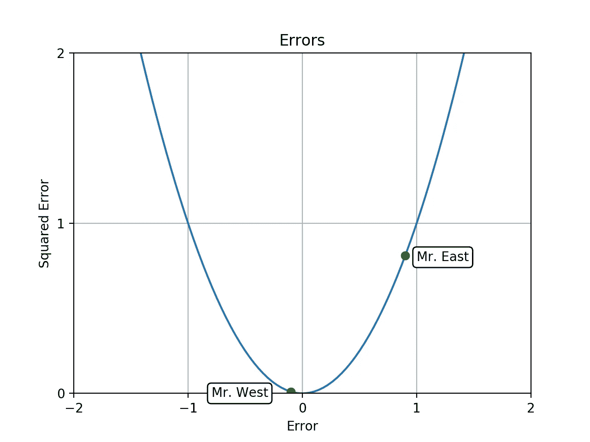

当你考虑权衡的时候，给 West 先生加上一些便宜的误差是值得的，这样我们就可以从 East 先生身上减去昂贵的误差。

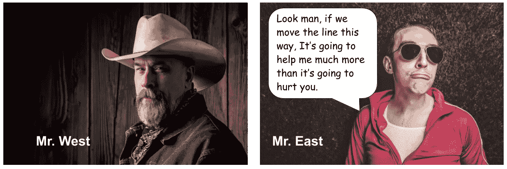

东方先生对变化非常敏感。我的意思是，把线从 East 先生那里移开会让我们花费很多，而把线移到离 East 先生更近的地方会让我们节省很多。

相比之下，韦斯特先生对变化不敏感。将战线移向韦斯特先生，我们并没有得到多少好处。将生产线从韦斯特先生那里移开也花费较少。

我们的调查没有考虑“敏感性”。我们应该修改调查。我们需要问的不仅仅是"*我们应该把线往什么方向移动？*“但是”*你对线条运动有多敏感？*

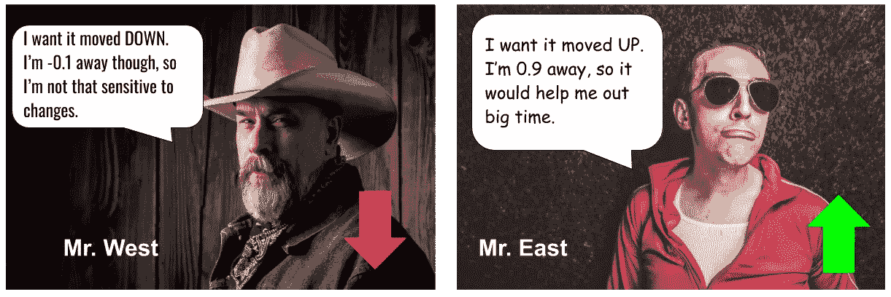

我们将结果写在我们的移动调查中:

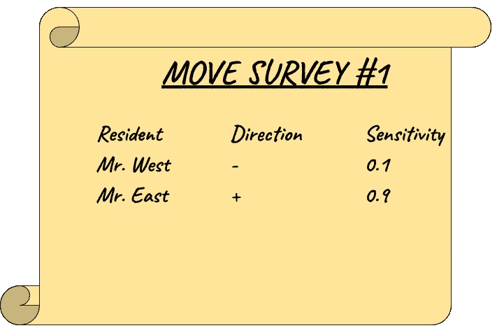

一旦我们调查了所有居民，我们将总敏感度除以居民人数，得出“平均敏感度”:

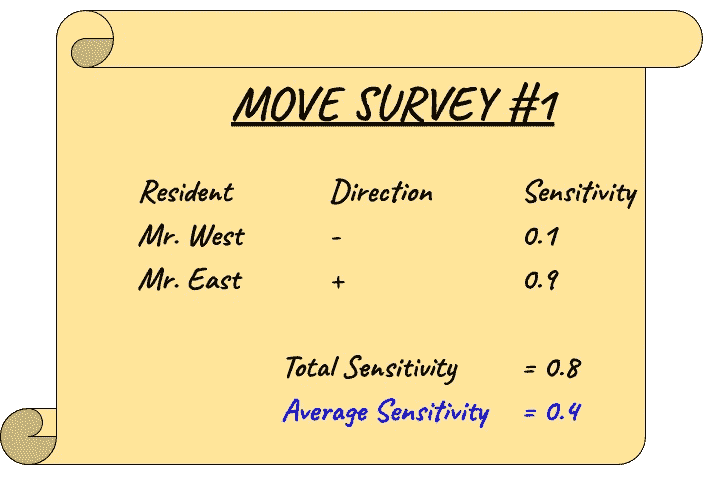

这里的正平均敏感度意味着，如果我们把线上移，利大于弊。平均灵敏度(0.4)告诉我们上下权衡的强度。

我们从这个数字中抽取一小部分(比如说 25%)。我们把这个百分比叫做“学习率”。

*0.4 *.25 = 0.1*

然后我们把线移动那么多。

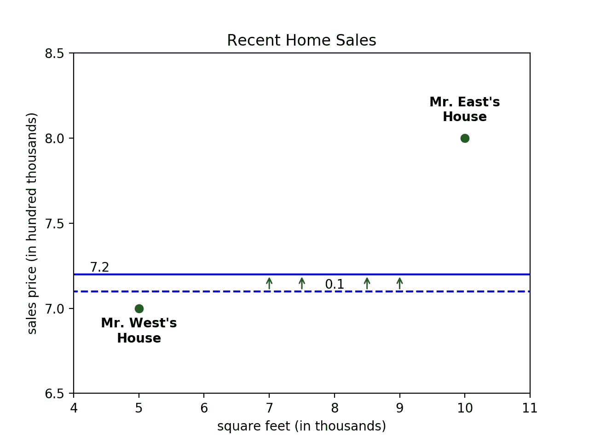

回到拔河的类比，你可以想象东方先生和西方先生在往相反的方向拉，但是东方先生远比西方先生强(因为他更敏感)。

来自用户 [falco](https://pixabay.com/users/falco-81448/) 在 [pixabay](https://pixabay.com/photos/tug-of-war-monument-wismar-515183/) 上的照片

线现在是 7.2，我们做另一个调查，再次问:

*   ”*我们应该向什么方向移动这条线？*
*   "*你对线条运动有多敏感？*”

我们可以看到，西先生比以前敏感了，东先生比以前不敏感了。

伊斯特先生的敏感性仍然超过韦斯特先生，但没有以前那么多了。

让我们用这个数字的 25%来更新这一行:

*.3 * .25 = .075*

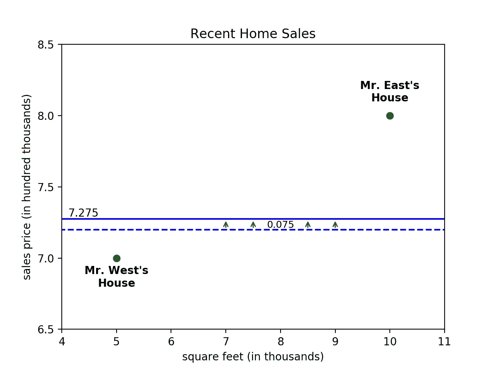

该线现在位于 7.275。移动的幅度比以前更小了。

如果我们继续进行多轮调查，你会发现韦斯特先生越来越敏感，而伊斯特先生越来越不敏感。动作也越来越小。

随着更多回合的到来，拉锯战变得更加势均力敌。伊斯特先生希望这条线向上延伸，就像韦斯特先生希望这条线向下延伸一样。此时，“平均灵敏度”非常小(两个灵敏度实际上相互抵消)。

随着平均灵敏度接近零(平衡)，线停止移动，因为线更新是基于平均灵敏度的。

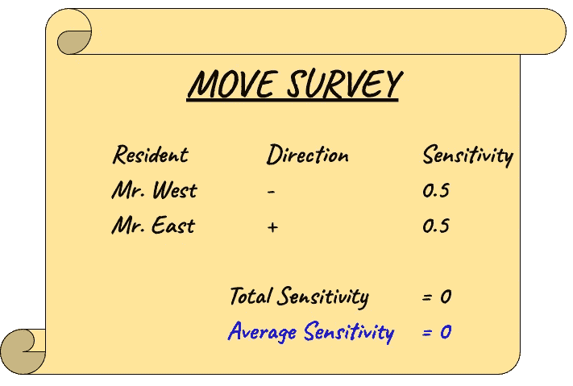

我将向您展示 3 个不同的动画，它们都显示了直线从第一次测量(7.1)移动到平衡(7.5)时的梯度下降。这三个视图应该可以帮助你理解这个过程。

# 视图#1:生产线移动视图

以下动画展示了每次测量后的直线移动。当线接近 7.5(最小误差点)时，你可以看到波动越来越小。

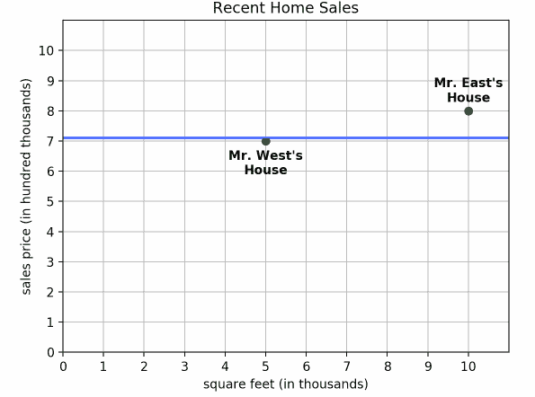

# 视图#2:单个错误视图

这个动画展示了东方先生和西方先生的错误。你可以看到，我们继续用昂贵的错误换取便宜的错误，直到双方都不便宜。

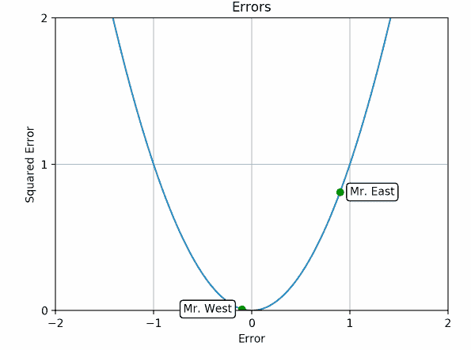

仔细想想，这是有道理的。只有当你得到的比放弃的多的时候，你才想要移动这条线。当平均灵敏度为零时，向任一方向移动直线都没有好处(因为两边的灵敏度相同)。

# 视图#3:梯度下降视图

当谈到梯度下降时，你会看到最后一种类型的图表被多次引用。这一点可能很难理解。

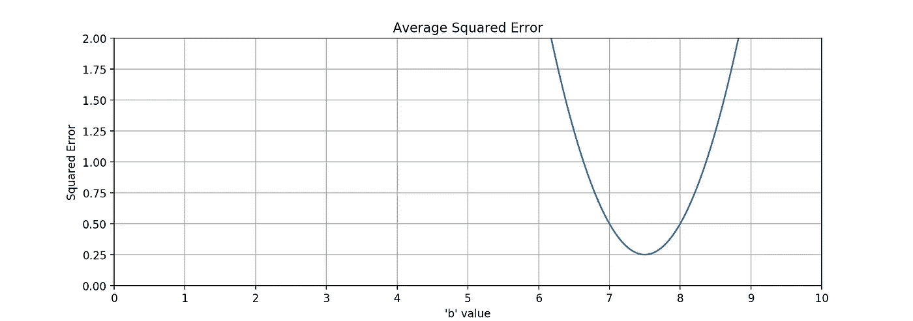

该图与前面的图具有相同的形状，但不要被欺骗，它是**非常**不同的。在上图中，X 轴是误差(每个误差是一个单独的点)，Y 轴是误差的平方。

在这张新图表中:

*   X 轴显示了' *b* 的不同值。
*   当' *b* '设置为该值时，Y 轴是**平均平方误差**。

我们可以看到，理想的' *b* '值为 7.5，产生 0.25 的平均平方误差。

我们在梯度下降中的任务是找到这条曲线底部的点(最小平方误差)。

当我们开始(在 7.1)，并继续做移动调查，我们在几轮后接近底部。点击此处观看动画:

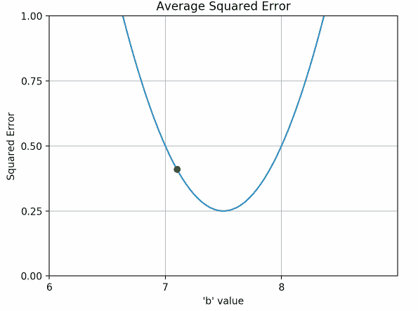

在我们开始梯度下降之前，我们知道曲线会这样形成(它总是这样)，但是我们不知道最小值在哪里。

在第一次移动调查后，我们发现猜测值为 7.1 会导致平均平方误差为 0.41。起初，这似乎是我们所知道的全部:

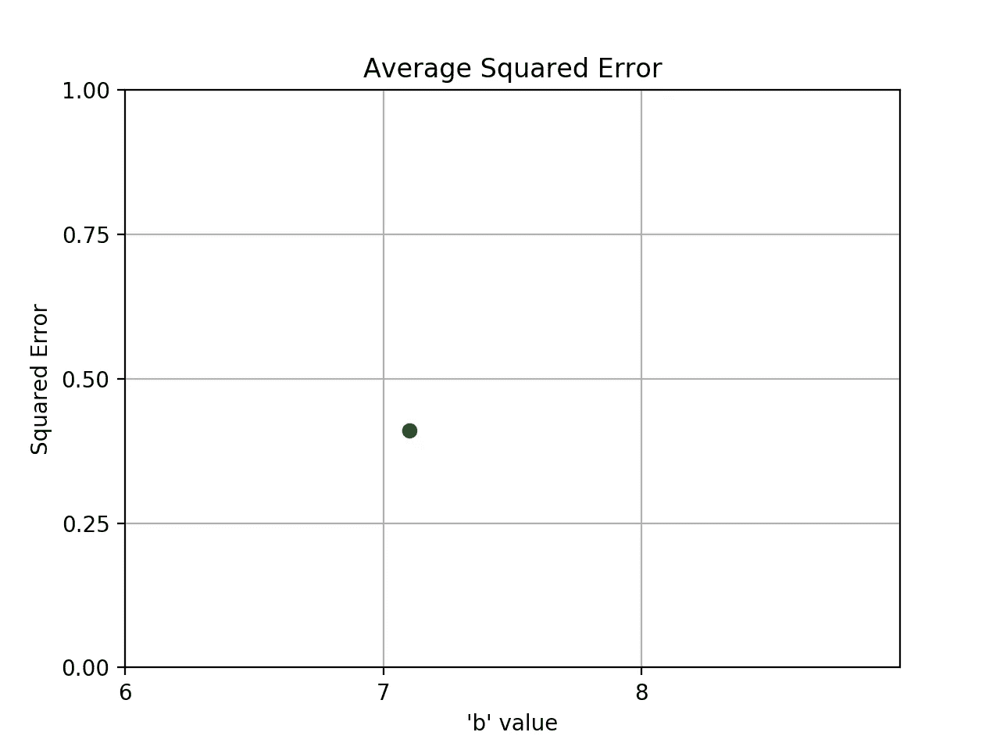

然而，我们实际上知道的更多。我们知道平均灵敏度是 0.4，这告诉我们两件事:

1.  居民希望这条线上移(这样我们就知道我们在曲线的左侧)。
2.  平均灵敏度很高，所以我们离中心很远。

我将标记一条蓝线，显示我们对自己所处位置的了解。

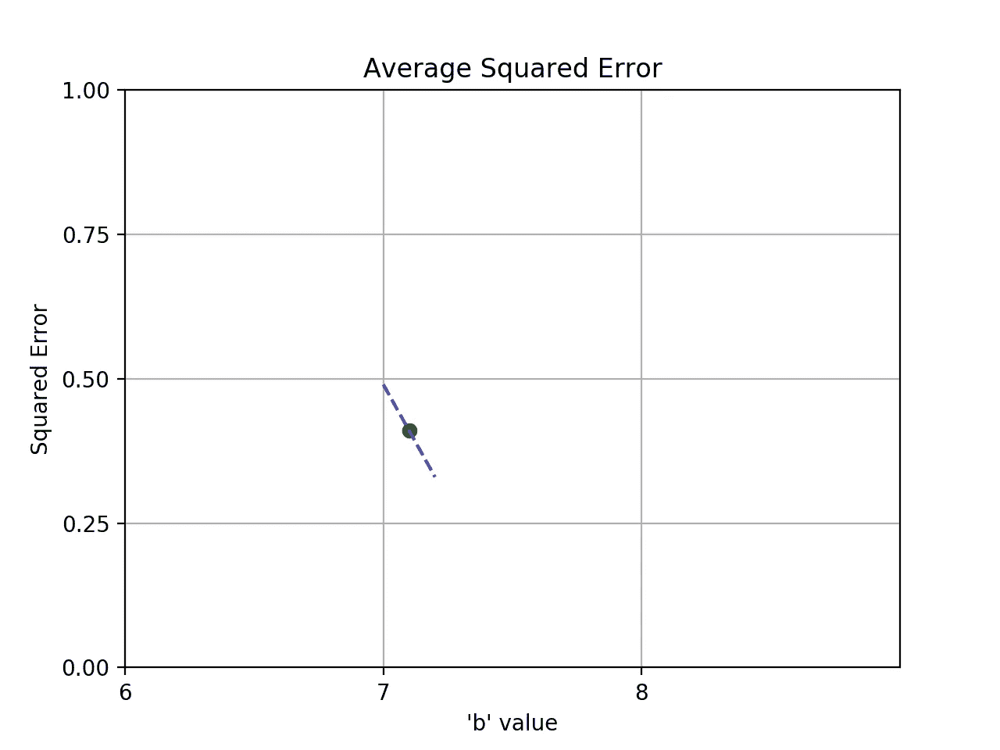

然后，我们做一个*秒*移动调查，我们发现 7.2 的猜测导致 0.34 的平均平方误差。

由于平均敏感度(. 3)，我们知道我们仍然在图表的左侧，但我们越来越接近中心。我将画另一条线来表示这一点，但这条线不会太陡，因为我们更接近底部。

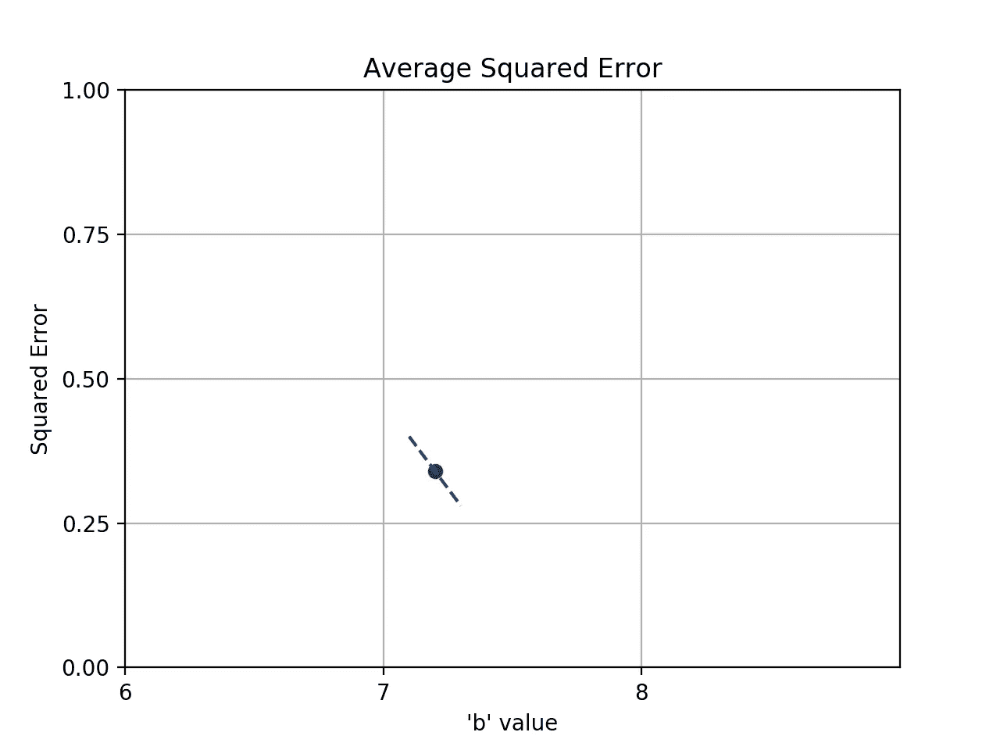

随着我们继续做移动调查，我们的步伐越来越小，越来越接近曲线的底部。

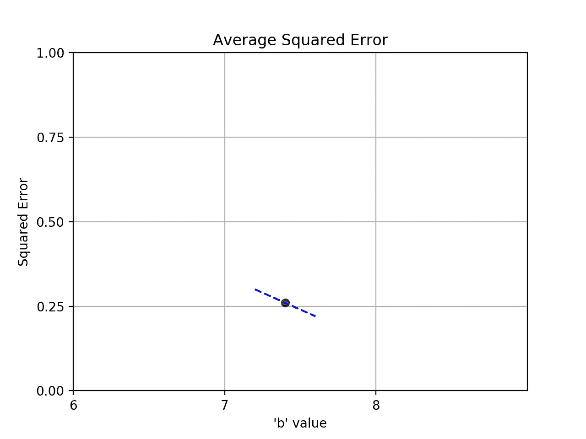

蓝线的“陡度”代表平均灵敏度。当' *b* 值远离最小值时，斜率很陡。

随着' *b* '值接近最小值，平均灵敏度(也称为斜率)接近零。

> “G *radient* ”只是“*斜率*”的另一种说法。随着我们向图表的底部移动，梯度变得越来越小。这就是为什么我们称这种方法为“梯度下降”。

无论你有两个数据点(如此处所示)，还是 1000 个数据点。梯度下降的逻辑是相同的:

*   调查每个点，询问“*您希望我向哪个方向移动？”*和“*你有多敏感？*
*   取所有灵敏度(梯度)的平均值。
*   乘以“学习率”
*   更新该行。
*   重复直到我们找到平衡。

*实际上，你永远不会完全达到平衡，因为当它接近底部时，更新变得越来越小，但是在足够多的回合之后，差异将变得微不足道。*

# 好的，我们可以解出 b。“m”呢？

现在我们已经发现了如何找到最小的“b”值，让我们暂时忽略“b ”,想想如何找到最小的“m”值。

*y = mx*

这意味着“ *b* ”实际上被固定在常数 0。我们可以使用“ *m* ”值来改变函数的斜率，但是直线将总是通过(0，0)

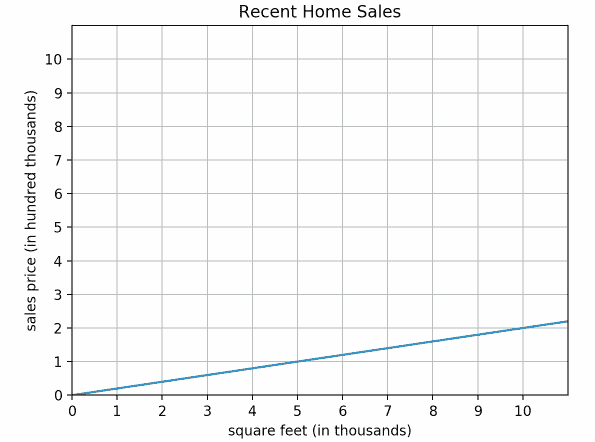

让我们再来看看 East 先生和 West 先生，猜一猜这条线可能在哪里:

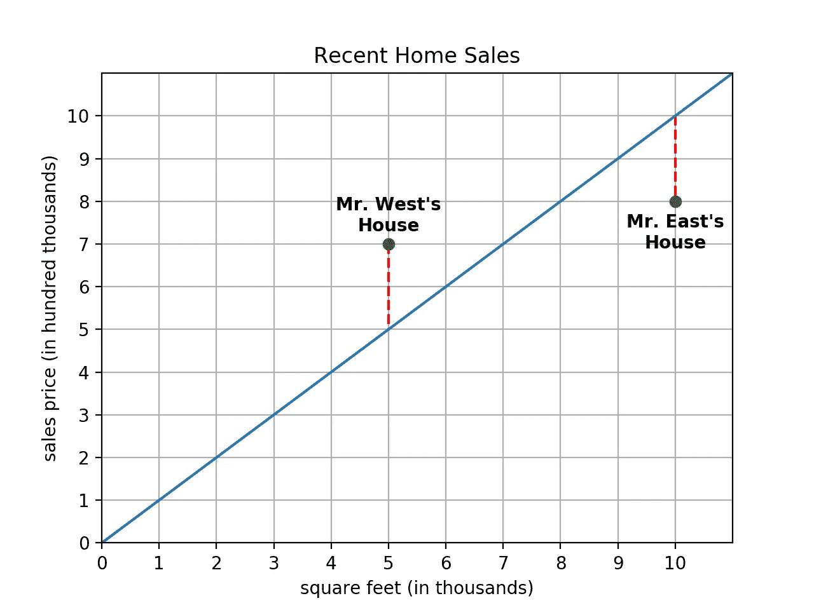

在 *m=1* 处，我们看到 West 先生在线上 2 个单位*，East 先生在线下*2 个单位*。平均平方误差为 4。*

直觉上，我们似乎处于平衡状态，无法在此基础上有所提高。然而，事实并非如此。

下面的动画显示了如果我们将“ *m* ”值从 1 更改为 0.9 会发生什么

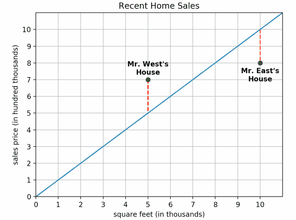

请注意，我们是如何在离 East 先生更近的地方得到 1 个完整的空间，而在离 West 先生更远的地方只得到 1/2 的空间。总平方误差减少到 3.625

当你认为等式 *y = mx* 是有意义的

将“*m”*值乘以“ *x* ”。因为东先生( *x=10* )的距离是西先生( *x=5* )的两倍，所以东先生受“ *m* 变化的影响也是西先生的两倍。

一般来说，越往东，对坡度变化越敏感。

既然我们向 East 先生移动可以得到两倍的收益，为什么不把线一直移动到 East 先生呢？我们可以向东方先生移动整整 2 个单位，而向西方先生只移动 1 个单位。

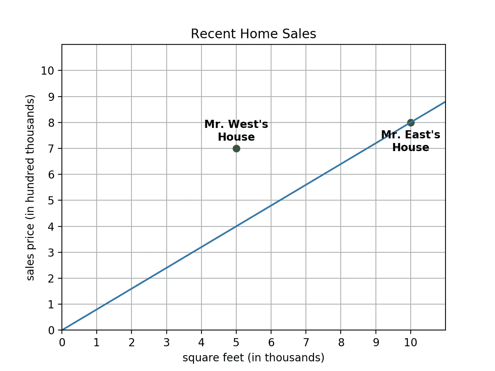

因为我们离韦斯特先生有 3 个空间，新的平均平方误差是(4.5)。这比我们开始的时候更糟…怎么回事？

记住:当我们把线从 West 先生移开时，每个误差都比上一个更昂贵(由于平方误差)。在某些时候，韦斯特先生对运动非常敏感，以至于不值得做出权衡，尽管你可以通过移动线来获得两倍于伊斯特先生的距离。

> 虽然上面的线有最小的原始误差，但它没有最小的平方误差。

因此，东先生和西先生都很敏感，但原因不同。事实证明，点对斜率变化的敏感度由两个因素决定:

*   点离线有多远？
*   这个点向东有多远？

当我们计算灵敏度时，我们需要考虑这两个因素。

*灵敏度= {与直线的距离} * {x 值}*

让我们把这条线放回( *m = 0.9)*

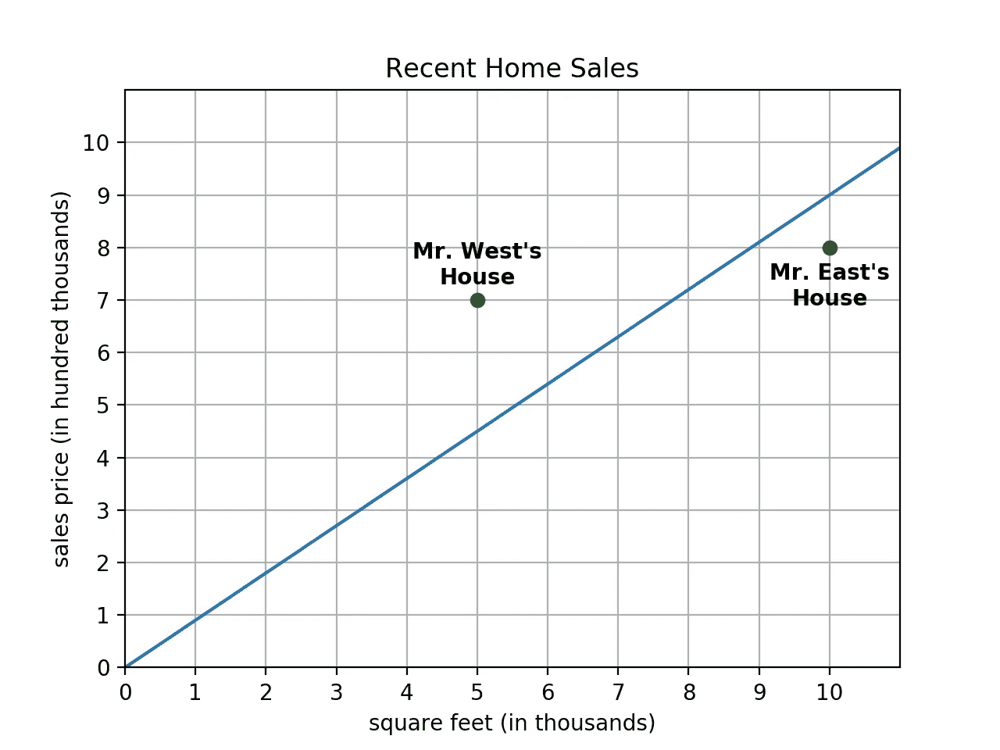

本帖第一次，你很可能无法通过简单的看一眼就判断出线条应该往哪个方向移动。

我们来做个移动调查，计算一下敏感度，就知道了。

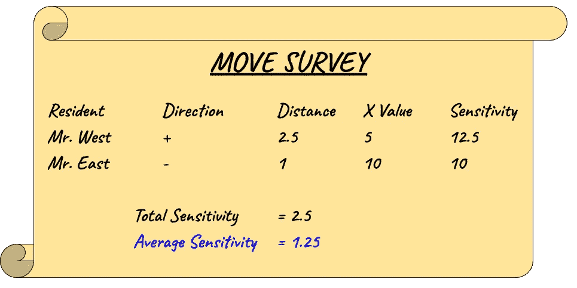

我们可以看到，尽管 West 先生只有“ *x* ”值的一半，但由于他与生产线的距离，他更加敏感。

我们知道斜率需要向上移动，但是增加 1.25 比 T21 大得多，会把线放在两点之上。这就是为什么我们只移动它的一个百分比(我之前描述的“学习率”)。这里我用 1%的学习率。

*1.25 * .01 = .0125*

*新的“m”= . 9+. 0125*

新线在. 9125。在另一次移动调查后，我们可以看到平方误差有所下降。

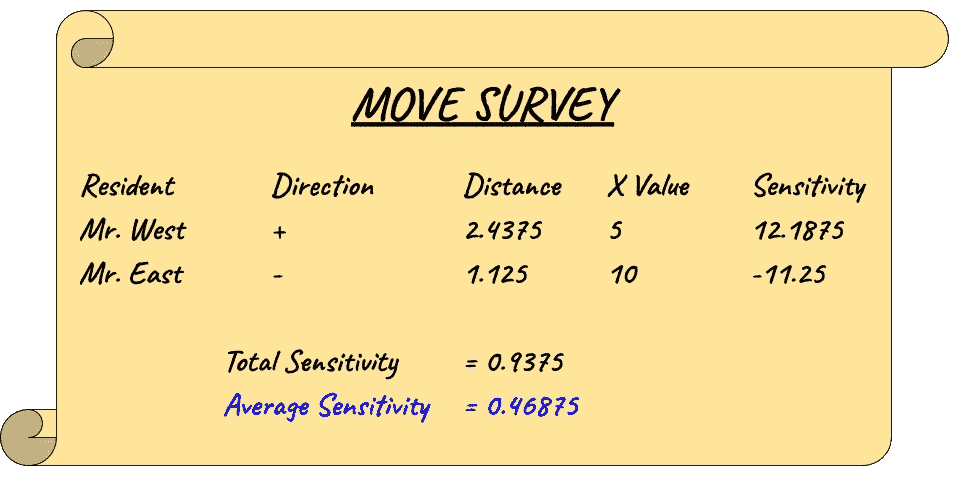

乘以学习率以获得更新值:

*0.46875 * .01 = .0046875*

*新的“m”值= .9125 + .0046875*

更新后线路在. 917。如果我们继续一轮又一轮的移动调查，这条线会越来越接近它的平衡点(. 92)。

这是 0.92 时的移动调查结果

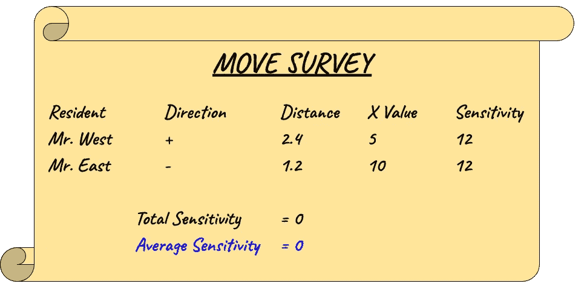

梯度下降过程看起来非常类似于我们看到的“ *m* ”的梯度下降。

# 梯度下降视图

让我们看看坡度变化的梯度体面视图:

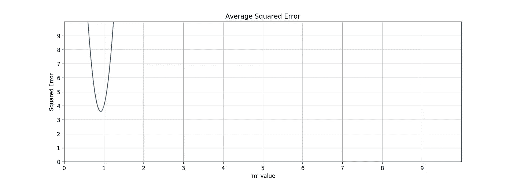

我们可以看到，当“ *m* ”值为 0.9 时，平方误差最小。

关于“ *m* ”曲线需要注意的一点是，它比我们看到的“ *b* ”的曲线要陡得多。这是因为" *m* "值乘以我们的每个" *x* "值，所以即使对" *m* "的小更新也会导致大的变化(更好或更坏)。这就是为什么保持小的学习率很重要。

# 把所有的放在一起

首先，我们想出了当“ *m* ”保持不变时，如何求解“ *b* ”。然后，我们想出了当“ *b* ”保持不变时，如何求解“ *m* ”。我们如何移动“ *m* ”和“ *b* ”来找到最佳的整体匹配？

当“ *m* 和“ *b* 都可以移动时:

1.  假设“ *m* ”不变。进行移动调查，询问所有居民他们希望“ *b* ”值向哪个方向移动。
2.  假设“ *b* ”不变。进行移动调查，询问所有居民他们希望“ *m* ”值移动到哪个方向。
3.  根据“ *b* ”移动调查的平均灵敏度更新“ *b* ”值。
4.  根据“ *m* ”移动测量的平均灵敏度更新“ *m* ”值。
5.  只有一个地方“ *m* ”和“ *b* ”的灵敏度都为零。这条线将会聚在那一点。

# 完整的例子

让我们来看一下当水平线位于( *y = 0x + 7.5”)，*并进行全梯度下降时会发生什么。

**第一轮:**

1.  在“ *b* ”移动调查中，我们发现 East 先生和 West 先生对“ *b* ”的变化同样敏感(他们都相距 0.5)。“ *b* 的平均灵敏度为零。
2.  在“ *m* ”移动调查中，我们发现虽然两人距离相同，但 East 先生对“ *m* ”变化的敏感度是他的两倍，因为他有两倍的“ *x* ”值。
3.  “ *b* ”值没有更新，因为没有平均“ *b* ”灵敏度。
4.  我们将“ *m* ”值更新为平均“ *m* ”灵敏度的 1%。

该线现在为" *y = 0.0125x + 7.5"*

**第二轮:**

1.  这一次，韦斯特先生比伊斯特先生离这条线更远。这意味着他对“ *b* ”的变化更加敏感。韦斯特先生比较强势，想把“ *b* ”值拉下来。
2.  在“ *m* ”移动调查后，我们发现 East 先生仍然对“m”的变化更敏感，并希望将“ *m* ”的值拉高。
3.  我们将“b”值向下移动平均“ *b* ”灵敏度的 25%。
4.  我们将“ *m* ”值向上移动平均“ *m* ”灵敏度的 1%。

随着我们继续将“ *m* ”和“ *b* ”移向平衡，我们接近“ *m* ”和“ *b* ”都为零(最小值)的唯一地方。

让我们从两个角度来总结一下。

# **直线运动视图**

以下动画显示了梯度下降的重复循环，更新了“ *b* 和“ *m* ”。观察“ *b* ”值如何下降，以及“ *m* ”值如何增加。

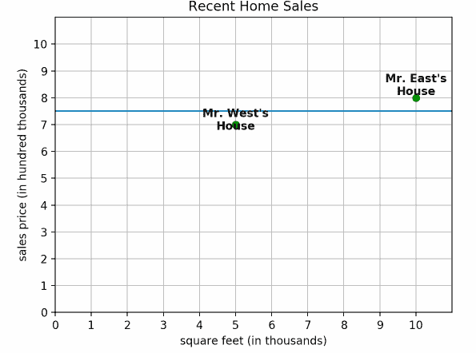

# 梯度下降视图

让我们从“梯度下降”的角度来看正在发生的事情。到目前为止，我们已经展示了两张“梯度下降”图。

1.  " *b* "值与均方差。
2.  *m* 值与均方差。

为了显示" *m* " **"和** " *b* "与均方误差的关系，我们需要图表上的第三个轴。

两个水平轴将代表“ *m* 和“ *b* ”的值。纵轴代表这些点的平方误差。

3 轴梯度下降图通常看起来像这样。这个图表不是基于我们的数据，而是帮助你理解这个概念。

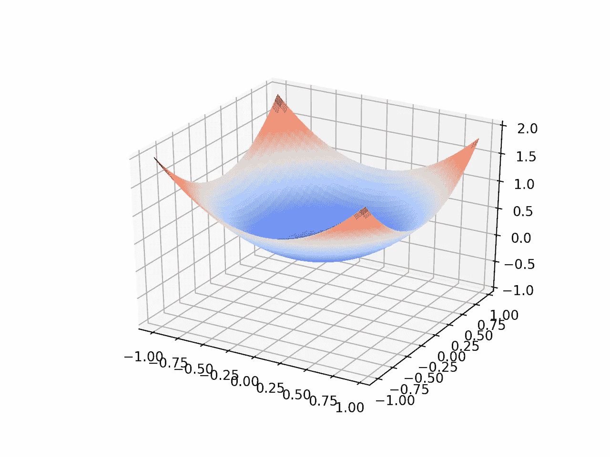

该图有助于显示“ *m* ”和“ *b* ”都处于平衡状态的地方只有一个(底部)。

这是基于我们*实际*数据的梯度下降图。看起来有点困难，但是它有相同的“下坡到最小值”属性:

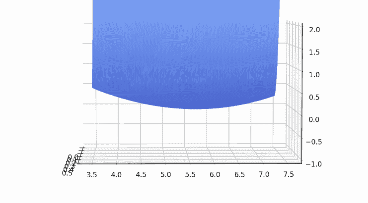

如果您仔细观察这个图表，您可以看到最小点的" *m* "值为 6，而" *b* "值为 0.2。

直线" *y = 0.2x + 6* "实际上是理想的函数，结果是零误差(它穿过两点)。

该图与之前的图有所不同，原因如下:

*   “ *m* ”侧的变化比“ *b* ”侧的变化要敏感得多，使图形呈现出这种独特的“taco”形状。
*   对于“ *b* ”的每个值，最小可能的“ *m* ”值会有一点变化。这就是为什么你看到的浅槽同时向“ *m* ”和“ *b* ”方向移动。

# 关于作者

我是约翰尼·伯恩斯，FlyteHub.org 的创始人，这是一个免费开源工作流程库，可以在没有编码的情况下执行机器学习。我相信在人工智能上的合作会带来更好的产品。

如果你对数学如何支持我们的“敏感度”公式感兴趣，我会写一篇后续文章来解释。