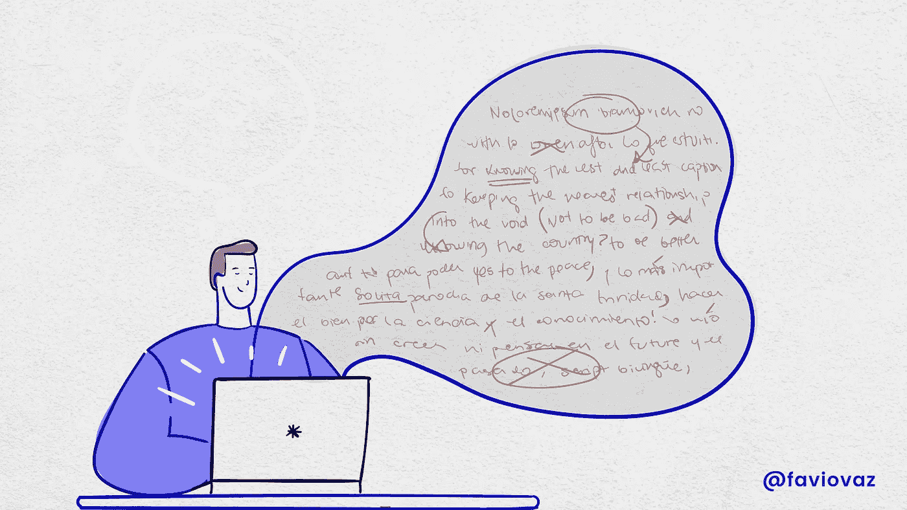

# 使用这个 Python 工具编写更好的故事

> 原文：<https://towardsdatascience.com/write-better-stories-with-this-python-tool-ad1371158822?source=collection_archive---------5----------------------->

## 利用编程的力量写得更好，提高可读性。



[héizel vázquez 的插图](https://www.instagram.com/heizelvazquez/)

如果你经常给老板写文章、博客或报告，那么你要确保人们理解你说的话。在这篇文章中，我将展示如何使用一个名为 [textstat](https://github.com/shivam5992/textstat) 的 Python 库来确定你的文本的可读性、复杂性、等级级别以及更多相关信息。

# 装置

您可以通过 Python 包索引(PyPI)轻松安装 textstat:

```
pip install textstat
```

您也可以从 GitHub 安装最新版本:

```
git clone [https://github.com/shivam5992/textstat.git](https://github.com/shivam5992/textstat.git)
cd textstat
pip install .
```

# 使用

该库中有许多有用的函数来:

*   数音节
*   执行词典计数
*   计算句子
*   运行 Flesch 阅读难易程度评分来评估文档的可读性。
*   运行弗莱施-金凯等级。这是一个评分公式，9.3 分意味着九年级学生能够阅读该文档。
*   返回雾标度。雾指数为 12 需要美国高中毕业生(大约 18 岁)的阅读水平。
*   返回雾霾指数。这是一种可读性的衡量标准，估计了理解一篇文章所需的教育年限。
*   返回自动可读性索引。它产生了理解文本所需的美国等级水平的近似表示。
*   返回科尔曼-廖指数。
*   返回 Linsear 编写的公式。
*   获得 Dale-Chall 可读性分数。
*   基于以上所有测试，获得可读性共识。

这个库的基本思想是让你写一篇文章，然后运行不同的测试和索引，看看你的文章有多好。我将在下面的例子中解释如何做。

# 例子

我将从我写的一篇旧文章中选取一段，然后对它进行不同的测试。文章是:

[](/https-towardsdatascience-com-on-data-and-science-e96849b5f363) [## 关于数据和科学

### 第一部分:将科学引入讨论的重要性。

towardsdatascience.com](/https-towardsdatascience-com-on-data-and-science-e96849b5f363) 

我要用的文字是这样的:

> 数据科学是目前大多数科学和研究的主要焦点，它需要许多东西，如人工智能、编程、统计、商业理解、有效的演示技巧等等。所以才不容易理解，也不容易学习。但是我们能做到，我们正在做。
> 
> 数据科学已经成为学术界和工业界解决问题的标准框架，而且这种情况还会持续一段时间。但是我们需要记住我们从哪里来，我们是谁，我们要去哪里。

在这个 GitHub repo 中，您将找到运行库的下一个笔记本:

[](https://github.com/FavioVazquez/improve-writing) [## FavioVazquez/改进-写作

### 此时您不能执行该操作。您已使用另一个标签页或窗口登录。您已在另一个选项卡中注销，或者…

github.com](https://github.com/FavioVazquez/improve-writing) 

在创建这段代码的过程中，我还发现了一些有趣的事情。如何在 Python 中运行类的每个方法？我没有在网上找到它，所以这里是这个库的例子:

```
*# Run all at once*
**import** **inspect**
funcs = ["textstat." + inspect.getmembers(textstat, predicate=inspect.ismethod)[i][0] **for** i **in** range(1,28)]**for** elem **in** funcs:
    method = eval(elem)
    textstat.set_lang("en")
    print(elem.split(".")[1])
    print(method(text))
    print(" ")
```

相当酷。但是缺少了一些东西，拼写呢？Python 中有很好的库，但是*自动更正*是最容易使用的:

```
# Here I'm misspelling :
# presentation as presentatio
# focus as focsu
# framework as framwork 
text = """
Data science is the main focsu of most sciences and studies right now, 
it needs a lot of things like AI, programming, statistics, 
business understanding, effective presentatio skills and much more. 
That's why it's not easy to understand or study. But we can do it, we are doing it.
Data science has become the standard solving problem framwork for academia and 
the industry and it's going to be like that for a while. But we need to remember 
where we are coming from, who we are and where we are going.
"""
```

正如你所看到的，我故意拼错了单词**演示、焦点和框架，**，我可以用这段简单的代码来修复它:

```
from autocorrect import Spellercheck = Speller(lang='en')check(text)
```

结果是:

```
"\ndata science is the main focus of most sciences and studies right now, \nit needs a lot of things like AI, programming, statistics, \nbusiness understanding, effective presentation skills and much more. \nThat's why it's not easy to understand or study. But we can do it, we are doing it.\ndata science has become the standard solving problem framework for academia and \nthe industry and it's going to be like that for a while. But we need to remember \nwhere we are coming from, who we are and where we are going.\n"
```

已经修好了。

如果你是一个 Python 用户，希望你可以用它来写更好的文章、报告等等。请在下面告诉我你的想法:)

你也可以通过 Instagram/Twitter 联系我:

[](https://twitter.com/faviovaz) [## 法维奥·巴斯克斯

### Favio Vázquez 的最新推文(@FavioVaz)。数据科学家。物理学家和计算工程师。我有一个…

twitter.com](https://twitter.com/faviovaz)