# 学习如何在 Jupyter 笔记本上写下降价和乳胶

> 原文：<https://towardsdatascience.com/write-markdown-latex-in-the-jupyter-notebook-10985edb91fd?source=collection_archive---------1----------------------->

## 不仅是朱庇特。Google Colab、R Markdown 等等。


背景由[JESHOOTS.COM](https://unsplash.com/@jeshoots?utm_source=medium&utm_medium=referral)于 [Unsplash](https://unsplash.com?utm_source=medium&utm_medium=referral)

交互式笔记本越来越受欢迎。*为什么？* 仅仅是因为它是一个很棒的教学环境，功能强大，可共享，并提供了在相同环境中执行数据可视化的能力。*应该用哪些互动笔记本？*我推荐:

*   [**Jupyter Notebook**](https://jupyter.org/)是一个开源的 web 应用程序，允许您创建和共享包含实时代码、公式、可视化和叙述性文本的文档。
*   [**Colaboratory**](https://colab.research.google.com/) 是一个免费的 Jupyter 笔记本环境，不需要设置，完全在云中运行。

他们两个都支持

1.  Markdown 是一种标记语言，是 HTML 的超集。
2.  [**乳胶**](https://www.latex-project.org/) 渲染数学和科学的写法。

# 降价

这是一种非常简单的语言，它允许你以一种简化的方式编写 HTML。它可以用在一些网站上，比如 Stack Overflow，或者用来写文档(基本上是在 GitHub 上)。

> Markdown 文件扩展名是。钔

当你在 Markdown 中写的时候，你使用缩短的符号，这些符号被相应的 HTML 标签所取代。每次，我都会告诉你相当于 Markdown 符号的 HTML，向你展示 Markdown 是如何使我们的生活比以往任何时候都更容易。

现在，甚至网络开发者也使用 Markdown，然后通过一些网站将其转换成 HTML。

## 标题

你用标签`#`制作标题。一个标签给你一个标题(h1)，两个标签给你一个副标题(h2)，依此类推，如下所示:

```
# Heading 1
## Heading 2
### Heading 3
#### Heading 4
##### Heading 5
###### Heading 6
```

**HTML** 等效:

输出结果: [Colab 笔记本](https://colab.research.google.com/drive/18_2yFdH8G-6NXY_7fTcshMoScgJ-SYac#scrollTo=q9AnessjErun&line=1&uniqifier=1)

## 段落

HTML 中的段落由`<p>`标签表示。在 Markdown 中，它们由一个或多个空行分隔。像 HTML 一样，空白被忽略。所以如果你增加 10 个空行，你仍然只有一个段落。

```
This is a paragraph of text.This is another paragraph of text.
```

**HTML** 等效:

输出结果: [Colab 笔记本](https://colab.research.google.com/drive/18_2yFdH8G-6NXY_7fTcshMoScgJ-SYac#scrollTo=Ti6TaA5lErsI&line=1&uniqifier=1)

## 换行

只需用两个或更多空格结束一行，然后键入 return。或者留一个空行。

```
This is a text.     <!-- spaces -->
This is another text.
```

**HTML** 等效:

输出结果: [Colab 笔记本](https://colab.research.google.com/drive/18_2yFdH8G-6NXY_7fTcshMoScgJ-SYac#scrollTo=QDvhBqZYErh5&line=1&uniqifier=1)

## 标出重点

您可以通过将文本加粗或倾斜来强调。

```
Emphasis, aka italics, with ***asterisks*** or **_underscores_**.Strong emphasis, aka bold, with ****asterisks**** or **__underscores__**.Combined emphasis with ****asterisks and _underscores_****.Strikethrough uses two tildes ~ . **~~Scratch this.~~**
```

**HTML** 等效:

输出结果: [Colab 笔记本](https://colab.research.google.com/drive/18_2yFdH8G-6NXY_7fTcshMoScgJ-SYac#scrollTo=cJEt55GRErfd&line=9&uniqifier=1)

## 列表

在 Markdown 中创建列表是一种真正的乐趣，你会发现没有什么比这更简单的了！

```
1\. Item 1
2\. Item 2 ( we can type 1\. and the markdown will automatically numerate them) 
* First Item
  * Nested item 1
  * Nested item 2
    1\. Keep going
    1\. Yes

* Second Item
- First Item
- Second Item
```

**HTML** 等效:

输出结果: [Colab 笔记本](https://colab.research.google.com/drive/18_2yFdH8G-6NXY_7fTcshMoScgJ-SYac#scrollTo=8WHwnW5kEraB&line=13&uniqifier=1)

## 链接和图像

要创建链接，必须将链接文本放在方括号中，后面是圆括号中的 URL。图像的插入方式几乎和链接一样，添加一个感叹号(`!`，后面是括号中的 alt 文本，括号中是图像资产的路径或 URL。

```
<!-- [Text](link) -->
[Link Text]([https://medium.com/@ahmedazizkhelifi](https://medium.com/@ahmedazizkhelifi) "Optional Title")<!--  -->
 "Optional Title")**<!-- Linking Image -->**
<!-- [](link) -->[ "Optional Title")]([https://medium.com/@ahmedazizkhelifi](https://medium.com/@ahmedazizkhelifi))
```

**HTML** 等效:

输出结果: [Colab 笔记本](https://colab.research.google.com/drive/18_2yFdH8G-6NXY_7fTcshMoScgJ-SYac#scrollTo=vwNK8mMSGfYZ&line=10&uniqifier=1)

## 水平标尺

要创建水平线，请在一行中单独使用三个或三个以上的星号(`***`)、破折号(`---`)或下划线(`___`)。

```
Reading articles on Medium is awesome.
---
Sure !!
```

**HTML** 等效:

输出结果: [Colab 笔记本](https://colab.research.google.com/drive/18_2yFdH8G-6NXY_7fTcshMoScgJ-SYac#scrollTo=dJ5GQ3YCGfQH&line=5&uniqifier=1)

## 桌子

太简单了。而且你可以使用[这个网站](https://www.tablesgenerator.com/markdown_tables)来生成它们。
在笔记本上的美元符号`$`前使用`\`，否则将进入数学显示模式(在 LaTeX 面查看)。

```
| Id | Label    | Price |
|--- |----------| ------|
| 01 | Markdown |\$1600 |
| 02 | is       |  \$12 |
| 03 | AWESOME  | \$999 |
```

**HTML** 等效:

输出结果: [Colab 笔记本](https://colab.research.google.com/drive/18_2yFdH8G-6NXY_7fTcshMoScgJ-SYac#scrollTo=wDS958ruGfDl&line=7&uniqifier=1)

## 代码和语法突出显示

```
```python
def staySafe(Coronavirus)
  if not home:
    return home
```
```

**HTML** 等效:

输出结果: [Colab 笔记本](https://colab.research.google.com/drive/18_2yFdH8G-6NXY_7fTcshMoScgJ-SYac#scrollTo=MQrtBJ3KH1Nj&line=7&uniqifier=1)

## 大宗报价

块引号的工作方式类似于对电子邮件的回复:您必须在引号前面加上一个`>`。

```
> This is a blockquote.
>  
> This is part of the same blockquote.Quote break> This is a new blockquote.
```

**HTML** 等效:

输出结果: [Colab 笔记本](https://colab.research.google.com/drive/18_2yFdH8G-6NXY_7fTcshMoScgJ-SYac#scrollTo=52zLR8keH1A4&line=6&uniqifier=1)

# 乳液

> 你有没有问过自己，他们是如何用计算机写出复杂的数学和物理方程的？嗯，都是关于乳胶的。

Jupyter 笔记本使用 [MathJax](http://www.mathjax.org/) 在 HTML / Markdown 中渲染 LaTeX。把你的 LaTeX math 放在`$ $`里面就行了。或者通过在`$$ $$`之间书写进入*显示*数学模式。

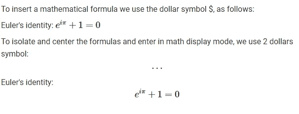

输出结果: [Colab 笔记本](https://colab.research.google.com/drive/18_2yFdH8G-6NXY_7fTcshMoScgJ-SYac#scrollTo=fiZwHP0czJyT)

[**重要提示**](https://colab.research.google.com/drive/18_2yFdH8G-6NXY_7fTcshMoScgJ-SYac#scrollTo=1v3l2nNmNN7_) **:**

1.  使用`\,`在数学模式中添加**小间距**
2.  在数学模式下使用`\\`添加**新行**
3.  使用`\frac{arg 1}{arg 2}`显示**分数**
4.  对于**电源**(上标文本)使用`^{}`
5.  对于**索引**(下标)使用`_{}`
6.  对于**根**，使用`\sqrt[n]{arg}` `[n]`是可选的。

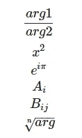

输出示例: [Colab 笔记本](https://colab.research.google.com/drive/18_2yFdH8G-6NXY_7fTcshMoScgJ-SYac#scrollTo=1v3l2nNmNN7_&line=7&uniqifier=1)

> *LaTeX 文件的扩展名是。特克斯*

## 希腊字母

要写希腊字母，输入`\`和字母名称:

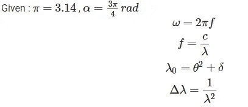

输出结果: [Colab 笔记本](https://colab.research.google.com/drive/18_2yFdH8G-6NXY_7fTcshMoScgJ-SYac#scrollTo=go3imAWqE9au)

[**重要注意事项**](https://colab.research.google.com/drive/18_2yFdH8G-6NXY_7fTcshMoScgJ-SYac#scrollTo=VFaCoSXvS-_H&line=6&uniqifier=1) :
要写**大写希腊字母**，键入反斜杠`\`后的第一个大写，例如:

```
\delta >>> δ 
\Delta >>> Δ\omega >>> ω
\Omega >>> Ω
```

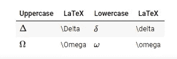

输出示例: [Colab 笔记本](https://colab.research.google.com/drive/18_2yFdH8G-6NXY_7fTcshMoScgJ-SYac#scrollTo=VFaCoSXvS-_H)

如下图所示:

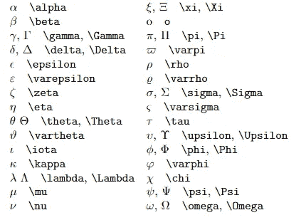

完整的希腊字母列表。[来源](http://tug.ctan.org/)

## 罗马名称:

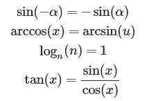

输出结果: [Colab 笔记本](https://colab.research.google.com/drive/18_2yFdH8G-6NXY_7fTcshMoScgJ-SYac#scrollTo=3aD-y9kO523a)

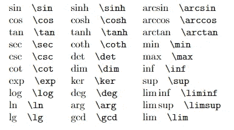

[来源](http://tug.ctan.org/)

## 其他符号

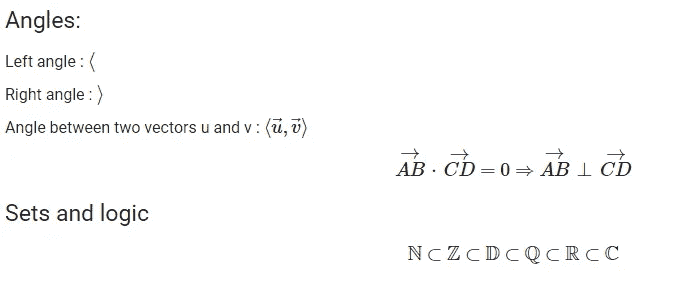

输出结果: [Colab 笔记本](https://colab.research.google.com/drive/18_2yFdH8G-6NXY_7fTcshMoScgJ-SYac#scrollTo=-888LBso8HS1)

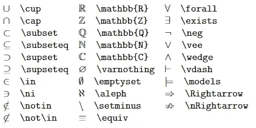

集合与逻辑:[来源](http://tug.ctan.org/)

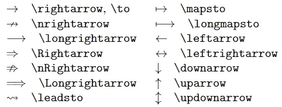

箭头:[来源](http://tug.ctan.org/)

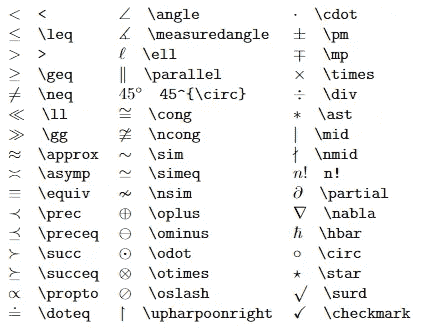

其他符号:[来源](http://tug.ctan.org/)

## 垂直花括号:

为了定义左垂直花括号，我们使用属性

```
\left\{
```

为了关闭它，我们使用

```
\right\}
```

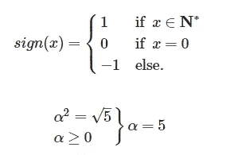

输出结果: [Colab 笔记本](https://colab.research.google.com/drive/18_2yFdH8G-6NXY_7fTcshMoScgJ-SYac#scrollTo=XPXiLu3IE9gO)

## 水平花括号

对于水平花括号，我们使用:

```
\underbrace{...}
\overbrace{...}
```


输出结果: [Colab 笔记本](https://colab.research.google.com/drive/18_2yFdH8G-6NXY_7fTcshMoScgJ-SYac#scrollTo=xzu2CyGLE9iy)

## 衍生产品

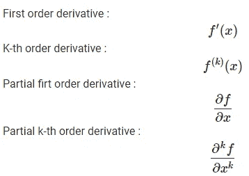

输出结果: [Colab 笔记本](https://colab.research.google.com/drive/18_2yFdH8G-6NXY_7fTcshMoScgJ-SYac#scrollTo=S06VqebHE9mE)

## 极限

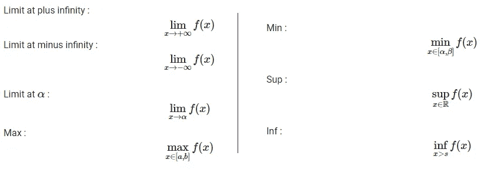

输出结果: [Colab 笔记本](https://colab.research.google.com/drive/18_2yFdH8G-6NXY_7fTcshMoScgJ-SYac#scrollTo=9eGgqyQ4E9oC)

## 总和

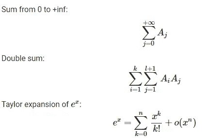

输出结果: [Colab 笔记本](https://colab.research.google.com/drive/18_2yFdH8G-6NXY_7fTcshMoScgJ-SYac#scrollTo=m6Q0JcCYE9qm)

## 产品

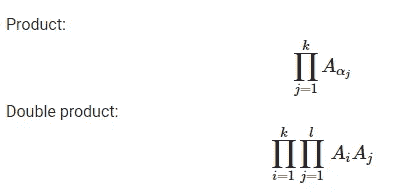

输出结果: [Colab 笔记本](https://colab.research.google.com/drive/18_2yFdH8G-6NXY_7fTcshMoScgJ-SYac#scrollTo=twn8CTHSE9tH)

## 积分

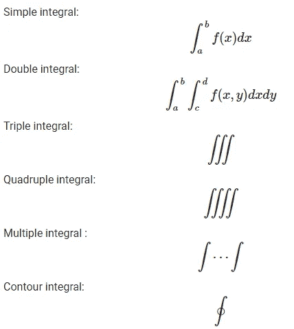

输出结果: [Colab 笔记本](https://colab.research.google.com/drive/18_2yFdH8G-6NXY_7fTcshMoScgJ-SYac#scrollTo=aYWkttHLE9vs)

## 矩阵

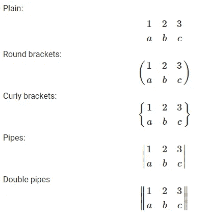

输出结果: [Colab 笔记本](https://colab.research.google.com/drive/18_2yFdH8G-6NXY_7fTcshMoScgJ-SYac#scrollTo=z3qGgxul048v)

**资源:**

*   [https://www . datasciencecentral . com/profiles/blogs/all-about-using-jupyter-notebooks-and-Google-colab](https://www.datasciencecentral.com/profiles/blogs/all-about-using-jupyter-notebooks-and-google-colab)
*   [https://oeis.org/wiki/List_of_LaTeX_mathematical_symbols](https://oeis.org/wiki/List_of_LaTeX_mathematical_symbols)
*   [https://jupyter.org/](https://jupyter.org/)
*   [https://en.wikipedia.org/wiki/Project_Jupyter](https://en.wikipedia.org/wiki/Project_Jupyter)
*   [https://en.wikipedia.org/wiki/Markdown](https://en.wikipedia.org/wiki/Markdown)
*   [http://tug.ctan.org/info/undergradmath/](http://tug.ctan.org/info/undergradmath/)
*   [https://open classrooms . com/en/courses/1304236-redi gez-en-markdown](https://openclassrooms.com/en/courses/1304236-redigez-en-markdown)

**感谢阅读！😄**

[](https://medium.com/@ahmedazizkhelifi)

查看**我的其他文章**并关注我的 [**中的**](https://medium.com/@ahmedazizkhelifi)

哈利菲·艾哈迈德·阿齐兹