# 用 pandas 编写 5 个常见的 SQL 查询

> 原文：<https://towardsdatascience.com/writing-5-common-sql-queries-in-pandas-90b52f17ad76?source=collection_archive---------32----------------------->

## 利用您的 SQL 数据操作技能来学习熊猫

能够熟练地使用 SQL 和 pandas(Python 中的一个数据分析库)操作数据，对于数据分析师、数据科学家和任何处理数据的人来说都是一项很有价值的技能。在本帖中，我们将并排比较 SQL 查询和它们在 pandas 中的对应项。

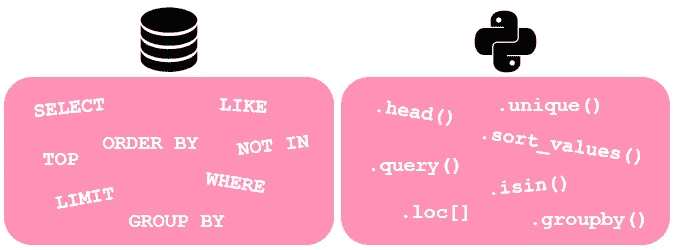

作者图片

通常有许多方法可以达到相同的输出。因此，对于一些 SQL 查询，我们将在 pandas 中选择一些对应的查询。

# 0.资料组📦

*如果你还没有，确保你已经安装了* [*熊猫*](https://pandas.pydata.org/pandas-docs/stable/getting_started/install.html) *和* [*海兽*](https://seaborn.pydata.org/installing.html) *。*

我们将使用 seaborn 的餐馆小费数据集作为样本数据集。关于这个数据集的细节可以在这里找到[(这个源实际上是 R 的，但是它看起来是指同一个底层数据集)。为了便于快速查阅，我在下面引用了他们的数据描述:](https://vincentarelbundock.github.io/Rdatasets/doc/reshape2/tips.html)

> “一个服务员记录了他在一家餐馆工作几个月期间收到的每一笔小费的信息。”

```
# Import packages
import pandas as pd
import seaborn as sns# Import data 
tips = sns.load_dataset('tips')
```

# 📍 1.查看数据提取

让我们简单地从数据集中的前 5 条记录开始:

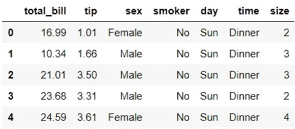

在`head()`方法中，我们可以像这样指定 parantheses 中的行数:`tips.head(5)`。然而，在这个例子中我们可以不用`tips.head()`，因为默认的行数被设置为 5。

我们不查看所有列，而是查看包含选定列的前 3 行:

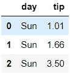

在本例中，更改行选择和列选择的顺序不会影响结果。因此，图像显示了两种变化。在第一个版本中，我们首先选择列，然后指定行选择，而在第二个版本中，我们反过来做。现在，让我们看看如何过滤数据。

# 📍 2.过滤数据

让我们来看看周四前五名的记录:

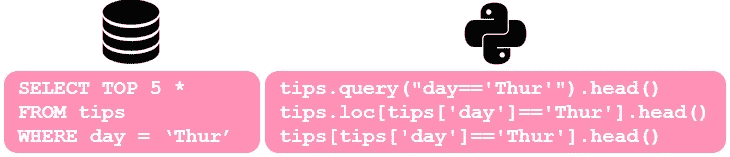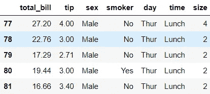

我们可以用三种方法中的一种在熊猫身上达到同样的效果。第一种是我最喜欢的在 pandas 中过滤数据的方法，因为它更简洁，尤其是当有多个条件要过滤时。在另外两种方法中，我们用代码的`tips['day']=='Thur'`部分表示的*布尔掩码*过滤数据。该布尔掩码将为每个记录创建一个布尔值，如果记录来自星期四，则为`True`，否则为`False`。因为后两种方法除了`.loc`部分是相同的，我将只展示后者的例子，因为前者可以很容易地从另一个中推断出来。你注意到我们用`==`表示平等吗？那是因为`=`在 Python 中是为赋值保留的。然而，`>`、`>=`、`<`和`<=`在两者中的工作方式是一样的。现在，让我们看看其他一些运算符:

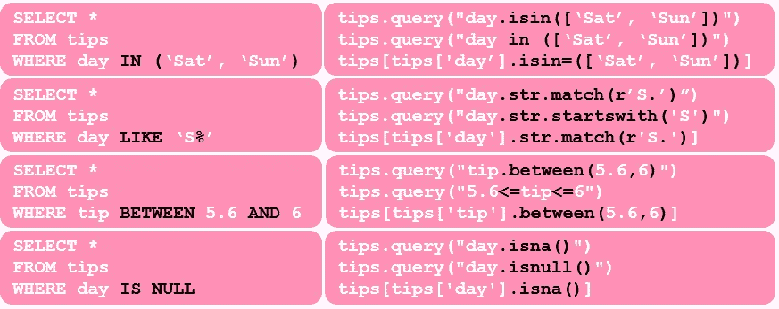

如你所见，两者在关键词上有相似之处。需要记住的一点是 Python 是区分大小写的。这意味着`match(r'S.')`和`match(r's.')`将给出不同的输出，而 SQL 中的`LIKE 'S%'`或`LIKE 's%'`将返回相同的输出。如果我们想过滤任何以' s '开头的日期，而不考虑大小写，一种方法是使用`match(r'[Ss]')`。如果对于某些记录，我们有一个名为“S”的工作日，`WHERE day LIKE ‘S%'`和`.str.startswith(‘S')`将选择这些案例，而`.str.match(r'S.')`不会。如果我们想迎合这种情况，那么我们将修改脚本为`.str.match(r'S.?')`。现在，让我们来看看否定:

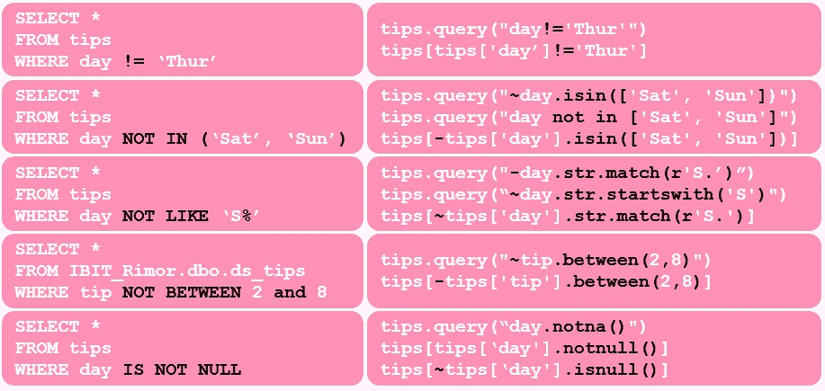

您可能已经注意到，SQL 中的`NOT`对应于 pandas 中的`-`或`~`。现在，让我们看看如何使用`AND`或`OR`进行多条件过滤:

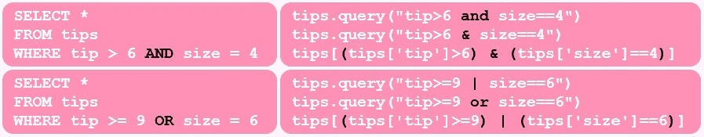

> *💡*在 Python 中，`and`或`or`被称为布尔运算符，而`&`或`|`被认为是位运算符。

如你所见，用`query`过滤比布尔掩码更简洁。它也更灵活，因为我们可以使用布尔或按位运算符。另一方面，当使用布尔掩码过滤时，只支持按位运算符。那就是`tips[(tips['tip']>=9) or (tips['size']==6)]`会给出一个错误。如果你想知道为什么，看看 StackOverFlow 上的这个帖子。

但是，当根据您的熊猫版本使用`query()`时，您可能会遇到此处 : `TypeError: ‘Series’ objects are mutable, thus they cannot be hashed`描述的[问题。如果发生这种情况，请使用使用布尔掩码的替代方法来过滤数据。](https://github.com/pandas-dev/pandas/issues/34251)

# 📍 3.排序数据

现在让我们看看如何按一列升序对数据进行排序:

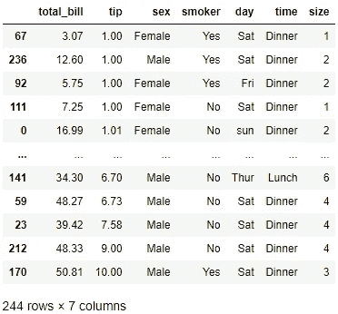

就像我们可以在 SQL 中使用`ORDER BY tip ASC`一样，我们也可以在 pandas 中使用`tips.sort_values(tip’, ascending=True)`。然而，我觉得这些多余的赘言是多余的。如果我们要按降序排序，我们使用:

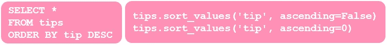

看看布尔值如何也可以用整数来表示？让我们看看如何按多列排序:

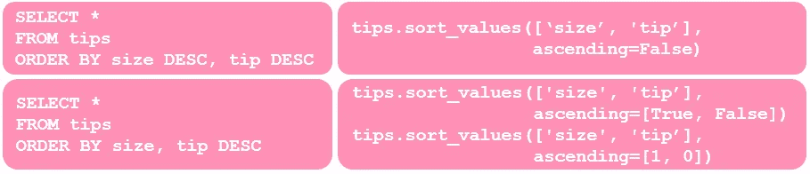

排序到此为止！

# 📍 4.汇总数据

通常，我们希望汇总数据并检查汇总指标，让我们从最基本的指标开始。这是检查行数的方法:

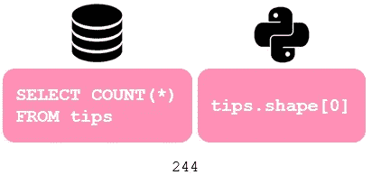

在 pandas 中，如果我们运行`tips.shape`，它将以如下格式显示行数和列数:(#rows，#columns)。这里，我们只是通过添加`[0]`来过滤行数。另一种常见的聚合是查找汇总统计数据。让我们检查所有数字列的平均值:

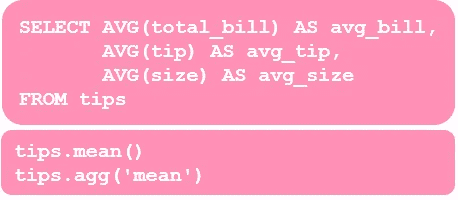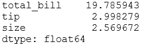

在 pandas 中使用这两个选项中的任何一个，如果数据在正确的[类型](https://pandas.pydata.org/pandas-docs/stable/reference/api/pandas.DataFrame.dtypes.html)中，所有的数字列都将被自动选取。因此，我们不必键入所有的列名。

值得注意的是，`agg`其实是`aggregate`的别名。因此，所示的第二个选项是`tips.aggregate('mean')`的简称。

现在让我们检查列的最小值和最大值:

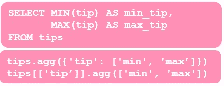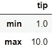

同样，这两种选择都可行。让我们进一步扩展查询:

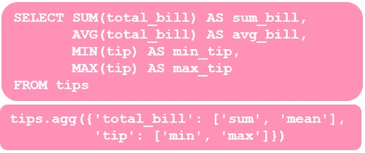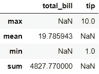

尽管 SQL 和 pandas 中的输出并不完全相同，但我们得到的是相同的汇总统计数据，只是格式略有不同。这就是我们如何为两列提取相同的汇总统计信息:

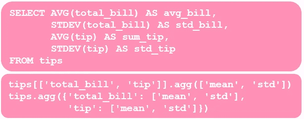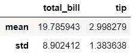

另一个常见的查询是检查列的唯一值:

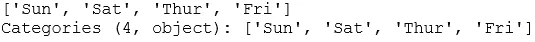

如果我们想查看唯一值的数量，那么它会变成:

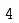

在熊猫中，我们还可以使用`describe()`获得汇总统计数据。如果我们运行`tips.describe()`，我们将看到一个漂亮的所有数字列的汇总统计表。

# 📍 5.按组聚集数据

让我们先看一个简单的组聚合示例:

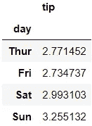

另一个例子:

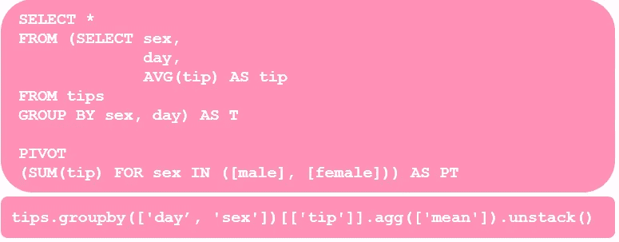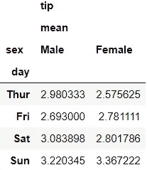

熊猫的数据透视表看起来更简单吗？也许吧？👀我们也可以将我们在聚合部分学到的知识用于组聚合。

Voila❕:这些是对 5 种查询的比较。这里有一个额外的例子，我们结合了一些查询:


*您想访问更多这样的内容吗？媒体会员可以无限制地访问媒体上的任何文章。如果您使用* [*我的推荐链接*](https://zluvsand.medium.com/membership)*成为会员，您的一部分会费将直接用于支持我。*

谢谢你看我的帖子。希望这些比较对你有用，✂️，并对熊猫有更多的了解。

如果你有兴趣了解更多关于熊猫的知识，这里有我的一些帖子的链接:
◼️️ [给熊猫用户的 5 个建议](/5-tips-for-pandas-users-e73681d16d17)
◼️️ [如何在熊猫数据框架中转换变量](/transforming-variables-in-a-pandas-dataframe-bce2c6ef91a1)

再见🏃💨