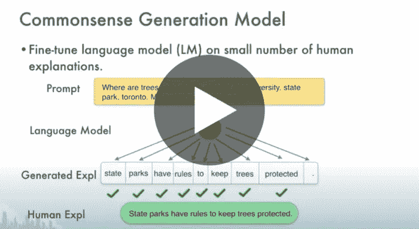

# 撰写数据科学博客

> 原文：<https://towardsdatascience.com/writing-a-data-science-blog-5595bf542107?source=collection_archive---------58----------------------->

照片由 Unsplash 上的思想目录

## [我如何写数据科学博客](/how-i-write-a-data-science-blog-62e4108fe478)

由[丽贝卡·维克里](https://medium.com/u/8b7aca3e5b1c?source=post_page-----5595bf542107--------------------------------)——5 分钟阅读

两年来，我几乎一直在媒体上专门写关于数据科学的文章。我最初打算只是偶尔写点东西来帮助其他人学习数据科学，并作为我自己发展的学习工具(我是费曼技术的超级粉丝)。

照片由 Pexels 的 Pixabay 拍摄

## [欢迎加入数据团队！请解决一切。](/welcome-to-the-data-team-please-solve-everything-part-i-the-problem-13a157551804)

到[贾鲁斯·辛格](https://medium.com/u/413ac87ff804?source=post_page-----5595bf542107--------------------------------) — 11 分钟读取

先说一个常见的情况。不管是勇敢的 MBA 市场实习生还是首席执行官，至少拥有一点权力的人都会面临一个难题。他们安排了一个项目启动会议，与不同的人一起集思广益，想出一个解决方案，并且知道如果它有任何机会被他们的上级批准，它将需要数据的支持。

照片由 Alva Pratt 在 Unsplash 上拍摄

## [哪位翻译？](/which-translator-870bae18f3bf)

史蒂文·麦克唐纳 — 12 分钟阅读

作为一个狂热的小说读者，我经常想知道译者的风格对翻译小说的影响。尤其是，我一直对村上春树的作品很好奇。他用日语写作，有三个主要的英语翻译:阿尔弗雷德·伯恩鲍姆、杰伊·鲁宾和菲利普·加布里埃尔。

阿莱西奥·达马托，米哈伊尔·梁赞诺夫/CC BY-SA([http://creativecommons.org/licenses/by-sa/3.0/](http://creativecommons.org/licenses/by-sa/3.0/))

## [钟形曲线的魔力](/the-magic-of-the-bell-curve-60caa40bf182)

由曼努埃尔·布伦纳 — 7 分钟读完

这个世界令人难以置信地混乱，所以我们甚至需要一定的勇气去试图在其中找到永恒的结构。统计学家是这群大胆的人中的一员，他们总是在寻找规律性。但是规律性很难找到，关于这个世界的强有力的陈述通常只有在长期盲目徘徊的代价下才会出现。

## [自己解释！利用语言模型进行常识推理](/explain-yourself-leveraging-language-models-for-common-sense-reasoning-1c988b8b24cd)

作者 naz neen Rajani——25 分钟

深度学习模型在需要常识推理的任务上表现不佳，这通常需要某种形式的世界知识或对输入中不立即存在的信息进行推理。我们以自然语言序列的形式收集人类对常识推理的解释，并在一个名为常识解释(CoS-E)的新数据集中突出标注。