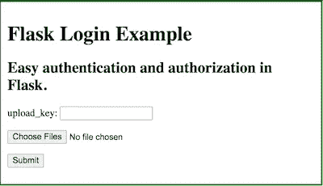
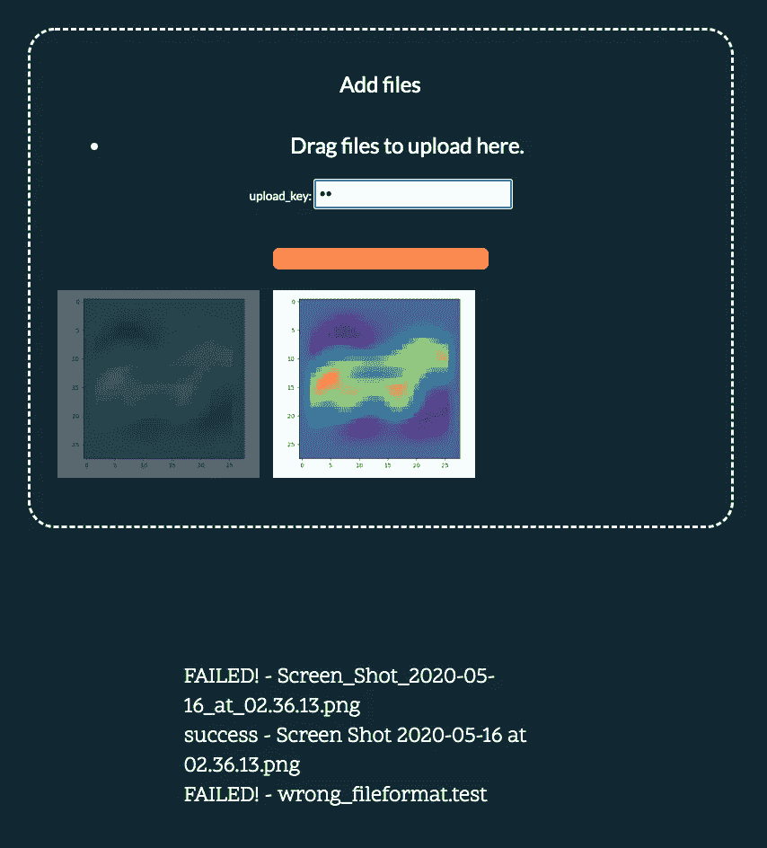

# 编写带有用户认证的多文件上传 Python-web 应用程序

> 原文：<https://towardsdatascience.com/writing-a-multi-file-upload-python-web-app-with-user-authentication-8f75064b819a?source=collection_archive---------7----------------------->

## 为合作者提供了一种简单的方法来上传文件到文件存储，而不需要他们理解任何代码


你好，我是尼克🎞 on [Unsplash](https://unsplash.com?utm_source=medium&utm_medium=referral)

当构建一个 web 服务器时，我们经常希望提出一个想法或主题。在静态网站的情况下，这可以通过在源文件中包含相关信息来实现。在更动态的例子中，在将信息返回给用户之前，可以使用 API(应用编程接口)来预处理信息。

在这个例子中，我们设计了一个简单的 flask 应用程序，它只需要一个用户密钥和一个 web 浏览器就可以工作。这背后的想法是，任何人都可以使用它，它是一个设备(和操作系统)，独立的。

# 创建烧瓶应用程序

像往常一样，我们首先为服务器安装相关的库。最简单的方法是使用 pip(python 包管理器)。

```
pip install flask, werkzeug
```

## 上传页面模板

接下来，为登录页面创建 HTML 模板。为此，我们从应用程序目录开始，创建一个名为`templates`的新文件。在这里，我们创建一个名为`upload.html`的文件，并将下面的代码粘贴到其中。

本质上，我们有一个`form`，其中包含我们的密码`input`，一个文件上传`input`和一个提交按钮。工作时，这将看起来如下



upload_simple.html 的输出

## 设置上传选项

接下来，我们为上传选项定义一个配置文件。为此，在主应用程序文件夹中创建一个名为`config.py`的文件。在此范围内，我们可以指定可接受的最大文件大小、上传目的地以及我们可以选择接受的文件扩展名。将下面的代码复制到`config.py`中，并进行相应的调整。

*关于文件类型的注意事项:文件扩展名不保证文件类型，我们应该避免执行任何上传的文件。这就是我们后来引入密码的原因——只有经过批准的用户才能上传。*

## 烧瓶模板

我们从一个基本的 flask 模板开始，它导入我们的信息，并在导航到`[http://127.0.0.1:4000/upload](http://127.0.0.1:4000/upload)`时服务于`upload.html`页面

## 上传文件检查

现在我们有了我们的应用程序，我们可以添加一些功能来确保我们有正确的目录，如果没有创建它。

```
if not os.path.isdir(upload_dest):
    os.mkdir(upload_dest)
```

我们可以设置最大文件上传大小(使用来自`config.py`的值)

```
app.config['MAX_CONTENT_LENGTH'] = file_mb_max * 1024 * 1024
```

并检查文件扩展名(再次在`config.py`中定义)

```
def allowed_file(filename):
    return '.' in filename and filename.rsplit('.', 1)[1].lower() in                 extensions
```

就我个人而言，我在代码中的`app.secret`和`@app.route`部分之间添加了这些。

## 上传时要做什么

最后，我们还没有告诉程序在上传时做什么。我们通过解析来自上传页面的 post 请求来做到这一点。有关这意味着什么的信息，请阅读:

[](/talking-to-python-from-javascript-flask-and-the-fetch-api-e0ef3573c451) [## 从 Javascript: Flask 和 fetch API 与 Python 对话

### 使用 Python 处理动态 web 界面或可视化所需的数据。

towardsdatascience.com](/talking-to-python-from-javascript-flask-and-the-fetch-api-e0ef3573c451) 

这里我们检查`request.method`是否是一个帖子，如果是，处理任何附加的文件。第一部分处理一个空请求，而第二部分遍历每个文件，检查它们是否有正确的文件扩展名，如果有，将它们保存到我们想要的位置(`upload_dest`)。

```
[@app](http://twitter.com/app).route('/upload', methods=['POST'])
def upload_file():
    if request.method == 'POST': if 'files[]' not in request.files:
            flash('No files found, try again.')
            return redirect(request.url) files = request.files.getlist('files[]') for file in files:
            if file and allowed_file(file.filename):
                filename = secure_filename(file.filename)
                file.save(os.path.join( upload_dest, filename)) flash('File(s) uploaded')
    return redirect('/upload')
```

## 测试用例

最后，在继续添加密码之前，我们要确保上传功能正常。为此，我们运行 python 脚本，导航到[http://127 . 0 . 0 . 1:4000/upload](http://127.0.0.1:4000/upload)，选择几个文件，然后单击 upload。如果这已经成功，并且您正在使用上面的配置，那么您的文件现在应该位于与您的应用程序嵌套在同一文件夹中的`uploads_folder`目录中。

# 添加用于用户身份验证的加密数据库

到目前为止，我们已经创建了一个 Flask 应用程序，可以用来上传文件。接下来，我们想添加一个基本的安全层，这样我们就可以跟踪哪些文件被上传了，是谁上传的。此外，这允许我们拒绝任何未经授权向目录提交数据的人。

## 安装 **pysqlcipher3**

我们从安装数据库工具开始。这有时会给人们带来问题，所以下面包含了 Mac 和 Linux 的安装说明。

**MAC**

```
brew install SQLCipher
pip install pysqlcipher3
```

**LINUX**

```
sudo apt install sqlcipher libsqlcipher0 libsqlcipher-dev
sudo -H pip3 install pysqlcipher3python3 -c 'import pysqlcipher3; print(pysqlcipher3.__path__)'
```

## 连接到数据库

我们从连接数据库开始。如果您以前使用过数据库，pysqlcipher 语法与 sqlite 或任何 postgresql 库非常相似。我们从导入库开始

```
from pysqlcipher3 import dbapi2 as sqlite3
from config import app_key, db_loc
```

然后连接到数据库:

```
conn = sqlite3.connect(db_loc)# where this is /path/test.db
cursor = conn.cursor()
```

最后，我们需要为数据库指定一个加密密钥，以便能够访问数据。

```
cursor.execute("PRAGMA key='%s'"%app_key)
```

如果不这样做，或者使用不同的键，您将收到以下错误:`DatabaseError: file is not a database`当试图从数据库模式中读取信息时。

## 创建数据库

打开我们的数据库，输入我们的密钥，我们现在可以创建一个表来存储我们的值。我们通过使用`cursor execute`函数执行一个`create table` SQL 命令来实现这一点。最简单的用例需要一个**名称**和一个**上传密钥。**

```
cursor.execute(
            '''
            **CREATE** TABLE IF NOT EXISTS **upload** (
            id INTEGER NOT NULL PRIMARY KEY AUTOINCREMENT,
            **name** TEXT NOT NULL,
            **upload_key** TEXT UNIQUE
            );
            '''
    )
```

*此外，我设置了一个条件，即每个密钥必须是唯一的，因为我们不使用用户名登录。*

最后，我们必须将新表提交给数据库并关闭它。

```
conn.commit()
## conn.close() 
## close only when we have finished everything, otherwise we have to reopen the database each time
```

## 添加用户

我们需要用户能够使用上传工具，所以我们可以使用`insert`命令添加一些。

```
cursor.execute(
            '''
            **INSERT** INTO **upload** (name, dir, uploadcode)
            VALUES ("bob", "bobs top secret upload key")
            '''
conn.commit()
```

## 读取数据库

作为检查，我们想看看是否有一个名字与 upload_key 相关联。这可以通过`select`函数和`where`条件来实现。

```
user_code = 'bobs top secret upload key'cursor.execute('**select** * from upload **where** uploadcode="%s"'%user_code)result = cursor.fetchall() # get all the results e.g. [("bob",)]
```

# 把它们串在一起

现在我们有了一个数据库和一个上传脚本，我们可以将两者结合起来。

## 打开数据库

首先，我们添加所需的库

```
from pysqlcipher3 import dbapi2 as sqlite3
# from config import app_key, db_loc # already imported
```

在`from config_simple import *`线下。

## 读取密码

如果您使用的是之前的 HTML 代码，我们已经有了一个密码输入字段:`<p> upload_key: <input name=”psw” type=”password” /></p>`

因为这在提交表单中，所以我们可以在`@app.route`包装器中将它作为 POST 请求的一部分来阅读。

```
user_code = str(request.form.get('psw'))
```

我们将此与我们数据库阅读器结合起来，形成一个条件检查，看看是否有人拥有访问密钥/密码。

```
cursor.execute('select * from upload where uploadcode="%s"'%user_code)
        result = cursor.fetchall()if len(result)==0: 
            flash('Not a valid Code')
            return redirect(request.url)
```

然而，由于数据库只能从与我们需要放置的网站相同的计算线程中打开和读取

```
conn = sqlite3.connect(db_loc)
cursor = conn.cursor()
cursor.execute("PRAGMA key='%s'"%app_key)
```

在`cursor.execute`块之前，以及在`result =`线之后的`conn.close()`。(见最后 GitHub repo 中的 app.py)

# 结论

这就是我们要做的——最基本的提交框，允许预先批准的用户上传文件。但是，您可能希望进行一些改进(这些都在下面 GitHub 资源库中显示的附加文件中)。

*   检查扩展名的文件名字符串可能会导致问题。文件可能命名不正确，甚至没有扩展名(我的许多文件就是这种情况)。相反，我们可以过滤`file.mimetype`值。这些是格式`image/png`等。
*   拖放上传。手动选择文件通常很麻烦，尤其是当它们位于不同的位置时。从文件浏览器中拖动它们让用户的生活变得简单多了。
*   自动上传。另一个常见的错误是选择一个文件，但忘记点击提交。在你放入一个文件后，拥有一个可以立即工作的窗口有助于提高工作效率和用户满意度
*   文件预览。如果用户正在上传图像，提供微缩预览总是很有帮助的。这样可以进行最后一分钟的检查，这样就不会重复提交相同的文件。
*   文件失败指示器。虽然有一条消息通知我们上传状态，但一个视觉提示(即一个更亮的预览图像)让我们更容易看到是否有什么东西没有工作。
*   独特的下载空间——如果你有很多用户，你可能会弄不清哪个文件属于谁(更不用说覆盖问题了)。相反，我们可以为每个用户添加一个指定的空间，并将路径保存在数据库中。

添加以上所有附加建议，我们得到以下输出。



这里我们看到，两个文件都失败了，中间有一个成功了。在这种情况下，这是由于无效的用户凭据和故意无效的文件类型。

免责声明:这不是最安全的凭证检查方法，但是对于许多任务来说，这是一个非常合适的解决方案。

# 代码库

本教程的所有示例代码都被转储到了 Github 存储库中。

[](https://github.com/wolfiex/FlaskPython_FileUpload) [## wolfiex/FlaskPython_FileUpload

### 一个简单的烧瓶上传程序，用于需要凭据的多个文件

github.com](https://github.com/wolfiex/FlaskPython_FileUpload) 

如果您有任何改进，请随时提交拉取请求。