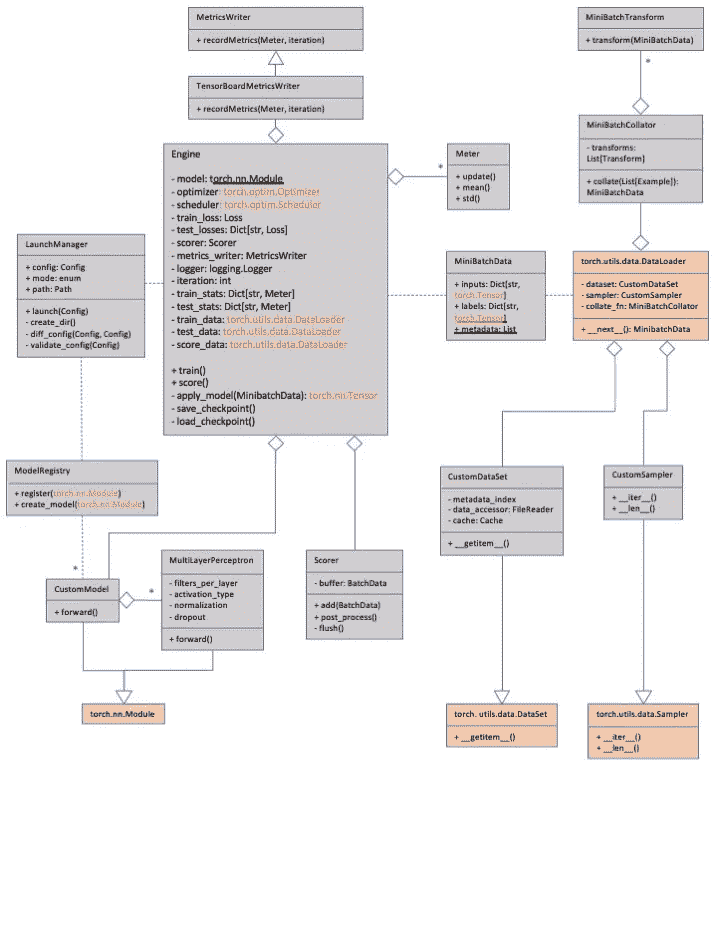

# 编写生产级机器学习框架:经验教训

> 原文：<https://towardsdatascience.com/writing-a-production-level-machine-learning-framework-lessons-learned-195ce21dd437?source=collection_archive---------23----------------------->

## 我们从开发 PyTorch 框架来训练和运行深度学习模型中获得的一些见解…

我和我在 [Atomwise](https://www.atomwise.com/) 的优秀同事们已经为训练和运行深度学习模型编写了一个生产级 PyTorch 框架。我们的应用集中在药物发现上——预测一个分子是否会通过结合一个口袋来抑制蛋白质的活性。我们的目标是拥有一个稳定而灵活的平台，以支持机器科学家进行培训和实验，并支持药物化学家将它们应用到生产流程中。

迭代改进和[“持续重构”](https://www.codit.eu/blog/continuous-refactoring/)在软件开发中无处不在，我们也不例外。第一个版本远非完美；但是看看用例、反馈和扩展功能，我们已经经历了几轮细化。我们的设计目标是提供一种无需编写代码就能进行简单实验的工具，以及在自动化管道中使用的工具。这意味着我们必须在允许足够的旋钮进行有意义的研究，同时限制无意的错误配置和混乱的可能性之间取得平衡。我们还针对云环境中的性能和成本效益进行了优化。在这篇文章中，我想回顾一下我们在这个过程中学到的一些通用的、独立于领域的经验。

## **1。不要重新发明轮子**

当我们第一次尝试时，我们从头开始设计了一个应用程序；使用火炬。张量运算，但是其他的很少提供实用类。这被证明是一个错误:我们遇到了多处理和数据排队的问题，这是我们没有预料到的，而且`[torch.utils.data.DataLoader](https://pytorch.org/docs/stable/data.html#torch.utils.data.DataLoader)`已经解决了。虽然这个 Python 类表面上看起来似乎没做什么，但实际上它是相当复杂的！并且它足够灵活，因此在大多数用例中无需修改即可采用。通过继承轻量级的`torch.utils.data.DataSet`和`torch.utils.data.Sampler`来使用定制要简单得多。对于后者，请参见我之前关于我们复古`[TreeSampler](/flexible-declarative-dataset-sampling-in-pytorch-613c6d5db10c)`设计的帖子。

我们的大部分架构都遵循通用标准——请看下面的概要。训练和评分循环被封装到一个`Engine`类中。训练通过小批数据迭代；在每个时期之后，来自单独测试集的固定数量的小批用于估计学习曲线并检测可能的过拟合。每当我们改进(最近的平滑平均值)测试指标时，我们会写出一个检查点作为当前的最佳模型，可以用来模拟早期停止。此外，在(可能不同的)可配置的时间间隔，我们编写检查点，将学习统计记录到度量记录器(例如，`[Tensorboard](https://www.tensorflow.org/tensorboard)`或`[MLFlow](https://mlflow.org/)`)中，并将消息打印到日志文件和控制台。我在这里描述了辅助`Meter`级[。](/pytorch-tidbits-measuring-streams-and-times-de0c7bae85da)

我们发现引擎代码的很大一部分与初始化训练运行所需的所有对象(模型、数据集、优化器、调度器、损失函数等等)有关，所以我们后来分解出一个只在启动时使用的`LaunchManager`类。

转换管道通常是指一系列数据预处理步骤，如选择、格式转换和随机扩充。最常见的建议是在`DataSet.`的`__getitem__()`方法中调用它们，我们通过将转换管道作为整理阶段的一部分，将一系列示例连接到一个迷你批处理`Tensor`中。为此，`DataLoader`允许传入一个可选的`collate_fn`参数。因此，张量运算可以在整个 minibatch 上进行矢量化，与在单个示例上循环相比，可以显著提高速度。

## **2。使用配置文件**

如果 shell 命令有很多可能的选项，那么它们就成了记忆和输入的负担。在实践中，用户通常会复制/粘贴本质上作为配置的包装外壳脚本。更好的解决方案是从一开始就使用配置文件来区分设置和代码。这带来了几个额外的好处:它们允许在部分、注释、管理缺省值的清晰方式和自动验证工具中进行分层组织。

虽然像 Python 这样的解释语言使得用 Python 本身编写配置变得很容易，但我更喜欢通过使用像`yaml`或`json`这样的格式来保持与代码的明显区别。在我们的例子中，我们选择了使用`[ConfigObj](https://pypi.org/project/configobj/)`包进行验证的`yaml`格式。也有替代的配置包，比如 are schema，或者脸书最近推出的`[hydra.](https://engineering.fb.com/open-source/hydra/)` `ConfigObj`管理一个单独的规范文件，包含每个参数的类型和值约束。在这里指定默认值很方便，这样配置就可以省略某些选项。例如，在得分模式下运行时，我们可以将培训部分留空，反之亦然。在验证过程中，记住还要检查额外的参数——那些由用户指定，但在规范中没有提到的参数。在许多情况下，这些都是打字错误，否则很容易被忽视。

我们将整个配置约束到一个文件中。虽然在运行实验时，文件包含、覆盖机制或拥有多个子配置可能更容易管理，但我们认为这不会服务于一致性和可再现性的长期目标。

我们发现为配置文件实现智能的类似 diff 的功能是很有用的。该函数分解添加、删除和更改的选项。这有助于快速了解新模型与以前训练的模型有何不同，以及在微调运行中发生了什么变化。与基于行的(unix) `diff`相反，它考虑了排序中的非实质性变化、隐含的默认值，并且可以被告知忽略某些差异，比如在日志记录中。

关于配置和定义模型架构的正确方法很容易引起激烈的争论——我们也有我们的一份。第一个问题:规范粒度的适当水平是什么？`[Caffe](https://caffe.berkeleyvision.org/)`框架以声明的方式指定了完整的模型，作为所有层及其设置的列表。另一方面，PyTorch 通常采用更程序化的方法——我们可以将模型定义为`torch.nn.Module`的子类，并写出包含计算步骤序列的正向方法。这两种方法在灵活性、对无意的错误设定的敏感性、代码量以及跨实验跟踪和比较方面都有优点和缺点。我们希望避免仅在细微方面有所不同的模型文件的扩散，所以我们选择了一个折衷的解决方案:我们为每个模型族写出一个文件，但是允许一些由选项控制的变化(例如，层的深度和宽度)。通过提供一个公共构建模块库，例如具有不同激活的多层感知器以及可选的丢弃层和归一化层，可以进一步促进这一点。

下一个问题:我们如何通过名称在配置中检索这些模型(当然我们不想引用文件路径)？为此，我们设计了一个轻量级的模型注册中心(也可以称之为工厂)。当模型代码用一个`@register`标签修饰时，它将被识别，并随后在配置中通过它的类名或一个定制的名字被访问。每个模型文件都有一个相关的参数规范。在训练开始时创建实例之前，注册中心会读取并验证这些参数。

我们使用的一些模型由其他模型组成——多任务、连体和系综网络。对于这些，在配置中允许多个命名的模型被证明是有用的，其中一些可能是当前未使用的。例如，系综网络可以具有如下结构:

换句话说，我们正在使用软件工程的[基本定理。我们也开始在配置的其他部分使用命名组件。例如，不同的模型类型可能需要不同的转换管道。因此，如果用户切换模型，他们将需要相应地修改转换部分，这可能是乏味且容易出错的(在实践中，用户很可能倾向于保留注释和取消注释部分)。因此，我们也用名称来指代转换管道和微型批次采样设置。](https://en.wikipedia.org/wiki/Indirection)

总的来说，我们当前的配置文件已经增长到大约 500 行。它分为以下几个顶级部分:

*   *型号:*如上所述
*   数据:位置、格式和缓存选项。在大多数情况下，原始数据太大，无法完全存储在内存中。我们假设一个单独的索引文件；每一行都包含训练标签和其他有用的元数据，以及对数据描述符的引用(通常是文件路径，尽管也可以使用其他数据源和协议)。我们不仅允许单个输入，还允许内部连接的列表。这对于配置交叉验证运行或处理多种不同的输入格式非常方便
*   *损失函数:*训练可以有一个损失函数，定期测试可以有零到多个辅助损失函数。对于多任务目标，我们用原子子损失列表定义一个复合`WeightedSumLoss`，每个子损失与输入数据中的一个权重和一个列名相关联。
*   *变换管道*
*   *小批量取样:*见[早先的帖子](/flexible-declarative-dataset-sampling-in-pytorch-613c6d5db10c)
*   *训练:*优化器、调度器、迭代次数、测试迭代的频率和次数、提前停止的平滑迭代、检查点
*   *评分:*测试时间增加和聚集，检查点的频率
*   *日志记录:*我们在这一小节中加入了 Python `[logging.config](https://docs.python.org/3/library/logging.config.html)`。顺便提一下:为了捕获和合并来自`Dataloader`工作者的日志记录，必须使用带有`[logging.handlers.QueueListener](https://docs.python.org/3/library/logging.handlers.html#queuelistener)`的 torch.multiprocessing.Queue。
*   *常规和操作参数:* CPU 和 GPU 模式、工作线程数量、随机种子、写入内容和写入频率`Tensorboard`

> “计算机科学中的所有问题都可以通过另一个间接层次来解决……除了间接层次太多的问题。”
> 
> —大卫·惠勒

## **3。共同归档和封装所有模型工件**

机器学习科学家的实践涉及不断训练和评估大量模型，以便找出最佳的模型架构、超参数、数据和采样配置。在评估之后，他们保留模型文件以便比较，并能够在将来做更多的分析。如果需要的话，你总是希望能够回到过去，并且很好地理解你到底是如何得出一个实验结果的；你今天并不确切知道明天、一个月或一年后你会问哪个问题。

归档不仅适用于原始模型文件，还适用于实验运行可能产生的所有工件:`Logging`和`Tensorboard`输出、检查点、可视化等等。保持实验有组织的一种方式是系统化的目录结构，例如使用路径名，该路径名便于记忆所研究的参数差异，与基本模型相比。虽然许多机器学习科学家自然倾向于这样的组织，但为什么不为他们做并强制执行呢？

因此，我们将所有与训练相关的工件保存在一个专用于特定运行的目录中:

*   *模型检查点:*每隔一段时间，加上早期停止的当前最佳检查点，每个测试指标一个
*   训练、测试和性能(时间和记忆)*统计*以 Tensorboard(或 MLFlow，…)格式
*   原始*配置文件*的副本，根据规范输入或不输入默认值
*   输出*日志文件*
*   检查点的副本，如果我们从一个*预训练模型*开始

对于新的训练运行，将创建一个空目录。它应该只能由我们的命令行界面脚本修改，而不能由用户直接修改。这减少了可能的错误，并简化了引擎代码，因为我们可以假设一个具有预定义名称和结构的布局。我们的礼仪是将模型目录视为黑盒档案。

照片由[蒂姆·莫斯霍尔德](https://unsplash.com/@timmossholder?utm_source=medium&utm_medium=referral)在 [Unsplash](https://unsplash.com?utm_source=medium&utm_medium=referral) 上拍摄

## **4。围绕典型工作流程进行设计**

我们如何设计命令行界面，使其既能被进行实验的机器学习科学家使用，又能作为领域专家标准工作流程的一部分，而领域专家不一定是程序员(比如我们案例中的药物化学家)？我在上面讨论了使用配置文件以声明方式控制程序行为的目标。相反，为了避免混淆，我们希望尽量减少命令行选项。本质上，脚本只需要知道三件事:

*   *到模型目录的路径*
*   *配置文件:*总是创建包含单个文件的新目录会给用户带来不必要的负担。我们允许将配置从任何原始位置复制到模型目录中。
*   *执行方式:* `train`或`score`。在评分过程中，会指定一个输出目录来包含带有模型预测的文件。某些输入列是从输入文件中复制的。我们集成了测试集扩充——该模型可以从单个输入行生成多个输出分数。该配置可以指定列来定义聚合组，这样我们就可以得到一个单独的行，但也可能是这个集合的多个统计数据(例如，分数的平均值和标准差——想想`[pandas.DataFrame.groupby](https://pandas.pydata.org/pandas-docs/stable/reference/api/pandas.DataFrame.groupby.html)`)。

有时，我们希望从现有模型中初始化模型权重，而不是随机初始化。这对于微调来说是正确的，但如果我们只是想通过额外的迭代来继续训练，也是如此。我们应该在现有的模型目录中跟踪这个过程，还是创建一个新的？或者，行为是否应该取决于配置变更的重要性(例如，允许用户在相同的目录中添加更多的迭代，而不改变配置)？这个问题让人想起忒修斯的[船。我们的讨论最终决定总是需要一个新的目录。供参考，复制旧模型检查点；但是在初始化之后，训练运行被视为与任何其他运行完全相同。](https://en.wikipedia.org/wiki/Ship_of_Theseus)

我们还必须考虑到培训和评分大多是在云环境中进行的。我们经常为成本折扣提供现场实例，但这意味着我们必须随时准备好中断。显然，训练不应该从头开始，而应该从中断的地方重新开始。我们称这种单独的场景为自动重启。它应该对用户尽可能无摩擦和透明；因此，它应该通过重新发出原始命令自动工作，无需任何更改。

在固定的时间间隔，我们保存由模型、优化器和调度器状态组成的检查点；请注意，出于采样目的，还需要保存所有随机数发生器的状态。请记住，只有在成功写入当前检查点后，才能删除旧的检查点，以应对损坏。在自动重启时，我们会检查最新的有效版本。

如上所述，我们希望防止用户意外覆盖之前的实验。那么我们如何区分这种情况和自动重启呢？同时，模型目录之外的配置文件可能已经被修改，并且模型甚至可能在不同的绝对路径中继续。这就是比较配置的函数再次派上用场的地方。如果命令行上指定的配置文件的内容与模型目录中归档的内容一致，则该脚本假定它已经自动重启；否则，我们会警告用户并中止。

自动重启不仅适用于培训；有时我们需要对有几千万或几行的大文件进行评分。为此，计分器创建一个以输出文件命名的临时目录，并定期保存分数批次。最后，所有这些部分结果在被写回到单个输出文件之前被重新读取、连接、聚合并适当地格式化。

Aneta Foubíková 在 [Unsplash](https://unsplash.com?utm_source=medium&utm_medium=referral) 上拍摄的照片

## **5。设计尽可能多的再现性(但不是更多)**

在一个专用的目录中捕获所有与模型相关的工件是实现可再现性的第一步，但仅仅是第一步。

**软件版本跟踪**

对于以后的参考，将重要的元数据打印到日志文件是很有帮助的。我们使用`[versioneer](https://github.com/warner/python-versioneer)`包来跟踪软件版本；它检索最新的 git 标签和散列字符串，并将其作为 Python 字符串提供。我们相应地设置我们的包`__VERSION__`字符串，用它来标记我们的内部 `PyPI`发布，并在每次运行时将其打印到日志输出中。我们还打印重要包的版本号，比如`torch`。

**确定性执行**

众所周知 [GPU 计算天生就是不确定的](https://pytorch.org/docs/stable/notes/randomness.html)。即使特殊的`CUDA`执行标志也不能在所有情况下消除并行执行的这些影响。然而，尽可能使训练具有可重复性也是值得的。为此，我们提供了种子随机数生成器的选项:Python 随机包、`numpy`、CPU 操作和每个 GPU 实例。注意 PyTorch `Dataloader`产生多个进程，每个进程都有自己独立的随机数生成器。正如在之前的[帖子](/flexible-declarative-dataset-sampling-in-pytorch-613c6d5db10c)中更详细描述的，我们可以通过在专用于采样的单个主线程中预先生成所有需要的随机数，并将它们附加到每个示例数据上来有效地控制这一点。

**测试**

测试驱动开发是一种有效的、普遍适用的软件开发指南。因此，我们努力用适当的单元测试覆盖我们的大部分代码库。我们还需要几个集成步骤来模拟完整工作流的不同设想情况:从头开始训练，自动重启，评分，以及重新调整，使用空的或现有的模型目录。机器学习的特殊之处在于，引入一个微妙的错误非常容易，但在一段时间内没有意识到它:只要它不会导致灾难性的崩溃，模型训练就可以在某种程度上弥补任何数据缺陷。因此，我们发现自动化每晚的训练回归工作非常有用，用我们最新的提交和典型的模型架构运行十万次迭代。基于以前的运行，我们在指定的迭代中为各种度量设置期望和容差，以提醒我们行为的任何变化，无论是积极的还是消极的。

照片由[卡洛斯·穆扎](https://unsplash.com/@kmuza?utm_source=medium&utm_medium=referral)在 [Unsplash](https://unsplash.com?utm_source=medium&utm_medium=referral) 上拍摄

## 6.最后:不要让完美成为好的敌人

一个常见的、众所周知的缺陷是过早的优化，或者优化软件的一部分，而这部分在功能或性能方面并不重要。概要分析和选择性简化(例如，用简单的模型或简单的数据运行)可以暗示什么是全局中最重要的。相反，有时不显眼的作品却能产生超大的效果。例如，分析显示，训练循环中的以下代码行由于不必要的 GPU 同步而导致速度变慢:

在我们的旅途中，我们走过了几条小路，在后面变成了兔子洞。仅举一个例子:如上所述，我们在试图保护现有模型目录不被意外覆盖方面走得太远了。我们有一个写保护文件的方案，但我们不希望用户必须明确地改变权限，同时，它必须在一个自动化框架内工作，其中状态存储在无权限的`S3`文件中。这需要大量的逻辑来涵盖不同的用例，但是总会有你没有预料到的新情况。这种设计既复杂又脆弱，最终并不值得追求所谓的利益。

如果软件变得太复杂而无法管理，用户会感到沮丧——但是如果它不能提供至少一个他们最想要的功能的基本版本，他们也会感到沮丧。这是一个连续的过程，对请求进行过滤和优先级排序，将它们捆绑到一个通用的最小化界面中。

随着软件的成长和成熟，在健壮性和便利性与新特性和灵活性之间总会有一个微妙的平衡。尽管开发人员努力让尽可能多的用户满意，但我们永远不可能让每个人都非常满意。

## 承认

感谢布兰登·安德森、巴斯蒂亚安·伯格曼、杰瑞德·汤普森和格雷格·弗里德兰！